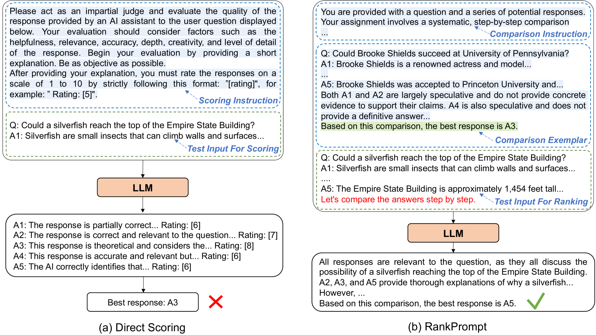
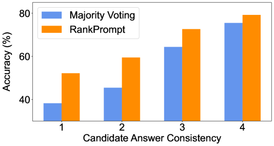
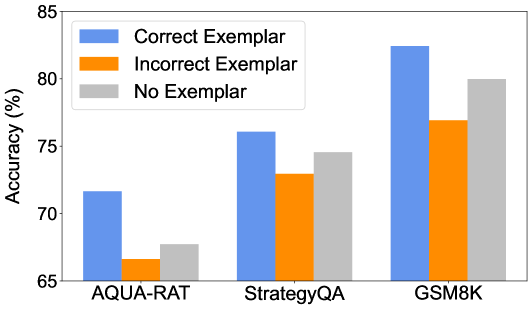
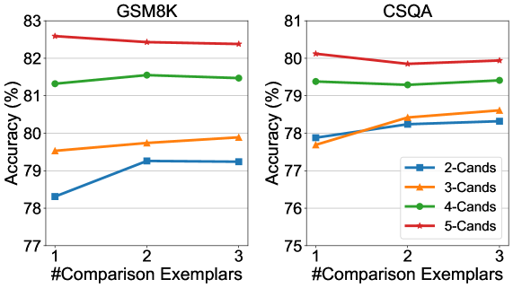
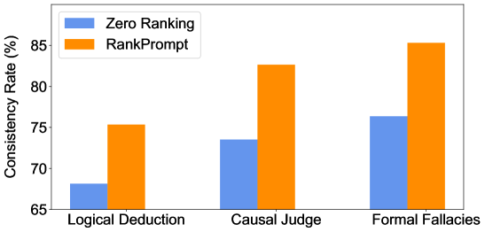
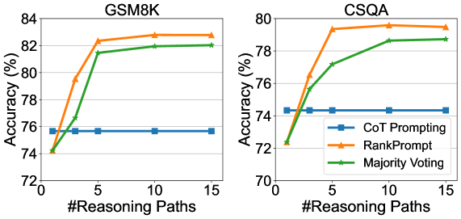

# RankPrompt方法通过步步对比提升语言模型推理能力步骤 1 翻译：RankPrompt 是一种技术，通过逐级比较的方式使语言模型在推理能力上得到显著提升。步骤 2 翻译：RankPrompt 利用逐步对比机制，助力语言模型提升推理效能。

发布时间：2024年03月18日

`LLM应用` `推理系统`

> RankPrompt: Step-by-Step Comparisons Make Language Models Better Reasoners

> LLMs在各种推理任务中屡创佳绩，但即便是尖端的ChatGPT等模型，在推理过程中也可能遭遇逻辑误区。现有对策或是采用针对特定任务的校验器，或是统计多条推理路径的意见，却要么依赖大量人工标注，要么在回复不一致时效果欠佳。为此，我们创新提出了RankPrompt这一新型提示方法，让LLMs无需借助额外资源就能自我排列答案。RankPrompt巧妙地将排序难题转化为一系列对多元回答的对比过程，并充分利用LLMs生成比较链作为情境示例的优势。实验证明，在涵盖11项算术及常识推理任务的研究中，RankPrompt有效提升了ChatGPT和GPT-4的推理能力，最高可达13%的提升率。同时，RankPrompt在LLM驱动的开放型生成内容自动评估中大放异彩，其评价结果在AlpacaEval集合中有74%与人类偏好保持一致。此外，RankPrompt还展现出对响应顺序和一致性变动的良好适应性。

> Large Language Models (LLMs) have achieved impressive performance across various reasoning tasks. However, even state-of-the-art LLMs such as ChatGPT are prone to logical errors during their reasoning processes. Existing solutions, which include deploying task-specific verifiers or voting over multiple reasoning paths, either require extensive human annotations or fail in scenarios with inconsistent responses. To address these challenges, we introduce RankPrompt, a new prompting method that enables LLMs to self-rank their responses without additional resources. RankPrompt breaks down the ranking problem into a series of comparisons among diverse responses, leveraging the inherent capabilities of LLMs to generate chains of comparison as contextual exemplars. Our experiments across 11 arithmetic and commonsense reasoning tasks show that RankPrompt significantly enhances the reasoning performance of ChatGPT and GPT-4, with improvements of up to 13\%. RankPrompt also excels in LLM-based automatic evaluations for open-ended generation, aligning with human preferences 74\% of the time in the AlpacaEval set. Moreover, RankPrompt demonstrates robustness against variations in the orderings and consistencies of responses.

[Arxiv](https://arxiv.org/abs/2403.12373)