# 深度探究大型语言模型在抽象与推理方面的表现，基于详尽的“抽象和推理语料库”进行分析。

发布时间：2024年03月18日

`LLM理论` `人工智能`

> Reasoning Abilities of Large Language Models: In-Depth Analysis on the Abstraction and Reasoning Corpus

> 以往对LLMs推理能力的评估手段过于关注结果输出，而忽视了推理过程的考察。现在，我们创新性地采用ARC数据集，从过程角度出发，深入剖析大型语言模型在推理及上下文理解上的表现。ARC以其严苛的问题解决逻辑结构设计，为衡量模型推理能力是否接近甚至媲美人类提供了一个有力的标准。实验结果显示，虽然大型语言模型已具备一定的推理能力，但在逻辑严密性、结构组合性和创新生成等方面仍存在差距。通过这些实验，我们揭示了LLMs的推理潜力，并为其迈向人类级别的推理能力指出了发展方向。

> The existing methods for evaluating the inference abilities of Large Language Models (LLMs) have been results-centric, making it difficult to assess the inference process. We introduce a new approach using the Abstract and Reasoning Corpus (ARC) dataset to evaluate the inference and contextual understanding abilities of large language models in a process-centric manner. ARC demands rigorous logical structures for problem-solving, making it a benchmark that facilitates the comparison of model inference abilities with humans. Experimental results confirm that while large language models possess weak inference abilities, they still lag in terms of logical coherence, compositionality, and productivity. Our experiments highlight the reasoning capabilities of LLMs, proposing development paths for achieving human-level reasoning.

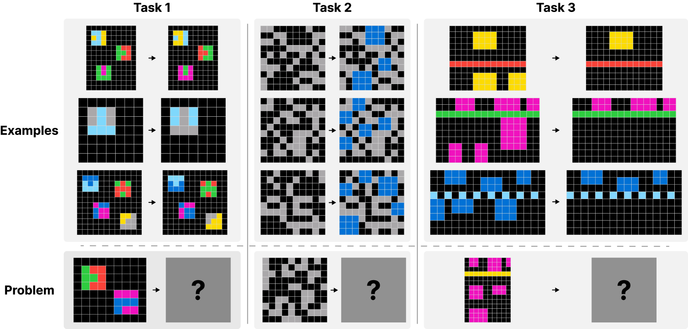

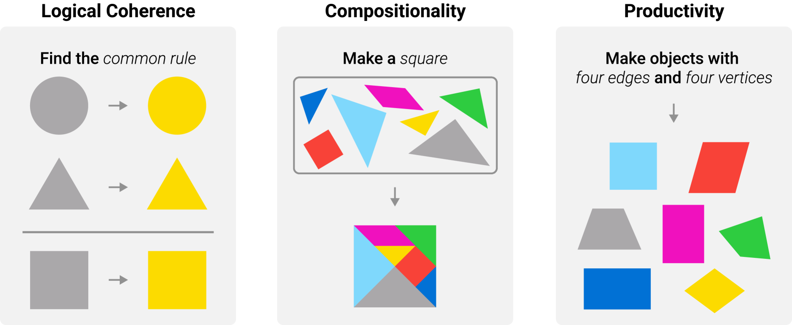

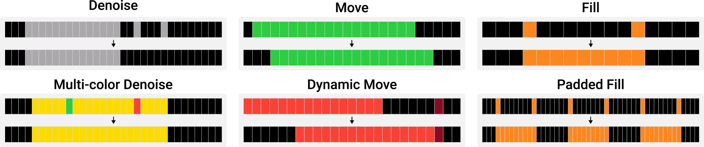

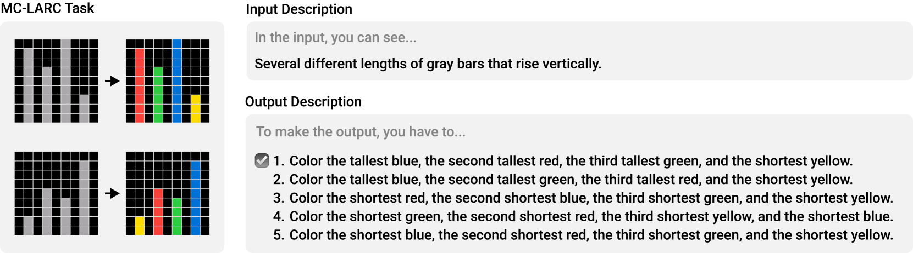

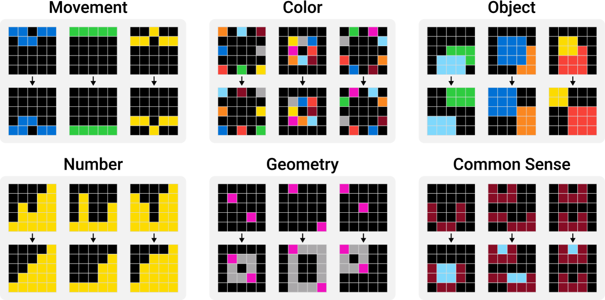

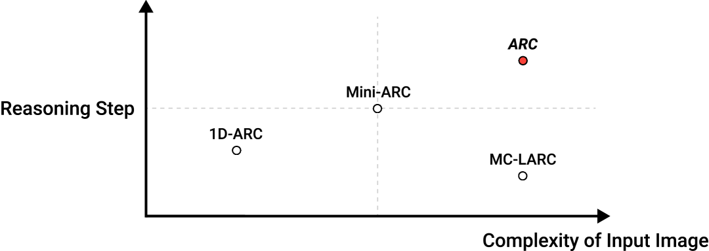

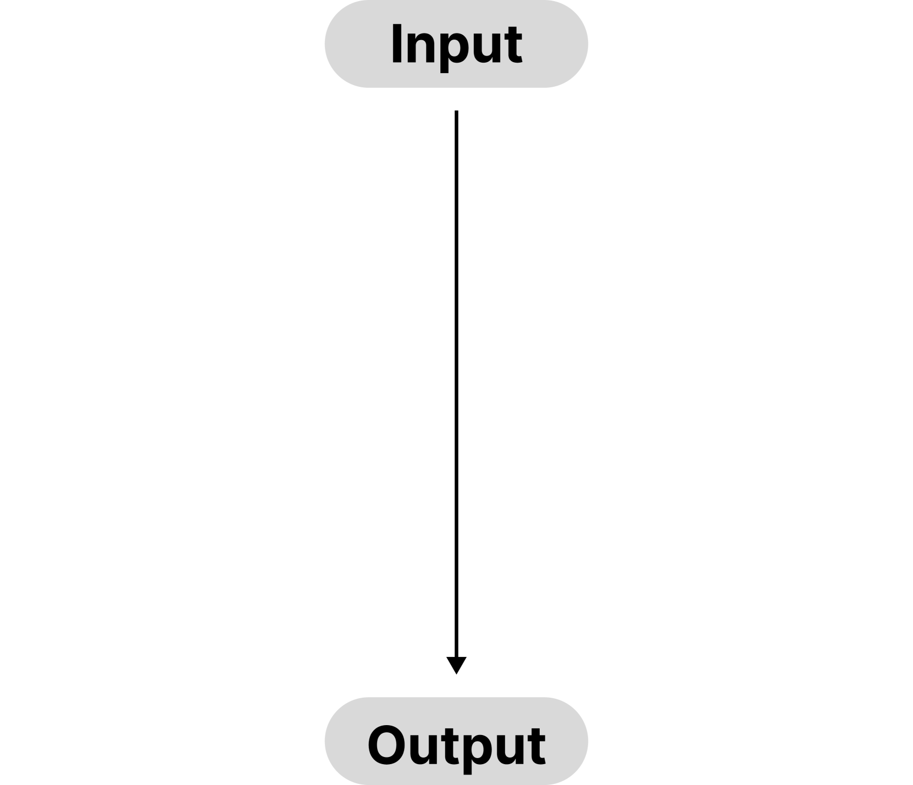

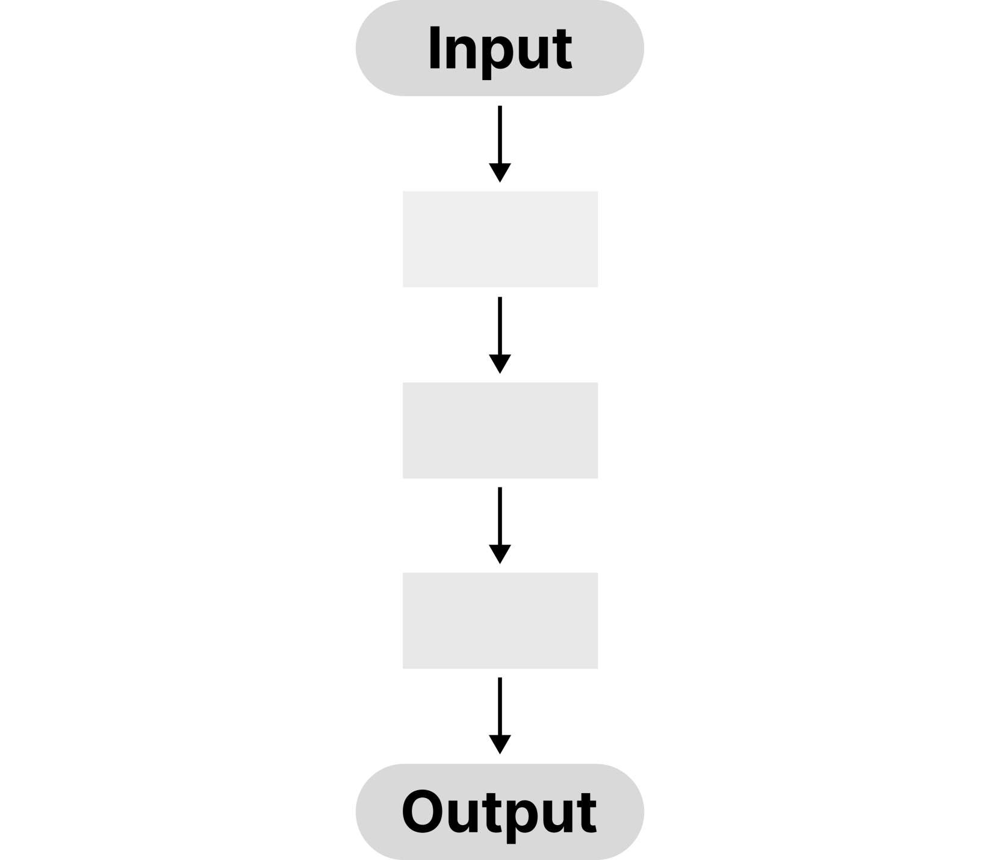

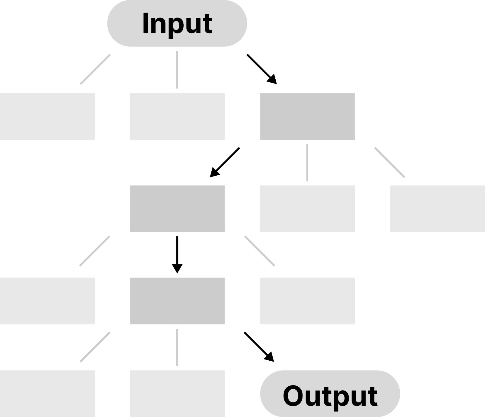

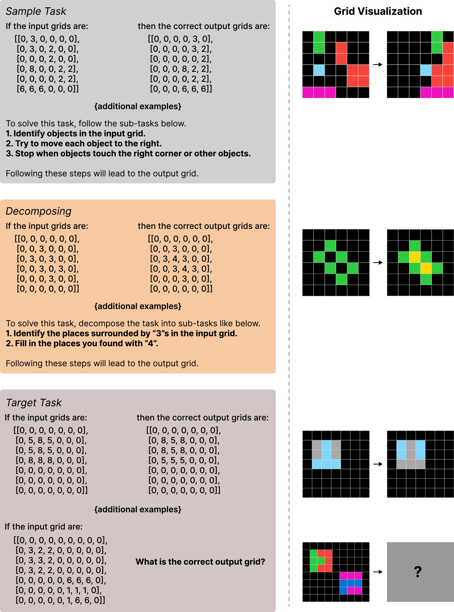

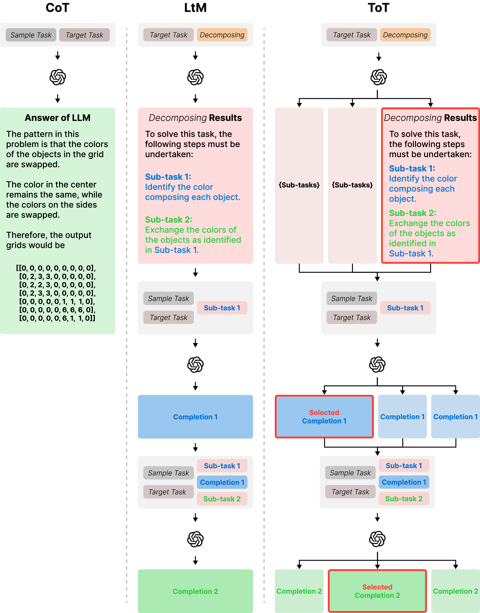

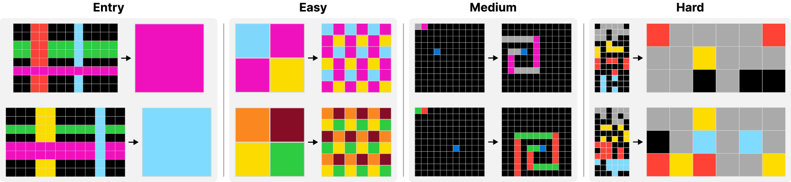

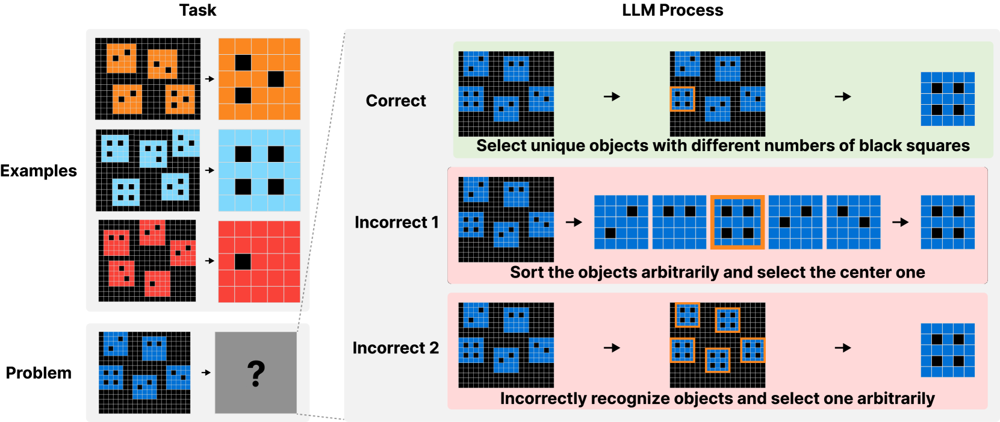

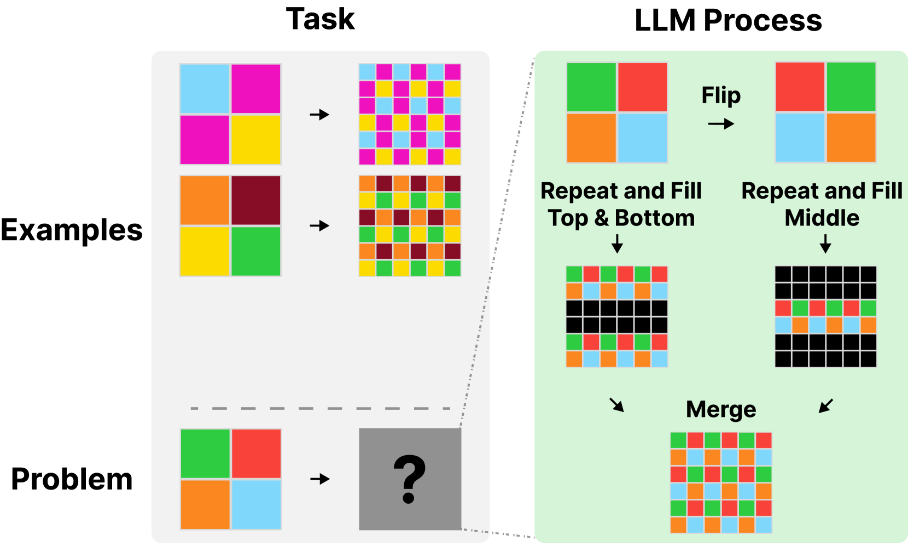

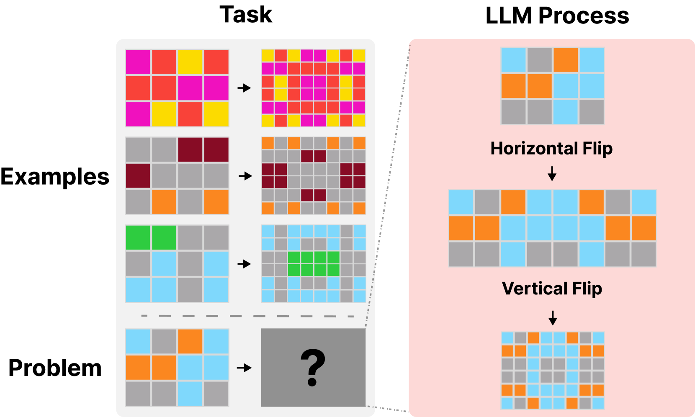

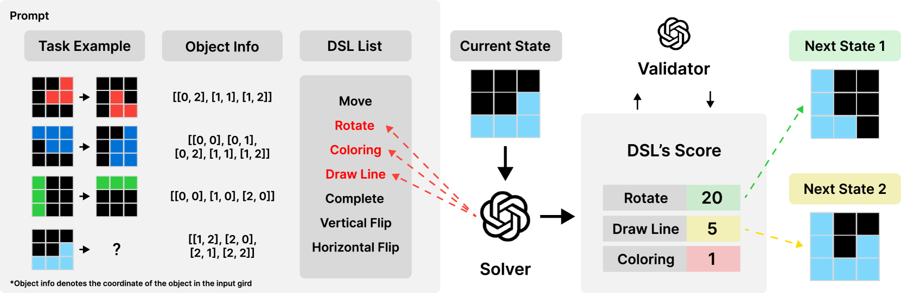

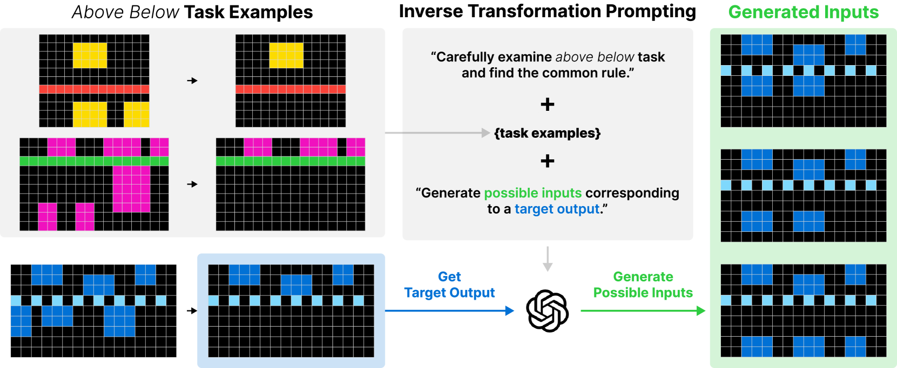

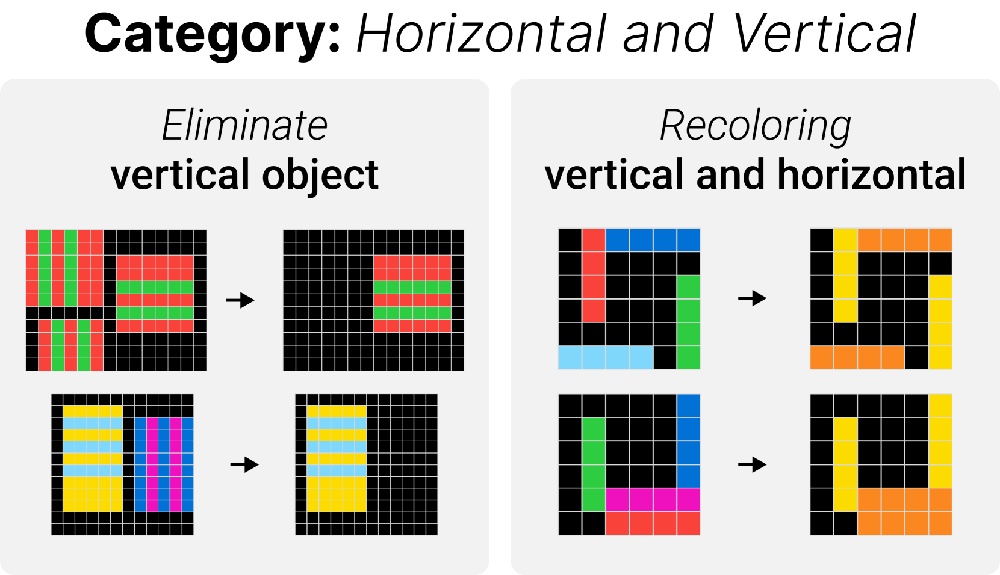

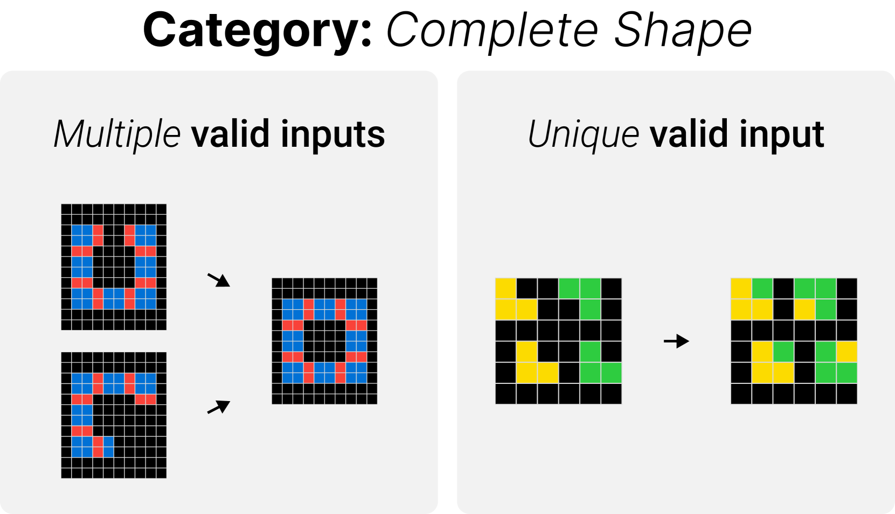

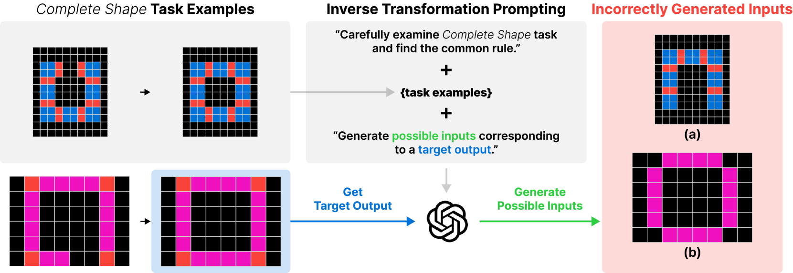

[Arxiv](https://arxiv.org/abs/2403.11793)