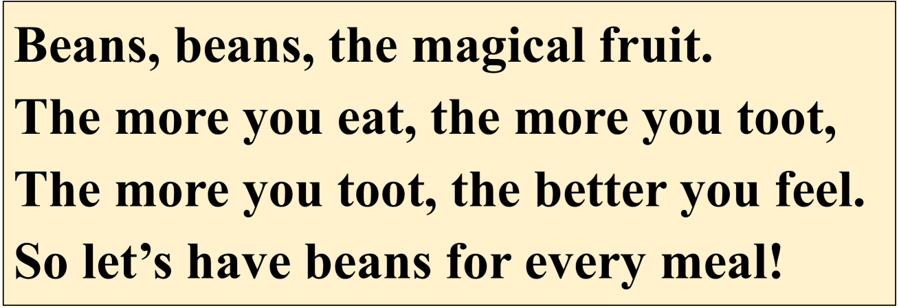
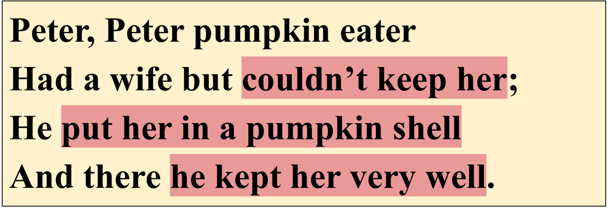
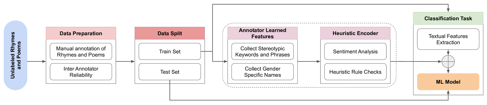
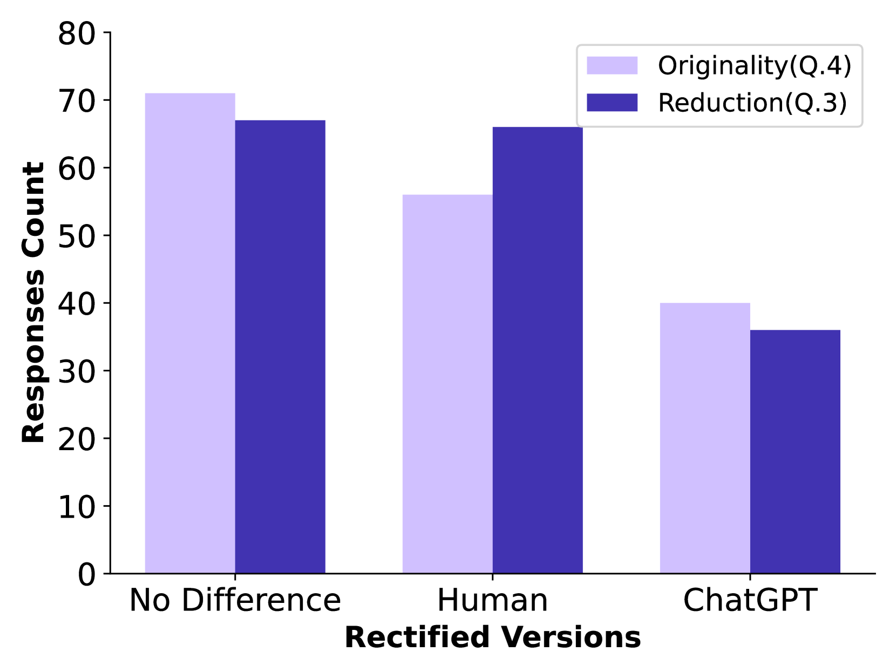

# 本研究重读经典，专注于识别并修正儿歌及诗歌中的性别刻板印象，旨在引导读者深入理解并重塑文学作品中的性别表达。

发布时间：2024年03月18日

`LLM应用` `性别研究`

> Revisiting The Classics: A Study on Identifying and Rectifying Gender Stereotypes in Rhymes and Poems

# 摘要

> 押韵和诗歌承载着丰富的文化价值观和社会角色信息，但其中固化的性别刻板印象却无形中强化了偏见认知，束缚了个体多元身份的发展。研究表明，儿童早期即萌发刻板印象与偏见，深入探究其形成机制对有效控制和消除这些问题至关重要。本研究采集了一系列押韵诗文样本，构建了一个识别性别刻板印象的高精度（97%）模型，并利用大型语言模型（LLM）进行性别偏见校正，经过与人类教育者修正方法的对比调研验证了其有效性。这项研究不仅揭示了文学作品中性别刻板印象的广泛渗透现象，还展示了LLM在纠正此类偏见中的巨大潜能，从而在艺术表达领域提升了性别平等意识，推动更具包容性的创新实践，为性别平权议题提供了重要见解。

> Rhymes and poems are a powerful medium for transmitting cultural norms and societal roles. However, the pervasive existence of gender stereotypes in these works perpetuates biased perceptions and limits the scope of individuals' identities. Past works have shown that stereotyping and prejudice emerge in early childhood, and developmental research on causal mechanisms is critical for understanding and controlling stereotyping and prejudice. This work contributes by gathering a dataset of rhymes and poems to identify gender stereotypes and propose a model with 97\% accuracy to identify gender bias. Gender stereotypes were rectified using a Large Language Model (LLM) and its effectiveness was evaluated in a comparative survey against human educator rectifications. To summarize, this work highlights the pervasive nature of gender stereotypes in literary works and reveals the potential of LLMs to rectify gender stereotypes. This study raises awareness and promotes inclusivity within artistic expressions, making a significant contribution to the discourse on gender equality.

[Arxiv](https://arxiv.org/abs/2403.11752)