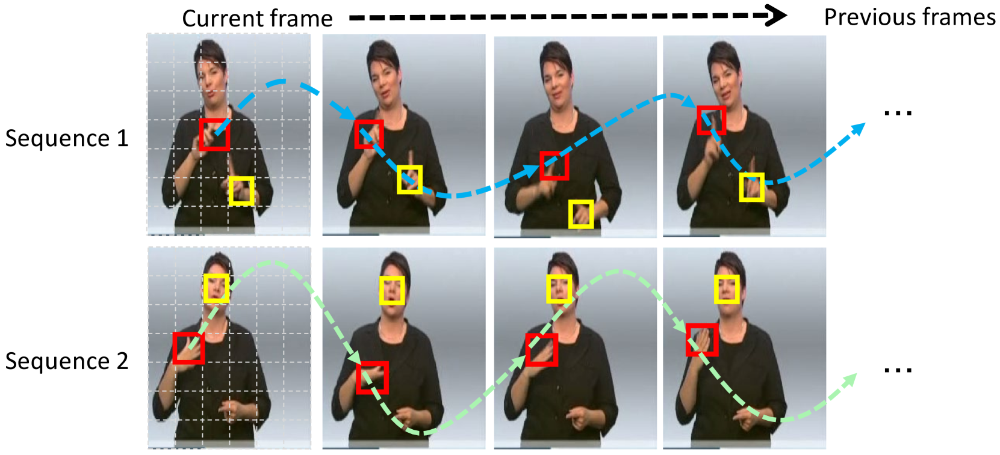
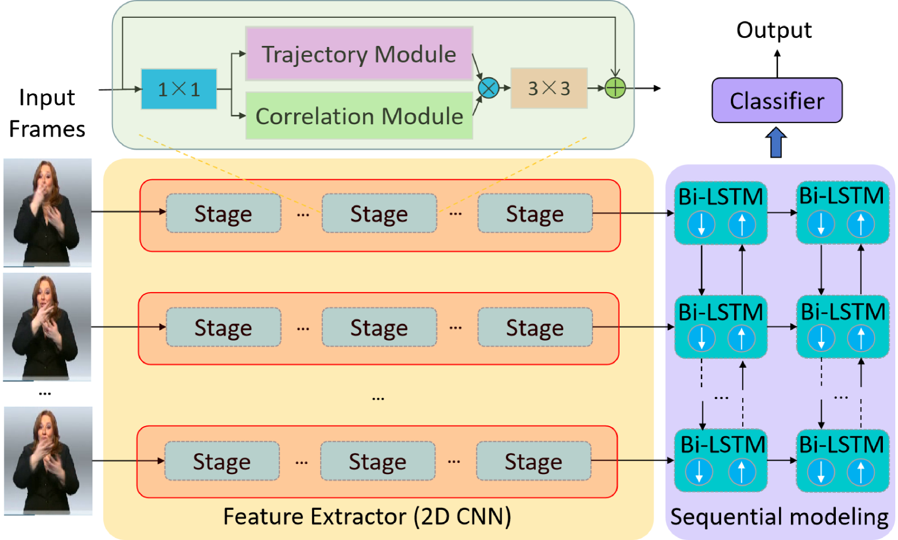
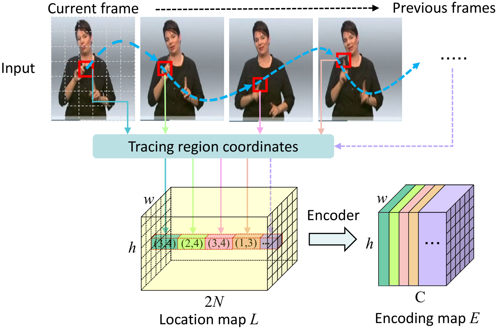
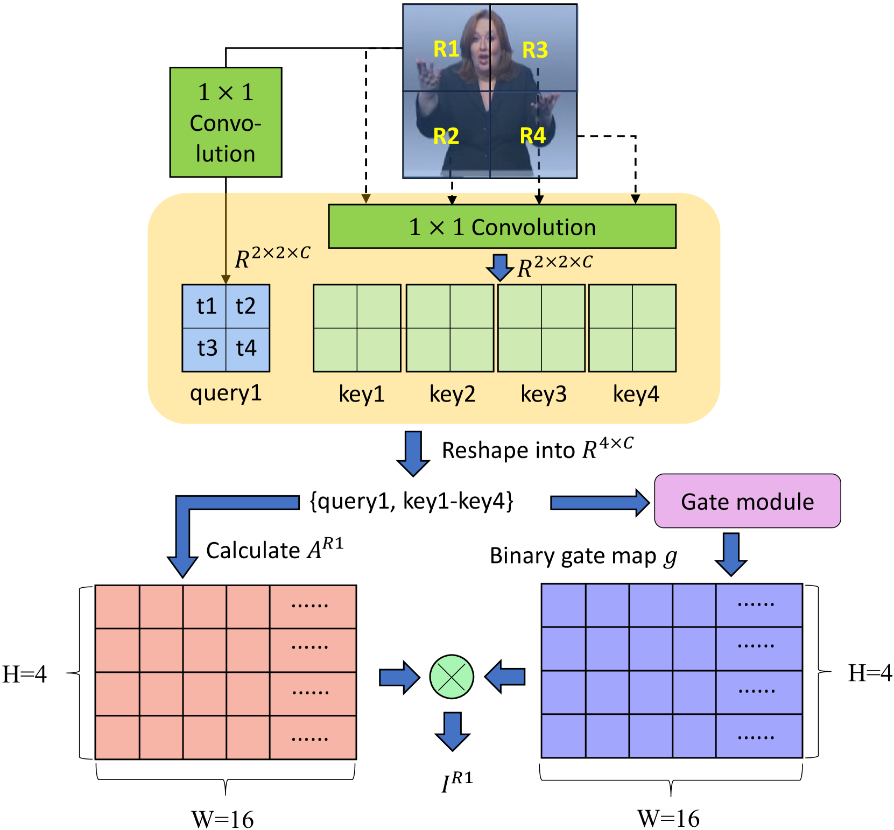

# TCNet 是一种用于连续手语识别的模型，它能从手势运动轨迹以及相关联的关键区域中捕捉并解析信息。

发布时间：2024年03月18日

`Agent` `手语识别` `视觉计算`

> TCNet: Continuous Sign Language Recognition from Trajectories and Correlated Regions

# 摘要

> 在处理连续手语识别时，如何高效捕获视频中随时间演变的远距离空间关联是一项核心难题。为此，我们创新设计了TCNet——一种融合网络，能出色地模拟轨迹与相关区域内的时空信息。TCNet的轨迹模块巧妙地将帧转化为由连续视觉元素构成的对齐轨迹，并且针对每一个查询元素，沿轨迹实施自注意力学习，从而精准把握诸如手指细微动作等特定动态区域的精微时空模式。而TCNet的相关性模块则运用了一种独创的动态注意力过滤机制，剔除无关帧区域，并且为每个查询点智能匹配相关区域的关键值令牌。这两项技术创新大幅削减了计算消耗和内存需求。我们分别在四大基准数据集PHOENIX14、PHOENIX14-T、CSL以及CSL-Daily上进行了验证实验，结果显示TCNet持续刷新了该领域的最优性能记录，例如，在PHOENIX14和PHOENIX14-T上，我们分别将词错误率降低了1.5%和1.0%，超越了以往的最佳水平。

> A key challenge in continuous sign language recognition (CSLR) is to efficiently capture long-range spatial interactions over time from the video input. To address this challenge, we propose TCNet, a hybrid network that effectively models spatio-temporal information from Trajectories and Correlated regions. TCNet's trajectory module transforms frames into aligned trajectories composed of continuous visual tokens. In addition, for a query token, self-attention is learned along the trajectory. As such, our network can also focus on fine-grained spatio-temporal patterns, such as finger movements, of a specific region in motion. TCNet's correlation module uses a novel dynamic attention mechanism that filters out irrelevant frame regions. Additionally, it assigns dynamic key-value tokens from correlated regions to each query. Both innovations significantly reduce the computation cost and memory. We perform experiments on four large-scale datasets: PHOENIX14, PHOENIX14-T, CSL, and CSL-Daily, respectively. Our results demonstrate that TCNet consistently achieves state-of-the-art performance. For example, we improve over the previous state-of-the-art by 1.5% and 1.0% word error rate on PHOENIX14 and PHOENIX14-T, respectively.

[Arxiv](https://arxiv.org/abs/2403.11818)