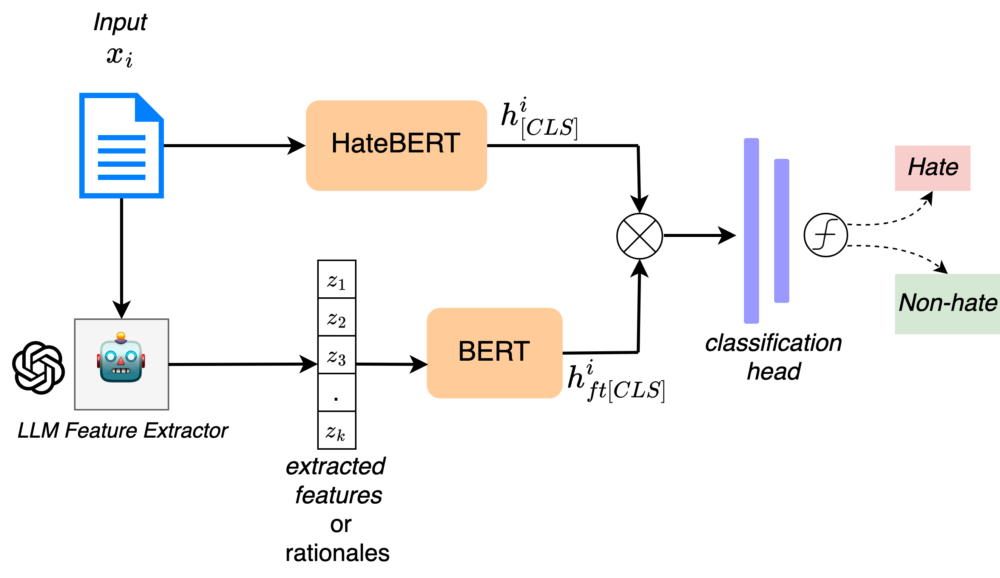
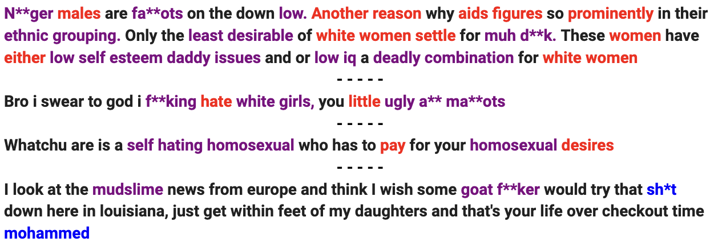

# 本研究致力于借助大型语言模型提取的关键理由实现对仇恨言论的可解释性检测，以揭示其内在逻辑并提高检测准确性。

发布时间：2024年03月18日

`LLM应用` `社交媒体` `仇恨言论检测`

> Towards Interpretable Hate Speech Detection using Large Language Model-extracted Rationales

> 虽然社交媒体平台是人们热烈互动、发表意见的重要舞台，但由于其表面伪装与匿名性特点，也可能成为部分用户宣泄仇恨言论和发布冒犯内容的温床。面对海量的社交媒体信息，迫切需要开发自动识别并标记仇恨言论的方法。尽管已有多项仇恨言论检测技术，但多数黑箱方法天生不具备可解释性。为此，本文创新性地运用尖端的大型语言模型（LLMs），从输入文本中抽取出合理清晰的特征，训练基础仇恨言论分类器，使其内在具备可信的可解释性。我们构建的框架巧妙融合了LLMs强大的文本理解和当前最优仇恨言论分类器的甄别能力，让这些分类器既准确又易于理解。经过对一系列社交媒体仇恨言论数据集的深入评估，我们发现：(1) LLM抽取的理由具有高度价值；(2) 在保证可解释性的训练过程中，检测器性能依然表现出乎意料的稳定性。

> Although social media platforms are a prominent arena for users to engage in interpersonal discussions and express opinions, the facade and anonymity offered by social media may allow users to spew hate speech and offensive content. Given the massive scale of such platforms, there arises a need to automatically identify and flag instances of hate speech. Although several hate speech detection methods exist, most of these black-box methods are not interpretable or explainable by design. To address the lack of interpretability, in this paper, we propose to use state-of-the-art Large Language Models (LLMs) to extract features in the form of rationales from the input text, to train a base hate speech classifier, thereby enabling faithful interpretability by design. Our framework effectively combines the textual understanding capabilities of LLMs and the discriminative power of state-of-the-art hate speech classifiers to make these classifiers faithfully interpretable. Our comprehensive evaluation on a variety of social media hate speech datasets demonstrate: (1) the goodness of the LLM-extracted rationales, and (2) the surprising retention of detector performance even after training to ensure interpretability.

[Arxiv](https://arxiv.org/abs/2403.12403)