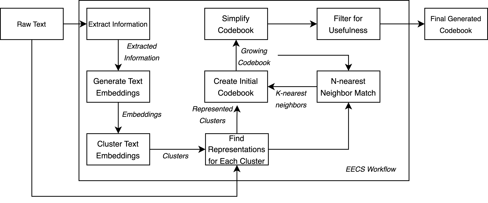
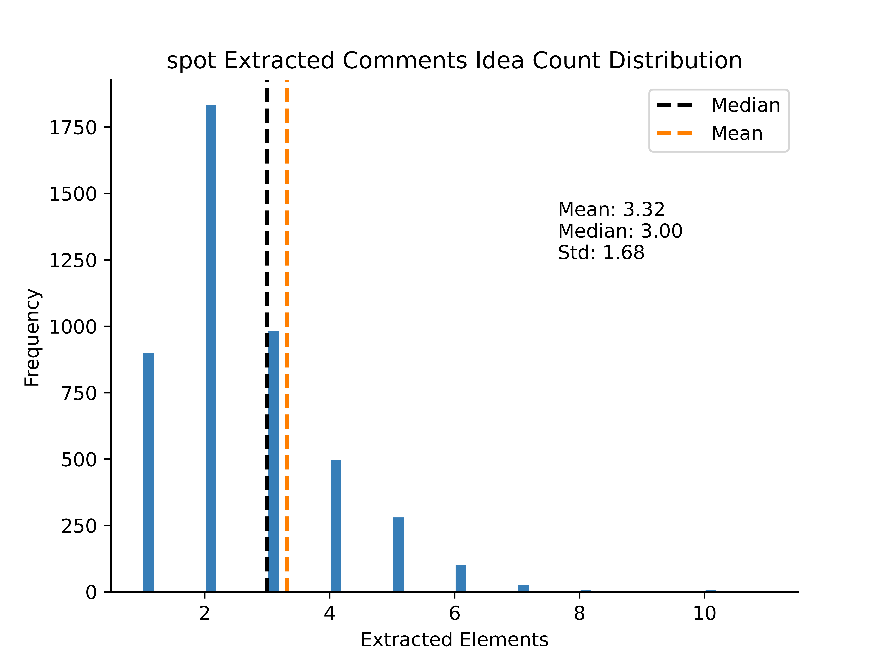

# 利用生成式文本模型的力量，我们致力于为学生教学评估构建一套详尽的定性编码手册，以提升评估过程的准确性和深度。

发布时间：2024年03月18日

`LLM应用`

> Using Generative Text Models to Create Qualitative Codebooks for Student Evaluations of Teaching

> 反馈是推动进步不可或缺的部分，但面对多源海量反馈时，往往难以提炼出具有指导意义的内容。以学生对教学评估（SETs）为例，这些信息对教师调整教学方式至关重要，同时也能为管理者提供课程及整体项目的参考依据。然而，在诸如高入学率课程或历年行政记录等大数据背景下，海量的SETs往往使深入分析变得困难重重。本文提出一种创新方法，运用自然语言处理（NLP）技术与大型语言模型（LLMs）共同解析SETs。我们通过实际操作，将此方法应用于一所大型公立大学的5000份SETs数据集中，展示其能够高效地提取、嵌入、聚类并归纳SETs所蕴含的主题内容。这一研究不仅示范了如何整合NLP技术与LLMs构建针对SETs的数据编码手册，而且揭示了这种方法在教学和研究领域分析包括SETs在内的各类学生文本资料的可能性。最终，我们将探讨这一新方法对解析SETs及其潜在应用场景的影响。

> Feedback is a critical aspect of improvement. Unfortunately, when there is a lot of feedback from multiple sources, it can be difficult to distill the information into actionable insights. Consider student evaluations of teaching (SETs), which are important sources of feedback for educators. They can give instructors insights into what worked during a semester. A collection of SETs can also be useful to administrators as signals for courses or entire programs. However, on a large scale as in high-enrollment courses or administrative records over several years, the volume of SETs can render them difficult to analyze. In this paper, we discuss a novel method for analyzing SETs using natural language processing (NLP) and large language models (LLMs). We demonstrate the method by applying it to a corpus of 5,000 SETs from a large public university. We show that the method can be used to extract, embed, cluster, and summarize the SETs to identify the themes they express. More generally, this work illustrates how to use the combination of NLP techniques and LLMs to generate a codebook for SETs. We conclude by discussing the implications of this method for analyzing SETs and other types of student writing in teaching and research settings.

[Arxiv](https://arxiv.org/abs/2403.11984)