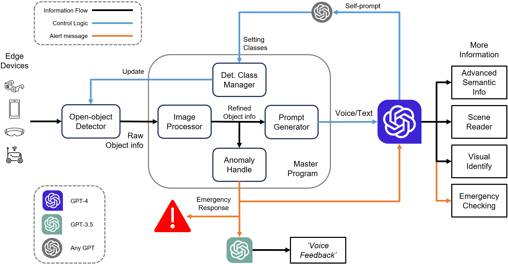
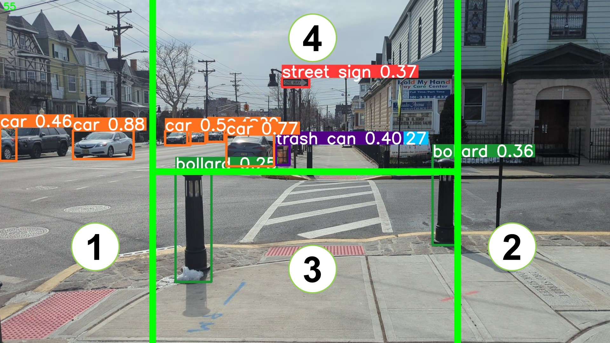
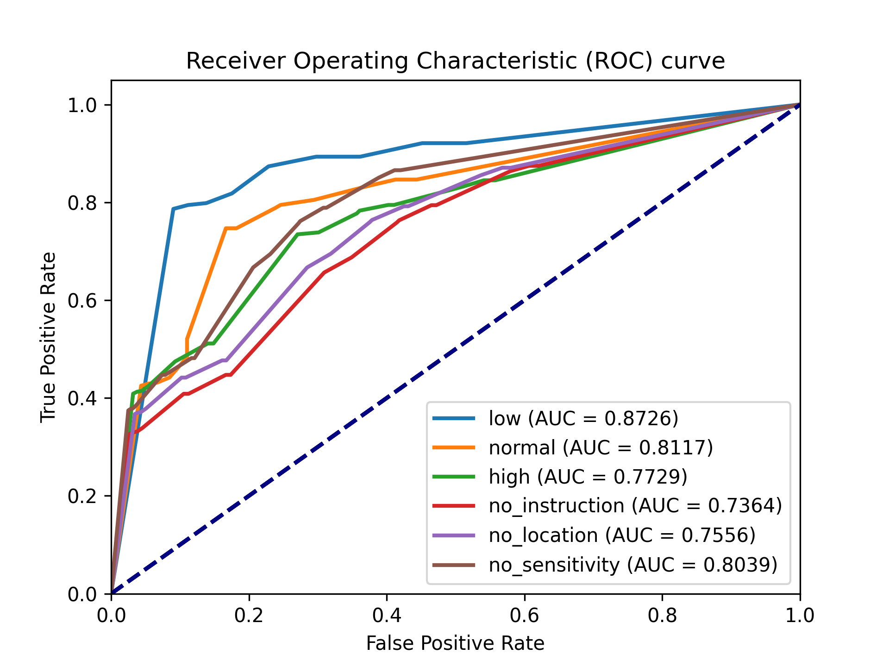
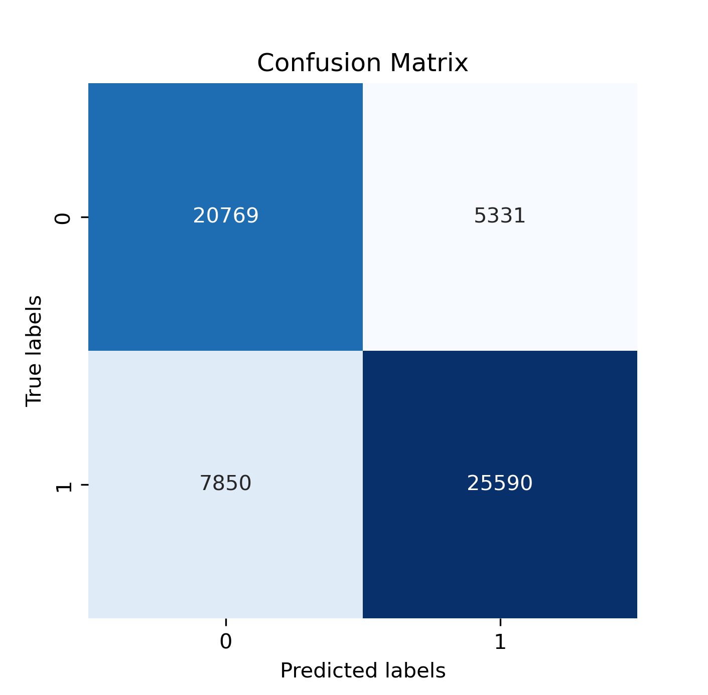
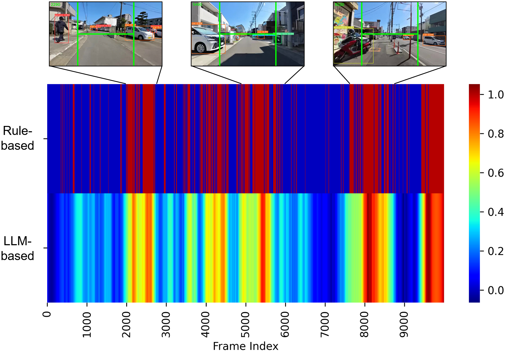

# VisionGPT：运用大型语言模型助力实时视觉导航异常检测，以保障安全行驶

发布时间：2024年03月18日

`LLM应用` `安全导航` `视觉障碍物检测`

> VisionGPT: LLM-Assisted Real-Time Anomaly Detection for Safe Visual Navigation

> 本文深入探索了LLMs在零样本情况下进行安全视觉导航的异常检测能力，通过结合顶尖实时开放世界物体检测模型Yolo-World与精心设计的提示，这一创新框架能在捕获的视频帧中识别各种潜在障碍物，并以简明的音频形式突出异常信息，助力复杂环境下安全导航。而且，该框架巧妙融合LLMs与开放词汇目标检测模型技术，实现灵活的场景动态切换，有效克服了传统视觉导航在连续场景适应上的短板。同时，论文进一步剖析了不同提示元素对整体性能的贡献，为今后提升视觉无障碍体验提供启示，并为LLMs在视频异常检测及视觉-语言理解领域的应用铺平了道路。

> This paper explores the potential of Large Language Models(LLMs) in zero-shot anomaly detection for safe visual navigation. With the assistance of the state-of-the-art real-time open-world object detection model Yolo-World and specialized prompts, the proposed framework can identify anomalies within camera-captured frames that include any possible obstacles, then generate concise, audio-delivered descriptions emphasizing abnormalities, assist in safe visual navigation in complex circumstances. Moreover, our proposed framework leverages the advantages of LLMs and the open-vocabulary object detection model to achieve the dynamic scenario switch, which allows users to transition smoothly from scene to scene, which addresses the limitation of traditional visual navigation. Furthermore, this paper explored the performance contribution of different prompt components, provided the vision for future improvement in visual accessibility, and paved the way for LLMs in video anomaly detection and vision-language understanding.

[Arxiv](https://arxiv.org/abs/2403.12415)