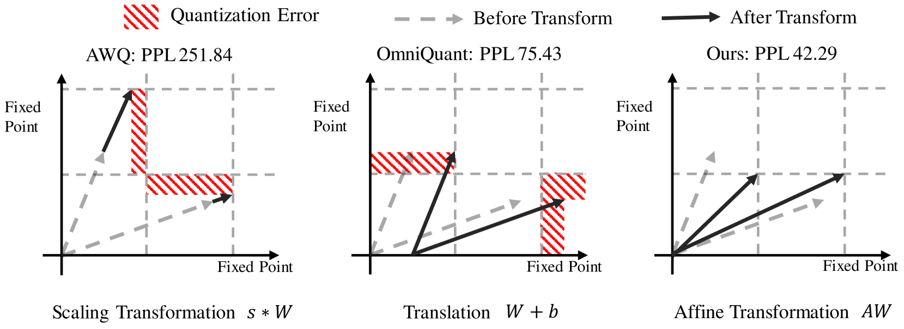
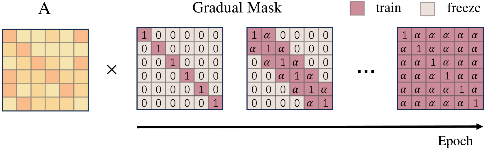
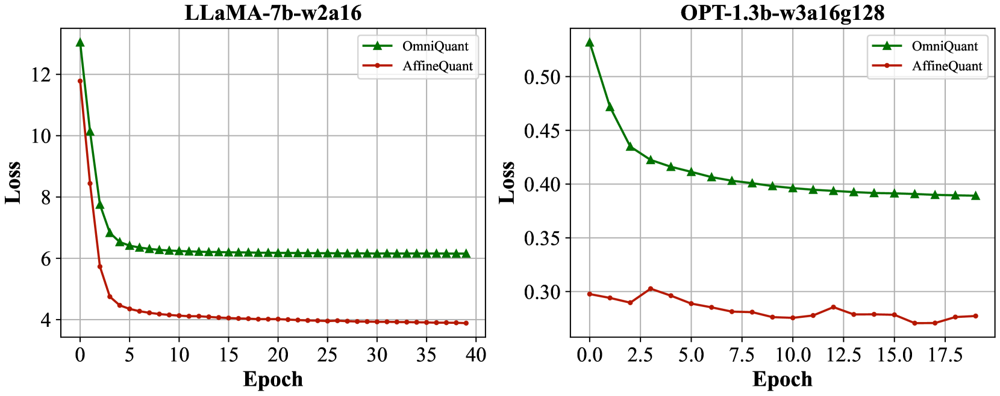
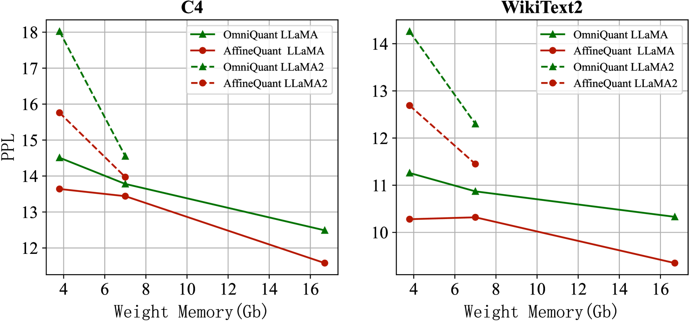
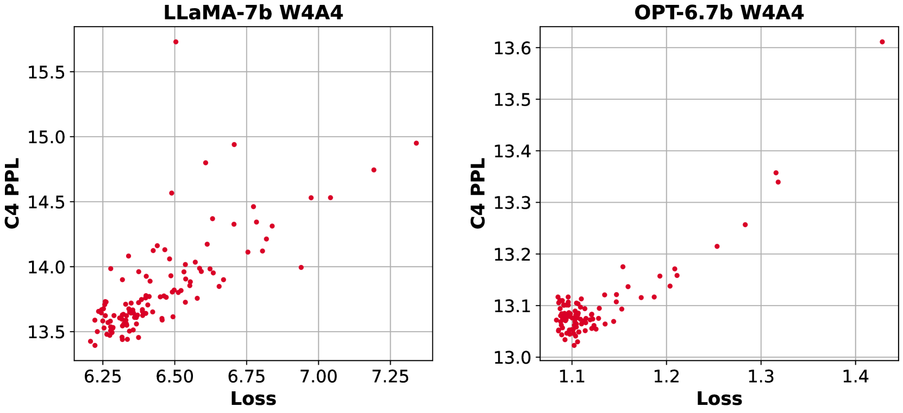
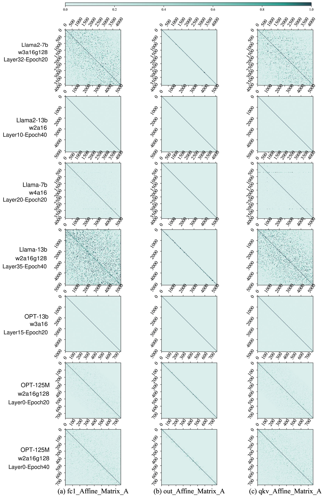

# AffineQuant——一种专为大型语言模型设计的仿射变换量化方法，旨在通过仿射变换实现模型量化，提升效率的同时保持模型性能。

发布时间：2024年03月19日

`LLM应用` `神经网络压缩`

> AffineQuant: Affine Transformation Quantization for Large Language Models

> 随着LLMs所需的大量资源引发广泛关注，人们越来越关注如何高效压缩和加速神经网络技术。其中，PTQ凭借其在训练阶段突出的压缩效能和经济效益脱颖而出。当前LLMs的PTQ策略仅针对预量化与后量化权重间的尺度转换进行优化。本文倡导在PTQ中运用等效仿射变换直接优化法——AffineQuant，这一方法拓展了优化范畴，有效减少了量化误差。同时，借助对应的逆矩阵，保障了PTQ前后量化输出的一致性，保持其高效性和良好的泛化性能。为确保优化过程中变换的可逆性，我们引入一种渐进式掩码优化技术，先从对角元素着手优化，再逐渐扩展至其余元素，这种方法遵循了Levy-Desplanques定理，理论上确保了变换始终可逆。最终，AffineQuant在不同LLMs及多样数据集上都展现出显著的性能提升。举例来说，在无需额外开销的情况下，我们以W4A4量化方式对LLaMA2-7B模型实现了15.76的C4困惑度（相较于OmniQuant的18.02降低2.26）。而在处理零样本任务时，当以4/4位量化LLaMA-30B时，AffineQuant取得了58.61的平均准确率（比OmniQuant的56.63高出1.98），树立了LLMs PTQ领域的全新标杆。

> The significant resource requirements associated with Large-scale Language Models (LLMs) have generated considerable interest in the development of techniques aimed at compressing and accelerating neural networks. Among these techniques, Post-Training Quantization (PTQ) has emerged as a subject of considerable interest due to its noteworthy compression efficiency and cost-effectiveness in the context of training. Existing PTQ methods for LLMs limit the optimization scope to scaling transformations between pre- and post-quantization weights. In this paper, we advocate for the direct optimization using equivalent Affine transformations in PTQ (AffineQuant). This approach extends the optimization scope and thus significantly minimizing quantization errors. Additionally, by employing the corresponding inverse matrix, we can ensure equivalence between the pre- and post-quantization outputs of PTQ, thereby maintaining its efficiency and generalization capabilities. To ensure the invertibility of the transformation during optimization, we further introduce a gradual mask optimization method. This method initially focuses on optimizing the diagonal elements and gradually extends to the other elements. Such an approach aligns with the Levy-Desplanques theorem, theoretically ensuring invertibility of the transformation. As a result, significant performance improvements are evident across different LLMs on diverse datasets. To illustrate, we attain a C4 perplexity of 15.76 (2.26 lower vs 18.02 in OmniQuant) on the LLaMA2-7B model of W4A4 quantization without overhead. On zero-shot tasks, AffineQuant achieves an average of 58.61 accuracy (1.98 lower vs 56.63 in OmniQuant) when using 4/4-bit quantization for LLaMA-30B, which setting a new state-of-the-art benchmark for PTQ in LLMs.

[Arxiv](https://arxiv.org/abs/2403.12544)