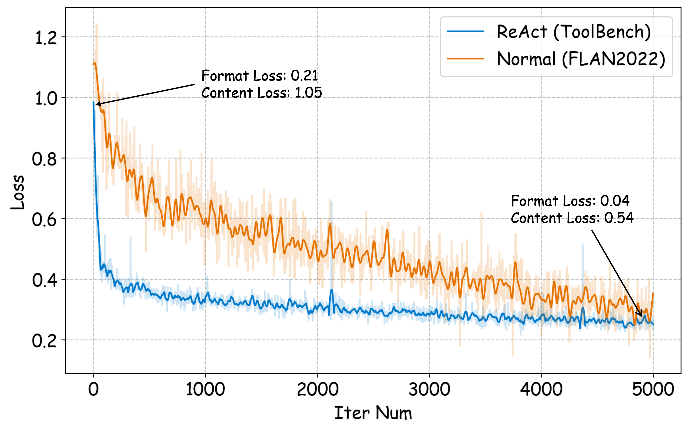
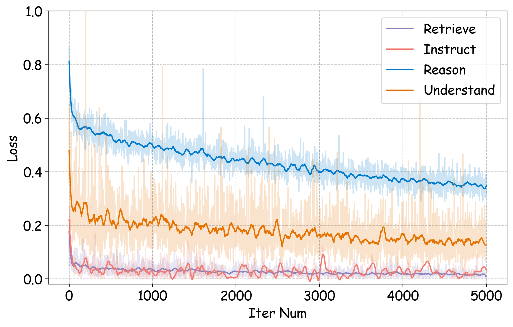
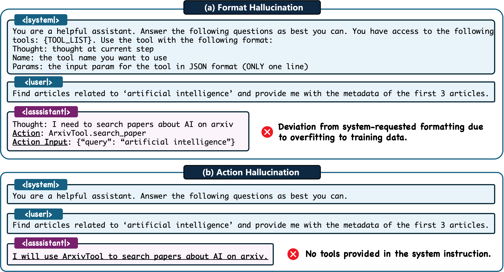
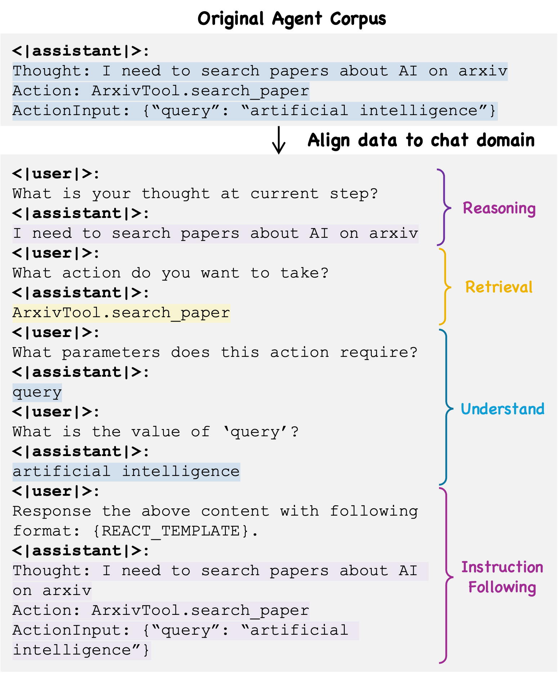
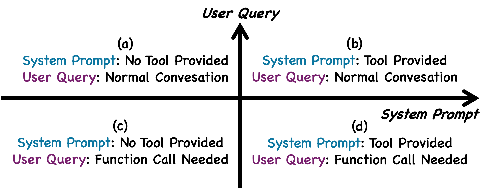
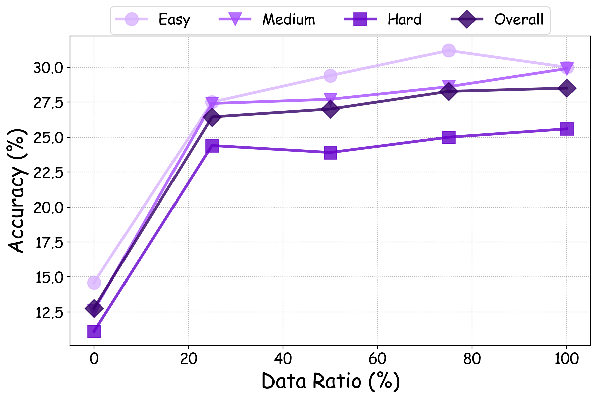
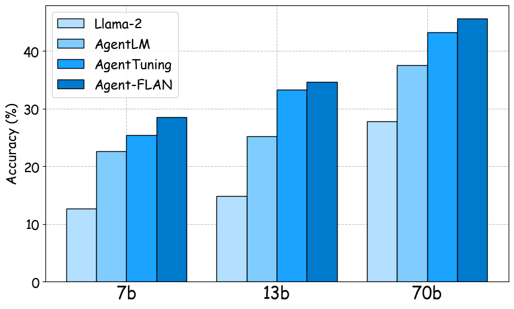
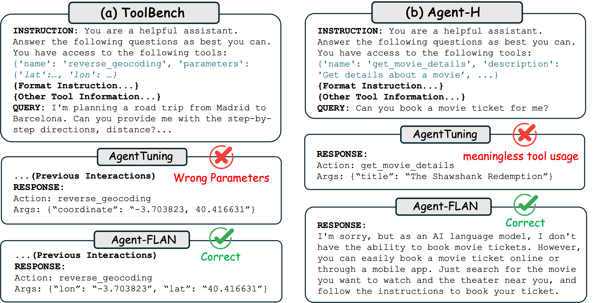

# Agent-FLAN：致力于为大型语言模型量身定制高效调优策略，通过精心设计数据集与调优方法，旨在提升其在各类任务中的表现。

发布时间：2024年03月19日

`Agent` `智能代理`

> Agent-FLAN: Designing Data and Methods of Effective Agent Tuning for Large Language Models

> 尽管开源LLMs已在多种NLP任务中大放异彩，但在充当智能代理角色时，其表现仍明显逊色于基于API的模型。因此，如何将智能代理功能无缝融入通用LLMs显得尤为关键和迫切。本文揭示了三大现象：一是现有的代理训练数据集混杂了遵循指令和逻辑推理两种模式，与LLMs预训练数据分布差异显著；二是LLMs对代理任务所需技能的学习速率各不相同；三是现有方法在增强代理能力时易引入幻觉这一副作用。为此，我们创新性地提出了Agent-FLAN方案，精细调整LLMs以适应代理任务。通过巧妙重构训练语料库，Agent-FLAN助力Llama2-7B模型在各代理能力评测数据集中跃升3.5\%，一举超越过往最佳水平。并且，依托精心构造的负面样本，Agent-FLAN依据我们的评估标准有效减轻了幻觉问题。更进一步，随着模型尺寸的增大，Agent-FLAN不仅稳步提升了LLMs的代理能力，还适度增强了其一般性能力。相关代码已发布在GitHub平台（https://github.com/InternLM/Agent-FLAN）。

> Open-sourced Large Language Models (LLMs) have achieved great success in various NLP tasks, however, they are still far inferior to API-based models when acting as agents. How to integrate agent ability into general LLMs becomes a crucial and urgent problem. This paper first delivers three key observations: (1) the current agent training corpus is entangled with both formats following and agent reasoning, which significantly shifts from the distribution of its pre-training data; (2) LLMs exhibit different learning speeds on the capabilities required by agent tasks; and (3) current approaches have side-effects when improving agent abilities by introducing hallucinations. Based on the above findings, we propose Agent-FLAN to effectively Fine-tune LANguage models for Agents. Through careful decomposition and redesign of the training corpus, Agent-FLAN enables Llama2-7B to outperform prior best works by 3.5\% across various agent evaluation datasets. With comprehensively constructed negative samples, Agent-FLAN greatly alleviates the hallucination issues based on our established evaluation benchmark. Besides, it consistently improves the agent capability of LLMs when scaling model sizes while slightly enhancing the general capability of LLMs. The code will be available at https://github.com/InternLM/Agent-FLAN.

[Arxiv](https://arxiv.org/abs/2403.12881)