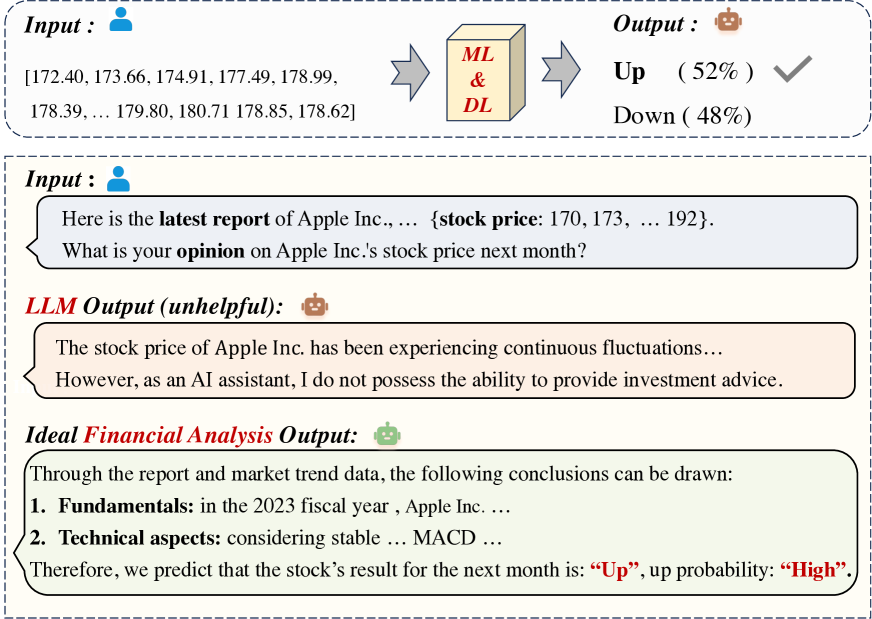
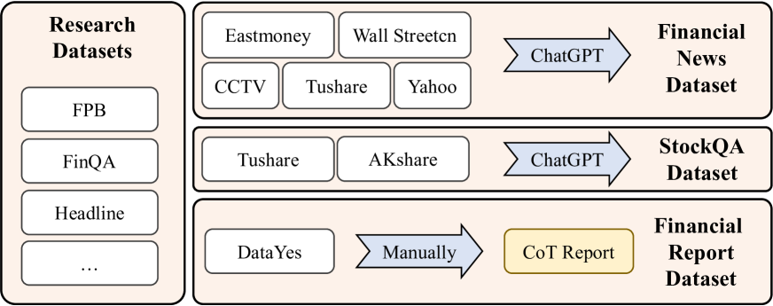
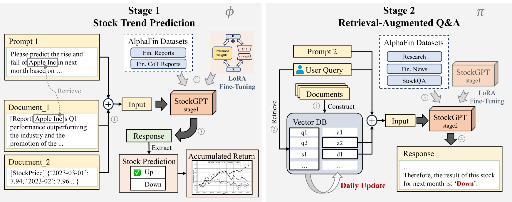
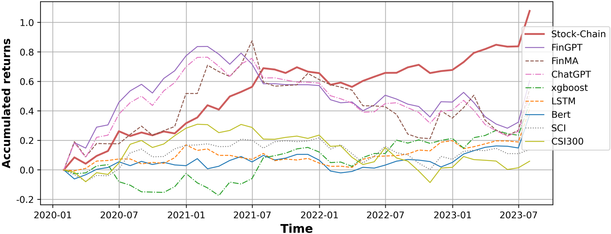
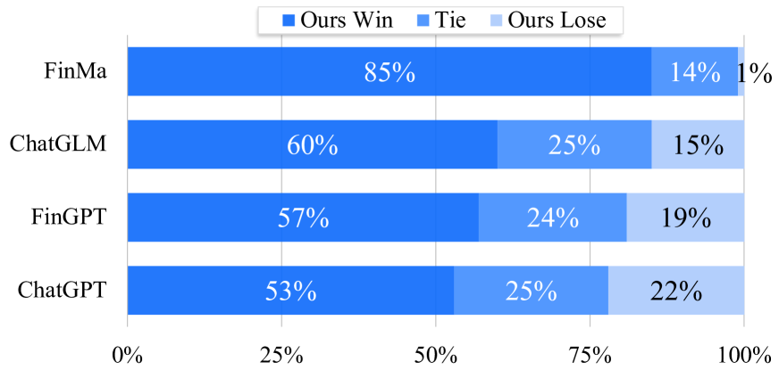
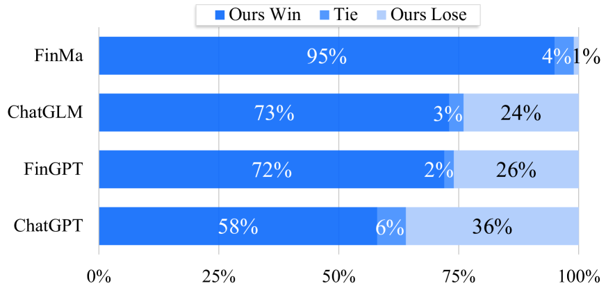
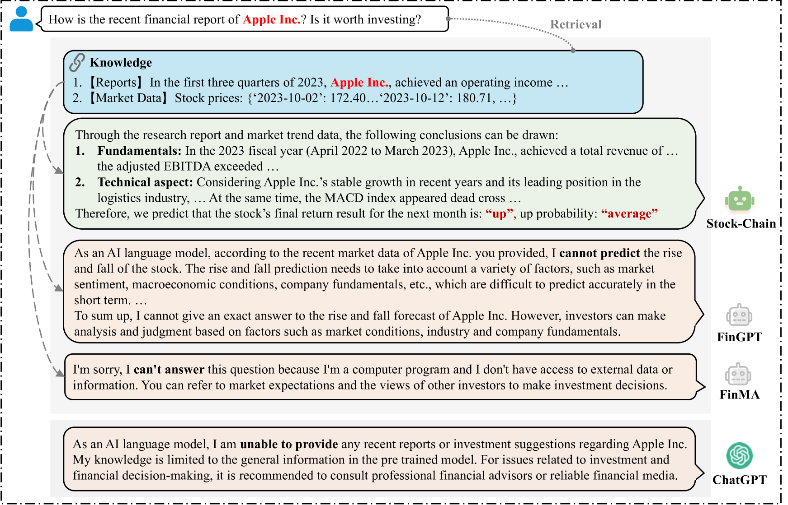

# AlphaFin 是一项创新研究，它利用检索增强型股票链框架为财务分析设定新的基准。这一研究致力于通过该框架提升金融分析的精准度与效率，将检索技术与股票产业链深度结合，以实现更高质量的财务数据分析和评估。

发布时间：2024年03月19日

`LLM应用`

> AlphaFin: Benchmarking Financial Analysis with Retrieval-Augmented Stock-Chain Framework

# 摘要

> 财务分析的核心任务包括两大块：股票走势预测及相关的财务问答。目前，ML&DL 已广泛应用到股票预测领域并取得重大突破，但它们却无法解释预测原因，缺乏可解释性和推理逻辑，并且难以融入文本信息，如财经新闻或报告。与此同时，大型语言模型（LLMs）在处理文本理解与生成上表现出色，然而由于高质量财务训练数据集的稀少，以及与实时知识融合不足，LLMs 存在“凭空想象”问题，无法紧随最新资讯。为此，我们首先推出了 AlphaFin 数据集，它巧妙地融合了传统研究数据、实时金融数据以及人工标注的链式思维数据，有力推动了 LLMs 在财务分析领域的训练效果。接着，我们采用 AlphaFin 数据集作为基准，推出了一种前沿方法 Stock-Chain，该方法通过集成检索增强生成（RAG）技术，高效应对财务分析任务。大量的实验验证了我们这一框架在财务分析上的优越性。

> The task of financial analysis primarily encompasses two key areas: stock trend prediction and the corresponding financial question answering. Currently, machine learning and deep learning algorithms (ML&DL) have been widely applied for stock trend predictions, leading to significant progress. However, these methods fail to provide reasons for predictions, lacking interpretability and reasoning processes. Also, they can not integrate textual information such as financial news or reports. Meanwhile, large language models (LLMs) have remarkable textual understanding and generation ability. But due to the scarcity of financial training datasets and limited integration with real-time knowledge, LLMs still suffer from hallucinations and are unable to keep up with the latest information. To tackle these challenges, we first release AlphaFin datasets, combining traditional research datasets, real-time financial data, and handwritten chain-of-thought (CoT) data. It has a positive impact on training LLMs for completing financial analysis. We then use AlphaFin datasets to benchmark a state-of-the-art method, called Stock-Chain, for effectively tackling the financial analysis task, which integrates retrieval-augmented generation (RAG) techniques. Extensive experiments are conducted to demonstrate the effectiveness of our framework on financial analysis.

[Arxiv](https://arxiv.org/abs/2403.12582)