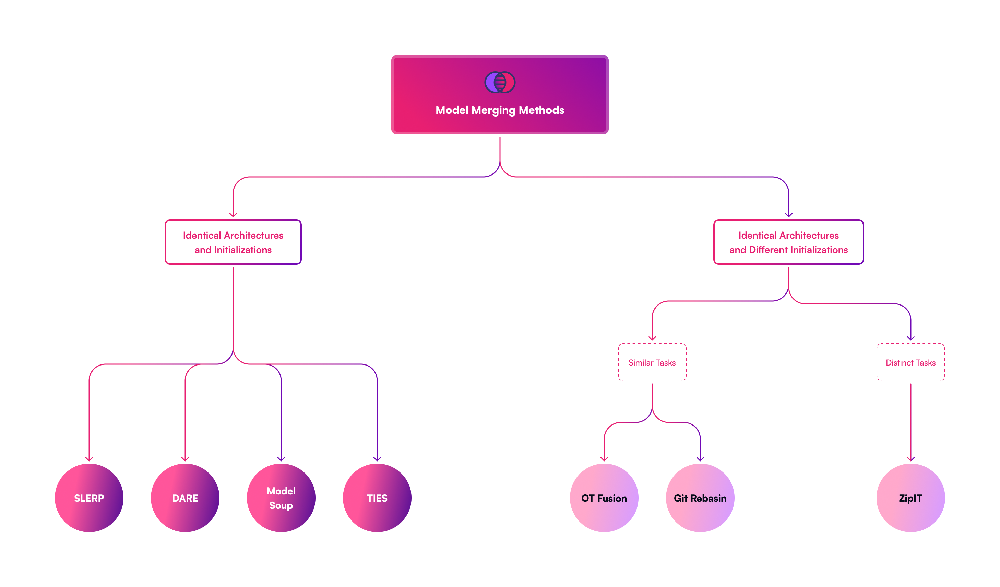
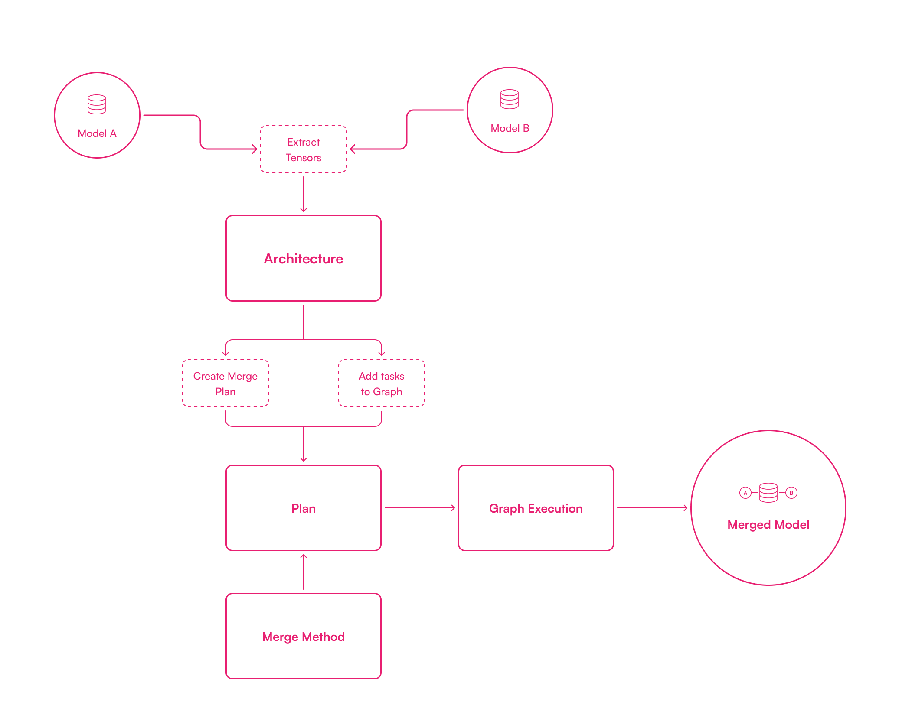
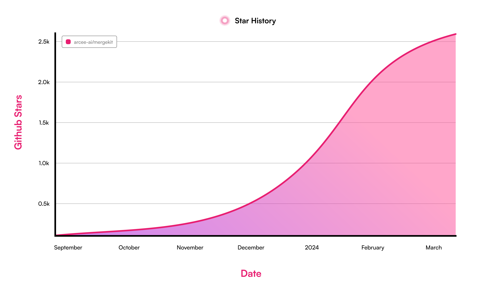
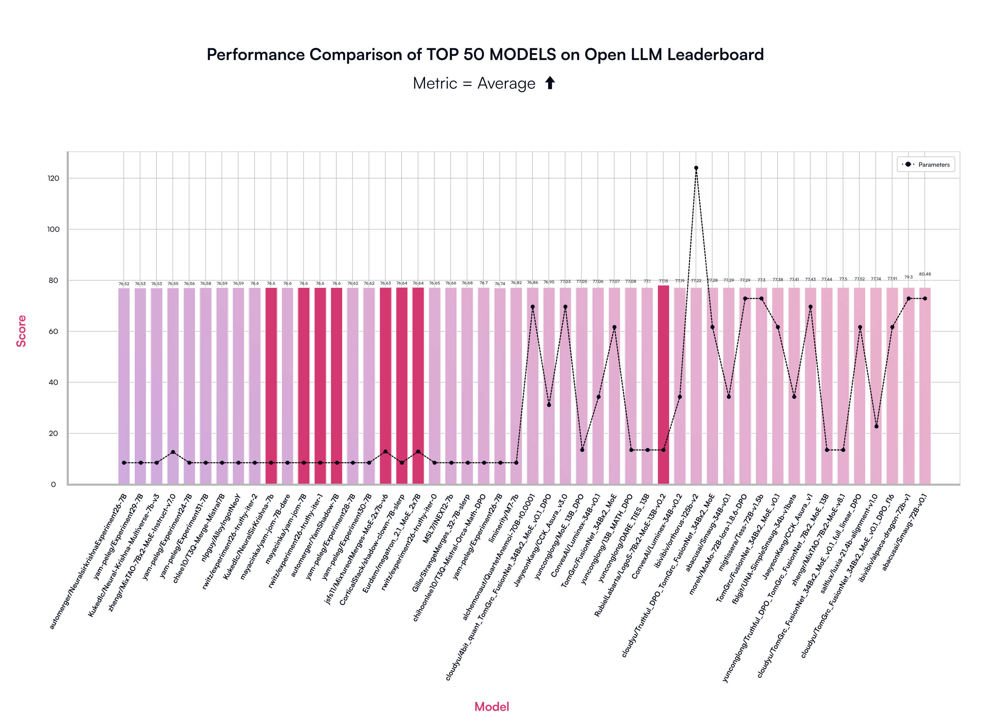

# Arcee 推出 MergeKit，这是一个专为整合大型语言模型而设计的实用工具包。

发布时间：2024年03月19日

`LLM应用` `模型融合`

> Arcee's MergeKit: A Toolkit for Merging Large Language Models

> 开源语言模型的爆发式增长带来契机，可通过整合各模型参数实现能力互补。迁移学习技术的演进使得针对特定任务对预训练模型进行微调成为可能，从而产生了大量专注单一任务、难以相互借鉴优点的特定任务模型。模型融合技术则突破了这一局限，无需额外训练即可构建多功能多任务模型，有力提升了模型的表现力与适应性，并有效应对了如灾难性遗忘和多任务学习等AI领域的棘手问题。为此，我们推出了MergeKit——一个功能齐全且开源的工具库，致力于简化并促进模型融合策略的应用。MergeKit提供了一个灵活的扩展框架，可在各种硬件上高效合并模型，极大地服务于研究者和实践者的需求。时至今日，开源社区已成功合并数千个模型，其中不乏在Open LLM Leaderboard排行榜上名列前茅的世界级开源模型检查点。您可以通过访问https://github.com/arcee-ai/MergeKit获取此库资源。

> The rapid expansion of the open-source language model landscape presents an opportunity to merge the competencies of these model checkpoints by combining their parameters. Advances in transfer learning, the process of fine-tuning pre-trained models for specific tasks, has resulted in the development of vast amounts of task-specific models, typically specialized in individual tasks and unable to utilize each other's strengths. Model merging facilitates the creation of multitask models without the need for additional training, offering a promising avenue for enhancing model performance and versatility. By preserving the intrinsic capabilities of the original models, model merging addresses complex challenges in AI - including the difficulties of catastrophic forgetting and multi-task learning. To support this expanding area of research, we introduce MergeKit, a comprehensive, open-source library designed to facilitate the application of model merging strategies. MergeKit offers an extensible framework to efficiently merge models on any hardware, providing utility to researchers and practitioners. To date, thousands of models have been merged by the open-source community, leading to the creation of some of the worlds most powerful open-source model checkpoints, as assessed by the Open LLM Leaderboard. The library is accessible at https://github.com/arcee-ai/MergeKit.

[Arxiv](https://arxiv.org/abs/2403.13257)