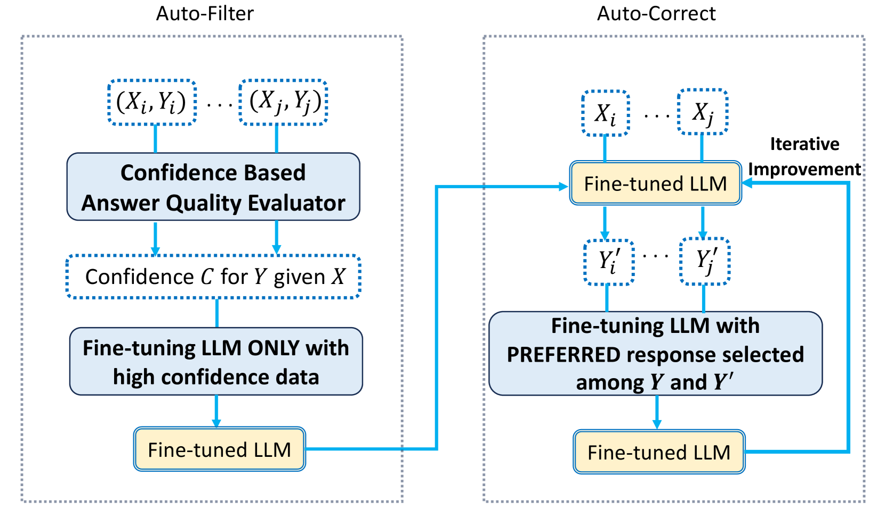
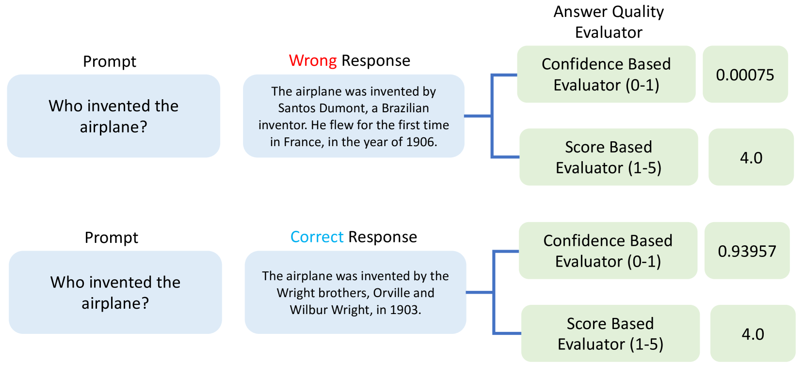
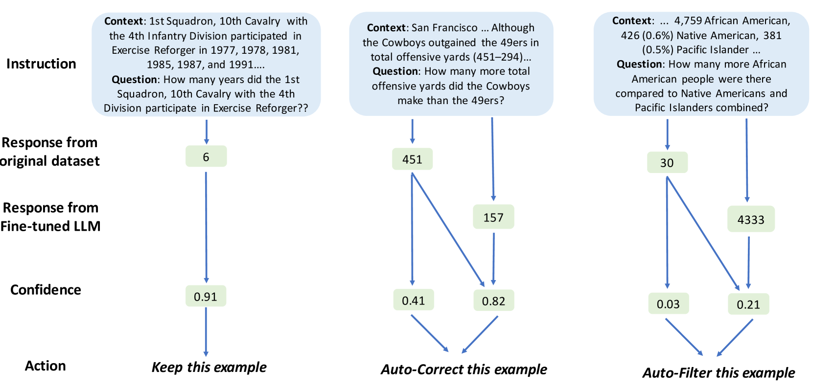
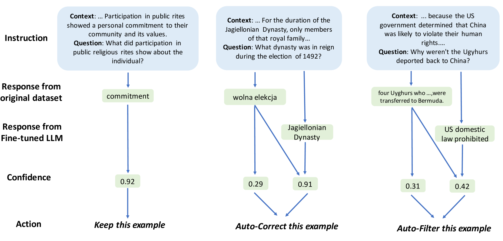
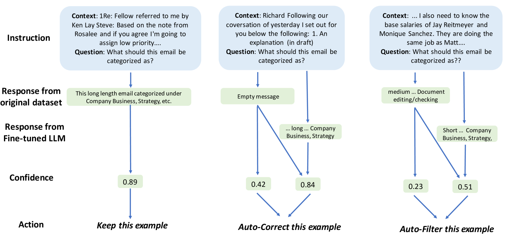

# 自动化的数据优选方法助力提升语言模型微调的稳健性

发布时间：2024年03月19日

`LLM应用` `数据优化`

> Automated Data Curation for Robust Language Model Fine-Tuning

# 摘要

> 如今，LLM已成为处理序列到序列文本生成任务的主流选择，但在专业任务及特定领域中，未经专门训练的LLM往往难以生成精准且格式规范的回答。通过监督微调，利用带目标回复的样本数据集可让LLM习得特殊技能，但实际数据时常包含噪声。面对众多微调算法，本文着眼于“数据驱动AI”的视角，探索如何系统化优化训练数据集，从而提升任何微调策略下产出的LLM效果。我们创新提出了一款名为CLEAR的自动化数据优选流程，特别适用于指导式微调数据集，它兼容各类LLM及其微调程序。CLEAR通过LLM自身的置信度评估筛选并修正低质量的训练数据，确保只对数据集做出有依据的改动。区别于现有数据优选技术，CLEAR提供了一个全面的方法论，无需额外微调运算即可提升数据集及相应训练模型的表现。而且，我们并不假定拥有一个比待微调模型更强的LLM作为参照（比如在微调GPT-3.5时借用GPT-4），而是检验CLEAR能否实质性地增强任何LLM的实力。实验证明，CLEAR在多种数据集和模型（如GPT-3.5、Llama2等）上均能显著提升微调模型的性能表现。

> Large Language Models have become the de facto approach to sequence-to-sequence text generation tasks, but for specialized tasks/domains, a pretrained LLM lacks specific capabilities to produce accurate or well-formatted responses. Supervised fine-tuning specializes a LLM by training it on dataset of example prompts with target responses, but real-world data tends to be noisy. While many fine-tuning algorithms exist, here we consider a \emph{data-centric AI} perspective on LLM fine-tuning, studying how to \emph{systematically} curate the training dataset to improve the LLM produced via \emph{any} fine-tuning algorithm.
  We introduce an automated data curation pipeline CLEAR (Confidence-based LLM Evaluation And Rectification) for instruction tuning datasets, that can be used with any LLM and fine-tuning procedure. CLEAR estimates which training data is low-quality and either filters or corrects it. Automatically identifying which data to filter or correct is done via LLM-derived confidence estimates, to ensure only confident modifications to the dataset. Unlike existing data curation techniques, CLEAR is a comprehensive framework that can improve a dataset (and trained model outputs) without additional fine-tuning computations. We don't assume access to a stronger LLM than the model being fine-tuned (e.g.\ relying on GPT-4 when fine-tuning GPT-3.5), to see whether CLEAR can meaningfully improve the capabilities of any LLM. Experiments reveal that CLEAR consistently improves the performance of fine-tuned models across many datasets and models (like GPT-3.5 and Llama2).

[Arxiv](https://arxiv.org/abs/2403.12776)