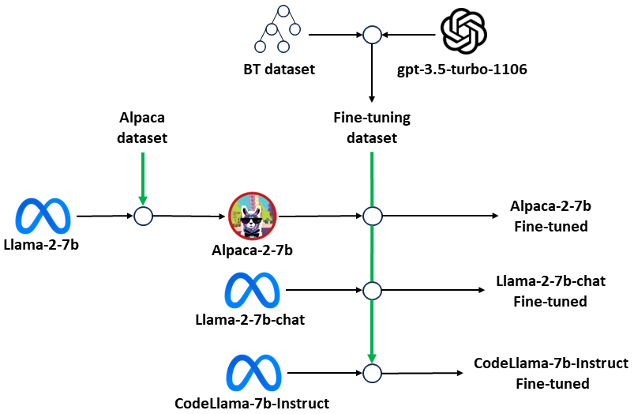
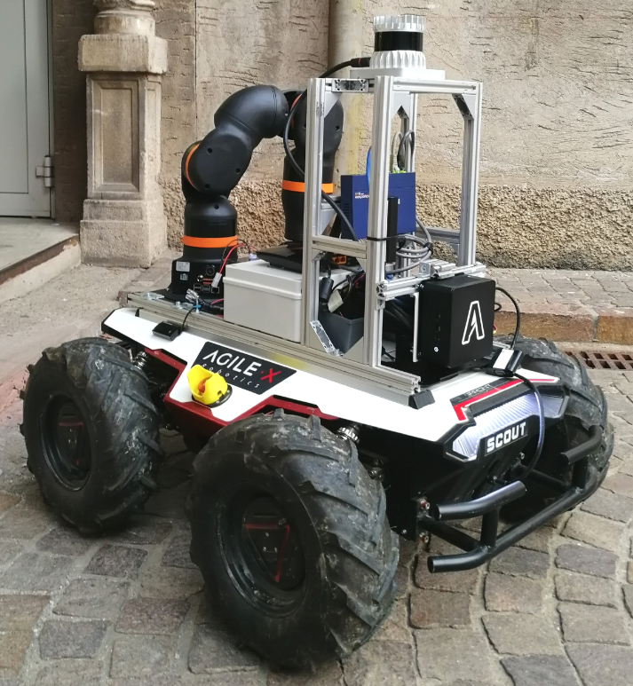

# BTGenBot 是专为机器人任务设计的一款创新工具，它利用轻量级大型语言模型（LLM）自动生成行为树。这一技术旨在简化并优化机器人的任务规划与执行流程。

发布时间：2024年03月19日

`Agent` `机器人`

> BTGenBot: Behavior Tree Generation for Robotic Tasks with Lightweight LLMs

> 本文介绍了一种创新方法，借助参数量不超过70亿的精简版大型语言模型(LLMs)，成功实现为机器人构建行为树。实验显示，只需针对特定数据集对小型LLMs进行微调，即可达到理想效果。研究亮点包括利用GPT-3.5依据已有行为树构造出一个微调数据集，并在九项迥异的任务上对多个LLMs（如llama2、llama-chat及code-llama）进行了深入对比研究。为了保证严谨性，我们从语法静态分析、验证体系、模拟仿真到实体机器人测试，全方位评估了生成的行为树质量。这一成果进一步揭示了在机器人上直接部署这类方案的可能性，提升了其实用性。研究结果显示，参数数量有限的LLMs同样具有生成高效且精准机器人行为的巨大潜能。

> This paper presents a novel approach to generating behavior trees for robots using lightweight large language models (LLMs) with a maximum of 7 billion parameters. The study demonstrates that it is possible to achieve satisfying results with compact LLMs when fine-tuned on a specific dataset. The key contributions of this research include the creation of a fine-tuning dataset based on existing behavior trees using GPT-3.5 and a comprehensive comparison of multiple LLMs (namely llama2, llama-chat, and code-llama) across nine distinct tasks. To be thorough, we evaluated the generated behavior trees using static syntactical analysis, a validation system, a simulated environment, and a real robot. Furthermore, this work opens the possibility of deploying such solutions directly on the robot, enhancing its practical applicability. Findings from this study demonstrate the potential of LLMs with a limited number of parameters in generating effective and efficient robot behaviors.

[Arxiv](https://arxiv.org/abs/2403.12761)