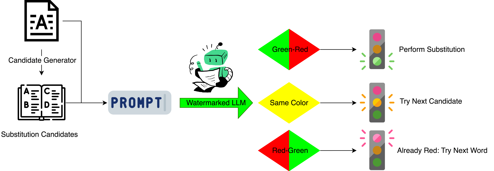
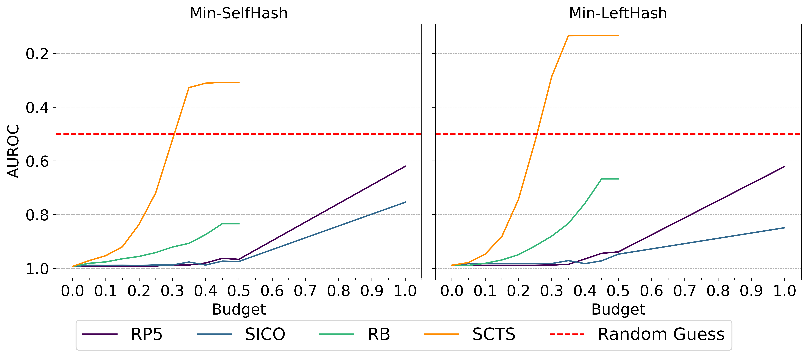
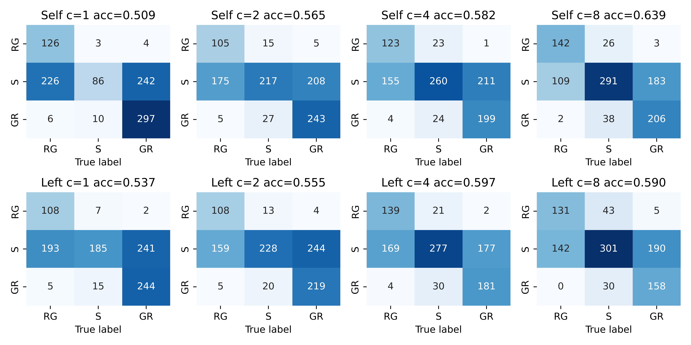
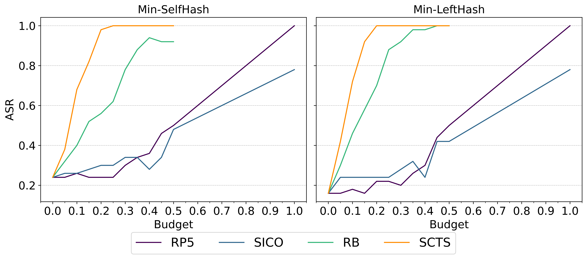
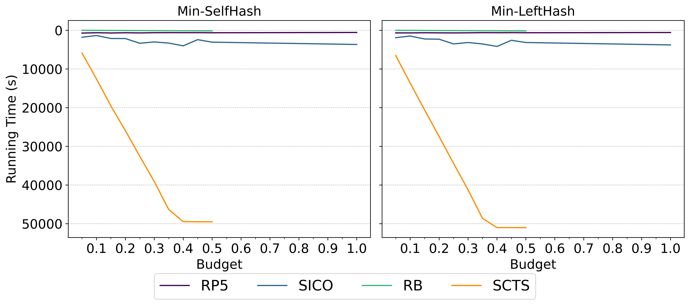
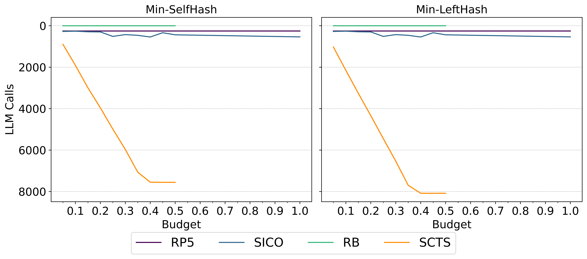

# 运用色彩感知替换策略规避LLM水印技术

发布时间：2024年03月19日

`Agent` `水印技术`

> Bypassing LLM Watermarks with Color-Aware Substitutions

# 摘要

> 针对识别文本源头是人或LLM的问题，现提出水印技术。当前最先进的水印策略巧妙地引导LLM生成特定的“绿色”标记，但其鲁棒性评估尚待解决。现有攻击手段难以在长文本片段中有效绕过检测。为此，我们创新性地提出了首个“认知颜色”的攻击方法——“基于自我颜色测试的替换(SCTS)”。该方法通过精细设计对带水印LLM的提示并分析输出标记频率，从而获取颜色信息，进而针对性地将绿色标记替换成非绿色标记。实验结果显示，SCTS能够在比同类方法更少的编辑次数下成功逃避水印检测。同时，我们理论与实践相结合，证实了SCTS能够有效地移除任意长度带水印文本中的水印信息。

> Watermarking approaches are proposed to identify if text being circulated is human or large language model (LLM) generated. The state-of-the-art watermarking strategy of Kirchenbauer et al. (2023a) biases the LLM to generate specific (``green'') tokens. However, determining the robustness of this watermarking method is an open problem. Existing attack methods fail to evade detection for longer text segments. We overcome this limitation, and propose {\em Self Color Testing-based Substitution (SCTS)}, the first ``color-aware'' attack. SCTS obtains color information by strategically prompting the watermarked LLM and comparing output tokens frequencies. It uses this information to determine token colors, and substitutes green tokens with non-green ones. In our experiments, SCTS successfully evades watermark detection using fewer number of edits than related work. Additionally, we show both theoretically and empirically that SCTS can remove the watermark for arbitrarily long watermarked text.

[Arxiv](https://arxiv.org/abs/2403.14719)