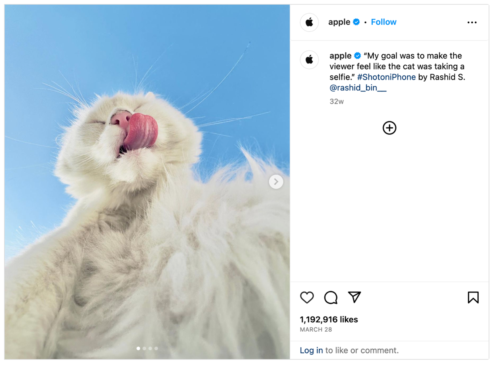
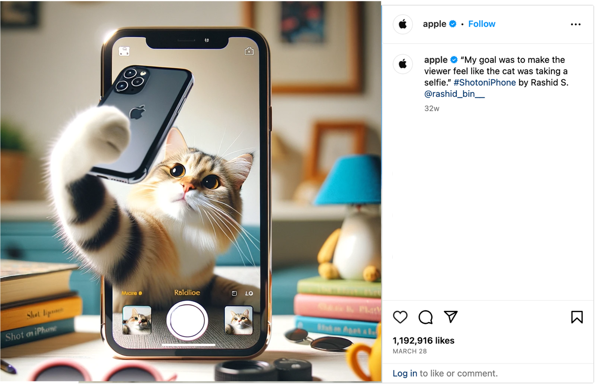
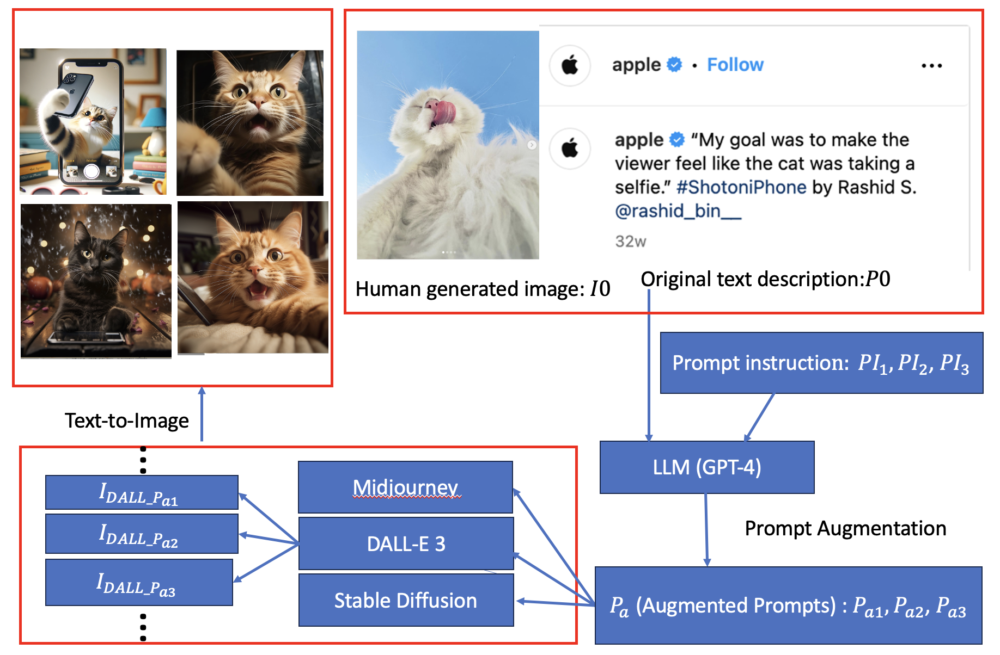
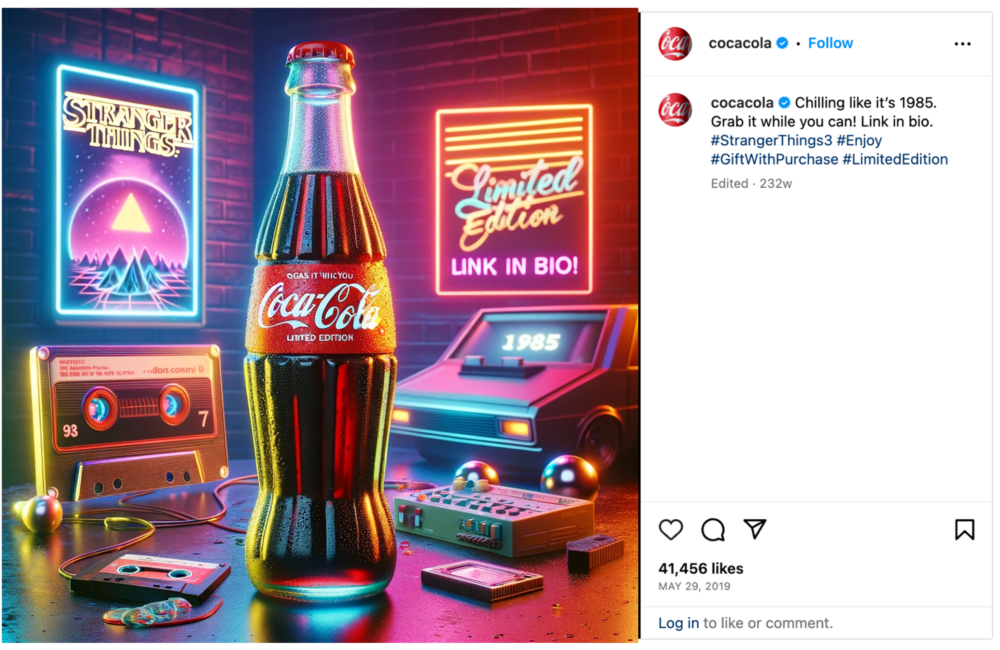
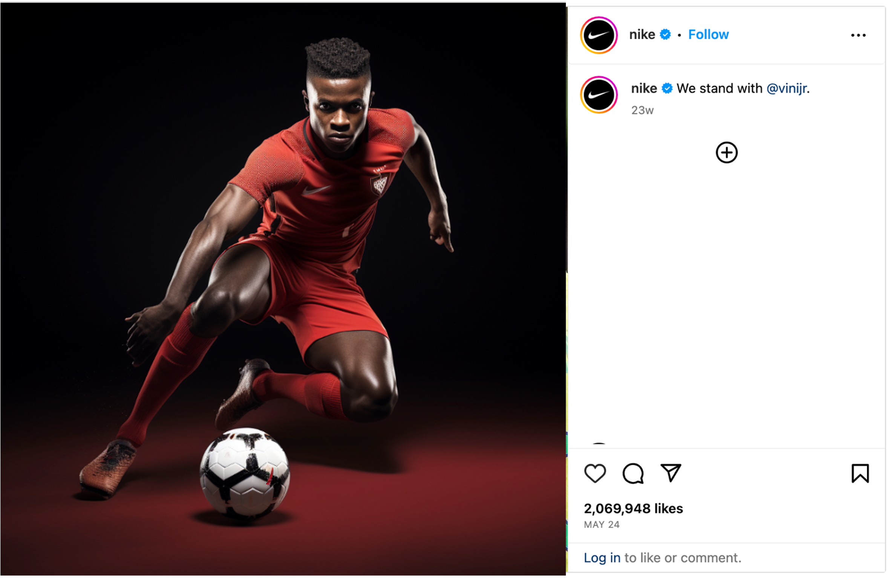
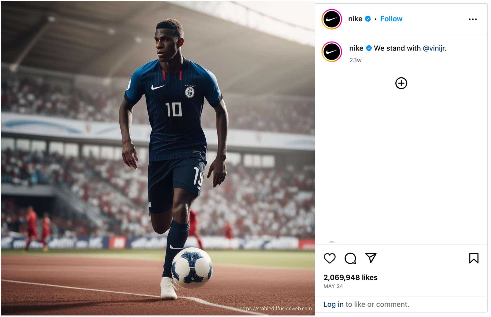

# AI是否能够在制作社交媒体创意方面超越人类专家呢？

发布时间：2024年03月19日

`LLM应用` `创意产业` `社交媒体`

> Can AI Outperform Human Experts in Creating Social Media Creatives?

# 摘要

> 人工智能在诸如国际象棋和围棋等功能性任务上的表现已超越人类专家，但在创意任务上的表现尚待探究。本研究旨在评估AI在创意领域的能力，并与人类专家进行比较。我们设计了一种创新的“提示对提示”策略，利用大型语言模型增强提示，以生成社交媒体上的创意内容。通过分析顶级品牌Instagram上获赞最多的热门帖子，我们为GPT 4提供了多组文本描述的提示指令，旨在为Midjourney、DALL E 3和Stable Diffusion等先进的文本到图像生成器打造最有效的提示。这种LLM增强的提示方法通过加入目标、互动策略、光线效果和品牌一致性，增强了AI在社交媒体图像创作方面的能力。通过广泛的人类评估实验，我们发现AI在创意表现上超越了人类专家，其中Midjourney表现尤为突出。出乎意料的是，与传统社交媒体行业的认知相反，那些包含引人注目元素的提示指令实际上效果不佳，而更自然的提示指令表现更佳。在创意内容类型方面，AI在处理动物或产品相关的创意时表现更佳，而在处理真人图像时提升有限。此外，AI在处理简短文本描述的创意内容时表现得更为出色，因为简短描述为AI提供了更多的发挥空间。

> Artificial Intelligence has outperformed human experts in functional tasks such as chess and baduk. How about creative tasks? This paper evaluates AI's capability in the creative domain compared to human experts, which little research has been conducted so far. We propose a novel Prompt-for-Prompt to generate social media creatives via prompt augmentation by Large Language Models. We take the most popular Instagram posts (with the biggest number of like clicks) in top brands' Instagram accounts to create social media creatives. We give GPT 4 several prompt instructions with text descriptions to generate the most effective prompts for cutting-edge text-to-image generators: Midjourney, DALL E 3, and Stable Diffusion. LLM-augmented prompts can boost AI's abilities by adding objectives, engagement strategy, lighting and brand consistency for social media image creation. We conduct an extensive human evaluation experiment, and find that AI excels human experts, and Midjourney is better than the other text-to-image generators. Surprisingly, unlike conventional wisdom in the social media industry, prompt instruction including eye-catching shows much poorer performance than those including natural. Regarding the type of creatives, AI improves creatives with animals or products but less with real people. Also, AI improves creatives with short text descriptions more than with long text descriptions, because there is more room for AI to augment prompts with shorter descriptions.

[Arxiv](https://arxiv.org/abs/2404.00018)