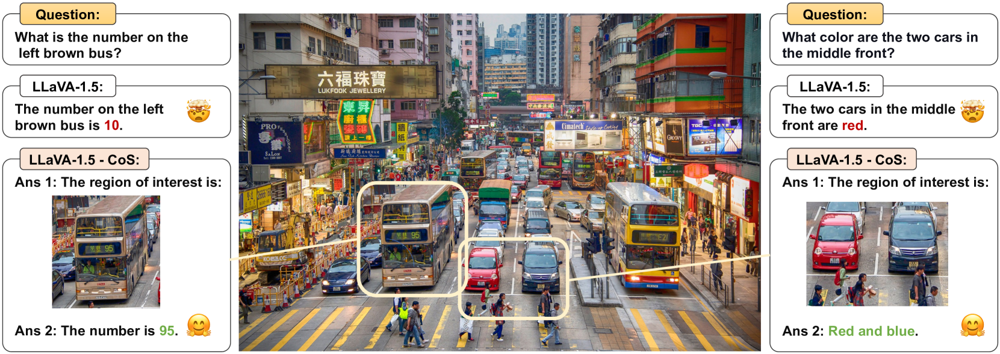
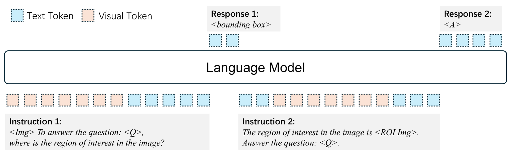

# Chain-of-Spot研究揭示，通过引入交互式推理机制，可以显著提升大型视觉-语言模型的性能表现。

发布时间：2024年03月19日

`Agent` `计算机视觉`

> Chain-of-Spot: Interactive Reasoning Improves Large Vision-Language Models

> 在视觉语言理解的世界里，模型解读和基于视觉内容进行推理的能力是许多应用的核心所在。然而，大型视觉语言模型（LVLM）中的视觉编码器往往难以针对性地抽取有助于解答问题的有效特征。另外，当前多数LVLM通常依赖低分辨率图像输入，这也限制了视觉识别的精细程度。为此，我们提出了创新的“点链”（CoS）方法，它运用交互式推理机制，集中关注与给定问题或指令紧密相关的图像关键区域（ROI），有效提升特征提取效果。这种方法使LVLM能够无损原图分辨率的前提下捕获更多详尽的视觉信息，从而提供多层次的图像特征。当我们将点链技术与遵循指令的LLaVA-1.5模型整合时，发现其在各种多模态数据集和基准测试上的图像推理能力均有显著提升，且无需任何花哨的附加操作，已达到新的技术水平。实验结果显示，这一进步明显增强了LVLM对视觉内容理解和推理的能力，为今后开发更为精密的视觉指令跟随应用开辟了新路径。相关代码和模型已在GitHub仓库（https://github.com/dongyh20/Chain-of-Spot）开放获取。

> In the realm of vision-language understanding, the proficiency of models in interpreting and reasoning over visual content has become a cornerstone for numerous applications. However, it is challenging for the visual encoder in Large Vision-Language Models (LVLMs) to extract useful features tailored to questions that aid the language model's response. Furthermore, a common practice among existing LVLMs is to utilize lower-resolution images, which restricts the ability for visual recognition. Our work introduces the Chain-of-Spot (CoS) method, which we describe as Interactive Reasoning, a novel approach that enhances feature extraction by focusing on key regions of interest (ROI) within the image, corresponding to the posed questions or instructions. This technique allows LVLMs to access more detailed visual information without altering the original image resolution, thereby offering multi-granularity image features. By integrating Chain-of-Spot with instruct-following LLaVA-1.5 models, the process of image reasoning consistently improves performance across a wide range of multimodal datasets and benchmarks without bells and whistles and achieves new state-of-the-art results. Our empirical findings demonstrate a significant improvement in LVLMs' ability to understand and reason about visual content, paving the way for more sophisticated visual instruction-following applications. Code and models are available at https://github.com/dongyh20/Chain-of-Spot

[Arxiv](https://arxiv.org/abs/2403.12966)