# 通过“基于图表的推理”技术，我们致力于将大型语言模型（LLMs）的能力迁移至视觉语言模型（VLMs），实现跨模态能力的转化与共享。

发布时间：2024年03月19日

`LLM应用` `多模态`

> Chart-based Reasoning: Transferring Capabilities from LLMs to VLMs

> VLMs 在解决多模态任务时表现出越来越强的实力，但小型 VLMs 的推理能力尤其受限，而 LLMs 则在这方面持续进步。我们创新性地提出了一个技术方案，将 LLMs 的卓越能力迁移到 VLMs 中。在最新的 ChartQA 测试中，当该技术应用于 PaLI3-5B VLM 模型时，取得了顶尖水平的表现，并且在 PlotQA 和 FigureQA 上同样大幅提升成绩。我们首先借助 \citet{liu2023deplot} 改进的图表转表格预训练任务优化了图表表示。随后，我们构建了一个比原训练集大 20 倍的新数据集。为了增强模型的一般推理能力和处理数值操作的能力，我们依据图表的表格形式生成推理路径。最终，运用 \citet{hsieh2023distilling} 提出的多任务损失函数对模型进行细致调整。我们的 ChartPaLI-5B 变体无需依赖上游 OCR 系统，便能击败体积大十倍的 PaLIX-55B 等模型，且保持与 PaLI3-5B 基线一致的推理速度。更令人惊喜的是，在使用 \citet{chen2023program} 提出的简易思维程序提示优化理由后，我们的模型成功超越了最新发布的 Gemini Ultra 和 GPT-4V。

> Vision-language models (VLMs) are achieving increasingly strong performance on multimodal tasks. However, reasoning capabilities remain limited particularly for smaller VLMs, while those of large-language models (LLMs) have seen numerous improvements. We propose a technique to transfer capabilities from LLMs to VLMs. On the recently introduced ChartQA, our method obtains state-of-the-art performance when applied on the PaLI3-5B VLM by \citet{chen2023pali3}, while also enabling much better performance on PlotQA and FigureQA.
  We first improve the chart representation by continuing the pre-training stage using an improved version of the chart-to-table translation task by \citet{liu2023deplot}. We then propose constructing a 20x larger dataset than the original training set. To improve general reasoning capabilities and improve numerical operations, we synthesize reasoning traces using the table representation of charts. Lastly, our model is fine-tuned using the multitask loss introduced by \citet{hsieh2023distilling}.
  Our variant ChartPaLI-5B outperforms even 10x larger models such as PaLIX-55B without using an upstream OCR system, while keeping inference time constant compared to the PaLI3-5B baseline. When rationales are further refined with a simple program-of-thought prompt \cite{chen2023program}, our model outperforms the recently introduced Gemini Ultra and GPT-4V.

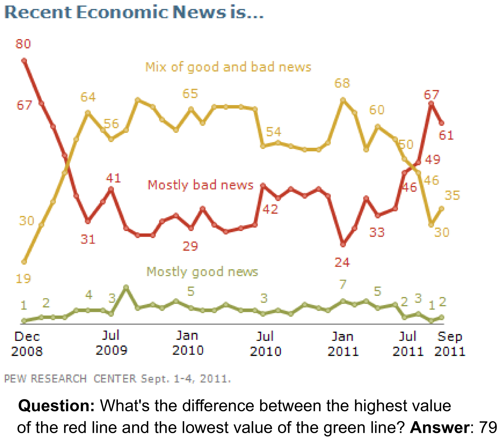

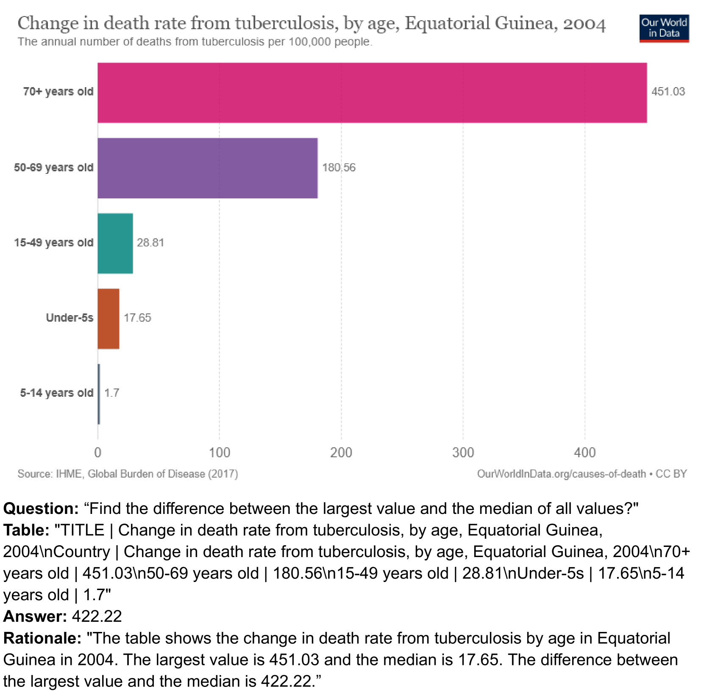

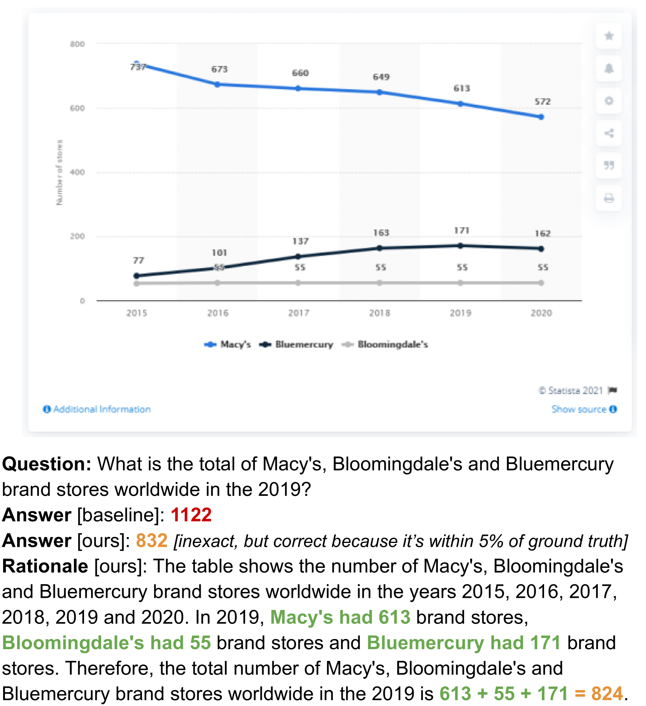

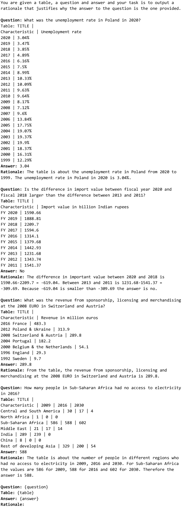

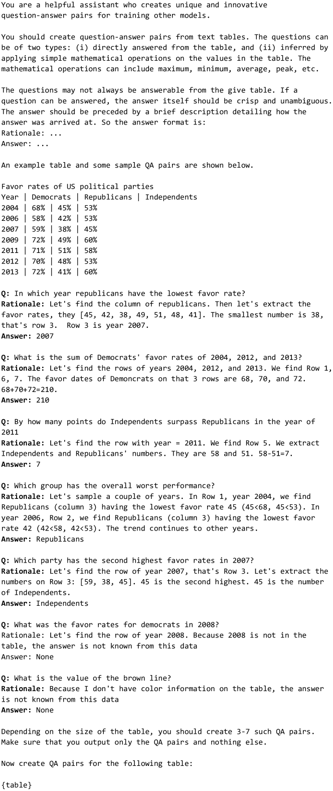

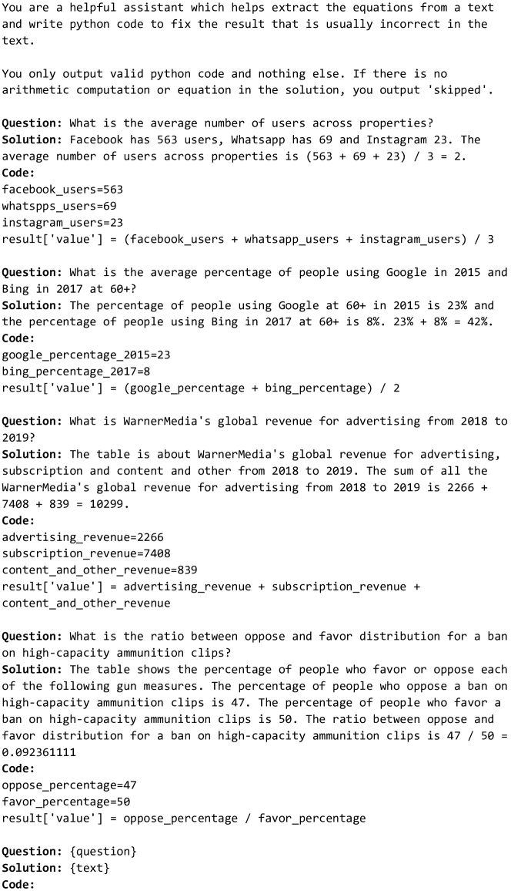

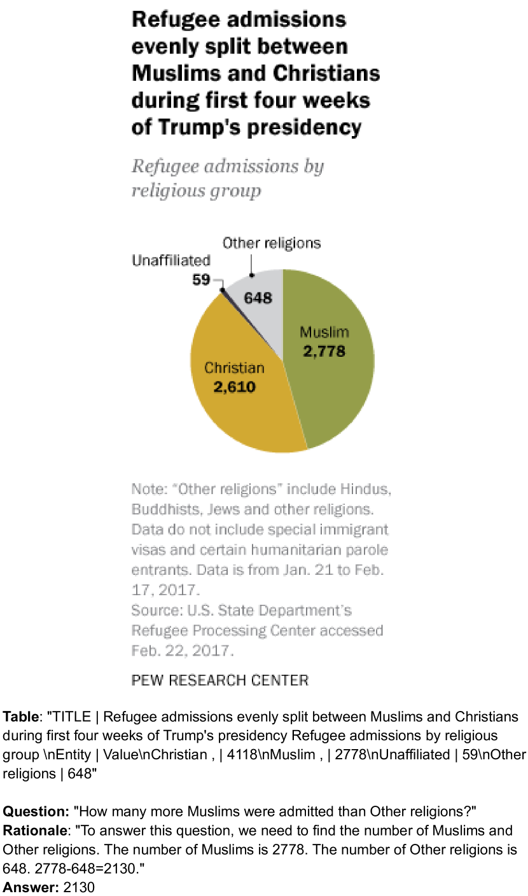

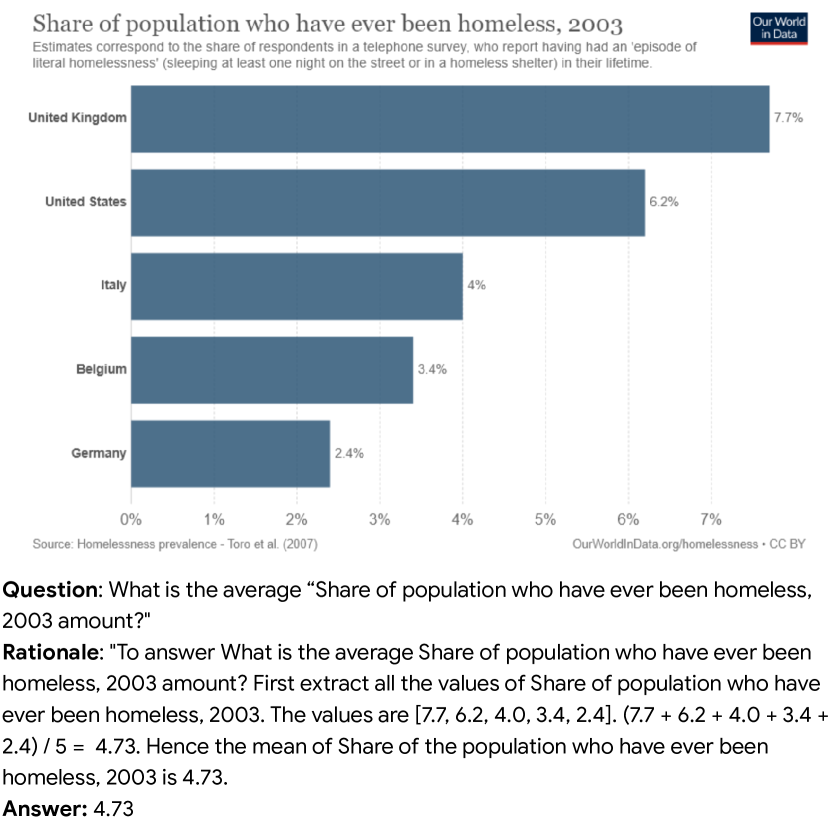

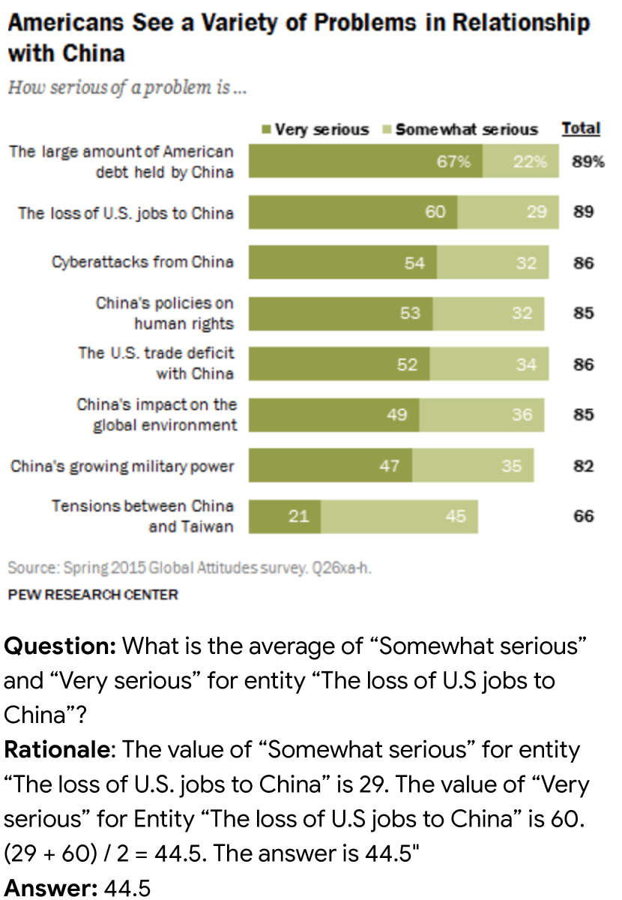

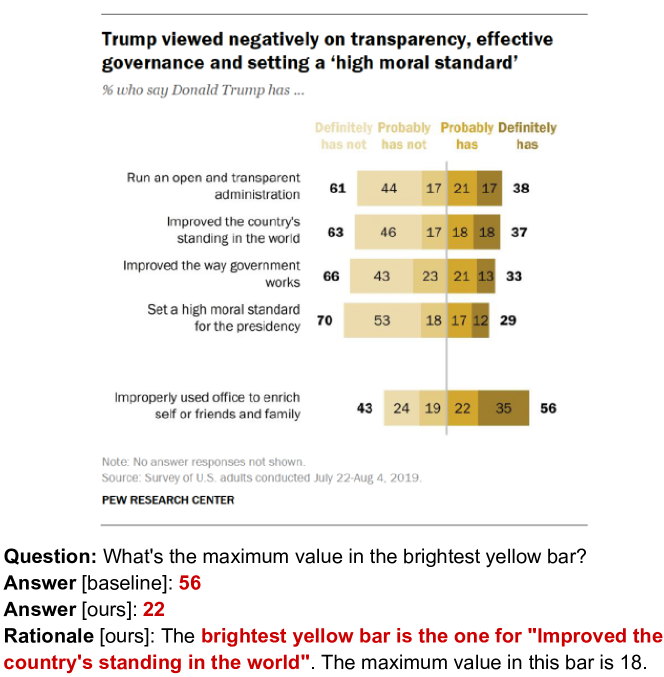

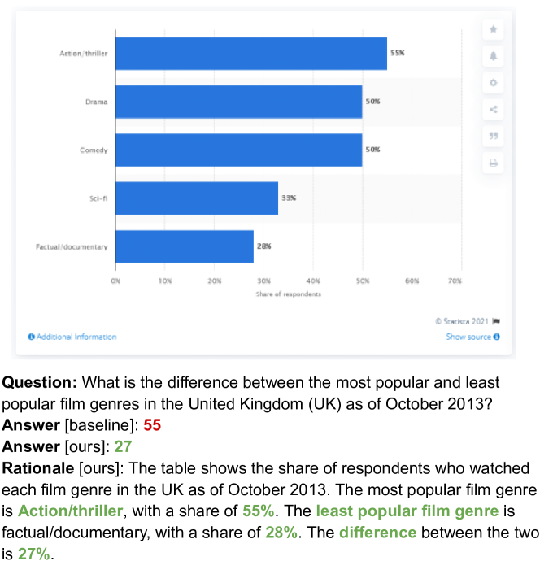

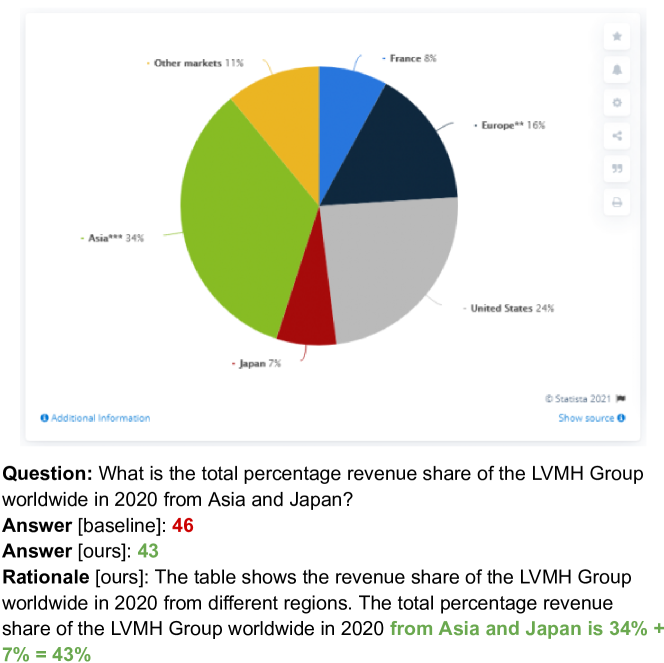

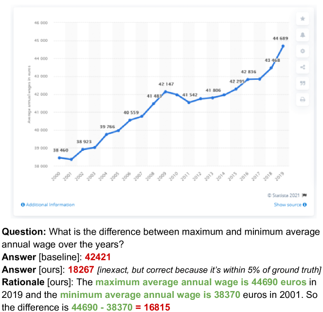

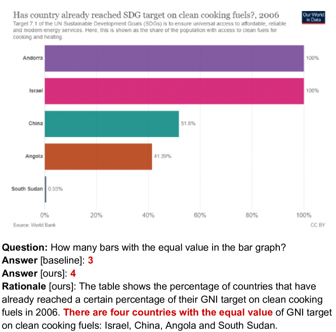

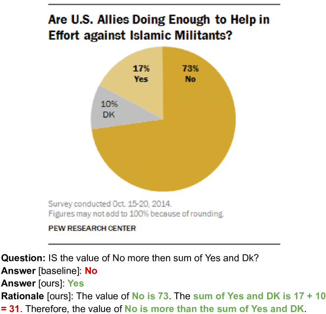

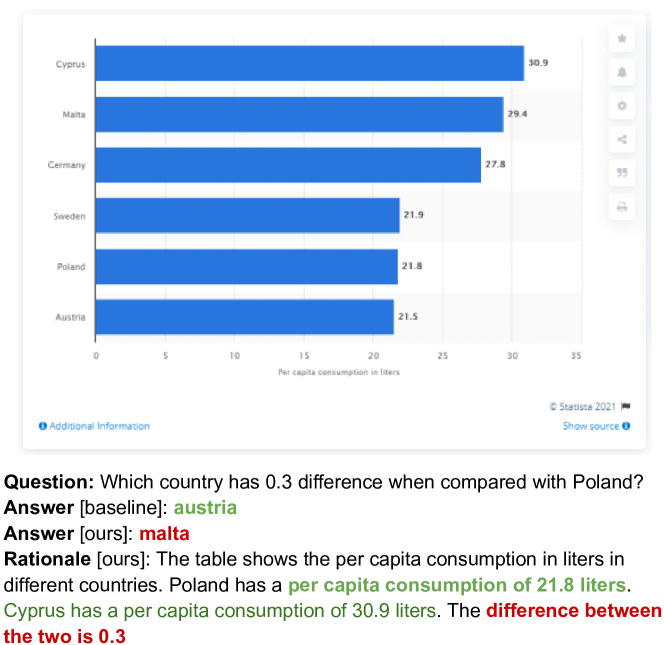

[Arxiv](https://arxiv.org/abs/2403.12596)