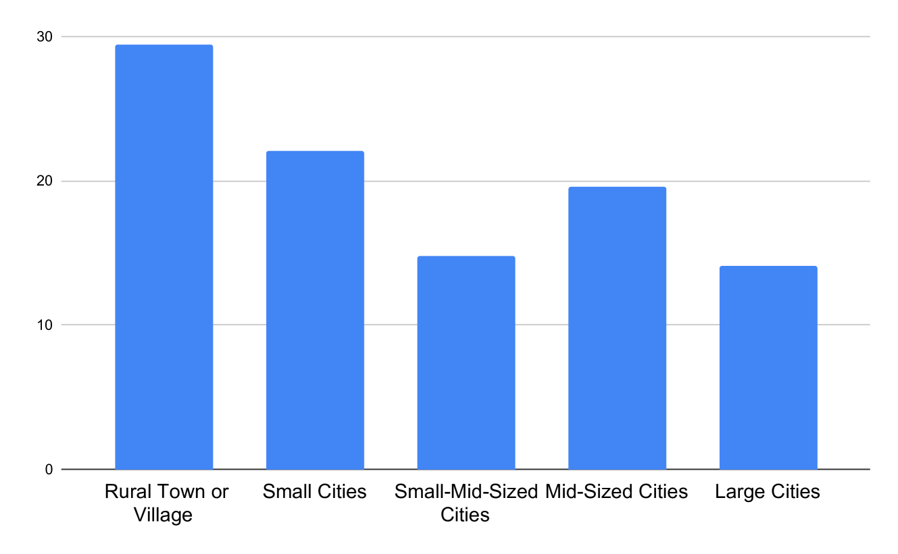
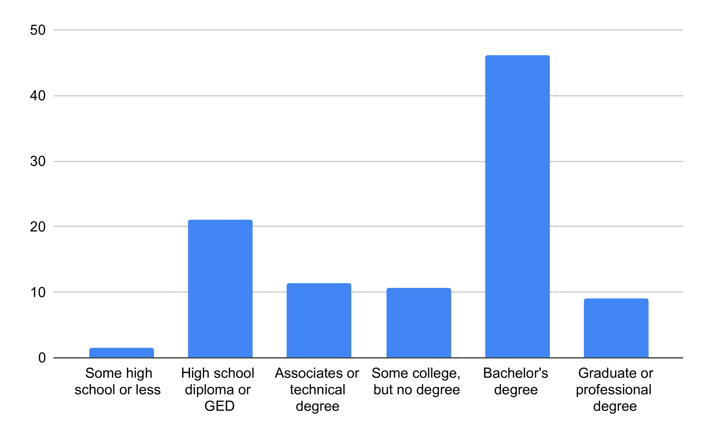
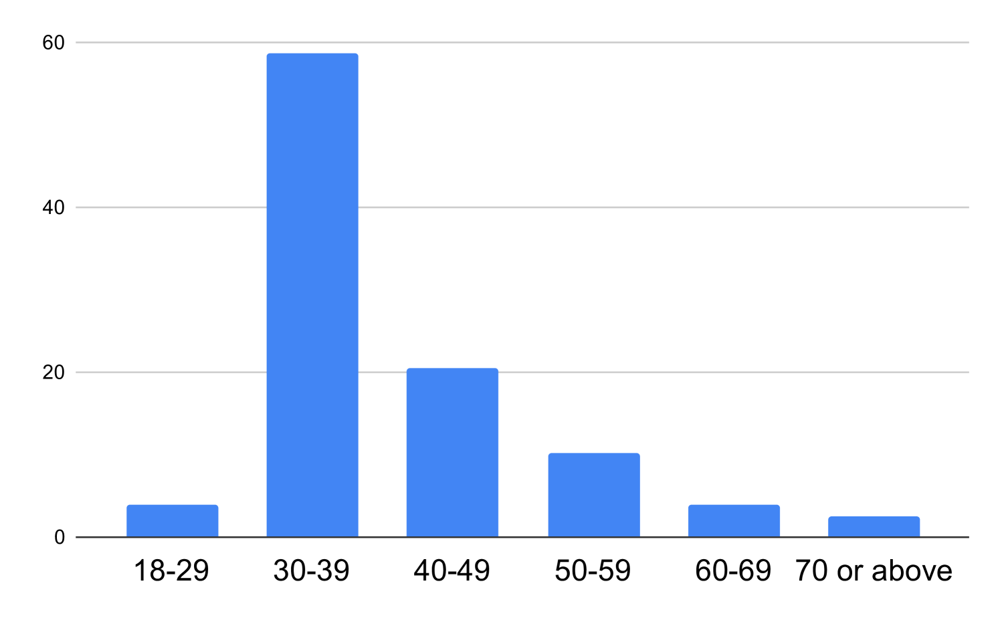
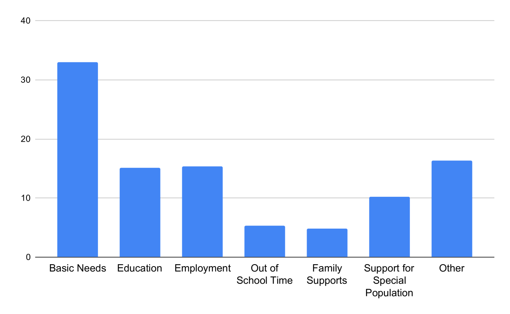
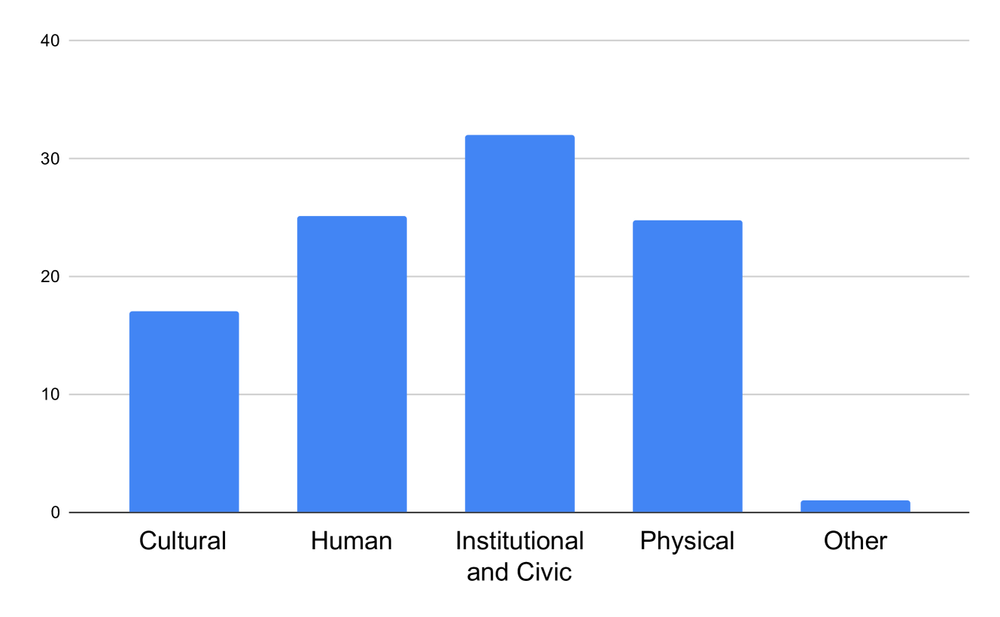
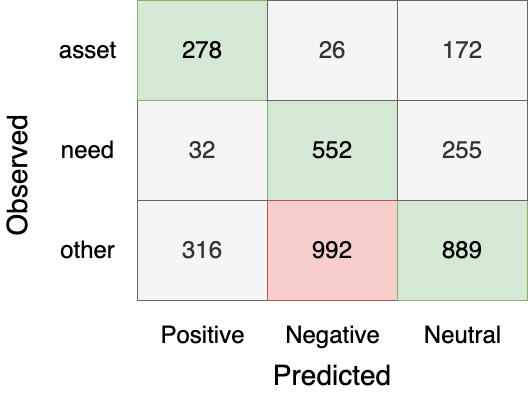
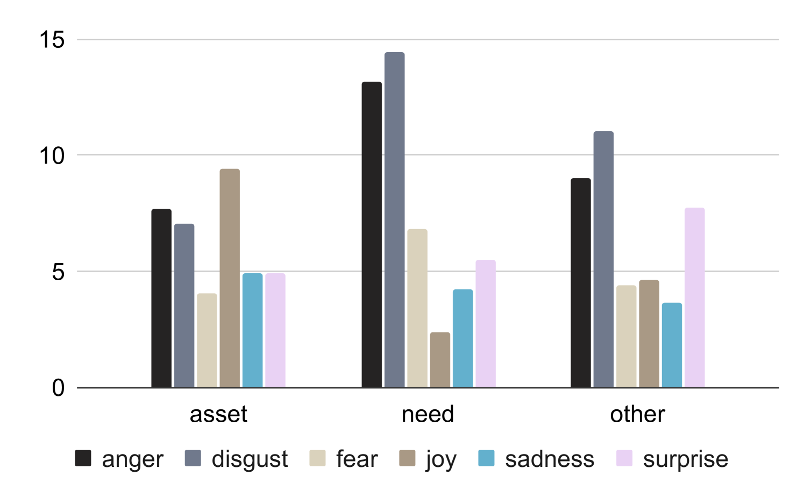
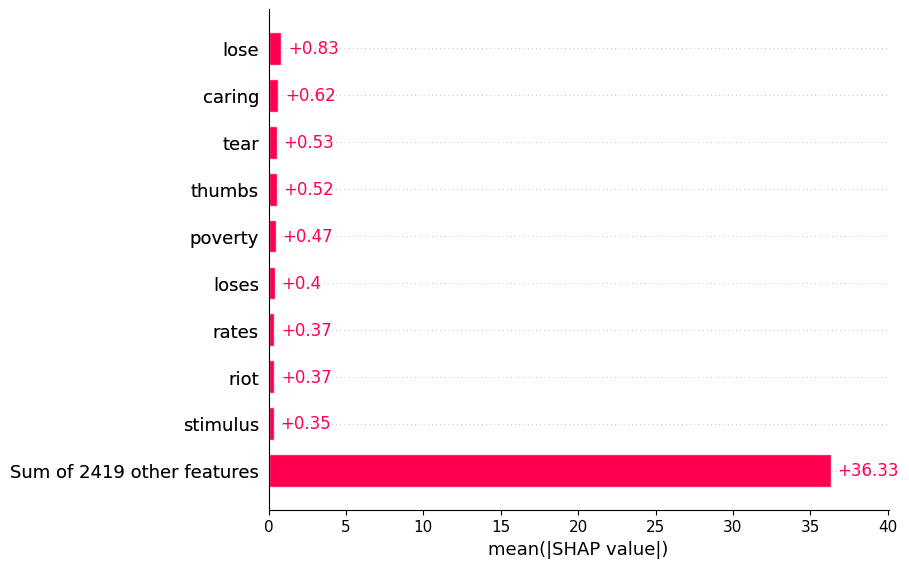
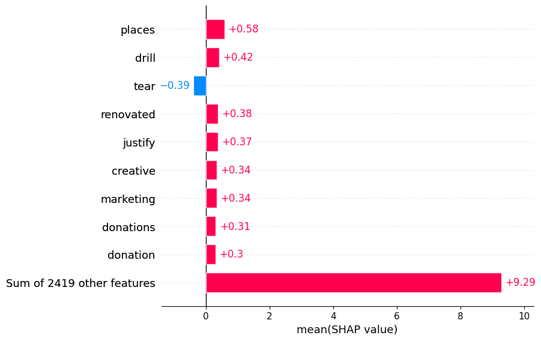
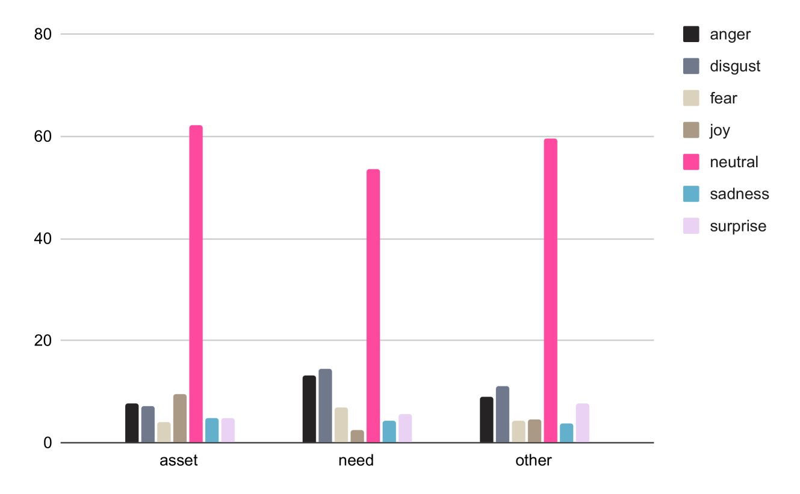

# 通过对社区对话进行深度计算分析，探索社区内需求与资产的分布状况。

发布时间：2024年03月19日

`Agent` `社区服务` `社交媒体分析`

> Community Needs and Assets: A Computational Analysis of Community Conversations

# 摘要

> 社区需求评估是公益组织和政府部门用于衡量社区优劣势，并据此优化资源配置的有效手段，现正逐渐转向借助社交媒体对话挖掘社区需求及内在资源。然而，面对日益庞大的社交媒体对话内容，手动分析显得力不从心。目前在自动分析社区成员如何讨论社区强项和需求的研究中尚存缺口。因此，我们提出运用尖端的自然语言处理技术，针对社交媒体对话中的社区需求和资产进行识别、抽取和分类。为了支持这项任务，我们创建了首个社区需求和资产数据集，包含了3,511条来自Reddit的对话记录，并通过众包方式完成了标注。实验中，我们使用该数据集评估了一个话语级别的分类模型，将其与情感分类模型及一款广泛应用的大规模语言模型（在零样本设置下）进行了比较，结果显示，我们的模型在F1分数上取得了94%，明显优于后两者分别达到的49%和61%。此外，研究还揭示出一个有趣的现象：有关需求的对话通常表达出消极情绪和情感，而涉及资产的对话则更多关注地理位置和具体实体。该数据集已公开发布在https://github.com/towhidabsar/CommunityNeeds。

> A community needs assessment is a tool used by non-profits and government agencies to quantify the strengths and issues of a community, allowing them to allocate their resources better. Such approaches are transitioning towards leveraging social media conversations to analyze the needs of communities and the assets already present within them. However, manual analysis of exponentially increasing social media conversations is challenging. There is a gap in the present literature in computationally analyzing how community members discuss the strengths and needs of the community. To address this gap, we introduce the task of identifying, extracting, and categorizing community needs and assets from conversational data using sophisticated natural language processing methods. To facilitate this task, we introduce the first dataset about community needs and assets consisting of 3,511 conversations from Reddit, annotated using crowdsourced workers. Using this dataset, we evaluate an utterance-level classification model compared to sentiment classification and a popular large language model (in a zero-shot setting), where we find that our model outperforms both baselines at an F1 score of 94% compared to 49% and 61% respectively. Furthermore, we observe through our study that conversations about needs have negative sentiments and emotions, while conversations about assets focus on location and entities. The dataset is available at https://github.com/towhidabsar/CommunityNeeds.

[Arxiv](https://arxiv.org/abs/2403.13272)