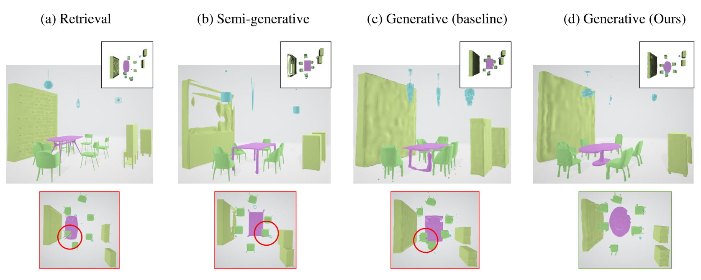
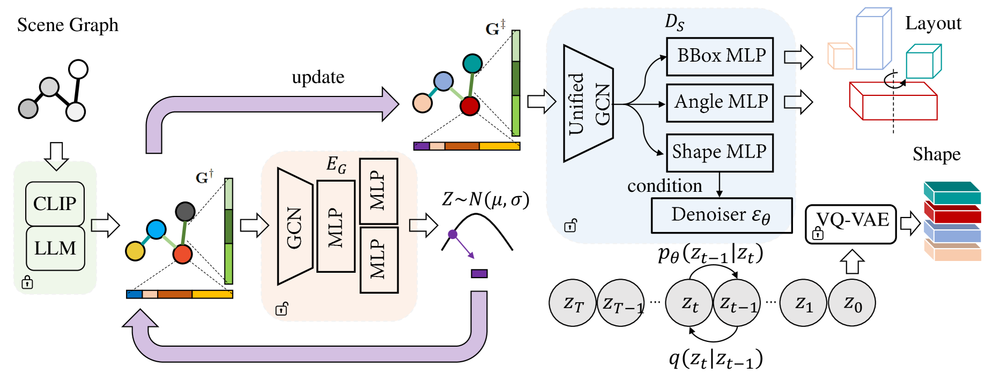
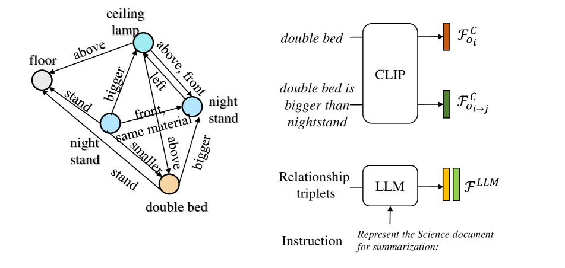
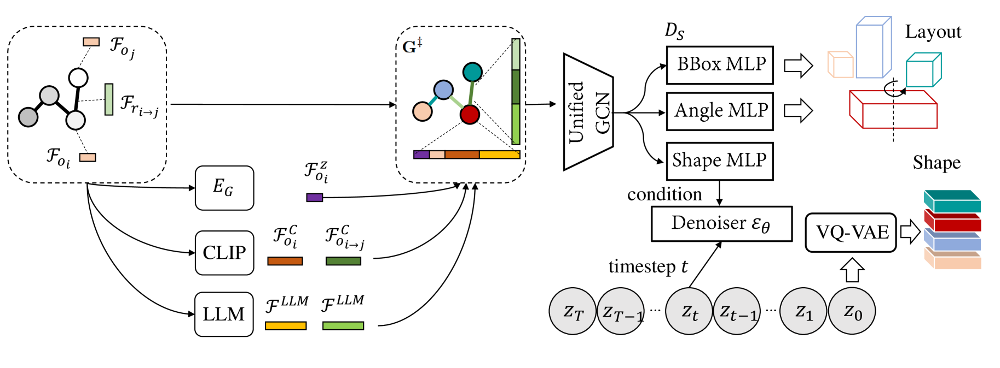
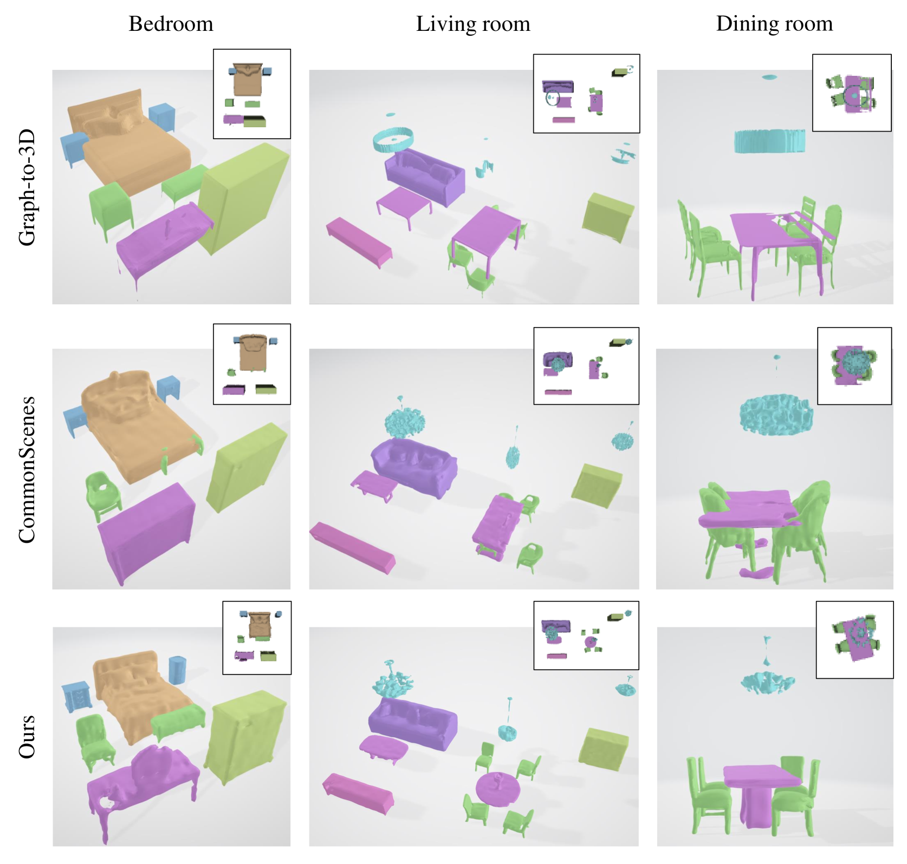
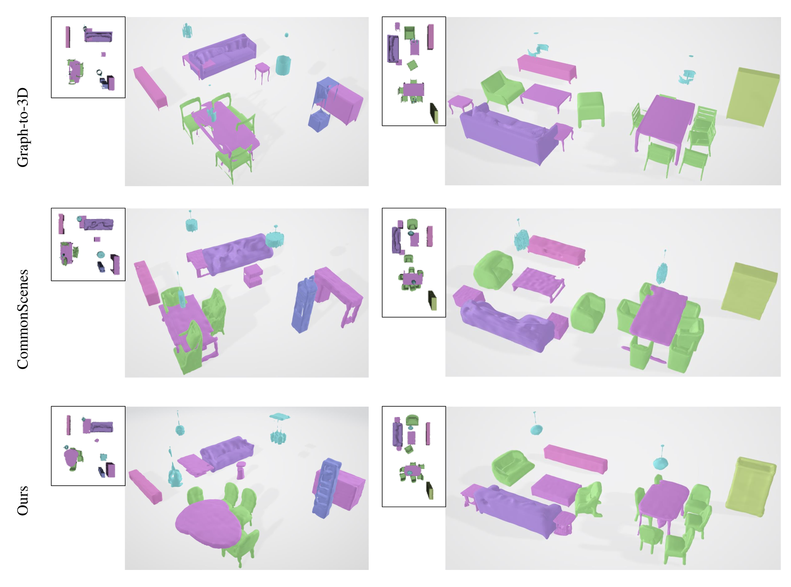
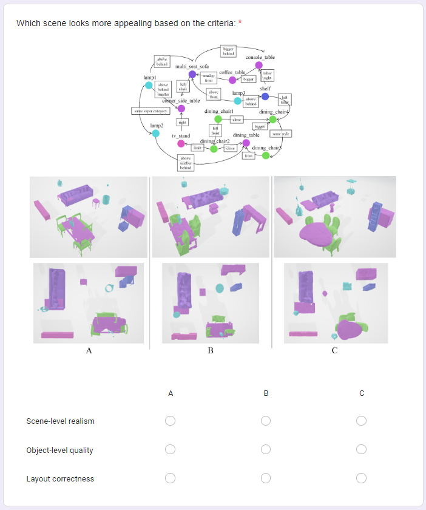
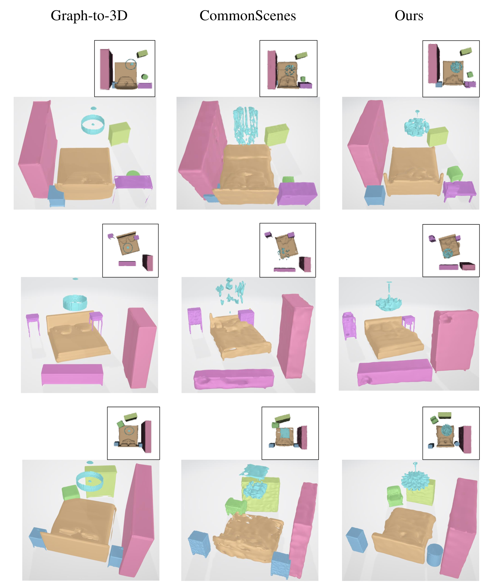
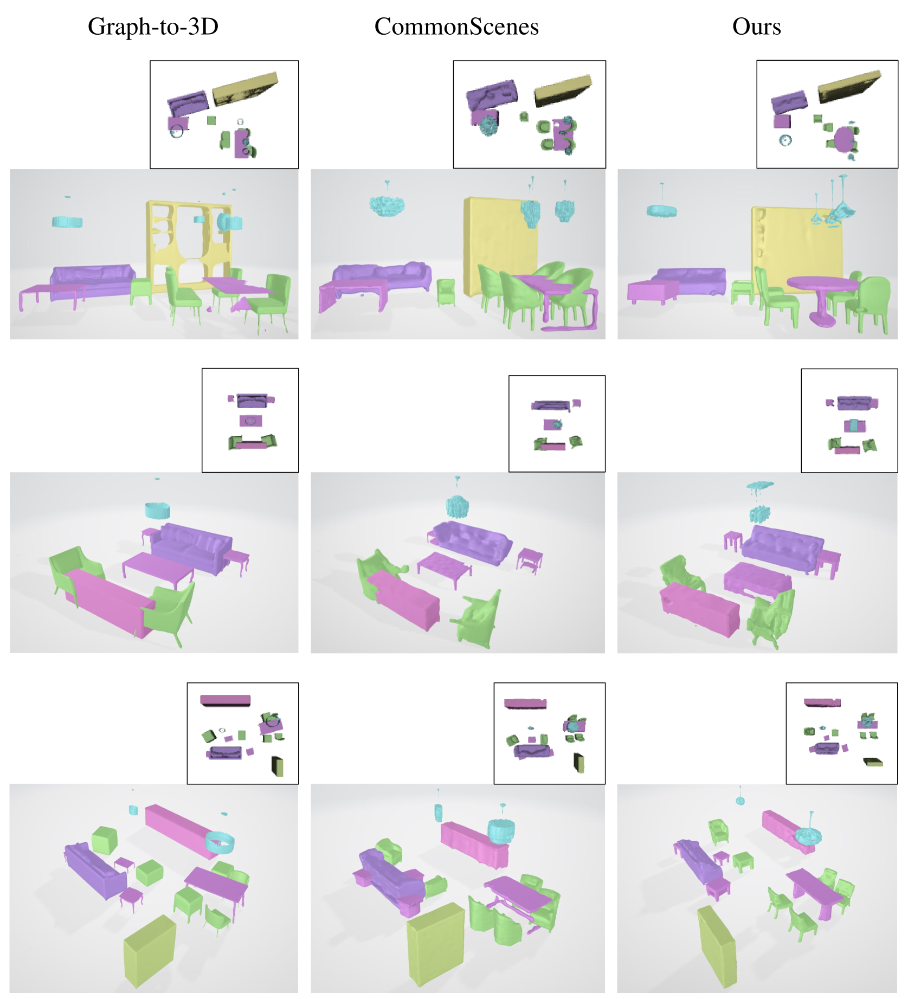
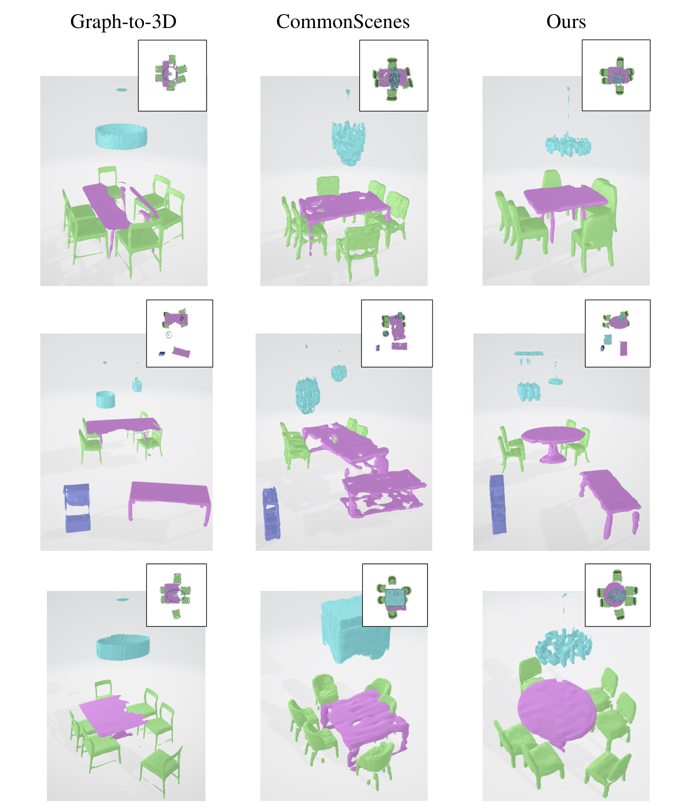

# 借助场景图指导的布局与形状生成技术，我们致力于实现创新的组合式3D场景合成，这种方法能够有序构建和生成复杂的三维场景结构。

发布时间：2024年03月19日

`Agent` `机器人` `三维建模`

> Compositional 3D Scene Synthesis with Scene Graph Guided Layout-Shape Generation

# 摘要

> 组合式三维场景合成技术因其能精确模拟现实世界复杂多对象环境而在机器人、影视及游戏等领域广泛应用。早期研究大多依赖形状检索框架，难免存在形状多样性不足的问题。近年来，随着扩散模型等强力生成模型的崛起，三维形状生成的精度显著提高。但现有方法普遍将三维形状生成与布局生成割裂处理，导致生成场景时常出现布局冲突，暗示场景整体保真度尚未得到充分挖掘。本文以场景图为出发点，致力于生成既逼真又合理的三维场景。为增强输入场景图的表达力，我们巧妙运用大型语言模型融合全局图特征与局部关系特征。通过统一的图卷积网络架构，对经由联合布局-形状分布优化后的场景图进行特征抽取。在场景生成阶段，引入基于IoU的正则化损失函数以约束预测出的三维布局。在SG-FRONT数据集上进行比对实验，证明本方法在三维场景合成效果，特别是场景整体保真度上更胜一筹。文章发表后，我们将公开源代码。

> Compositional 3D scene synthesis has diverse applications across a spectrum of industries such as robotics, films, and video games, as it closely mirrors the complexity of real-world multi-object environments. Early works typically employ shape retrieval based frameworks which naturally suffer from limited shape diversity. Recent progresses have been made in shape generation with powerful generative models, such as diffusion models, which increases the shape fidelity. However, these approaches separately treat 3D shape generation and layout generation. The synthesized scenes are usually hampered by layout collision, which implies that the scene-level fidelity is still under-explored. In this paper, we aim at generating realistic and reasonable 3D scenes from scene graph. To enrich the representation capability of the given scene graph inputs, large language model is utilized to explicitly aggregate the global graph features with local relationship features. With a unified graph convolution network (GCN), graph features are extracted from scene graphs updated via joint layout-shape distribution. During scene generation, an IoU-based regularization loss is introduced to constrain the predicted 3D layouts. Benchmarked on the SG-FRONT dataset, our method achieves better 3D scene synthesis, especially in terms of scene-level fidelity. The source code will be released after publication.

[Arxiv](https://arxiv.org/abs/2403.12848)