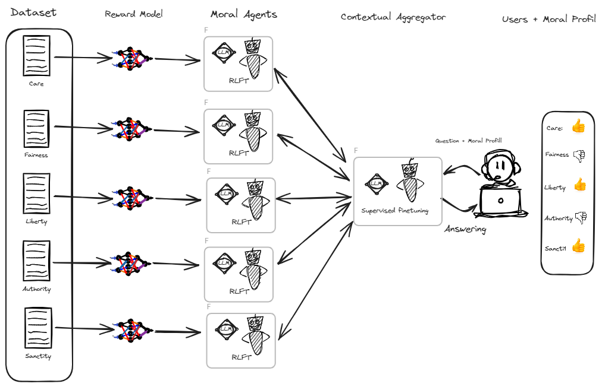
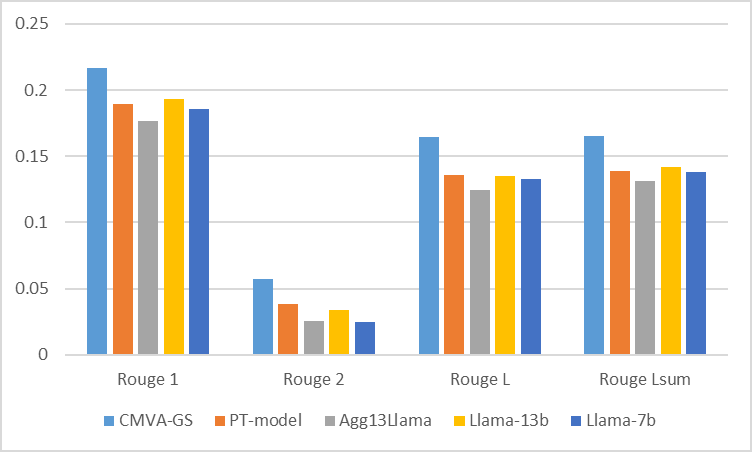

# 我们提出一种通过情境化聚合实现道德价值对齐的方法，该方法能够根据具体情境动态整合和调整模型输出的道德取向。

发布时间：2024年03月19日

`Agent` `道德伦理`

> Contextual Moral Value Alignment Through Context-Based Aggregation

> 在AI的世界里，打造符合价值观的人工智能代理是一个复杂而持久的难题。特别是在LLMs领域，如何将多个分别针对独特道德价值训练的对话代理巧妙地融合成一个能灵活适应并契合多种道德价值观的综合系统，显得尤为关键。本文介绍的是一种基于情境聚合理论的情境道德价值对齐系统，其中“聚合”是指根据用户输入中的特征信息，挑选并整合出最适宜回应用户的LLM应答集合。相较于当前技术水平，这一新型系统在与人类价值观的一致性方面展现出了更优的表现。

> Developing value-aligned AI agents is a complex undertaking and an ongoing challenge in the field of AI. Specifically within the domain of Large Language Models (LLMs), the capability to consolidate multiple independently trained dialogue agents, each aligned with a distinct moral value, into a unified system that can adapt to and be aligned with multiple moral values is of paramount importance. In this paper, we propose a system that does contextual moral value alignment based on contextual aggregation. Here, aggregation is defined as the process of integrating a subset of LLM responses that are best suited to respond to a user input, taking into account features extracted from the user's input. The proposed system shows better results in term of alignment to human value compared to the state of the art.

[Arxiv](https://arxiv.org/abs/2403.12805)