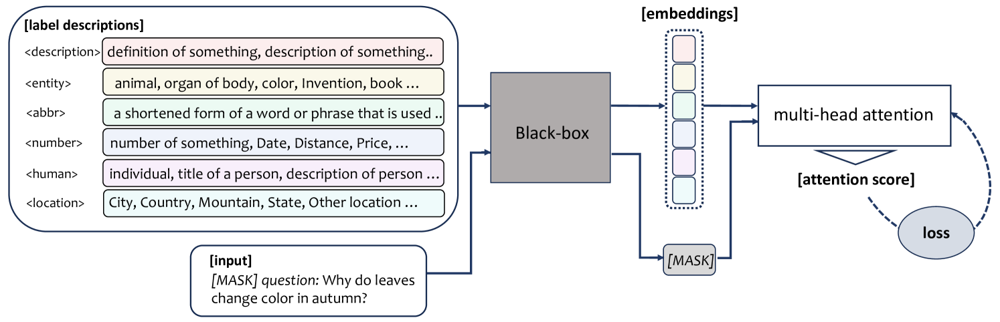
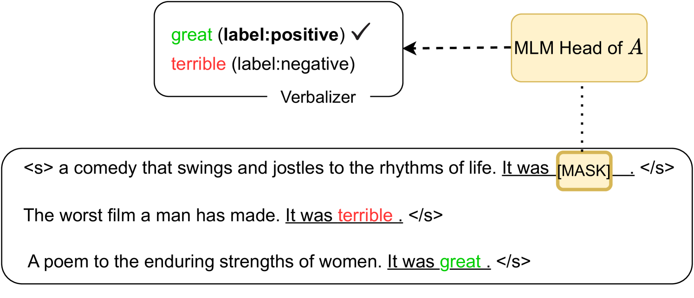
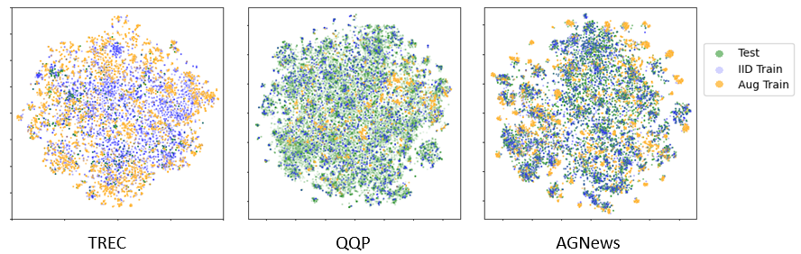
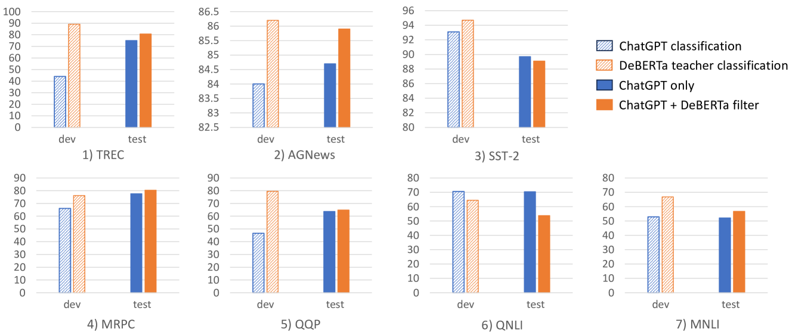

# CrossTune：一种通过标签增强技术实现在黑盒环境下对少量样本进行高效分类的方法。

发布时间：2024年03月19日

`LLM应用` `模型优化`

> CrossTune: Black-Box Few-Shot Classification with Label Enhancement

> 面对训练和微调LLMs所需的大量算力，研究者们开始积极探索下游任务的参数高效适应方案。其中一条途径就是将大型模型作为黑盒处理，并借助前向传播与之互动。目前的研究重心在于利用无梯度提示优化手段使这些黑盒模型适应下游任务，但寻找任务特定提示的过程往往代价高昂。因此，我们致力于探究无需提示搜索的黑盒语言模型适应技术。为此，我们创新性地推出了CrossTune——一种带有标签增强交叉注意力机制的网络，它可以捕捉输入文本序列与任务特有标签描述间的语义关联。我们在小样本文本分类任务中验证了CrossTune的有效性，并进一步利用ChatGPT通过上下文学习策略生成附加训练数据，以提升模型的泛化能力；同时，我们设计了一个开关机制以剔除质量欠佳的ChatGPT生成数据。经过对七大数据集的大规模实验证明，我们的新方法较之前最优的无梯度黑盒调优技术平均提升了5.7%的性能表现。即使在未采用ChatGPT增强数据的情况下，CrossTune仍能展现优于或至少持平于先前黑盒调优方法的效果，有力证明了本研究方法的有效性。

> Training or finetuning large-scale language models (LLMs) requires substantial computation resources, motivating recent efforts to explore parameter-efficient adaptation to downstream tasks. One approach is to treat these models as black boxes and use forward passes (Inference APIs) to interact with them. Current research focuses on adapting these black-box models to downstream tasks using gradient-free prompt optimization, but this often involves an expensive process of searching task-specific prompts. Therefore, we are motivated to study black-box language model adaptation without prompt search. Specifically, we introduce a label-enhanced cross-attention network called CrossTune, which models the semantic relatedness between the input text sequence and task-specific label descriptions. Its effectiveness is examined in the context of few-shot text classification. To improve the generalization of CrossTune, we utilize ChatGPT to generate additional training data through in-context learning. A switch mechanism is implemented to exclude low-quality ChatGPT-generated data. Through extensive experiments on seven benchmark text classification datasets, we demonstrate that our proposed approach outperforms the previous state-of-the-art gradient-free black-box tuning method by 5.7% on average. Even without using ChatGPT-augmented data, CrossTune performs better or comparably than previous black-box tuning methods, suggesting the effectiveness of our approach.

[Arxiv](https://arxiv.org/abs/2403.12468)