# 探究大型语言模型中的知识时效性——追踪其“知识截止点”动态步骤详细解释：1. 过时数据：在大型语言模型中追踪知识的截止点2. 翻译调整后：深入研究大型语言模型所承载知识的时效性问题，即追踪其内部的“知识截止点”。

发布时间：2024年03月19日

`LLM应用` `数据挖掘`

> Dated Data: Tracing Knowledge Cutoffs in Large Language Models

> 公开的LLMs常标配有声称的数据采集截止日期，以确保模型能提供最新信息。但实际情况更为复杂，比如各训练资源是否统一遵循这个截止日期？模型对各类子集所展现的知识更新程度是否与截止日期严格对应？本研究引入“有效截止”概念，不同于设计者声明的整体截止日期，它针对子资源和主题单独适用。我们提出了一个简便方法，通过跨数据版本探查，估算LLM在资源层面的有效截止日期。实验表明，实际有效截止日期常常与声明的截止日期不符。为探究其深层原因，我们对开放预训练数据集进行了大规模直接分析。分析揭示了两方面导致不一致性的因素：(1) CommonCrawl数据中新数据集中包含大量旧数据带来的时间偏差；(2) 在处理语义重复和词汇近似重复时，LLM去重策略引起的复杂问题。综上所述，知识截止日期并非表面看上去那么简单，无论是LLM数据集的构建者还是使用者，在依赖这些模型提供的信息时都需要格外小心。

> Released Large Language Models (LLMs) are often paired with a claimed knowledge cutoff date, or the dates at which training data was gathered. Such information is crucial for applications where the LLM must provide up to date information. However, this statement only scratches the surface: do all resources in the training data share the same knowledge cutoff date? Does the model's demonstrated knowledge for these subsets closely align to their cutoff dates? In this work, we define the notion of an effective cutoff. This is distinct from the LLM designer reported cutoff and applies separately to sub-resources and topics. We propose a simple approach to estimate effective cutoffs on the resource-level temporal alignment of an LLM by probing across versions of the data. Using this analysis, we find that effective cutoffs often differ from reported cutoffs. To understand the root cause of this observation, we conduct a direct large-scale analysis on open pre-training datasets. Our analysis reveals two reasons for these inconsistencies: (1) temporal biases of CommonCrawl data due to non-trivial amounts of old data in new dumps and (2) complications in LLM deduplication schemes involving semantic duplicates and lexical near-duplicates. Overall, our results show that knowledge cutoffs are not as simple as they have seemed and that care must be taken both by LLM dataset curators as well as practitioners who seek to use information from these models.

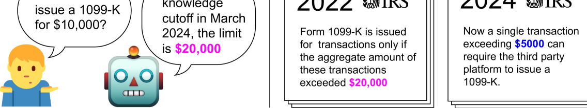

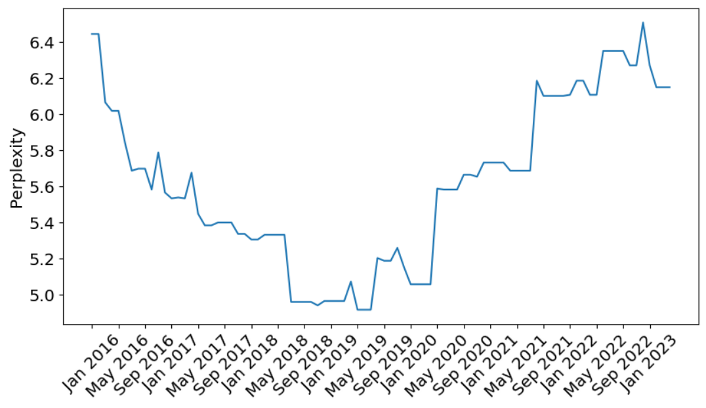

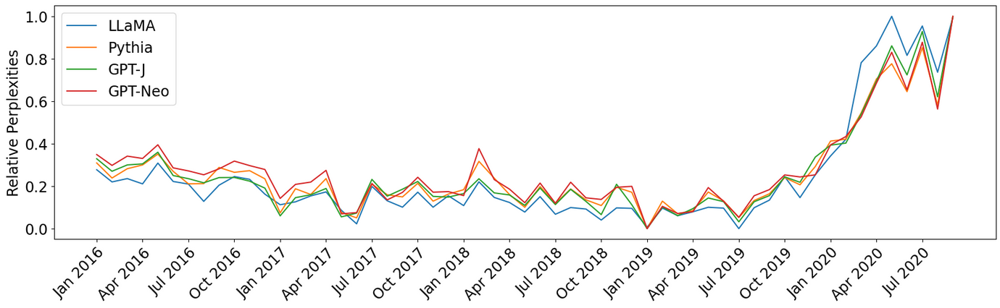

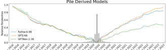

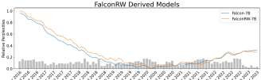

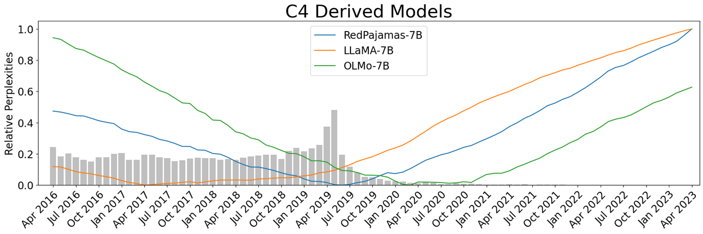

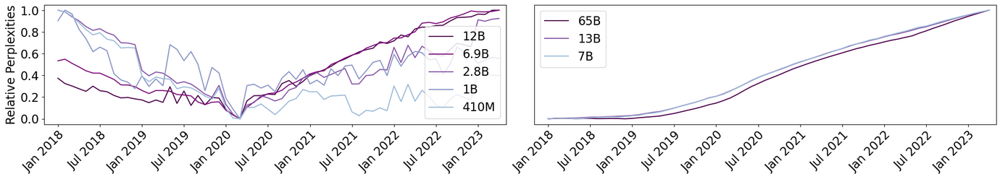

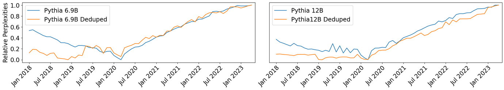

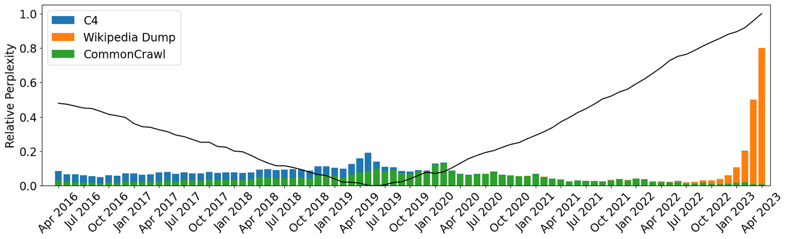

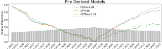

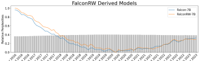

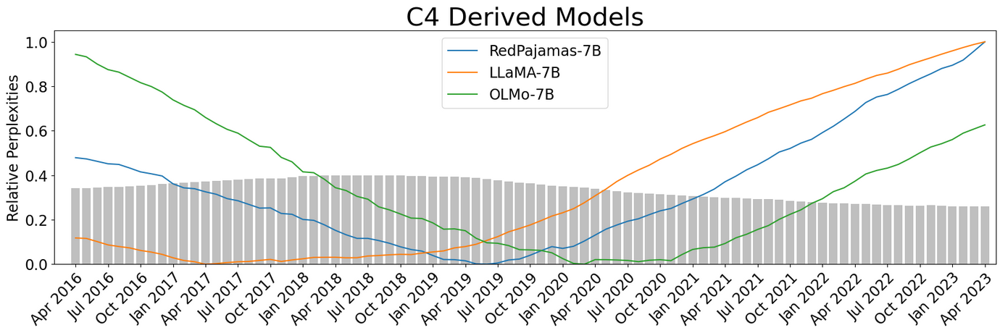

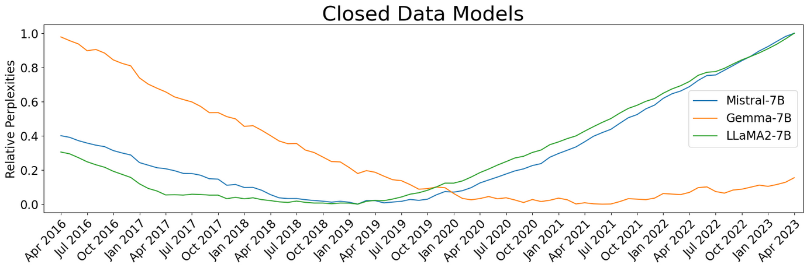

[Arxiv](https://arxiv.org/abs/2403.12958)