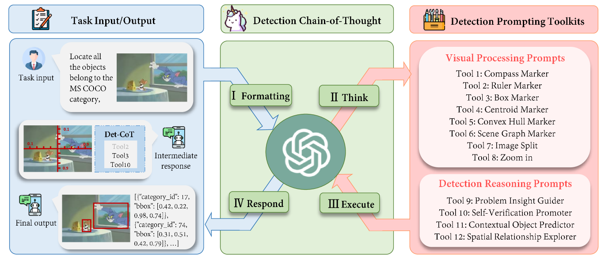
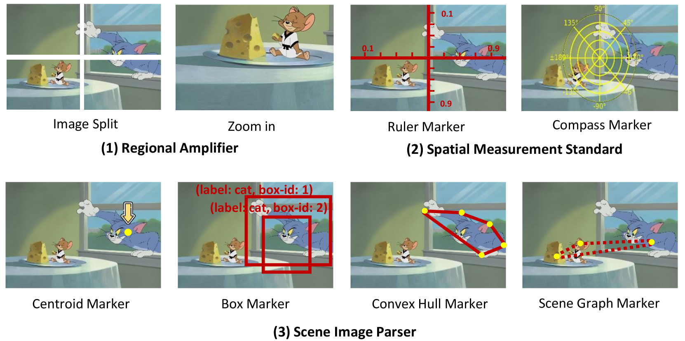
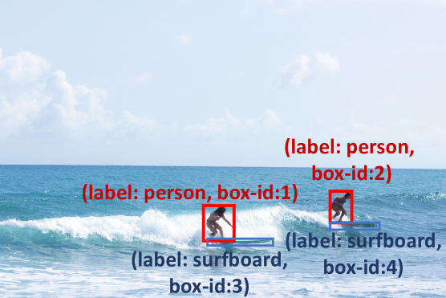
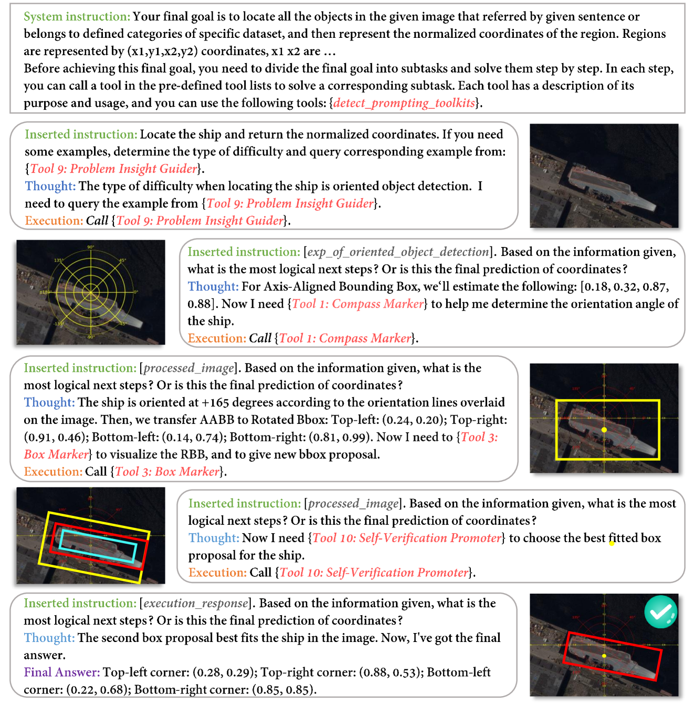
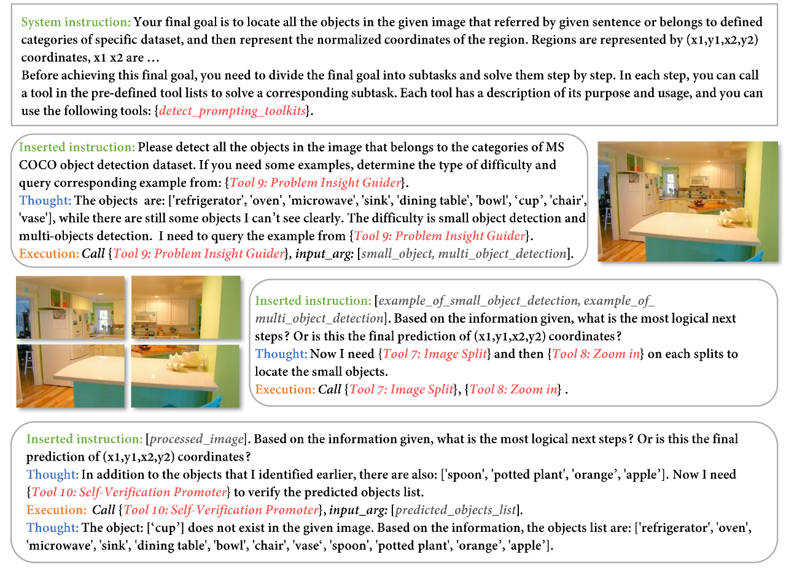
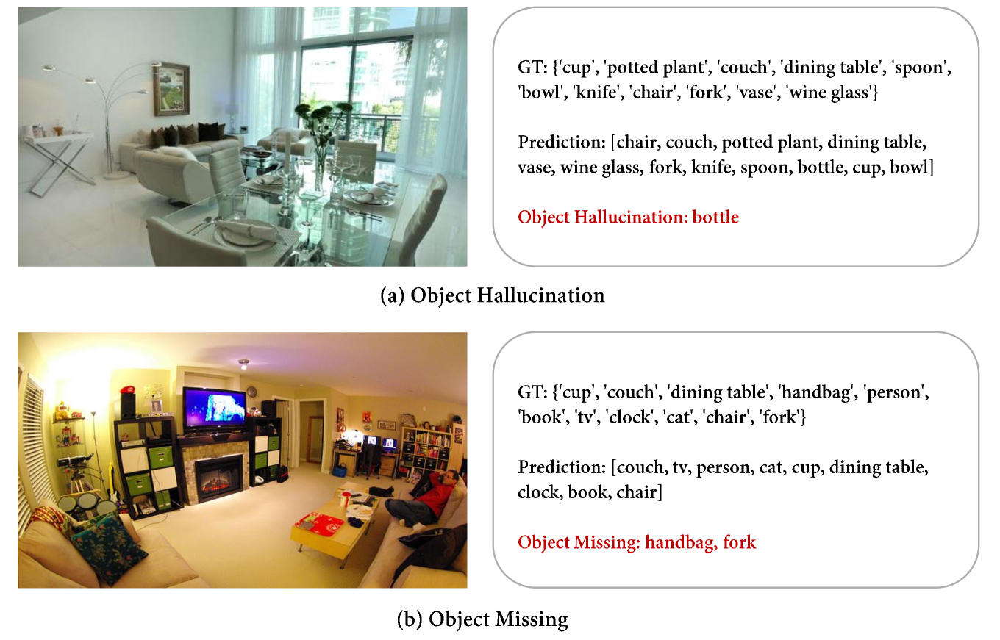

# DetToolChain 是一种创新的提示策略，致力于充分挖掘 MLLM 的检测潜能。

发布时间：2024年03月19日

`LLM应用` `计算机视觉`

> DetToolChain: A New Prompting Paradigm to Unleash Detection Ability of MLLM

# 摘要

> 我们创新推出的 DetToolChain 提示模式能够充分挖掘 GPT-4V、Gemini 等多模态大型语言模型的零样本对象检测潜力。该方法整合了一套以精密检测原理为灵感的检测提示工具箱，以及一套全新的 Chain-of-Thought 实施策略。这套工具箱内的提示巧妙设计，引导 MLLM 专注局部信息（比如局部放大），参照测量准则解读坐标（比如虚拟尺规辅助），并能依据情境信息推理判断（比如叠加场景图分析）。借助这一系列工具，新式的检测思维链可以自动化地将复杂任务拆解为若干简单子任务，对预测结果进行诊断，并有条不紊地规划边界框精修步骤。实验证明，无论是在广泛的各种检测任务中，还是在极具挑战性的难题上，我们的框架都展现出显著效果。相较于当前最先进的方法，搭载了 DetToolChain 的 GPT-4V 在 MS COCO 新类别集的开放词汇检测任务上提升了 +21.5% 的 AP50，在 RefCOCO val 集的零样本指示理解任务上提高了 +24.23% 的准确率，在 D-cube 完整设置下的描述对象检测任务上也实现了 +14.5% 的 AP 提升。

> We present DetToolChain, a novel prompting paradigm, to unleash the zero-shot object detection ability of multimodal large language models (MLLMs), such as GPT-4V and Gemini. Our approach consists of a detection prompting toolkit inspired by high-precision detection priors and a new Chain-of-Thought to implement these prompts. Specifically, the prompts in the toolkit are designed to guide the MLLM to focus on regional information (e.g., zooming in), read coordinates according to measure standards (e.g., overlaying rulers and compasses), and infer from the contextual information (e.g., overlaying scene graphs). Building upon these tools, the new detection chain-of-thought can automatically decompose the task into simple subtasks, diagnose the predictions, and plan for progressive box refinements. The effectiveness of our framework is demonstrated across a spectrum of detection tasks, especially hard cases. Compared to existing state-of-the-art methods, GPT-4V with our DetToolChain improves state-of-the-art object detectors by +21.5% AP50 on MS COCO Novel class set for open-vocabulary detection, +24.23% Acc on RefCOCO val set for zero-shot referring expression comprehension, +14.5% AP on D-cube describe object detection FULL setting.

[Arxiv](https://arxiv.org/abs/2403.12488)