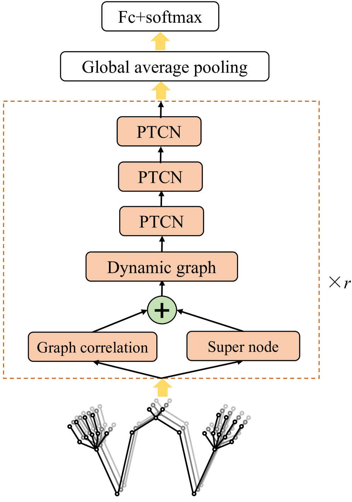
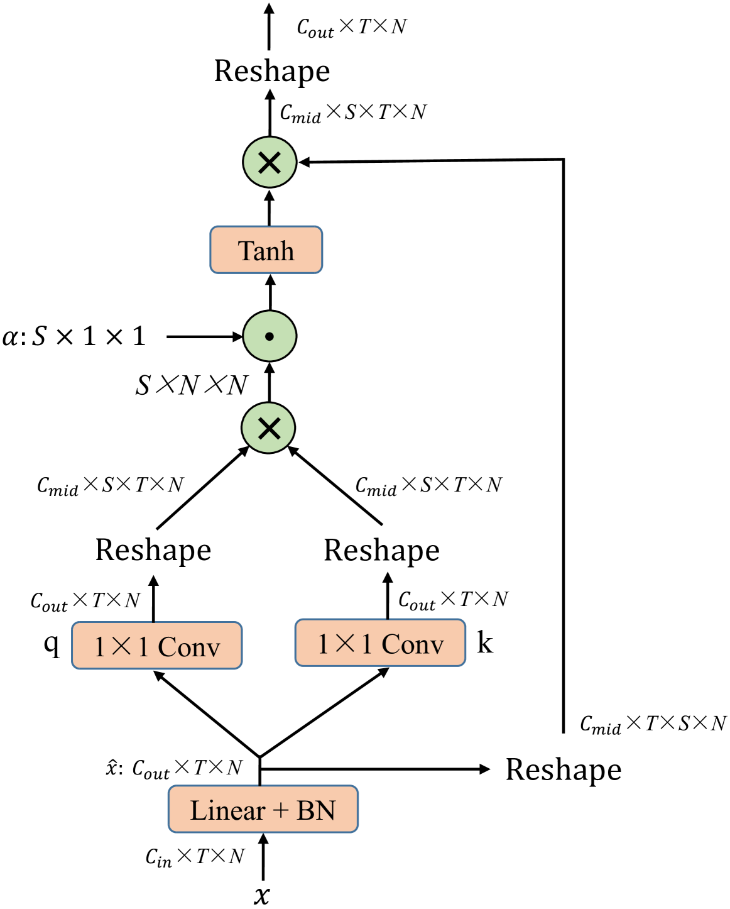
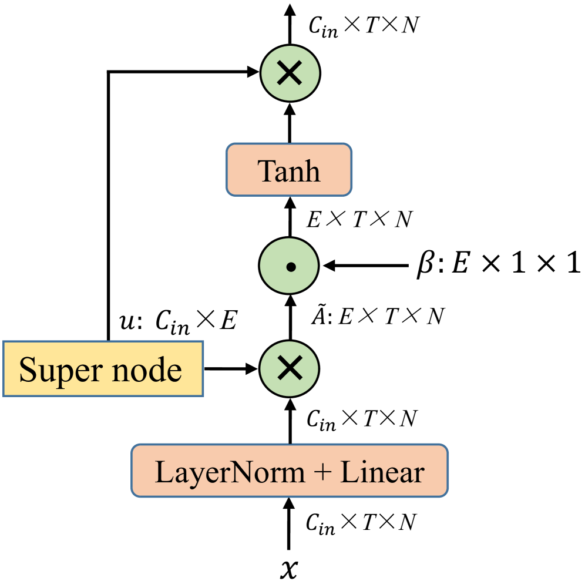
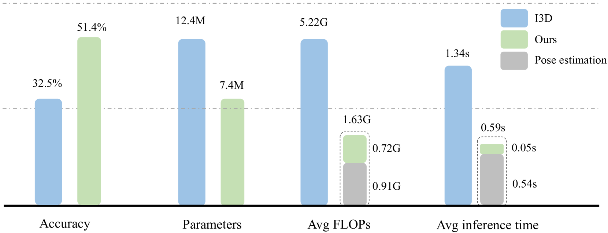

# 为实现精准手语识别，我们引入了动态时空聚合技术，该技术特别针对包含骨骼信息的手语动作特征进行深度提取和整合。

发布时间：2024年03月19日

`Agent` `手语识别` `计算机视觉`

> Dynamic Spatial-Temporal Aggregation for Skeleton-Aware Sign Language Recognition

> 得益于对背景信息免疫及低计算需求的优势，基于骨架的手语识别技术日渐流行。现有方法利用空间图模块和时间模块分别提取空间特征与时间特征，然而，其空间图模块大多基于固定图结构（如图卷积网络或单一可学习图），只能局部揭示关节间的关联。另外，采用简单的时间卷积核去捕捉时间信息，可能难以全面理解不同手语者复杂多变的动作规律。为此，我们创新设计了一种双分支的空间架构，各分支分别构建适应输入变化的关节关联模型，并针对性地融合特定领域知识以提升识别效果。两分支后续通过聚合操作筛选关键关节联系。与此同时，我们还提出了一种新型时间模块，能够模拟多层次时间信息，精确捕捉人体动作的复杂动态。实验证明，该方法在四个大型SLR数据集上超越了以往基于骨架识别的最新技术水平，并且在多数情况下，相较于基于RGB的方法，不仅识别精度更高，而且所需的计算资源大幅减少，实现了精度与计算效率的理想平衡。相关代码已开源，访问地址为https://github.com/hulianyuyy/DSTA-SLR。

> Skeleton-aware sign language recognition (SLR) has gained popularity due to its ability to remain unaffected by background information and its lower computational requirements. Current methods utilize spatial graph modules and temporal modules to capture spatial and temporal features, respectively. However, their spatial graph modules are typically built on fixed graph structures such as graph convolutional networks or a single learnable graph, which only partially explore joint relationships. Additionally, a simple temporal convolution kernel is used to capture temporal information, which may not fully capture the complex movement patterns of different signers. To overcome these limitations, we propose a new spatial architecture consisting of two concurrent branches, which build input-sensitive joint relationships and incorporates specific domain knowledge for recognition, respectively. These two branches are followed by an aggregation process to distinguishe important joint connections. We then propose a new temporal module to model multi-scale temporal information to capture complex human dynamics. Our method achieves state-of-the-art accuracy compared to previous skeleton-aware methods on four large-scale SLR benchmarks. Moreover, our method demonstrates superior accuracy compared to RGB-based methods in most cases while requiring much fewer computational resources, bringing better accuracy-computation trade-off. Code is available at https://github.com/hulianyuyy/DSTA-SLR.

[Arxiv](https://arxiv.org/abs/2403.12519)