# 具备实体形态的大型语言模型智能体已能在结构化的团队环境中学会协同合作。（注：由于原始句子较短且语义明确，从直译到优化的过程并未进行大幅度调整，保持了原句的核心含义和生动性。）

发布时间：2024年03月19日

`Agent` `多智能体系统`

> Embodied LLM Agents Learn to Cooperate in Organized Teams

# 摘要

> LLMs如今已成为倚仗广泛世界知识和出色的语言处理能力，进行推理、规划和决策的核心工具，并在多智能体系统中展现出极大的自然语言交互潜能以推动合作。但值得注意的是，LLM 代理往往过度响应并执行所有指示，可能会在多智能体协作中引发信息冗余与混淆。本研究借鉴人类社会组织模式，引入一种在LLM代理中实施基于提示的组织结构的框架，旨在解决此类问题。经过一系列与具身化LLM代理以及人-代理协同工作的实验，我们发现指定领导对团队效能有着显著影响，同时揭示了LLM代理表现出的领导特质及其自发合作行为。更进一步，我们借助LLMs的能力，通过“批判性反思”过程设计出优化的组织提示，从而创新出能够减少沟通成本、提升团队效率的新型组织结构。

> Large Language Models (LLMs) have emerged as integral tools for reasoning, planning, and decision-making, drawing upon their extensive world knowledge and proficiency in language-related tasks. LLMs thus hold tremendous potential for natural language interaction within multi-agent systems to foster cooperation. However, LLM agents tend to over-report and comply with any instruction, which may result in information redundancy and confusion in multi-agent cooperation. Inspired by human organizations, this paper introduces a framework that imposes prompt-based organization structures on LLM agents to mitigate these problems. Through a series of experiments with embodied LLM agents and human-agent collaboration, our results highlight the impact of designated leadership on team efficiency, shedding light on the leadership qualities displayed by LLM agents and their spontaneous cooperative behaviors. Further, we harness the potential of LLMs to propose enhanced organizational prompts, via a Criticize-Reflect process, resulting in novel organization structures that reduce communication costs and enhance team efficiency.

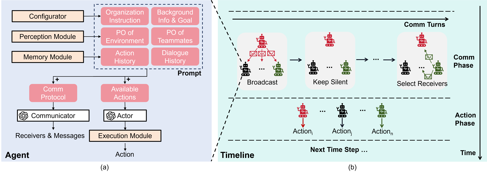

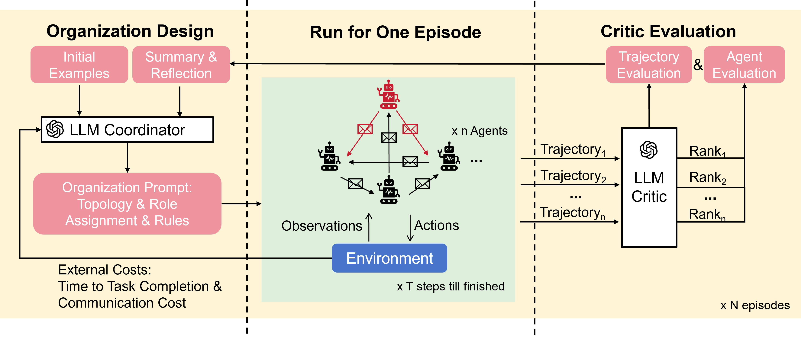

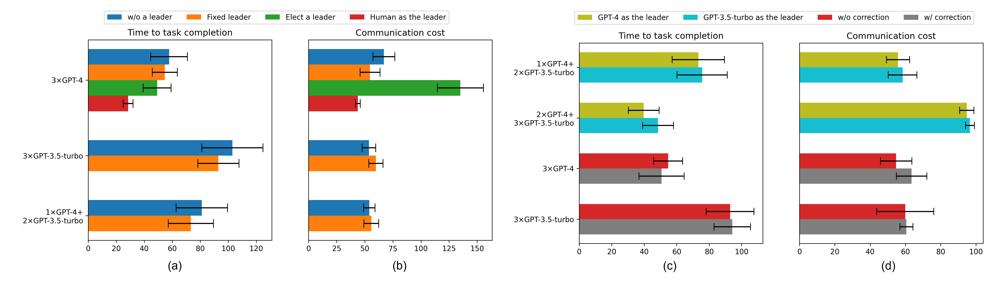

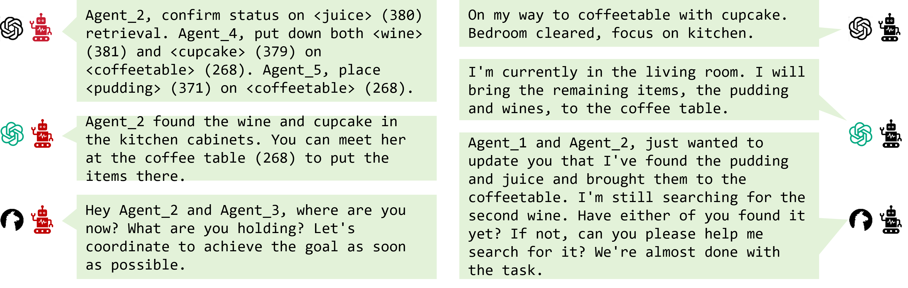

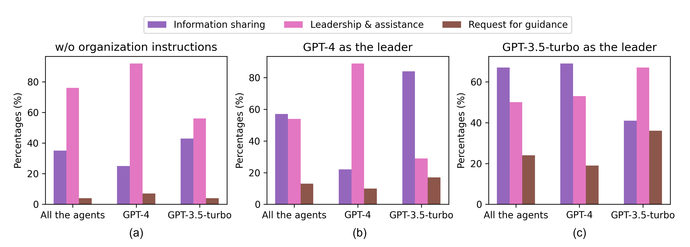

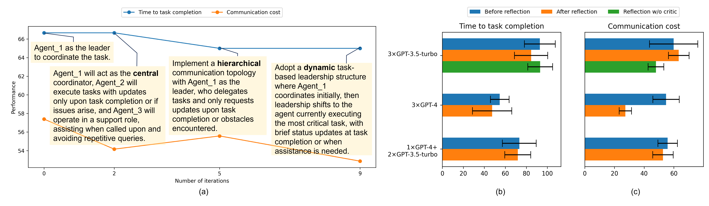

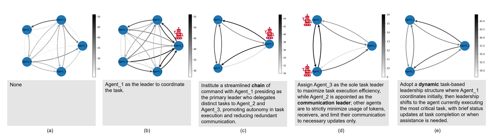

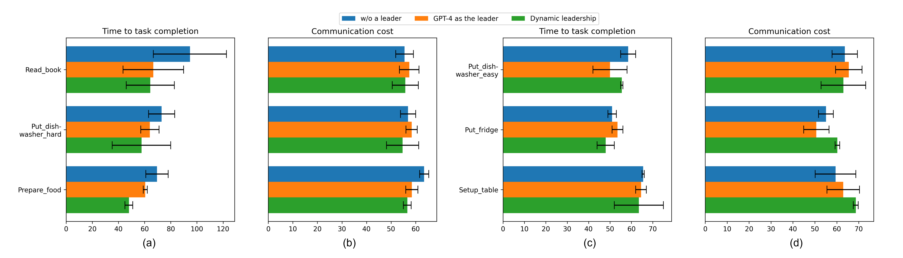

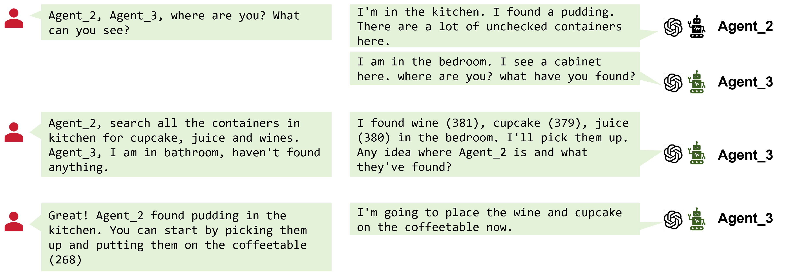

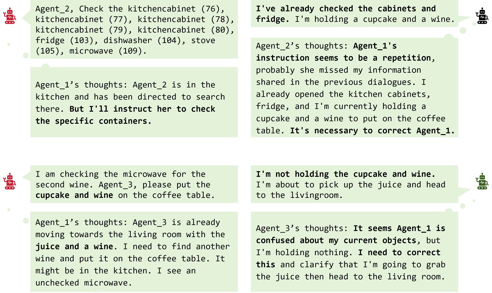

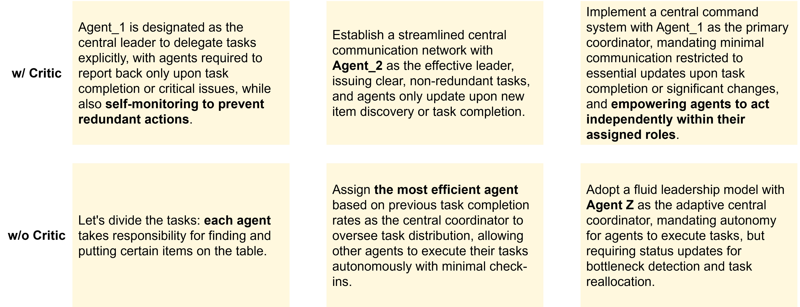

[Arxiv](https://arxiv.org/abs/2403.12482)