# 为了提升小型模型在代码生成任务上的表现，本研究尝试通过提炼大型语言模型（LLM）的深层推理能力，并将其灌输到小型模型中，以实现性能优化。

发布时间：2024年03月19日

`LLM应用` `代码生成` `模型压缩`

> Enhancing Code Generation Performance of Smaller Models by Distilling the Reasoning Ability of LLMs

# 摘要

> 近期，LLMs 利用“链式思维”提示技术，在代码生成领域取得显著突破，让模型能自主制定应对复杂编程问题的“解题思路”，有效提升了代码生成性能。然而，小型模型在这方面还难以跟上 LLMs 的步伐，其代码生成能力也因此受限。鉴于大型模型的庞大体积、高昂部署成本及数据安全顾虑，许多团队更倾向于部署小型模型进行代码生成，这就迫切需要将 LLMs 的代码生成推理能力迁移至小型模型中。为此，本文提出 CodePLAN 框架，通过知识蒸馏的方式，旨在将 LLMs 的推理能力传授给小型模型。我们采取联合训练的方法，同步完成代码生成与解题思路生成任务，以强化小型模型的代码生成能力。为保证解题思路的质量，我们倡导运用逆向推理和计划抽样策略。实验结果显示，相较于常规的微调方法，我们的方案在颇具挑战性的 APPS 测试基准上，能使小型模型的代码生成性能（以 pass@1 为评估指标）提升超过 130%。

> Large Language Models (LLMs) have recently made significant advances in code generation through the 'Chain-of-Thought' prompting technique. This technique empowers the model to autonomously devise "solution plans" to tackle intricate programming challenges, thereby improving its performance in code generation. Nevertheless, smaller models have been struggling to keep up with LLMs in deducing these plans, adversely affecting their code generation capabilities. Given the considerable size and associated deployment costs, along with concerns about data security, many teams opt for deploying smaller models for code generation. Consequently, there arises a compelling need for transferring LLMs' code generation reasoning abilities to the smaller models. In this paper, we propose the CodePLAN framework, which aims to transfer LLMs' reasoning capabilities to smaller models through distillation. We adopt a multi-task learning approach, jointly undertaking code generation and solution plan generation tasks, to enhance the code generation capabilities of the smaller model. To ensure the superior quality of the solution plans, we advocate for the utilization of backward reasoning and plan sampling strategies. Our experiments show that in comparison to the conventional fine-tuning approach, our approach improves the smaller model's code generation performance (measured in pass@1 metric) by over 130% on the challenging APPS benchmark.

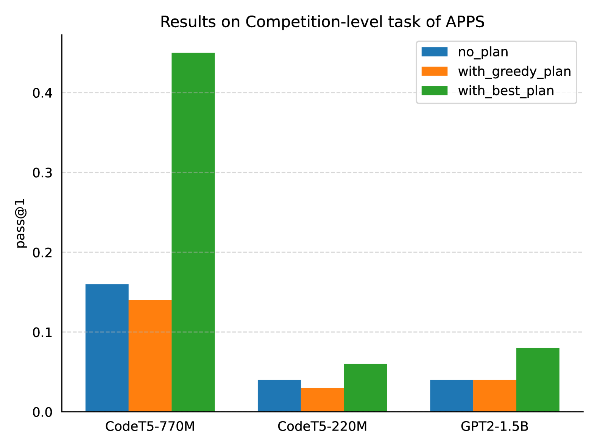

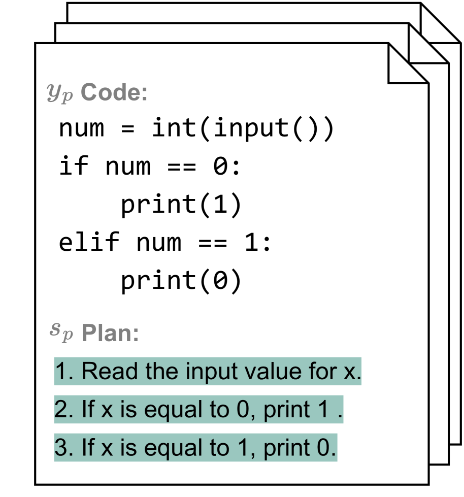

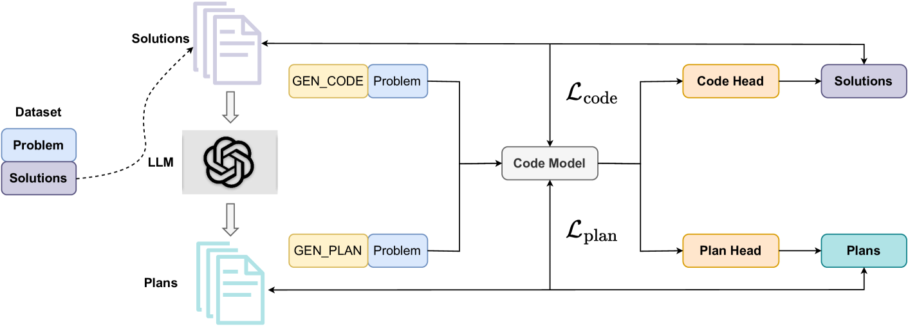

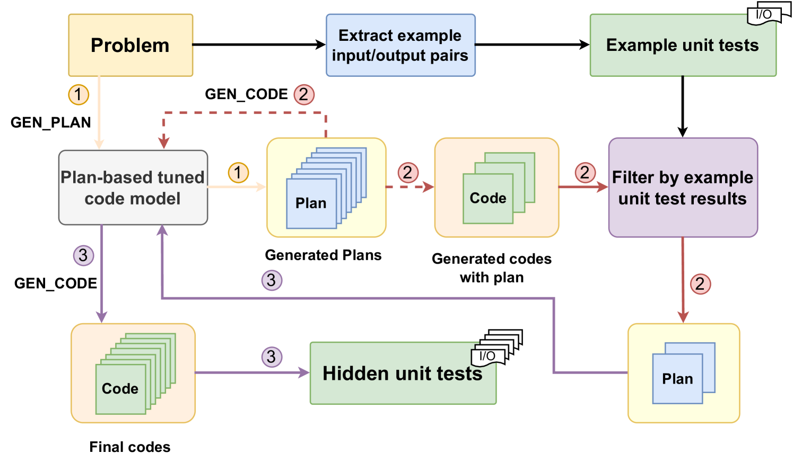

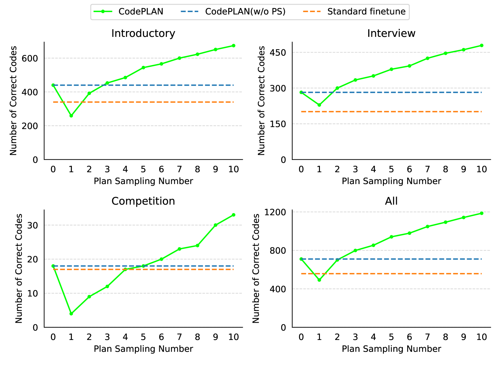

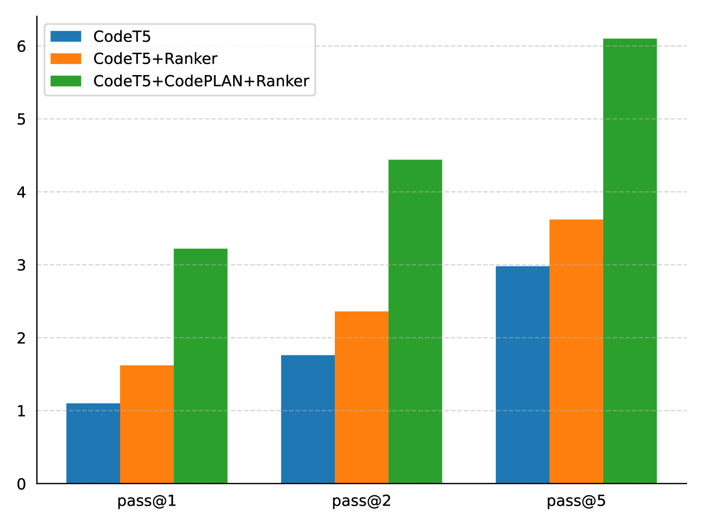

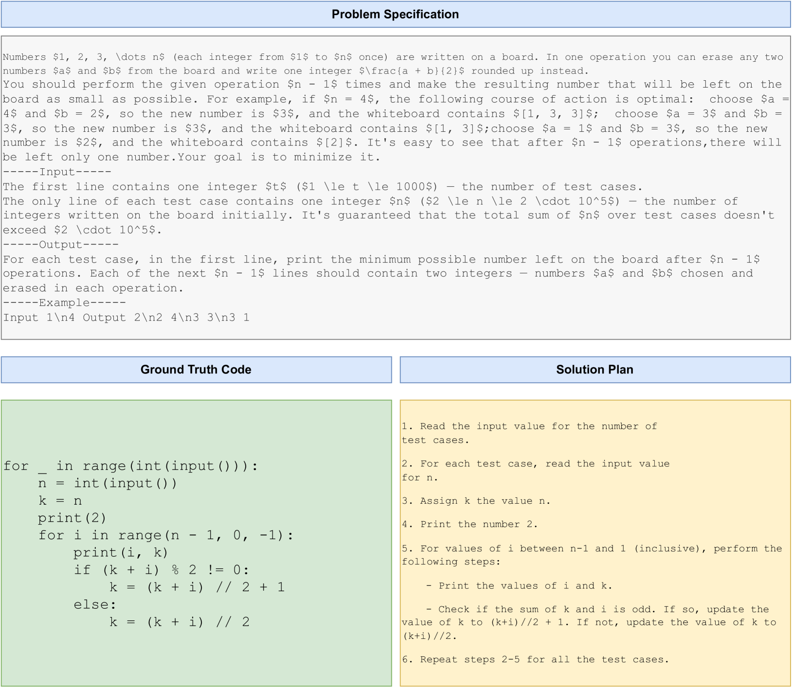

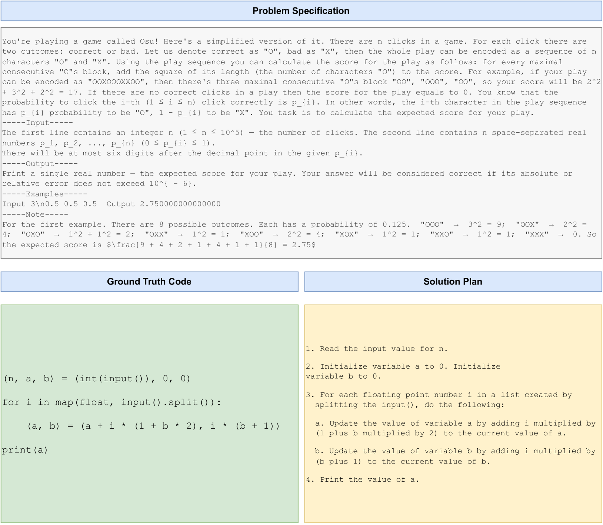

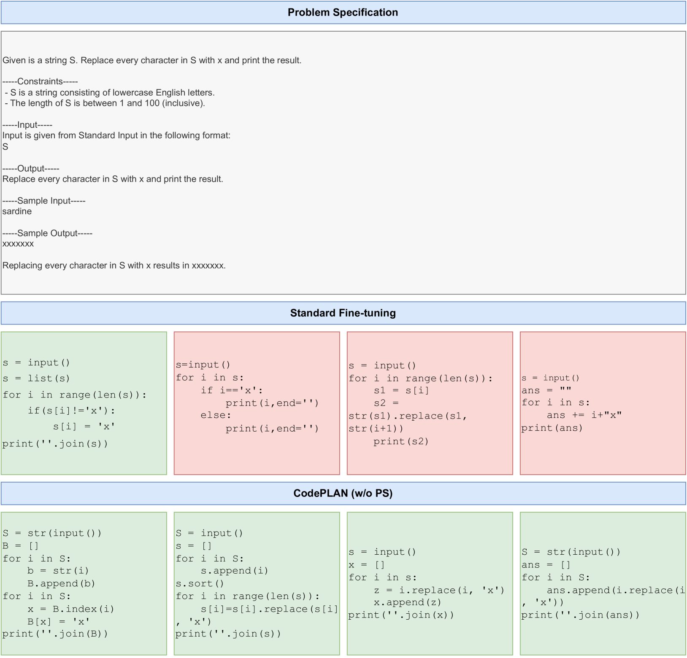

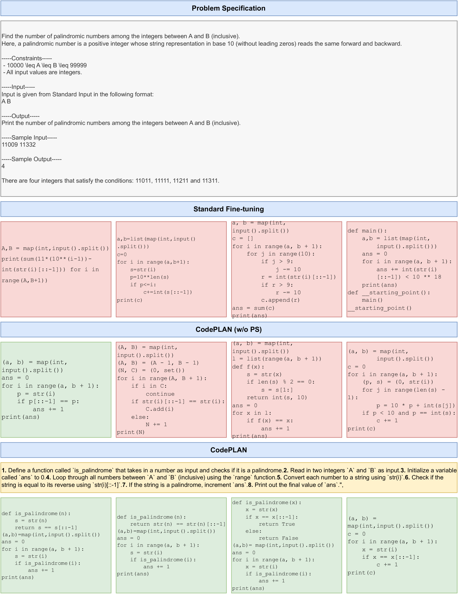

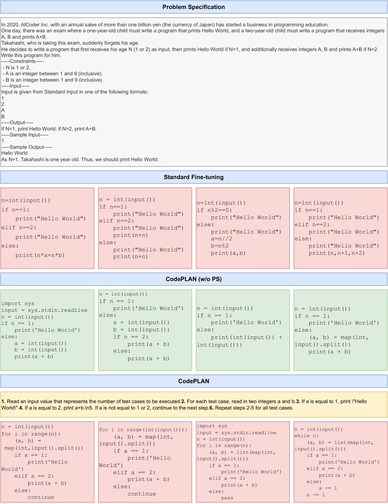

[Arxiv](https://arxiv.org/abs/2403.13271)