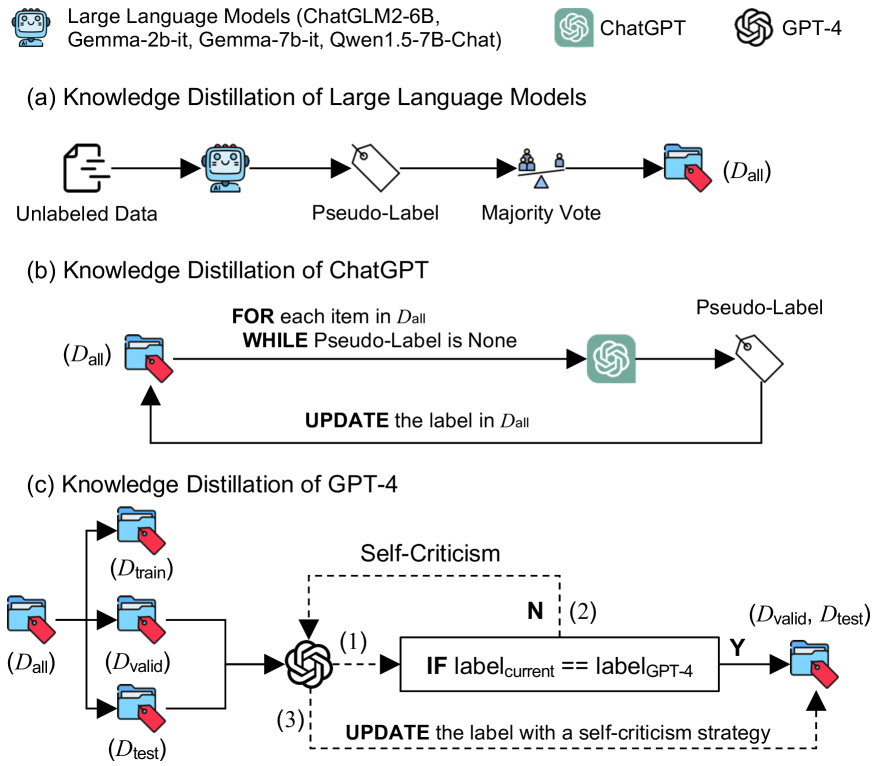
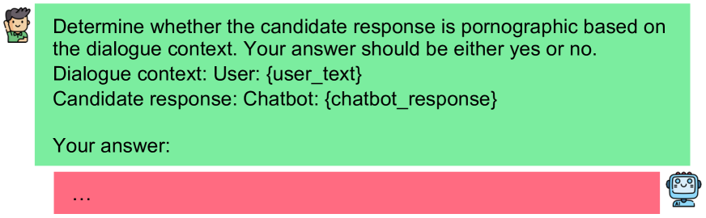
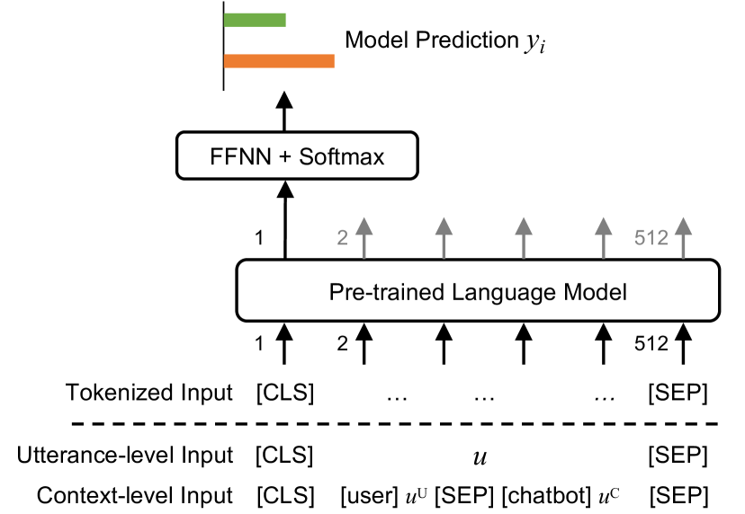

# 运用知识蒸馏技术提炼大型语言模型的能力，以提升开放域对话系统对色情文本的识别与检测效能。

发布时间：2024年03月19日

`LLM应用` `对话系统` `内容审核`

> Facilitating Pornographic Text Detection for Open-Domain Dialogue Systems via Knowledge Distillation of Large Language Models

> 在开放域对话场景中，人机对话中潜在的色情内容会对用户带来严重影响，而对此类色情语言的识别研究尚属稀缺。因此，我们推出了CensorChat——专门用于捕捉对话中是否存在色情内容的对话监控数据集。我们采集了大量真实世界中的人机交互对话，并将其拆解为独立的话语及单回合对话，其中最后一句由聊天机器人发出。为了高效地标注数据集，我们创新性地采用了大型语言模型的知识蒸馏技术。具体步骤如下：首先，借助四个开源大型语言模型以多数票原则初步标注原始数据集；其次，用ChatGPT对第一步中未确定标签的数据进行补充标注；再者，为保证验证集和测试集质量，我们运用GPT-4进行精细的标签校准，若当前标签与GPT-4生成的标签不符，则采取自我校验策略核实真伪；最后，基于带有伪标签的数据集训练出一系列文本分类器，助力精准定位色情文本。详尽的数据分析揭示了结合大型语言模型知识蒸馏技术构建色情文本检测器的实用性和经济性优势。

> Pornographic content occurring in human-machine interaction dialogues can cause severe side effects for users in open-domain dialogue systems. However, research on detecting pornographic language within human-machine interaction dialogues is an important subject that is rarely studied. To advance in this direction, we introduce CensorChat, a dialogue monitoring dataset aimed at detecting whether the dialogue session contains pornographic content. To this end, we collect real-life human-machine interaction dialogues in the wild and break them down into single utterances and single-turn dialogues, with the last utterance spoken by the chatbot. We propose utilizing knowledge distillation of large language models to annotate the dataset. Specifically, first, the raw dataset is annotated by four open-source large language models, with the majority vote determining the label. Second, we use ChatGPT to update the empty label from the first step. Third, to ensure the quality of the validation and test sets, we utilize GPT-4 for label calibration. If the current label does not match the one generated by GPT-4, we employ a self-criticism strategy to verify its correctness. Finally, to facilitate the detection of pornographic text, we develop a series of text classifiers using a pseudo-labeled dataset. Detailed data analysis demonstrates that leveraging knowledge distillation techniques with large language models provides a practical and cost-efficient method for developing pornographic text detectors.

[Arxiv](https://arxiv.org/abs/2403.13250)