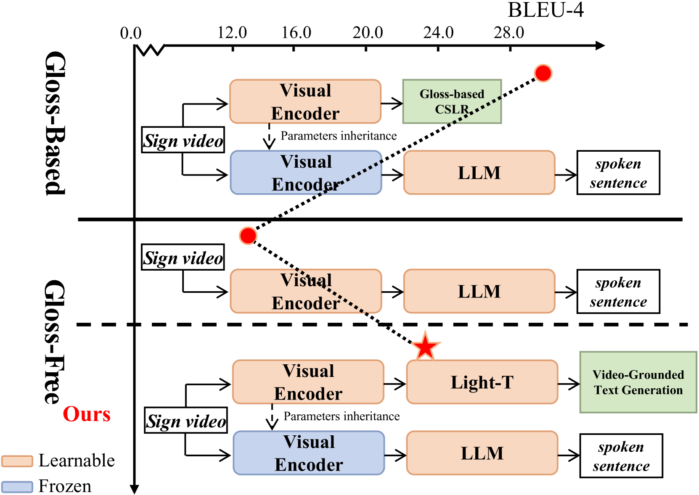
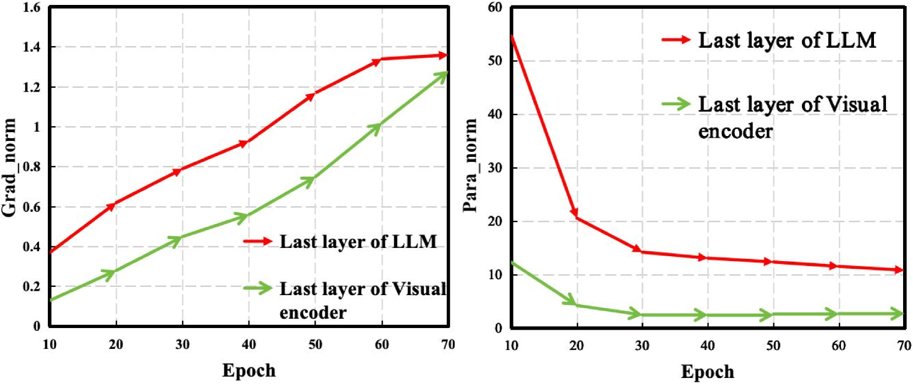
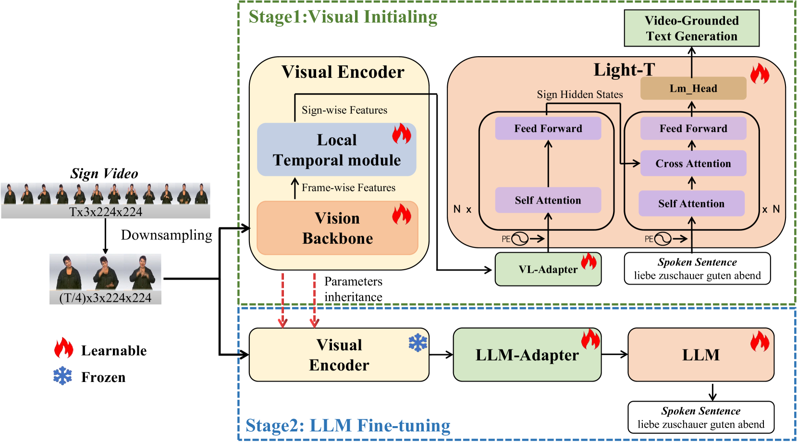
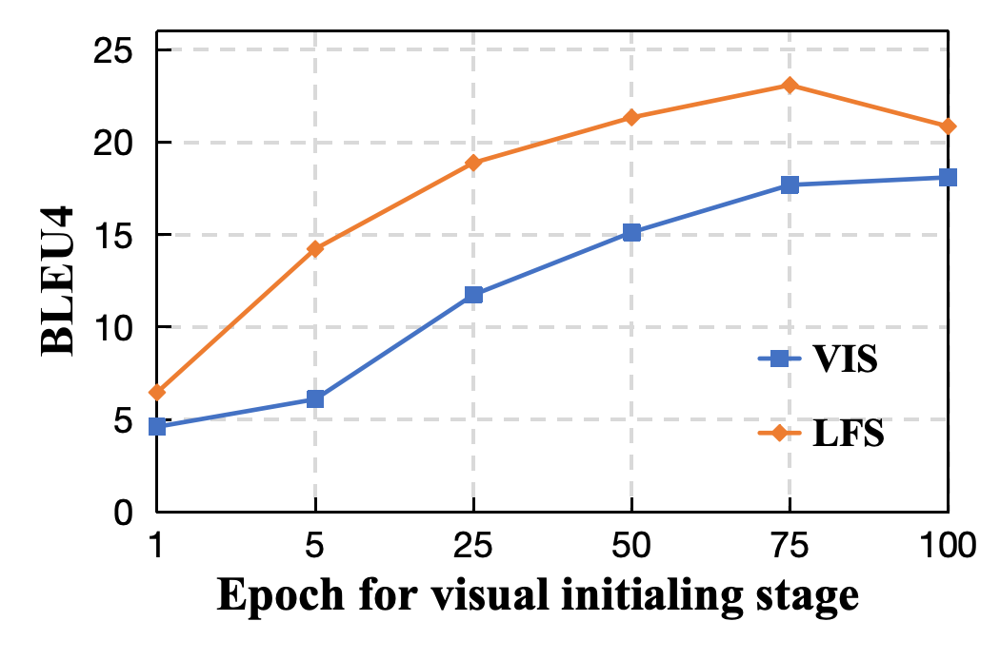

# 通过引入大型语言模型协助的分解学习技术，我们致力于开发一种无需依赖词汇表的手语翻译方案。

发布时间：2024年03月19日

`LLM应用` `机器翻译` `视觉问答`

> Factorized Learning Assisted with Large Language Model for Gloss-free Sign Language Translation

> 以往的SLT技术依靠注释符获得优秀表现，但注释工作耗时费力，制约了SLT领域的发展。有研究尝试跳过注释符，通过联合训练视觉编码器和翻译网络实现无注释符SLT，但此类方案仍存在性能欠佳、未充分利用强大LLM资源的问题。尤其值得注意的是，直接将LLM融入SLT会导致视觉表征学习不充分，因其在学习过程中占据主导地位。为此，我们创新性地提出FLa-LLM方案，借助大型语言模型辅助分解学习，应用于无注释符SLT场景。具体来说，我们将训练过程拆分为两步走：第一步是视觉初始化阶段，使用轻巧的翻译模型对视觉编码器进行预训练；第二步是LLM微调阶段，固定住视觉编码器中积累的知识，并将其与预先训练好的LLM相结合，以激活LLM在翻译上的潜能。这种分阶段训练策略在实践中效果显著，在三个不同且均采用无注释符设定的SLT数据集上，均取得重大突破。

> Previous Sign Language Translation (SLT) methods achieve superior performance by relying on gloss annotations. However, labeling high-quality glosses is a labor-intensive task, which limits the further development of SLT. Although some approaches work towards gloss-free SLT through jointly training the visual encoder and translation network, these efforts still suffer from poor performance and inefficient use of the powerful Large Language Model (LLM). Most seriously, we find that directly introducing LLM into SLT will lead to insufficient learning of visual representations as LLM dominates the learning curve. To address these problems, we propose Factorized Learning assisted with Large Language Model (FLa-LLM) for gloss-free SLT. Concretely, we factorize the training process into two stages. In the visual initialing stage, we employ a lightweight translation model after the visual encoder to pre-train the visual encoder. In the LLM fine-tuning stage, we freeze the acquired knowledge in the visual encoder and integrate it with a pre-trained LLM to inspire the LLM's translation potential. This factorized training strategy proves to be highly effective as evidenced by significant improvements achieved across three SLT datasets which are all conducted under the gloss-free setting.

[Arxiv](https://arxiv.org/abs/2403.12556)