# ICE技术实现了通过对话方式实现交互式3D游戏角色的编辑，让玩家能够以自然语言交流的方式塑造游戏角色。

发布时间：2024年03月19日

`Agent` `3D角色设计`

> ICE: Interactive 3D Game Character Editing via Dialogue

# 摘要

> 游戏内3D角色自定义系统通过文字驱动已简化了繁琐的角色参数调节流程，但现有方法仅限于一次性生成，无法支持深度编辑和细粒度调整。为此，我们提出了“交互式角色编辑”（ICE）框架，它采用多轮对话方式进行精细调优。简单来说，ICE让用户能轻松通过多次互动表达创意构思，确保创作出的角色充分契合玩家期待。其中，我们设计了一个“指令解析模块”（IPM），运用大型语言模型（LLMs）解析多轮对话，提炼出每轮明确的编辑指令。此外，我们还创新研发了“语义导向低维参数求解器”（SLPS），该工具能够在零样本条件下，依据指令精准操控角色参数，实现对细微特征的修改。SLPS首先定位到需调整的细粒度参数，继而在低维度空间优化相关参数，有效规避不合理结果的出现。大量的实验证据有力证明了ICE在游戏内角色创作中的高效表现及其出色的编辑性能。访问项目主页了解更多：https://iceedit.github.io/。

> Text-driven in-game 3D character auto-customization systems eliminate the complicated process of manipulating intricate character control parameters. However, current methods are limited by their single-round generation, incapable of further editing and fine-grained modification. In this paper, we propose an Interactive Character Editing framework (ICE) to achieve a multi-round dialogue-based refinement process. In a nutshell, our ICE offers a more user-friendly way to enable players to convey creative ideas iteratively while ensuring that created characters align with the expectations of players. Specifically, we propose an Instruction Parsing Module (IPM) that utilizes large language models (LLMs) to parse multi-round dialogues into clear editing instruction prompts in each round. To reliably and swiftly modify character control parameters at a fine-grained level, we propose a Semantic-guided Low-dimension Parameter Solver (SLPS) that edits character control parameters according to prompts in a zero-shot manner. Our SLPS first localizes the character control parameters related to the fine-grained modification, and then optimizes the corresponding parameters in a low-dimension space to avoid unrealistic results. Extensive experimental results demonstrate the effectiveness of our proposed ICE for in-game character creation and the superior editing performance of ICE. Project page: https://iceedit.github.io/.

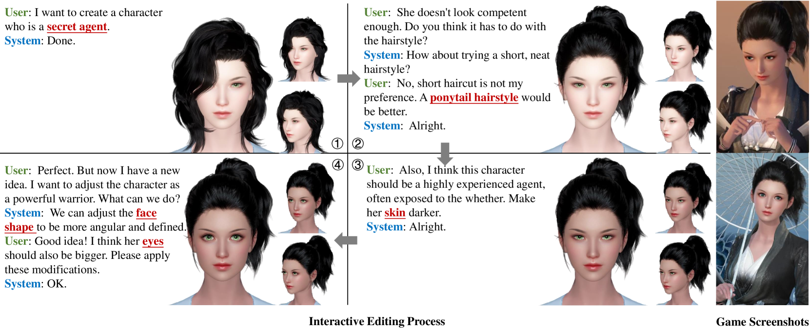

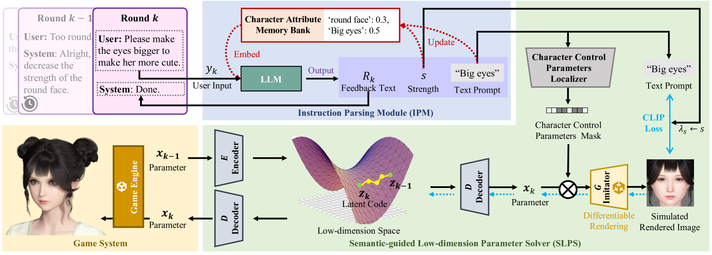

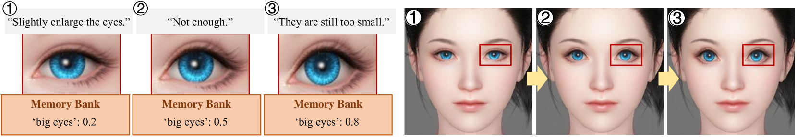

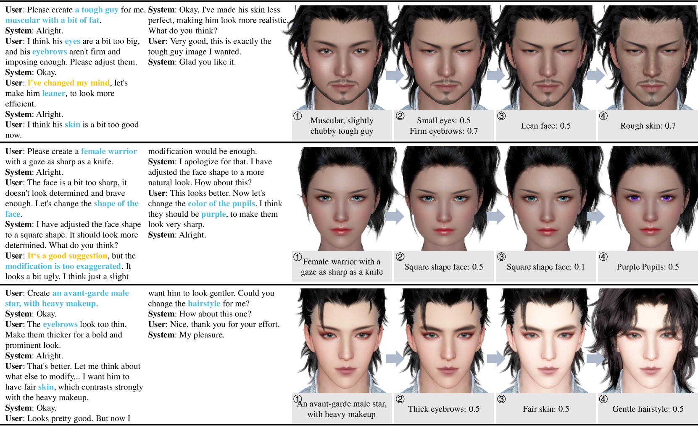

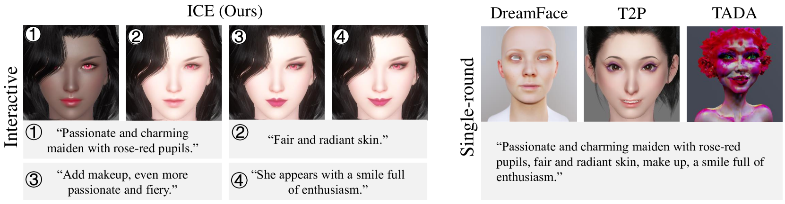

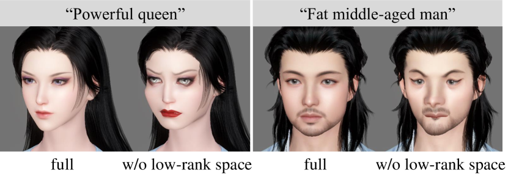

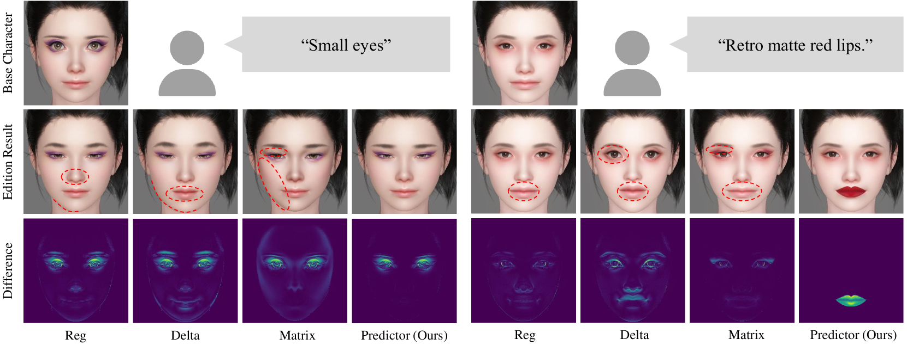

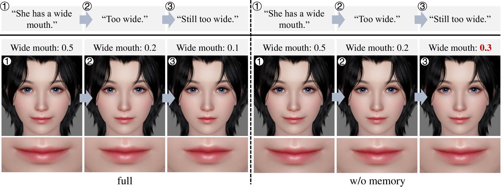

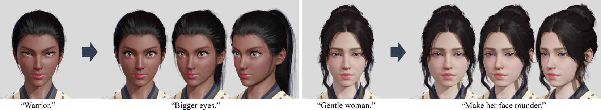

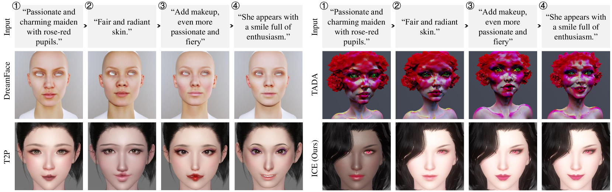

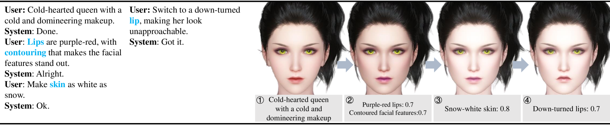

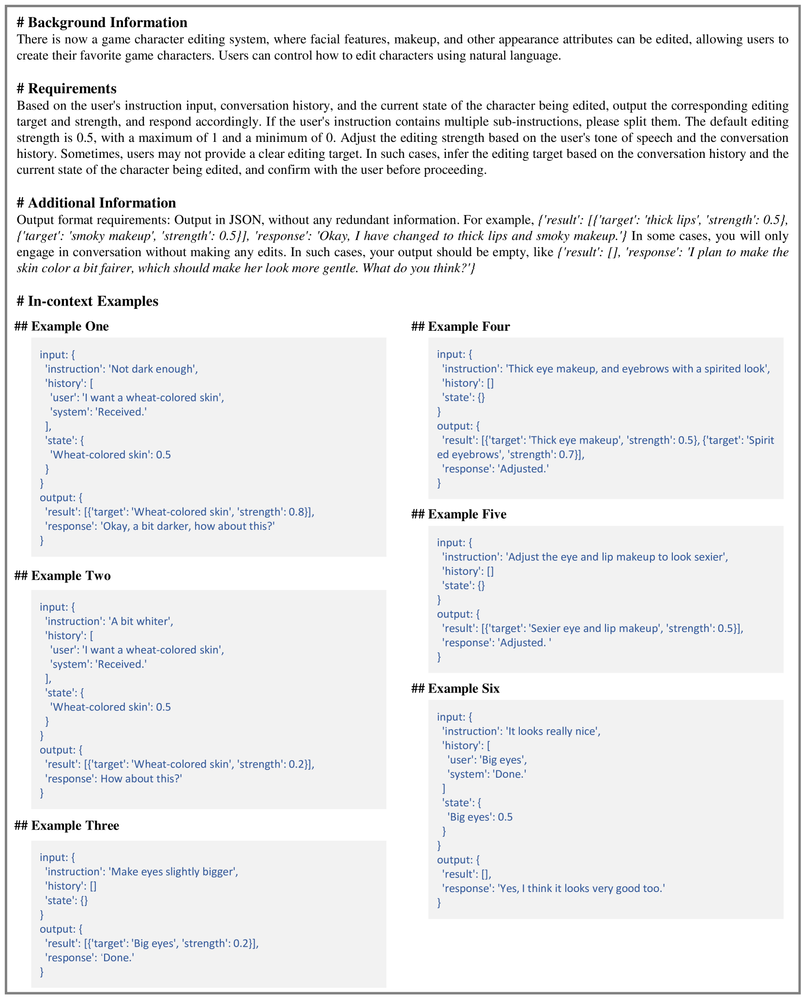

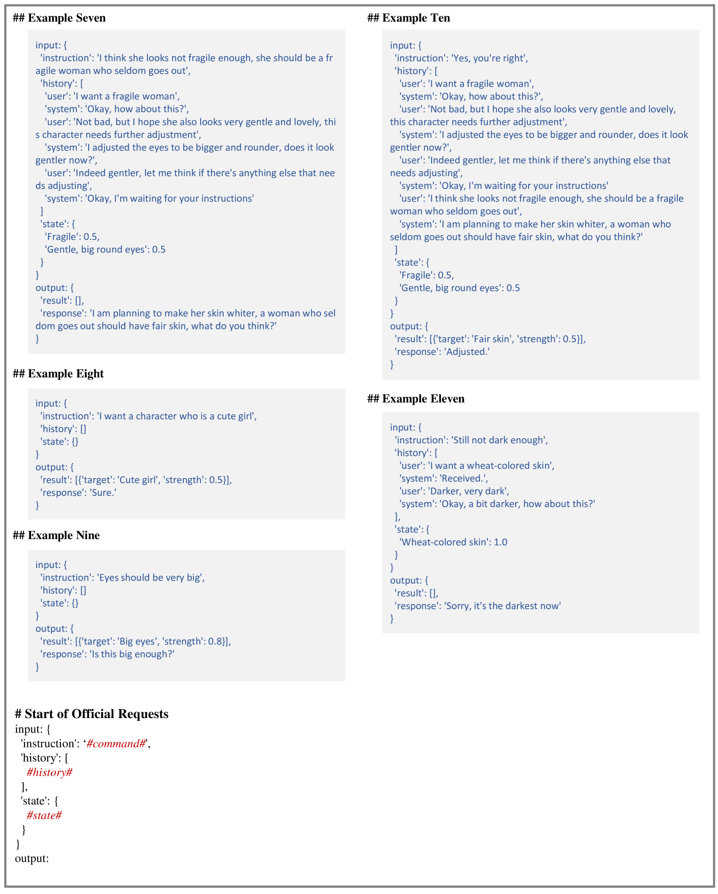

[Arxiv](https://arxiv.org/abs/2403.12667)