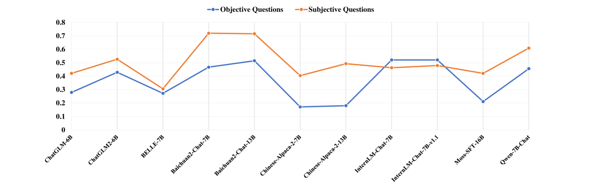

# LHMKE 是一个专为中国大型语言模型设计的大规模、全面的多学科知识评估基准。

发布时间：2024年03月19日

`LLM应用`

> LHMKE: A Large-scale Holistic Multi-subject Knowledge Evaluation Benchmark for Chinese Large Language Models

# 摘要

> 近期，中国大型语言模型（LLMs）在多个NLP基准及实际应用场景中展现出卓越性能。然而，现有的综合评估LLMs的标准尚不充足，尤其是在衡量LLMs所掌握的知识方面。为了填补这一空白，研究人员从各学科和各级别的中文考试中收集问题构建数据集，尽管如此，现有基准仍侧重于选择题等客观题型，缺乏多样化的问题类型。因此，本论文提出了一项名为LHMKE的大规模、全面且跨学科知识评估基准。LHMKE精心设计了涵盖30个学科、75项任务共10,465道题目，范围横跨小学至专业认证考试，特别包含客观与主观两类题目，以便对LLMs的知识水平进行全面而立体的评测。在与真实考试场景相仿的零样本环境下，我们评估了11款中文LLMs，并对其在不同学科上的表现进行对比。同时，我们深入探究了GPT-4是否能自动评分主观题预测。研究结果显示，LHMKE为检验中文LLMs提供了一个颇具挑战性且先进的试验场。

> Chinese Large Language Models (LLMs) have recently demonstrated impressive capabilities across various NLP benchmarks and real-world applications. However, the existing benchmarks for comprehensively evaluating these LLMs are still insufficient, particularly in terms of measuring knowledge that LLMs capture. Current datasets collect questions from Chinese examinations across different subjects and educational levels to address this issue. Yet, these benchmarks primarily focus on objective questions such as multiple-choice questions, leading to a lack of diversity in question types. To tackle this problem, we propose LHMKE, a Large-scale, Holistic, and Multi-subject Knowledge Evaluation benchmark in this paper. LHMKE is designed to provide a comprehensive evaluation of the knowledge acquisition capabilities of Chinese LLMs. It encompasses 10,465 questions across 75 tasks covering 30 subjects, ranging from primary school to professional certification exams. Notably, LHMKE includes both objective and subjective questions, offering a more holistic evaluation of the knowledge level of LLMs. We have assessed 11 Chinese LLMs under the zero-shot setting, which aligns with real examinations, and compared their performance across different subjects. We also conduct an in-depth analysis to check whether GPT-4 can automatically score subjective predictions. Our findings suggest that LHMKE is a challenging and advanced testbed for Chinese LLMs.

[Arxiv](https://arxiv.org/abs/2403.12601)