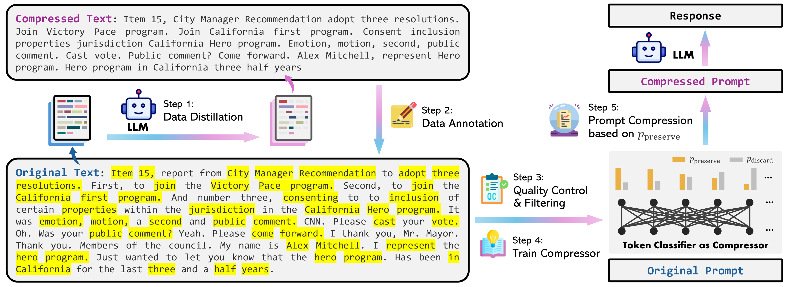
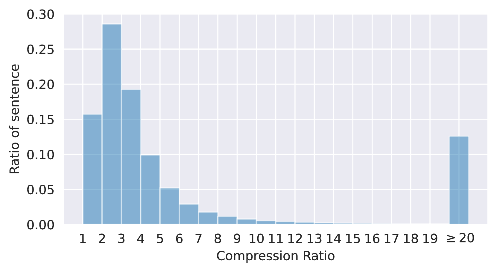
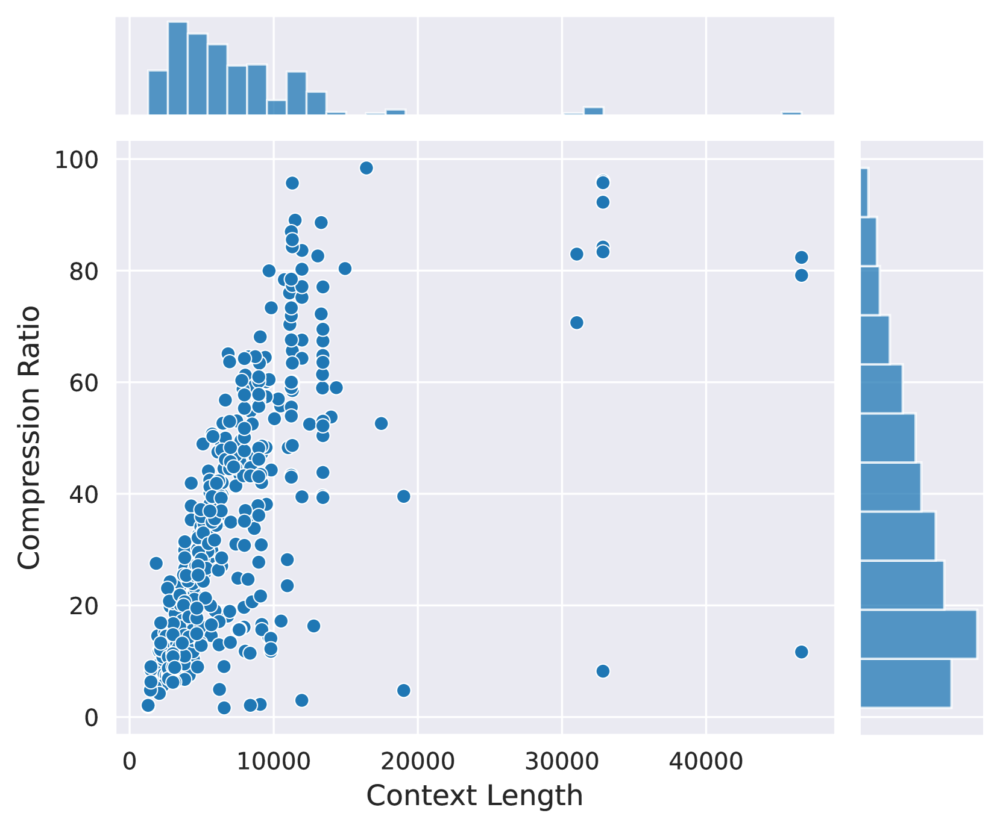

# LLMLingua-2 是一项关于数据蒸馏技术的研究，致力于实现高效而准确的任务无关型提示压缩。通过数据精炼技术，LLMLingua-2旨在压缩大型语言模型的提示信息，同时保持对各种任务的高度适应性和忠实性。

发布时间：2024年03月19日

`LLM应用` `模型压缩`

> LLMLingua-2: Data Distillation for Efficient and Faithful Task-Agnostic Prompt Compression

> 本研究致力于借助数据蒸馏技术对任务无关的提示进行高效压缩，旨在提高其泛化性和执行效率。当前的方法依赖于从LLaMa-7B等因果语言模型计算出的信息熵去除冗余标记或词组，但这可能因仅考虑单向上下文而忽视关键信息，且与压缩目标并不完全契合。为此，我们创新性地设计了一种数据提炼过程，能够从大型预训练模型中萃取知识，保证在压缩提示时不丢失核心信息，并构建了一个抽取式文本压缩数据集。我们将提示压缩视为一个标记分类任务，确保压缩后的提示忠实地保留原意，并采用全双工上下文感知的Transformer编码器结构来捕获所有关键压缩信息。通过在更小模型如XLM-RoBERTa-large和mBERT上明确学习压缩目标，我们的方法有效降低了延迟。实验证明，无论是在同领域还是跨领域的 MeetingBank、LongBench、ZeroScrolls、GSM8K 和 BBH 等数据集上，尽管模型小巧，却能取得明显优于基准的性能提升，并展现出在各类大型语言模型上的稳健泛化能力。更为惊艳的是，相比现有提示压缩方法，我们的模型速度提高了3至6倍，而且在达到2至5倍压缩率的同时，还能将整个流程的延迟加快1.6至2.9倍。

> This paper focuses on task-agnostic prompt compression for better generalizability and efficiency. Considering the redundancy in natural language, existing approaches compress prompts by removing tokens or lexical units according to their information entropy obtained from a causal language model such as LLaMa-7B. The challenge is that information entropy may be a suboptimal compression metric: (i) it only leverages unidirectional context and may fail to capture all essential information needed for prompt compression; (ii) it is not aligned with the prompt compression objective.
  To address these issues, we propose a data distillation procedure to derive knowledge from an LLM to compress prompts without losing crucial information, and meantime, introduce an extractive text compression dataset. We formulate prompt compression as a token classification problem to guarantee the faithfulness of the compressed prompt to the original one, and use a Transformer encoder as the base architecture to capture all essential information for prompt compression from the full bidirectional context. Our approach leads to lower latency by explicitly learning the compression objective with smaller models such as XLM-RoBERTa-large and mBERT.
  We evaluate our method on both in-domain and out-of-domain datasets, including MeetingBank, LongBench, ZeroScrolls, GSM8K, and BBH. Despite its small size, our model shows significant performance gains over strong baselines and demonstrates robust generalization ability across different LLMs. Additionally, our model is 3x-6x faster than existing prompt compression methods, while accelerating the end-to-end latency by 1.6x-2.9x with compression ratios of 2x-5x.

[Arxiv](https://arxiv.org/abs/2403.12968)