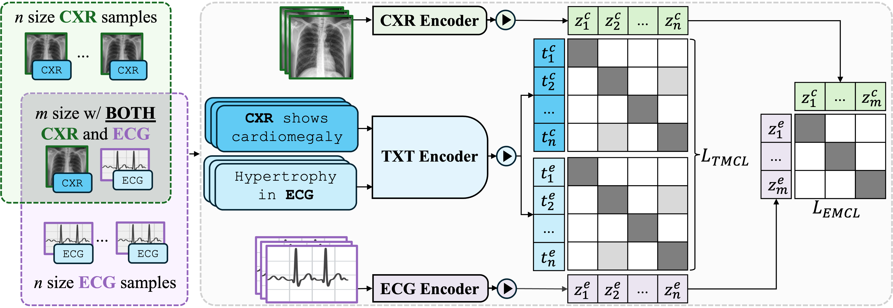
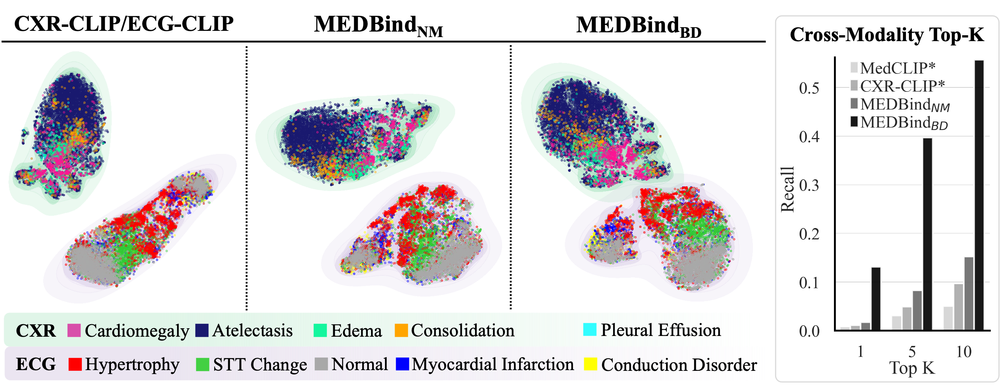
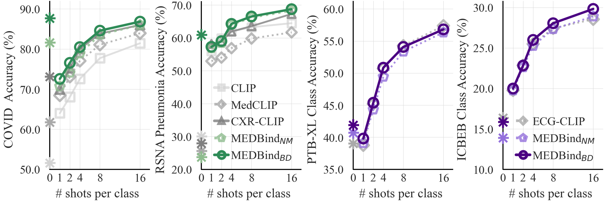
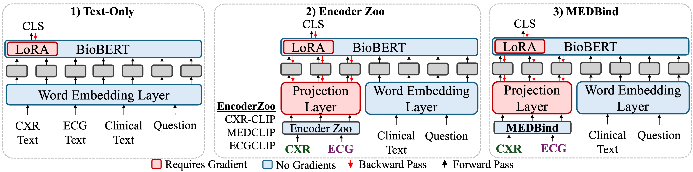

# MEDBind 是一项创新技术，它成功地将语言与多模态医学数据的嵌入融合起来，实现了一体化的信息表示。

发布时间：2024年03月19日

`LLM应用` `多模态学习`

> MEDBind: Unifying Language and Multimodal Medical Data Embeddings

# 摘要

> 医学影像-语言预训练模型（VLPM）成功地将胸透（CXR）与临床文本紧密结合，创新了图像-文本数据绑定技术，支持零样本学习和后续临床任务。但目前此类模型尚未充分整合如心电图（ECG）等其他医疗模态信息。为此，我们推出了MEDBind（电子病历综合模型），它能同时对CXR、ECG及医学文本进行联合嵌入学习，利用文本数据作为核心纽带，实现三模态高效绑定。MEDBind在顶级K检索、零样本和少量样本测试中展现出强大的竞争力，超越现有VLPM，并能够实现从CXR到ECG的零样本分类和检索。这一无缝整合得益于我们提出的“边缘模态对比损失”配合模态-文本对比损失函数，有力地构建了CXR、ECG和文本间的协同嵌入空间。最后，我们证实MEDBind可通过将CXR和ECG嵌入直接融入大型语言模型进行多模态提示微调，有效提升下游任务的表现。

> Medical vision-language pretraining models (VLPM) have achieved remarkable progress in fusing chest X-rays (CXR) with clinical texts, introducing image-text data binding approaches that enable zero-shot learning and downstream clinical tasks. However, the current landscape lacks the holistic integration of additional medical modalities, such as electrocardiograms (ECG). We present MEDBind (Medical Electronic patient recorD), which learns joint embeddings across CXR, ECG, and medical text. Using text data as the central anchor, MEDBind features tri-modality binding, delivering competitive performance in top-K retrieval, zero-shot, and few-shot benchmarks against established VLPM, and the ability for CXR-to-ECG zero-shot classification and retrieval. This seamless integration is achieved through combination of contrastive loss on modality-text pairs with our proposed contrastive loss function, Edge-Modality Contrastive Loss, fostering a cohesive embedding space for CXR, ECG, and text. Finally, we demonstrate that MEDBind can improve downstream tasks by directly integrating CXR and ECG embeddings into a large-language model for multimodal prompt tuning.

[Arxiv](https://arxiv.org/abs/2403.12894)