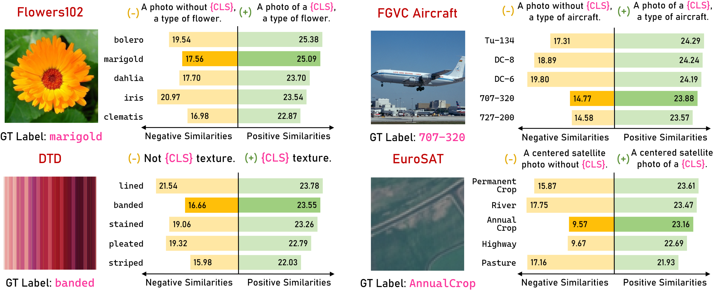
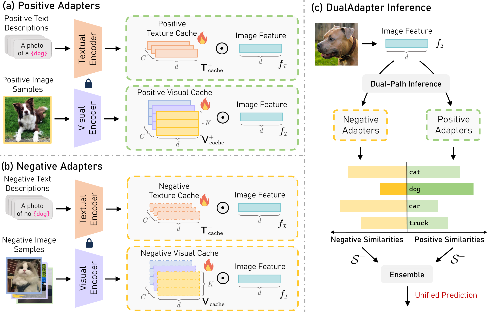
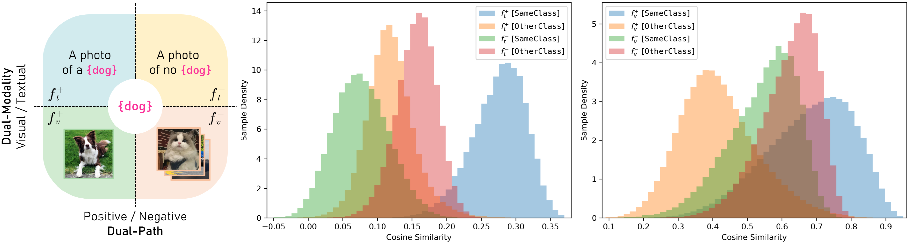
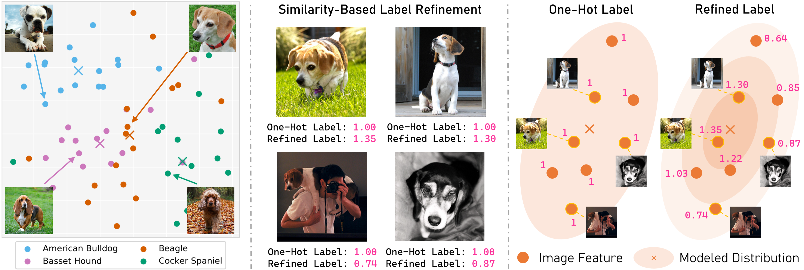
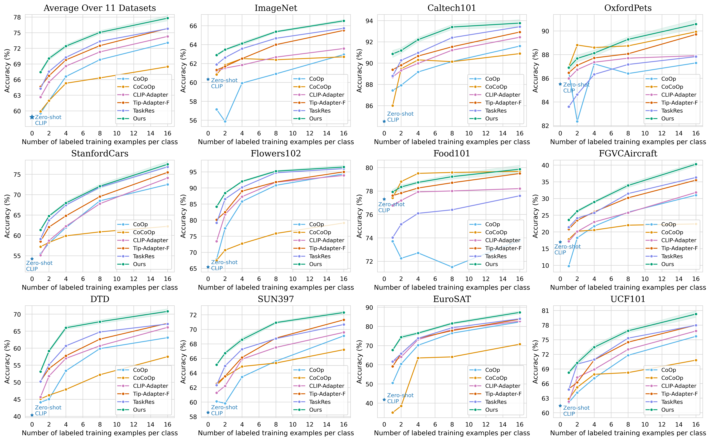
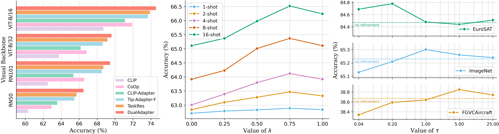

# 看似“负面”的收益实则产生积极影响，我们提出了适用于视觉-语言模型的统一双路径适配器。该适配器创新性地构建了双向交互路径，旨在提升跨模态任务中的性能表现。

发布时间：2024年03月19日

`Agent`

> Negative Yields Positive: Unified Dual-Path Adapter for Vision-Language Models

# 摘要

> 近期研究发现，大规模预训练的视觉-语言模型(VLMs)在开放世界视觉表达的学习及各类下游任务中的表现卓越，只需微调就能取得显著成效。本工作中，我们创造性地将双学习思想融入VLMs的微调环节，这意味着我们不仅要教会模型认识图像的正面特征，也要学会辨识其非典型特征。在此基础上，我们创新设计了DualAdapter方案，借助少量标注样本，从正反两面驱动VLMs进行双向适配调整。在预测阶段，DualAdapter通过跨目标类别的互补正选与负排机制实现统一预测，从而有效提升了VLMs在下游任务中的整体识别精度。实验证明，该DualAdapter在少样本学习和领域泛化任务上均超越当前最先进方法，并保持了较高的计算效率，相关代码已开源至https://github.com/zhangce01/DualAdapter。

> Recently, large-scale pre-trained Vision-Language Models (VLMs) have demonstrated great potential in learning open-world visual representations, and exhibit remarkable performance across a wide range of downstream tasks through efficient fine-tuning. In this work, we innovatively introduce the concept of dual learning into fine-tuning VLMs, i.e., we not only learn what an image is, but also what an image isn't. Building on this concept, we introduce a novel DualAdapter approach to enable dual-path adaptation of VLMs from both positive and negative perspectives with only limited annotated samples. In the inference stage, our DualAdapter performs unified predictions by simultaneously conducting complementary positive selection and negative exclusion across target classes, thereby enhancing the overall recognition accuracy of VLMs in downstream tasks. Our extensive experimental results across 15 datasets validate that the proposed DualAdapter outperforms existing state-of-the-art methods on both few-shot learning and domain generalization tasks while achieving competitive computational efficiency. Code is available at https://github.com/zhangce01/DualAdapter.

[Arxiv](https://arxiv.org/abs/2403.12964)