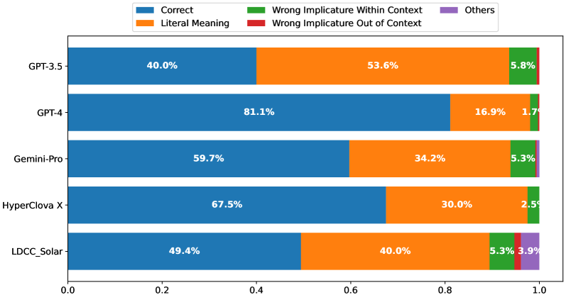
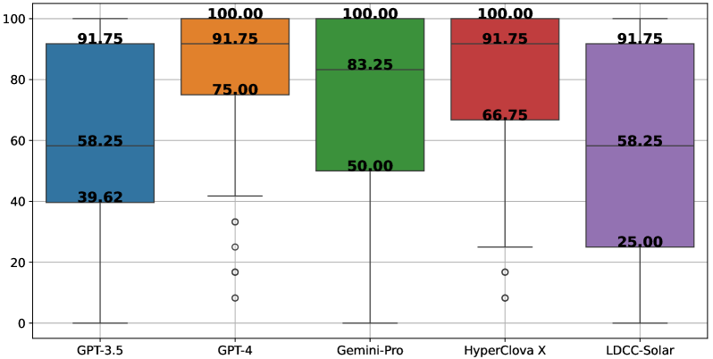

# 本研究专注于对大型语言模型进行韩语语用能力的深入评估，探究其在实际场景中理解和运用语言的智慧程度。

发布时间：2024年03月19日

`LLM应用` `语言模型`

> Pragmatic Competence Evaluation of Large Language Models for Korean

> 目前评价LLMs大多依靠适应自动评估的MCQ测试方式来衡量其内含知识，而本研究则进一步探究了在韩语情境下，尤其是此前尚未充分探讨过的LLMs语用能力。我们采用双轨评估方案，既有经过改良适用于自动评分的传统MCQ模式，也有需要人工专家评判的开放式问题OEQ，以此考察LLMs在无预设选项情况下生成叙事性答案的能力。实验揭示，GPT-4在两种测试方式中表现出色，分别取得了81.11和85.69的高分；而专为韩语优化的LLM HyperCLOVA X在OEQ环节中紧跟GPT-4步伐，得分81.56，仅相差4.13分。另外，尽管少量示例学习策略通常有助于提高LLMs性能，但采用Chain-of-Thought (CoT) 提示时，却容易导致模型过于侧重字面解读，影响其进行精确语用推理。鉴于人们越来越期望LLMs能理解和生成与人类交际规范相契合的语言，我们的研究成果凸显了推动LLMs掌握和传达超越字面意义的深层次含义能力的重要性。

> The current evaluation of Large Language Models (LLMs) predominantly relies on benchmarks focusing on their embedded knowledge by testing through multiple-choice questions (MCQs), a format inherently suited for automated evaluation. Our study extends this evaluation to explore LLMs' pragmatic competence--a facet previously underexamined before the advent of sophisticated LLMs, specifically in the context of Korean. We employ two distinct evaluation setups: the conventional MCQ format, adapted for automatic evaluation, and Open-Ended Questions (OEQs), assessed by human experts, to examine LLMs' narrative response capabilities without predefined options. Our findings reveal that GPT-4 excels, scoring 81.11 and 85.69 in the MCQ and OEQ setups, respectively, with HyperCLOVA X, an LLM optimized for Korean, closely following, especially in the OEQ setup, demonstrating a score of 81.56 with a marginal difference of 4.13 points compared to GPT-4. Furthermore, while few-shot learning strategies generally enhance LLM performance, Chain-of-Thought (CoT) prompting introduces a bias toward literal interpretations, hindering accurate pragmatic inference. Considering the growing expectation for LLMs to understand and produce language that aligns with human communicative norms, our findings emphasize the importance for advancing LLMs' abilities to grasp and convey sophisticated meanings beyond mere literal interpretations.

[Arxiv](https://arxiv.org/abs/2403.12675)