# RASP 是一种以无人机为核心的平台，具备灵活可配置的驱动与感知能力，专为构建适应环境、智能互动的系统而设计。

发布时间：2024年03月19日

`Agent` `无人机` `消费电子`

> RASP: A Drone-based Reconfigurable Actuation and Sensing Platform Towards Ambient Intelligent Systems

> 设想消费级无人机能像家里的扫地机器人或手中的智能手机那样无所不在、功能强大，关键在于赋予它们灵活应对各类常见场景的感知、执行及响应能力。因此，我们创新性地提出了 RASP 这一模块化且可重新配置的传感与驱动平台，它能在短短25秒内令无人机自动完成传感器和执行器的切换，使得一架无人机就能迅速适应多种多样的任务挑战。RASP 系统包含三个层级设计：负责实体更换传感器模块的机械层、保持传感器/执行器电力和通信连通的电气层，以及保证无人机与任意传感器模块间具备统一接口的软件层。我们紧随大语言模型和视觉语言模型技术前沿，进一步阐述了基于 RASP 的个人助手系统的结构设计、实际应用和现实部署案例。实验证明，RASP 能够助力无人机在家庭、办公、实验及更多室内场所实现一系列实用功能。

> Realizing consumer-grade drones that are as useful as robot vacuums throughout our homes or personal smartphones in our daily lives requires drones to sense, actuate, and respond to general scenarios that may arise. Towards this vision, we propose RASP, a modular and reconfigurable sensing and actuation platform that allows drones to autonomously swap onboard sensors and actuators in only 25 seconds, allowing a single drone to quickly adapt to a diverse range of tasks. RASP consists of a mechanical layer to physically swap sensor modules, an electrical layer to maintain power and communication lines to the sensor/actuator, and a software layer to maintain a common interface between the drone and any sensor module in our platform. Leveraging recent advances in large language and visual language models, we further introduce the architecture, implementation, and real-world deployments of a personal assistant system utilizing RASP. We demonstrate that RASP can enable a diverse range of useful tasks in home, office, lab, and other indoor settings.

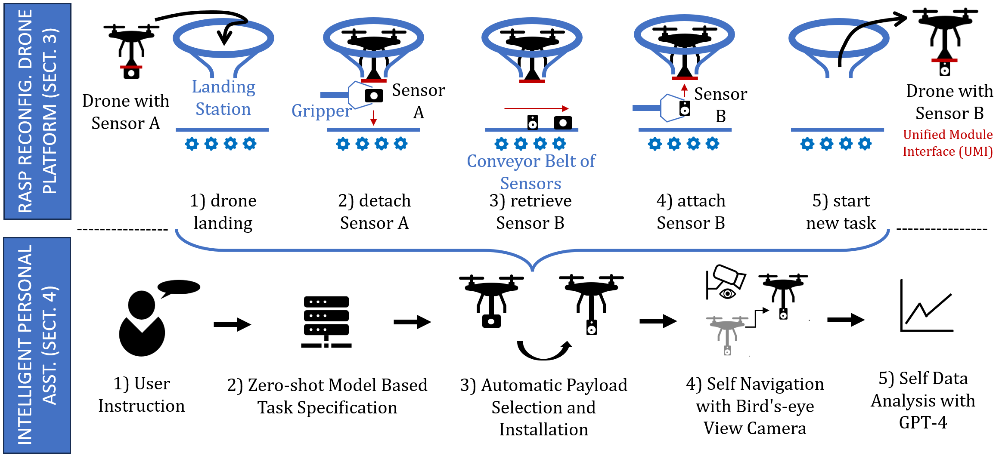

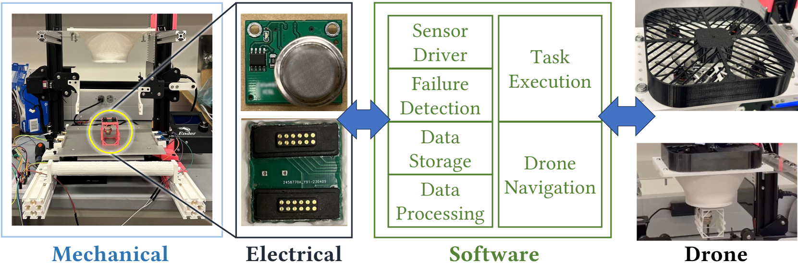

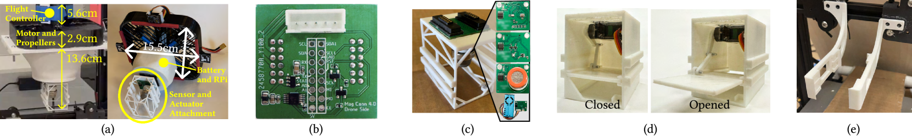

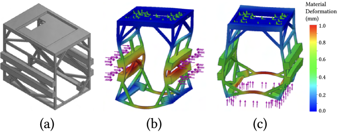

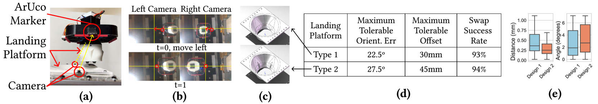

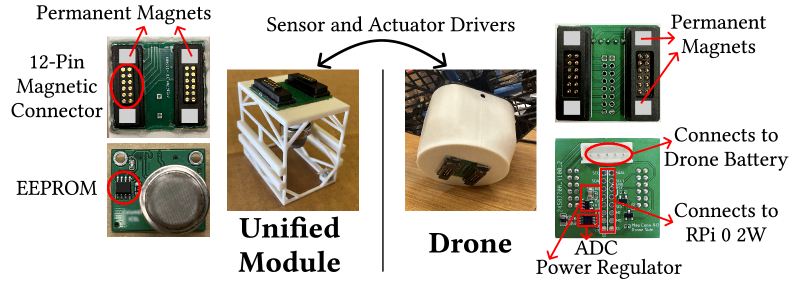

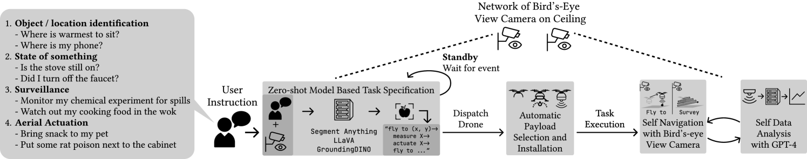

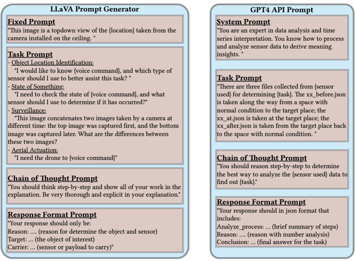

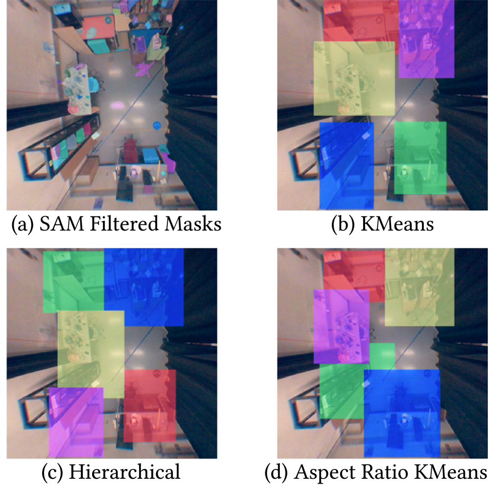

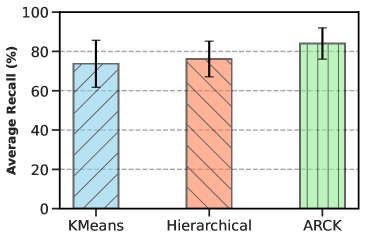

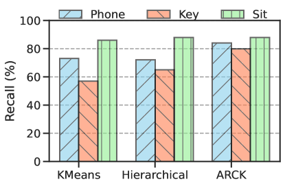

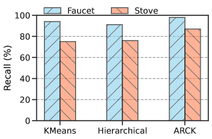

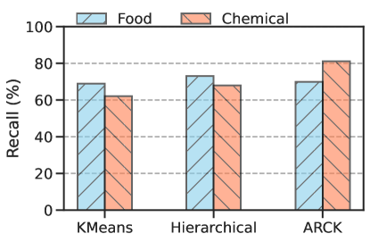

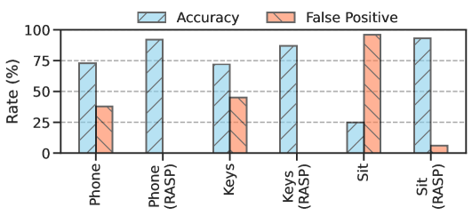

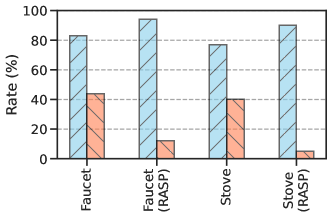

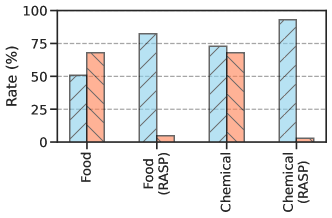

[Arxiv](https://arxiv.org/abs/2403.12853)