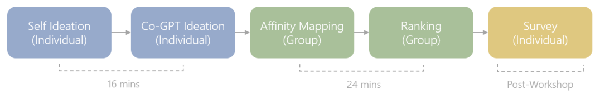
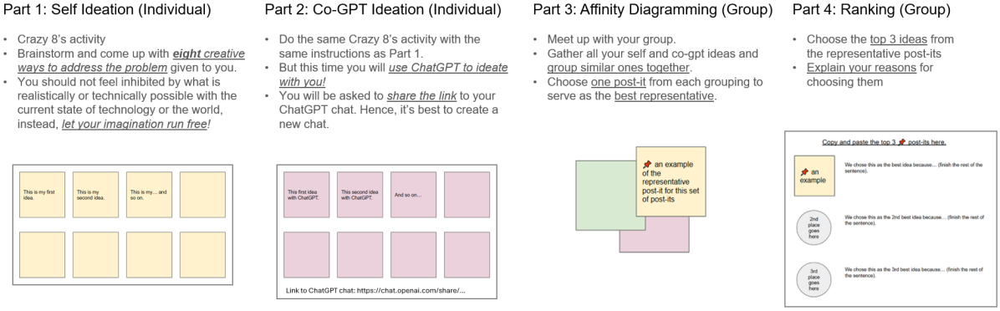
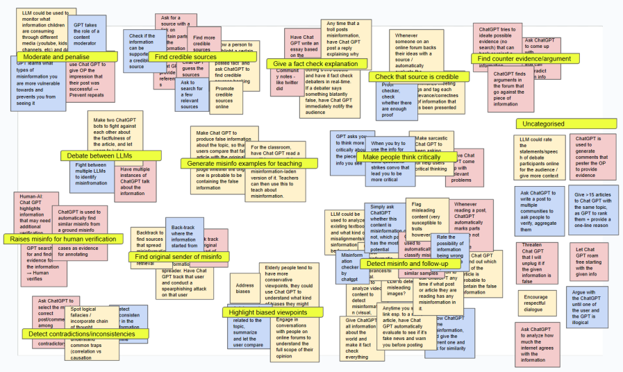
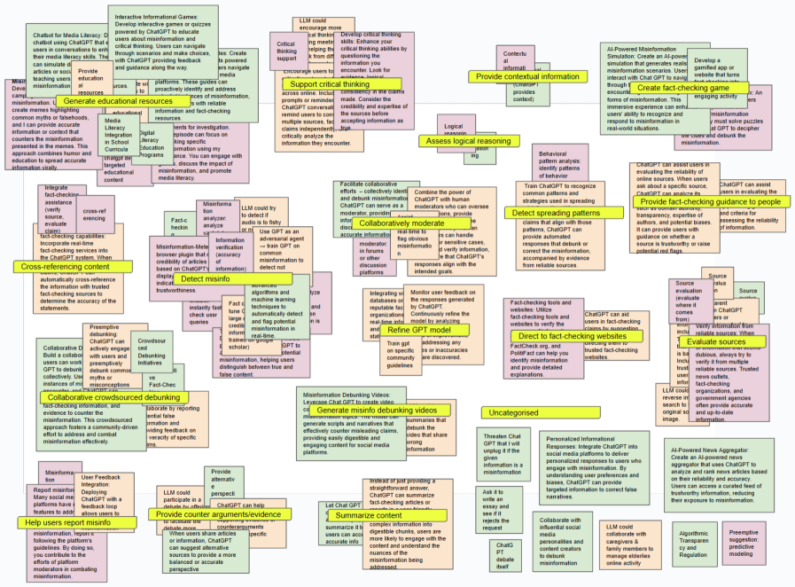
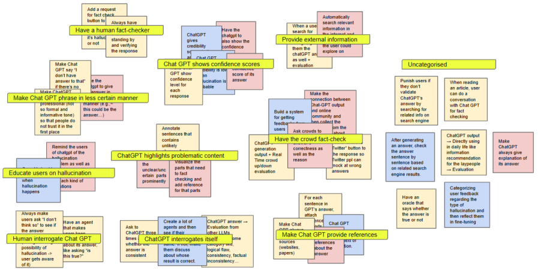
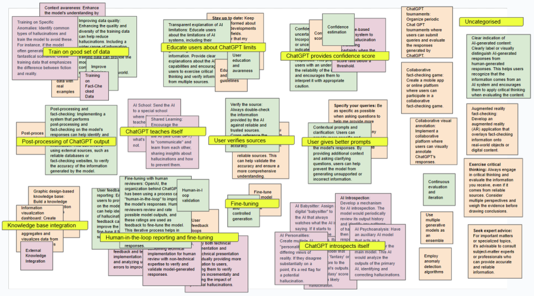

# 「快速 AI 创想」探讨了如何在个体独立思考和与大型语言模型协作的双重模式下，高效激发并生成创新想法。

发布时间：2024年03月19日

`LLM应用` `创新设计` `人工智能`

> Rapid AIdeation: Generating Ideas With the Self and in Collaboration With Large Language Models

> GenAI能高效产生丰富多元的内容，这一特质使其在设计初期具备强大的创新推动力。为揭示人类与GenAI如何携手创新解决实际问题，我们开展了一场快速构思工作坊，携手21位参与者运用大型语言模型(LLM)激荡脑力、评估可能的解决方案。实验结果显示，尽管LLM所产的创意多样性更广、品质较高，并不意味着其一定超越人类智慧。参与者们大多以直接、精炼的指令引导LLM。同时，我们注意到，在不同场景下，LLM会扮演咨询顾问或助手的角色，与人协同工作；尤为引人注目的是，有一种特殊的“对抗协作”模式出现，参与者通过对立方式刺激LLM以获取创意。

> Generative artificial intelligence (GenAI) can rapidly produce large and diverse volumes of content. This lends to it a quality of creativity which can be empowering in the early stages of design. In seeking to understand how creative ways to address practical issues can be conceived between humans and GenAI, we conducted a rapid ideation workshop with 21 participants where they used a large language model (LLM) to brainstorm potential solutions and evaluate them. We found that the LLM produced a greater variety of ideas that were of high quality, though not necessarily of higher quality than human-generated ideas. Participants typically prompted in a straightforward manner with concise instructions. We also observed two collaborative dynamics with the LLM fulfilling a consulting role or an assisting role depending on the goals of the users. Notably, we observed an atypical anti-collaboration dynamic where participants used an antagonistic approach to prompt the LLM.

[Arxiv](https://arxiv.org/abs/2403.12928)