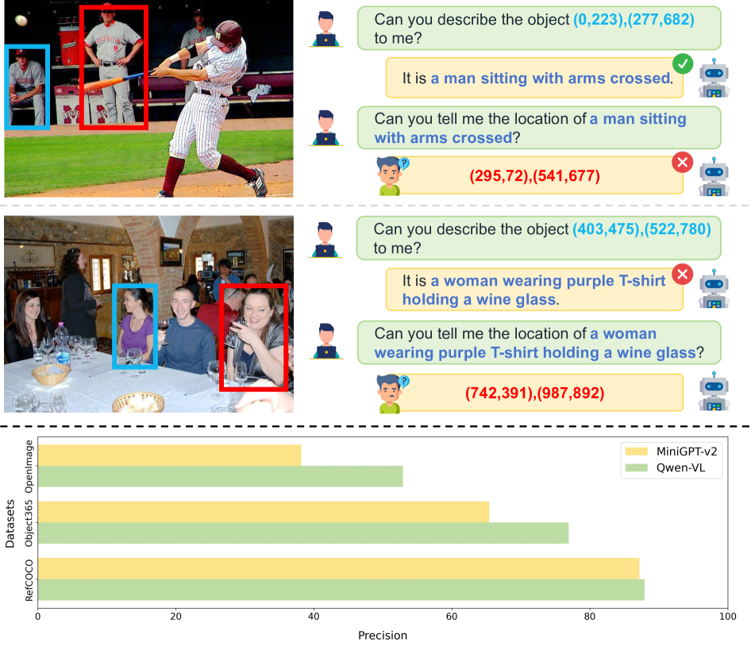
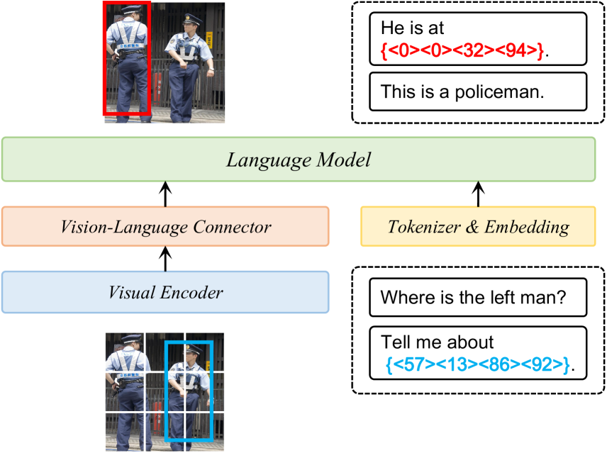
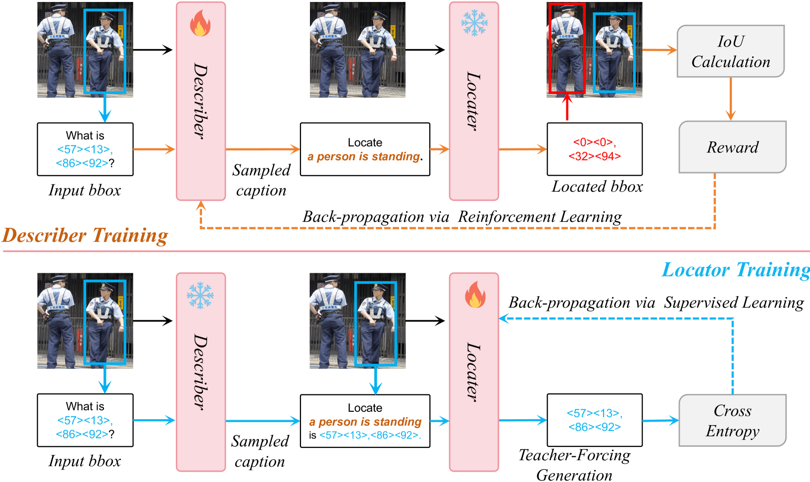
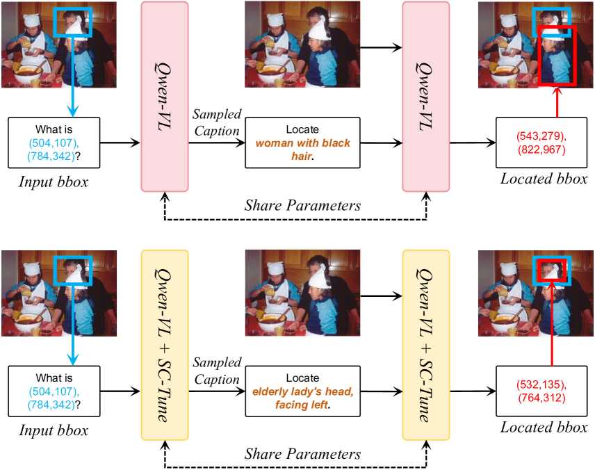
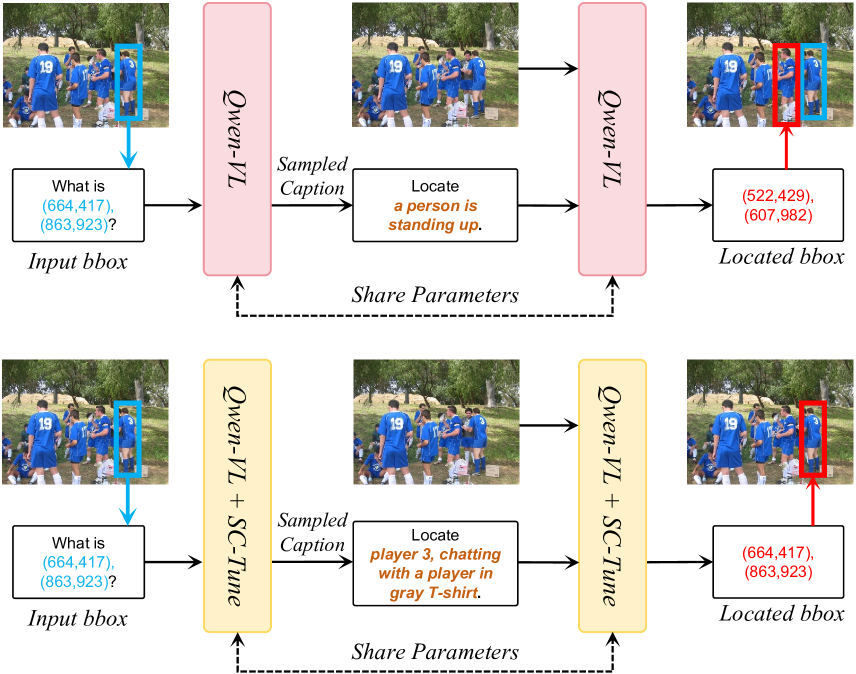
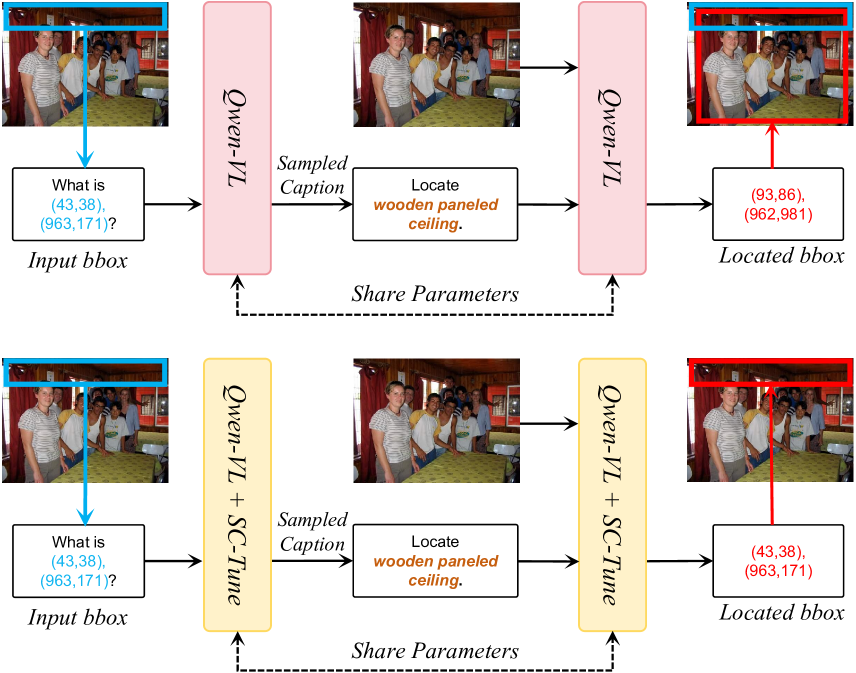
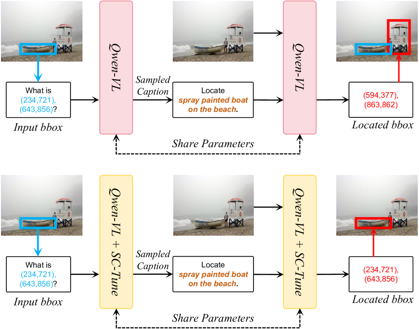

# SC-Tune：旨在揭示大型视觉语言模型内部的自洽参照理解潜力，从而充分释放其在处理复杂参照理解任务时的能力。

发布时间：2024年03月19日

`Agent` `计算机视觉`

> SC-Tune: Unleashing Self-Consistent Referential Comprehension in Large Vision Language Models

> 当前研究热点集中于让大型视觉语言模型（LVLMs）从广泛图像理解走向对特定物体深层次、精细的理解。本论文关注并深入研究LVLMs中一种反映其核心能力的特性——自我一致性能力。它意味着模型能够针对具体物体生成信息详实的描述，并在闭环系统中依据这些描述准确重识物体，从而体现模型在细粒度视觉与语言理解上的精确度和可信度。然而，现有LVLMs的自我一致性表现尚不尽人意，制约了其实用性和发展潜力。因此，我们创新性地提出了一种名为“自我一致性调整”（SC-Tune）的微调新策略，它强调一个循环描述-定位系统的协同训练机制，既节省数据又能在多种LVLMs上实现良好的泛化效果。大量实验表明，SC-Tune能够在各类物体级视觉语言基准测试上大幅提升性能，并在图像级视觉语言基准上保持或提高竞争力。我们的模型和源代码将公开发布于https://github.com/ivattyue/SC-Tune。

> Recent trends in Large Vision Language Models (LVLMs) research have been increasingly focusing on advancing beyond general image understanding towards more nuanced, object-level referential comprehension. In this paper, we present and delve into the self-consistency capability of LVLMs, a crucial aspect that reflects the models' ability to both generate informative captions for specific objects and subsequently utilize these captions to accurately re-identify the objects in a closed-loop process. This capability significantly mirrors the precision and reliability of fine-grained visual-language understanding. Our findings reveal that the self-consistency level of existing LVLMs falls short of expectations, posing limitations on their practical applicability and potential. To address this gap, we introduce a novel fine-tuning paradigm named Self-Consistency Tuning (SC-Tune). It features the synergistic learning of a cyclic describer-locator system. This paradigm is not only data-efficient but also exhibits generalizability across multiple LVLMs. Through extensive experiments, we demonstrate that SC-Tune significantly elevates performance across a spectrum of object-level vision-language benchmarks and maintains competitive or improved performance on image-level vision-language benchmarks. Both our model and code will be publicly available at https://github.com/ivattyue/SC-Tune.

[Arxiv](https://arxiv.org/abs/2403.13263)