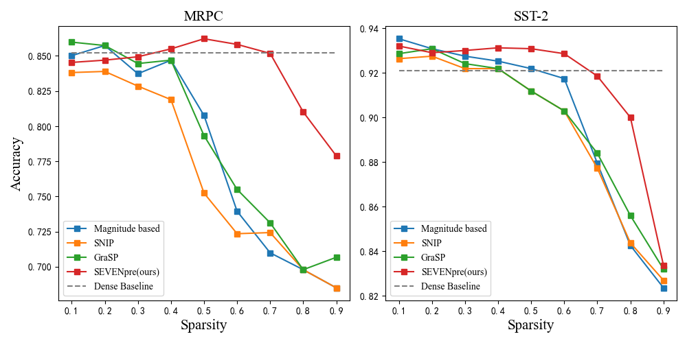
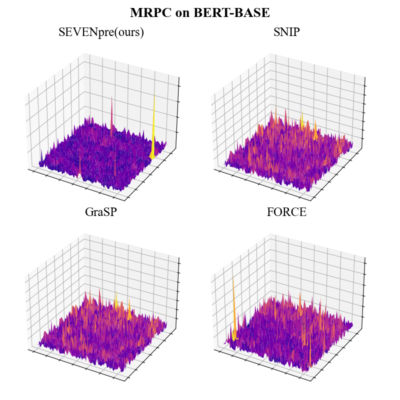
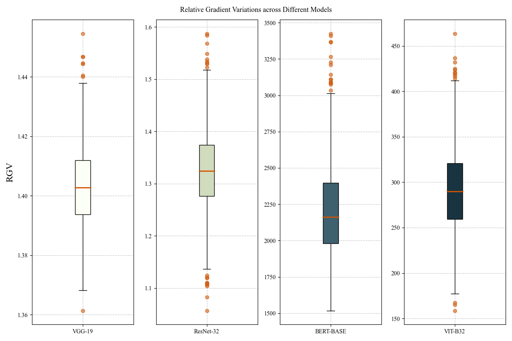
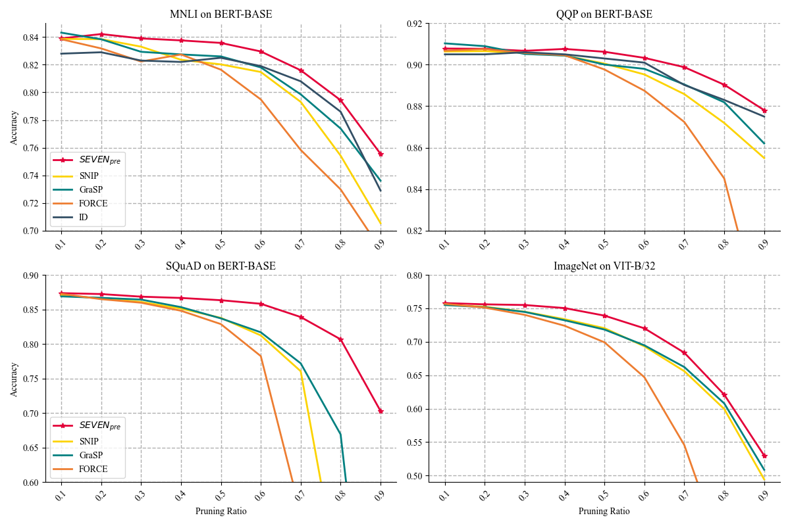
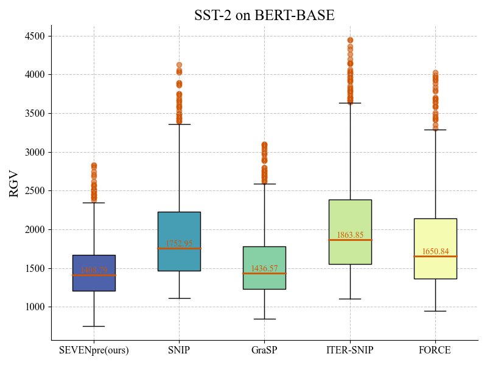
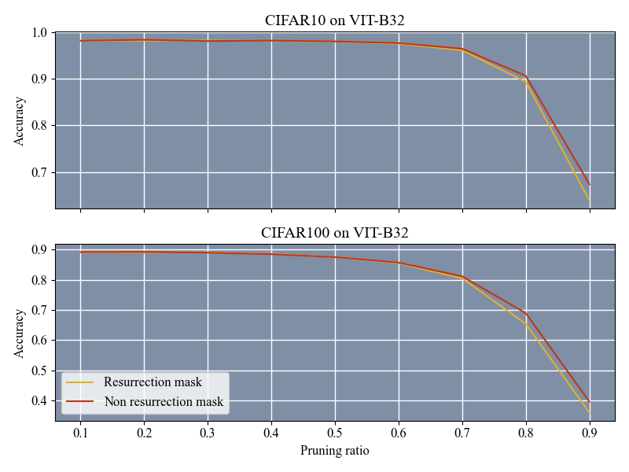

# SEVEN：一种通过保留“哨兵”机制对Transformer模型进行有效剪枝的方法

发布时间：2024年03月19日

`LLM理论` `模型压缩`

> SEVEN: Pruning Transformer Model by Reserving Sentinels

> Transformer 大模型因其出色的跨任务性能而备受瞩目，然而由于参数量庞大，特别是在移动端应用时受限。相比卷积神经网络，TM 中的梯度特性更显动态与复杂，传统的剪枝方法容易保留下较大梯度噪声的权重，使得剪枝模型对稀疏程度及数据集变化较为敏感，性能欠佳。论文提出了“符号下降”（SD）这一通用框架用于训练和调整 TM，试图通过 SD 的累积过程揭示 TM 中噪声批量梯度的本质规律，并借此动态衡量权重的重要程度。在此基础上，我们创新性地提出了一种名为 SEVEN 的方法，该方法偏好选择梯度噪声小、敏感度稳定的权重予以保留。我们针对自然语言处理、问答和图像分类等多个领域的 Transformer 模型开展了大量实验，实证了 SEVEN 在多种剪枝情况及不同稀疏等级下的显著优势，并展现出在各类微调策略下的稳健性能。相关代码已在 GitHub 平台公开，地址为 https://github.com/xiaojinying/SEVEN。

> Large-scale Transformer models (TM) have demonstrated outstanding performance across various tasks. However, their considerable parameter size restricts their applicability, particularly on mobile devices. Due to the dynamic and intricate nature of gradients on TM compared to Convolutional Neural Networks, commonly used pruning methods tend to retain weights with larger gradient noise. This results in pruned models that are sensitive to sparsity and datasets, exhibiting suboptimal performance. Symbolic Descent (SD) is a general approach for training and fine-tuning TM. In this paper, we attempt to describe the noisy batch gradient sequences on TM through the cumulative process of SD. We utilize this design to dynamically assess the importance scores of weights.SEVEN is introduced by us, which particularly favors weights with consistently high sensitivity, i.e., weights with small gradient noise. These weights are tended to be preserved by SEVEN. Extensive experiments on various TM in natural language, question-answering, and image classification domains are conducted to validate the effectiveness of SEVEN. The results demonstrate significant improvements of SEVEN in multiple pruning scenarios and across different sparsity levels. Additionally, SEVEN exhibits robust performance under various fine-tuning strategies. The code is publicly available at https://github.com/xiaojinying/SEVEN.

[Arxiv](https://arxiv.org/abs/2403.12688)