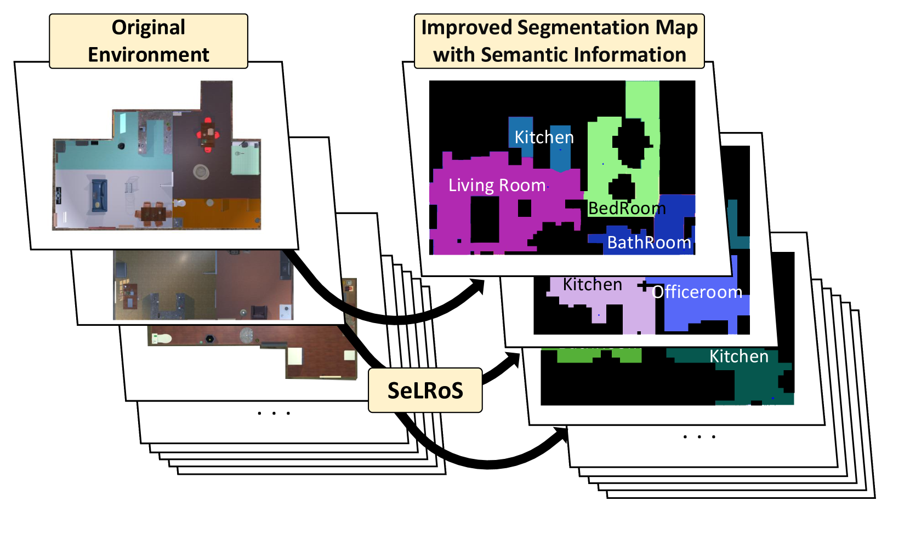
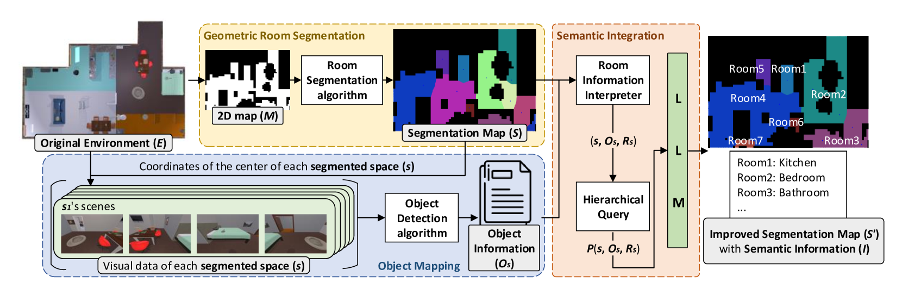
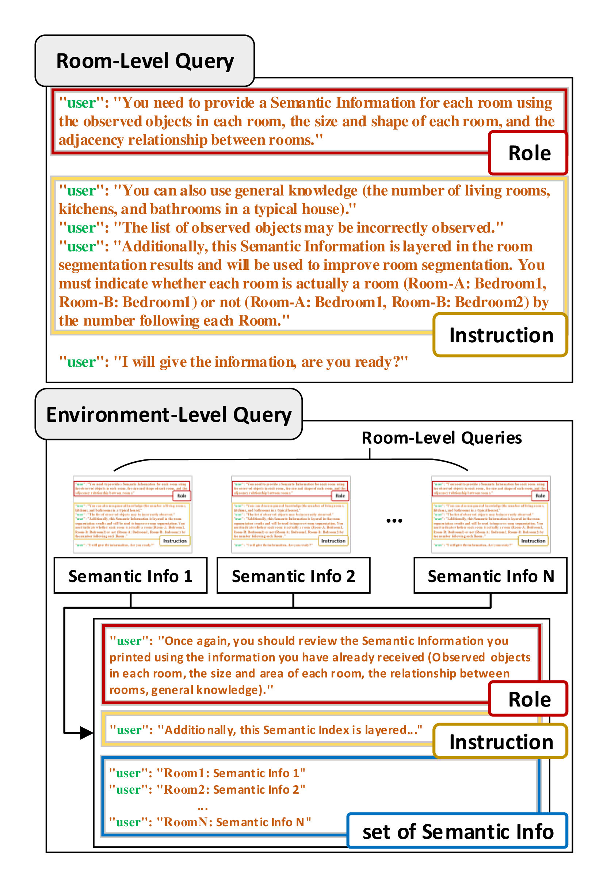
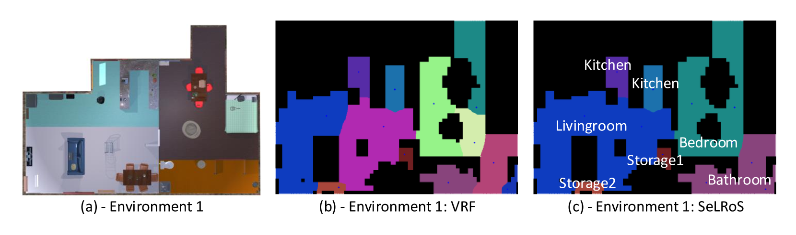
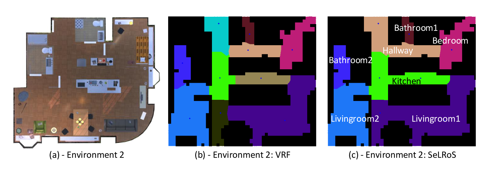
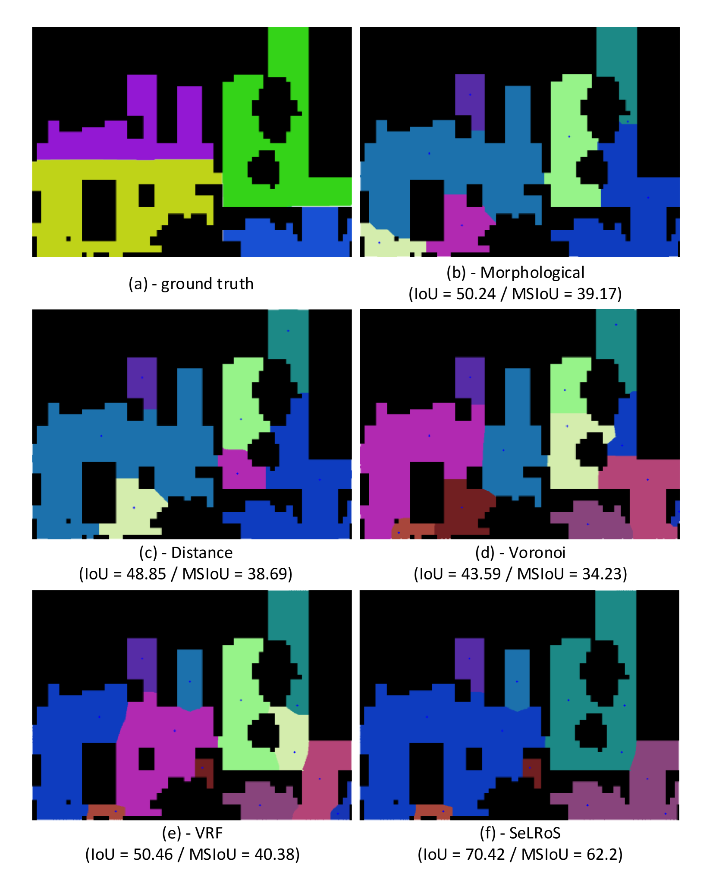

# 本研究探讨了如何借助大型语言模型（LLMs）实现房间分割的语义分层，从而更精确地理解和解析空间结构。

发布时间：2024年03月19日

`Agent` `机器人` `室内导航`

> Semantic Layering in Room Segmentation via LLMs

> 本文创新性地介绍了SeLRoS——一种结合大型语言模型(LLMs)与传统二维地图分割技术的语义层次化房间分割方法。区别于仅聚焦于几何形状分割的传统思路，SeLRoS为分割出的地图赋予了丰富的语义信息，如物体识别及空间关联，从而增强机器人在室内的导航能力。利用LLMs的强大功能，SeLRoS构建了一个新框架，能够深入解读并有序整理各个分割区域内的复杂信息，有效提升了房间分割的精确度和情境适用性。更重要的是，SeLRoS通过引入语义评价机制，成功突破了现有算法的局限，精准地区分出实际房间边界与因家具布局或分割误差导致的伪边界。该方法的有效性已在30个迥异的三维环境中得到了充分验证。您可在以下网址获取本研究的源代码和实验视频：https://sites.google.com/view/selros。

> In this paper, we introduce Semantic Layering in Room Segmentation via LLMs (SeLRoS), an advanced method for semantic room segmentation by integrating Large Language Models (LLMs) with traditional 2D map-based segmentation. Unlike previous approaches that solely focus on the geometric segmentation of indoor environments, our work enriches segmented maps with semantic data, including object identification and spatial relationships, to enhance robotic navigation. By leveraging LLMs, we provide a novel framework that interprets and organizes complex information about each segmented area, thereby improving the accuracy and contextual relevance of room segmentation. Furthermore, SeLRoS overcomes the limitations of existing algorithms by using a semantic evaluation method to accurately distinguish true room divisions from those erroneously generated by furniture and segmentation inaccuracies. The effectiveness of SeLRoS is verified through its application across 30 different 3D environments. Source code and experiment videos for this work are available at: https://sites.google.com/view/selros.

[Arxiv](https://arxiv.org/abs/2403.12920)