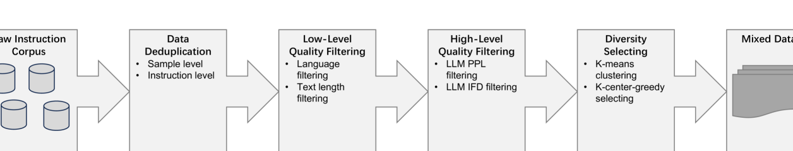
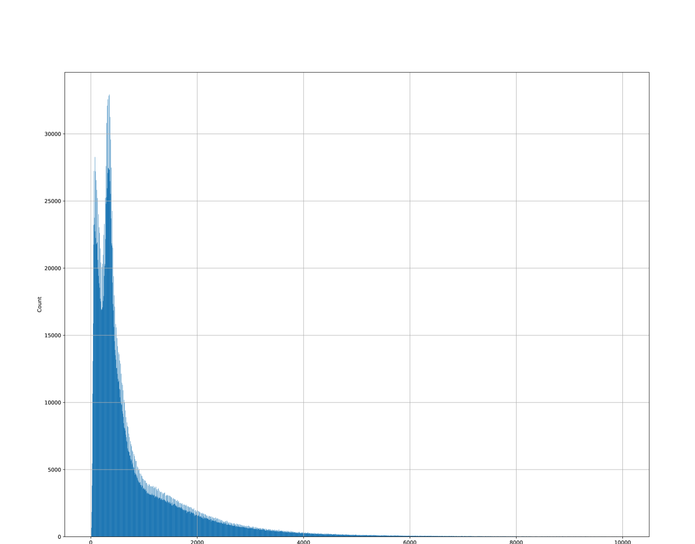
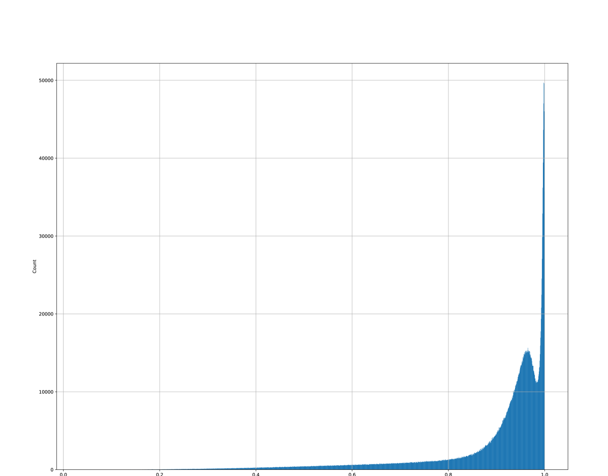
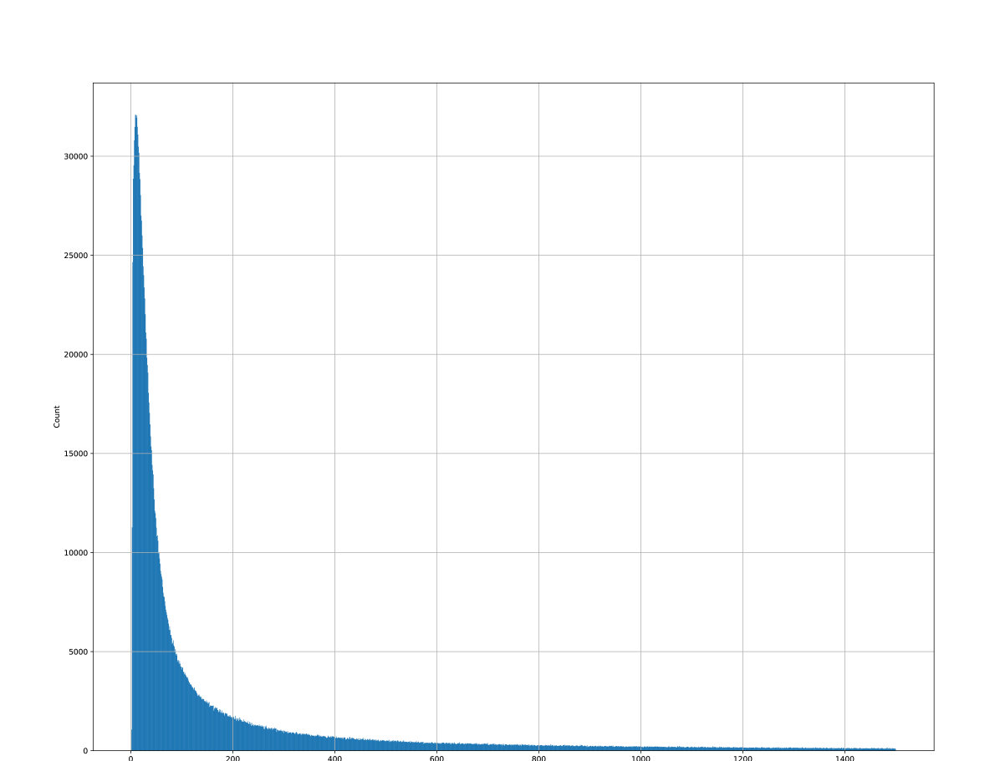
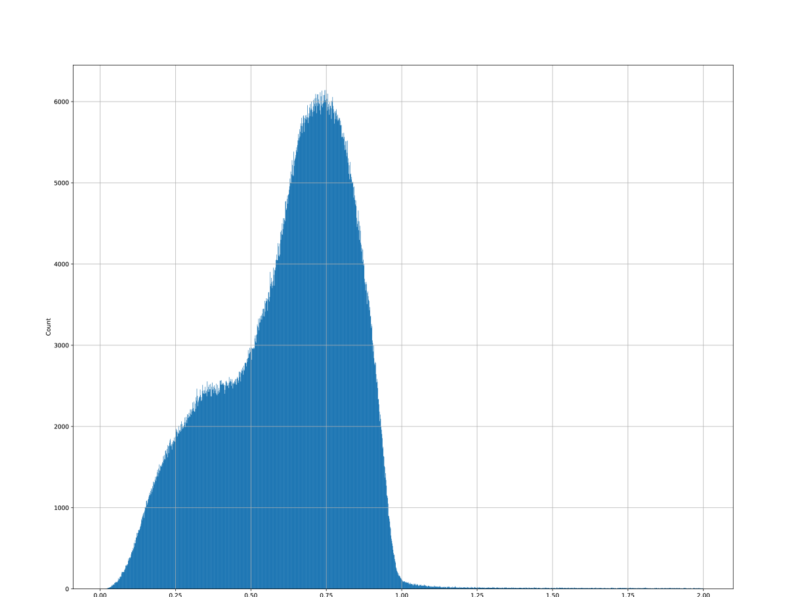
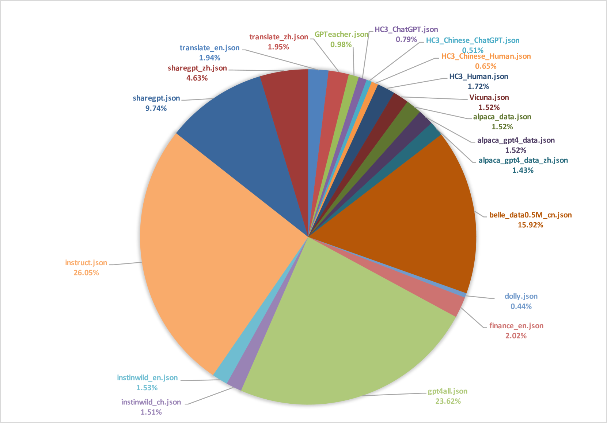
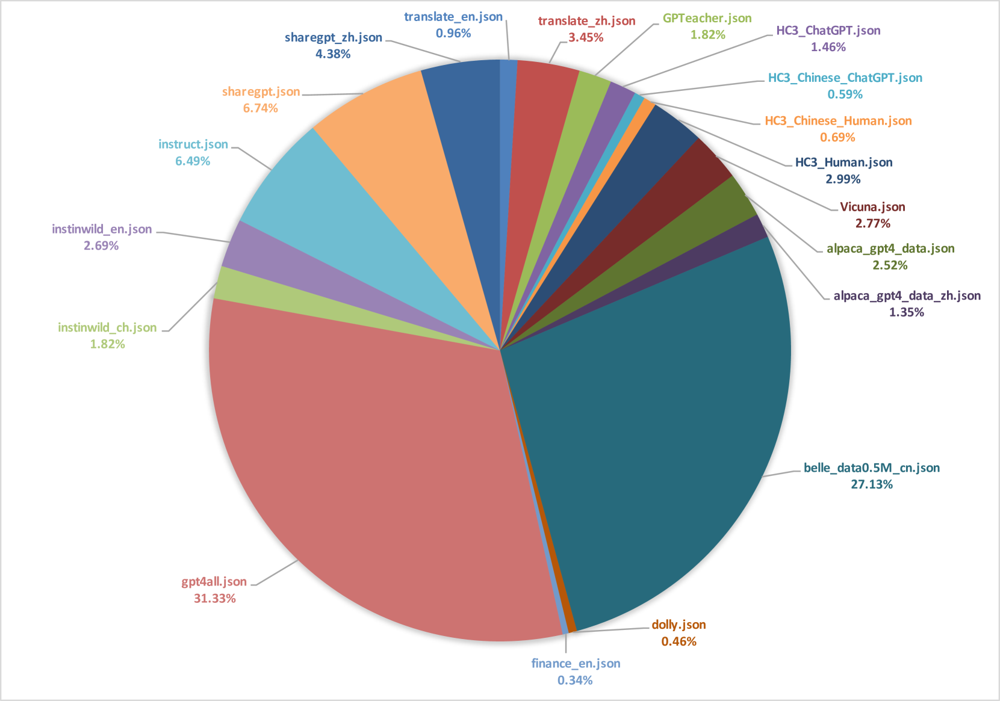
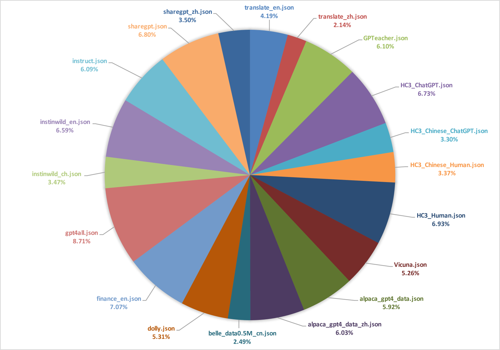
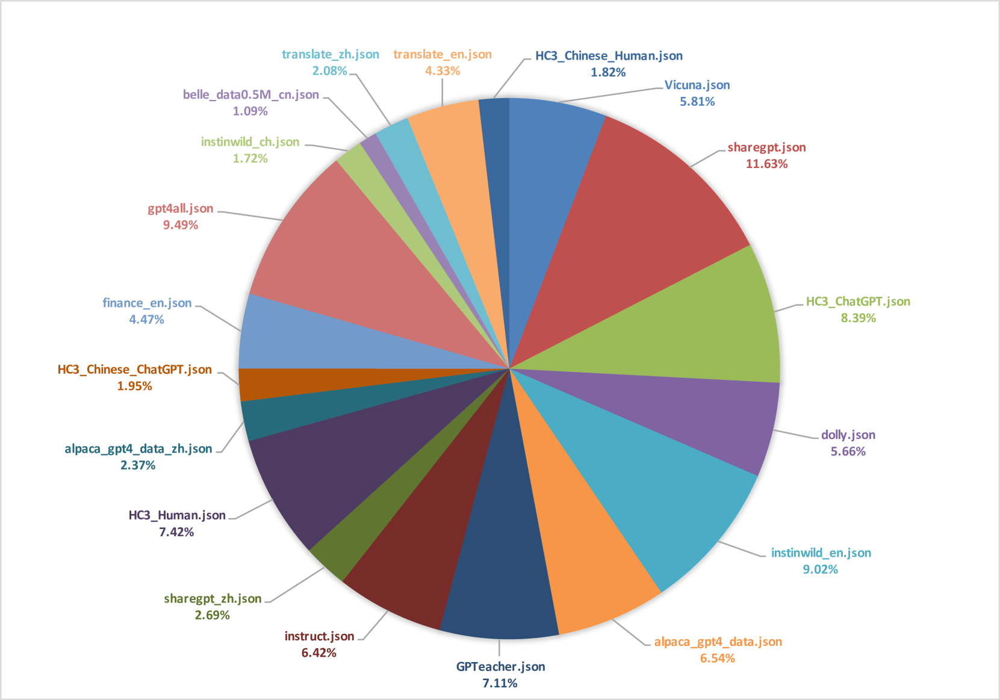

# 本技术报告详述了针对“BetterMixture”竞赛的解决方案，旨在深入探讨并优化混合模型的表现。

发布时间：2024年03月19日

`LLM应用` `数据优化`

> Technical Report: Competition Solution For BetterMixture

> 在大型模型繁盛的时代背景下，面对如何在有限算力限制下，从浩如烟海且复杂多变的数据中挑选并优化数据集来提升大型语言模型性能的重大挑战，我们提出了针对 BetterMixture 问题的解决方案，并在论文中进行了详细介绍。我们的方案荣获第三名，其中融入了数据去重技术，以及对数据进行低阶和高阶质量过滤，同时注重选取多样性的数据子集。这个方案的核心是基于 Data-Juicer 扩展开发的 Ke-Data-Juicer，它在处理与优化大型语言模型所需数据方面展现出了稳健高效的能力。

> In the era of flourishing large-scale models, the challenge of selecting and optimizing datasets from the vast and complex sea of data, to enhance the performance of large language models within the constraints of limited computational resources, has become paramount. This paper details our solution for the BetterMixture challenge, which focuses on the fine-tuning data mixing for large language models. Our approach, which secured third place, incorporates data deduplication, low-level and high-level quality filtering, and diversity selection. The foundation of our solution is Ke-Data-Juicer, an extension of Data-Juicer, demonstrating its robust capabilities in handling and optimizing data for large language models.

[Arxiv](https://arxiv.org/abs/2403.13233)