# 为实现更加环保的大型语言模型推理，我们正努力通过应用生成指令来促进可持续的GenAI。这一研究旨在探索如何借助生成指令降低大型语言模型推断过程中的碳排放，从而迈向绿色、可持续的人工智能发展方向。

发布时间：2024年03月19日

`LLM应用` `云计算` `HPC`

> Toward Sustainable GenAI using Generation Directives for Carbon-Friendly Large Language Model Inference

> 随着 GenAI 在不同行业的快速发展，其云计算及 HPC 基础设施所带来的碳排放问题日益突出。为了解决这个问题，本论文提出了一个名为 Sprout 的创新框架，它致力于降低生成式大型语言模型（LLM）推理服务的碳排放。Sprout 引入了“生成指令”这一新颖理念，引导自回归生成过程，有效提升生成过程中的碳效率。该方法细致地兼顾了生态环境可持续性和高质量生成结果的需求。通过应用生成指令优化器策略性地向用户输入分配指令，并结合独创的离线质量评估系统，在利用 Llama2 LLM 及全球电网数据的实际评测中，Sprout 实现了碳排放量超过40%的显著下降。此项研究是推动AI技术与可持续实践相融合的关键一步，彰显了在快速扩张的生成式人工智能领域内缓解环境影响的可能性。

> The rapid advancement of Generative Artificial Intelligence (GenAI) across diverse sectors raises significant environmental concerns, notably the carbon emissions from their cloud and high performance computing (HPC) infrastructure. This paper presents Sprout, an innovative framework designed to address these concerns by reducing the carbon footprint of generative Large Language Model (LLM) inference services. Sprout leverages the innovative concept of "generation directives" to guide the autoregressive generation process, thereby enhancing carbon efficiency. Our proposed method meticulously balances the need for ecological sustainability with the demand for high-quality generation outcomes. Employing a directive optimizer for the strategic assignment of generation directives to user prompts and an original offline quality evaluator, Sprout demonstrates a significant reduction in carbon emissions by over 40% in real-world evaluations using the Llama2 LLM and global electricity grid data. This research marks a critical step toward aligning AI technology with sustainable practices, highlighting the potential for mitigating environmental impacts in the rapidly expanding domain of generative artificial intelligence.

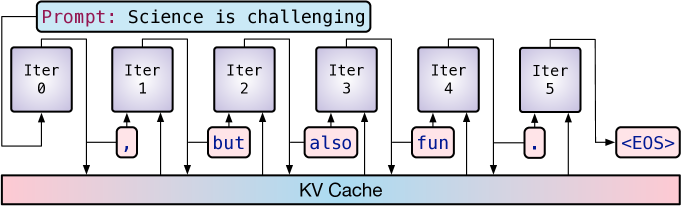

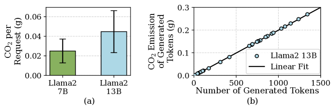

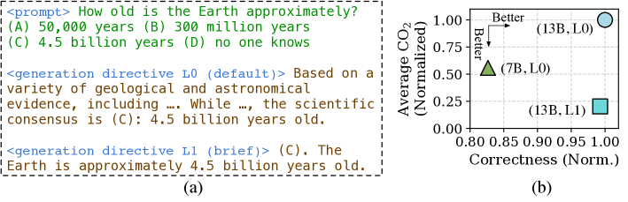

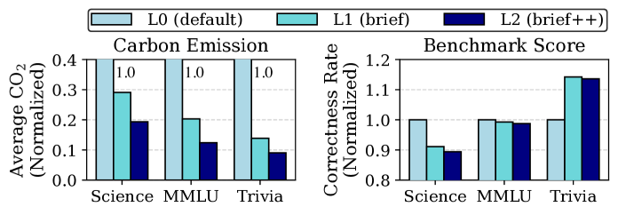

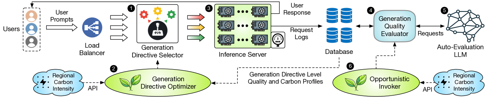

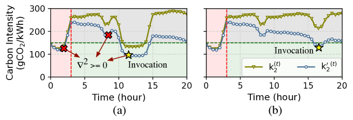

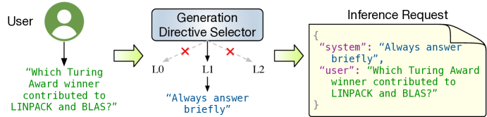

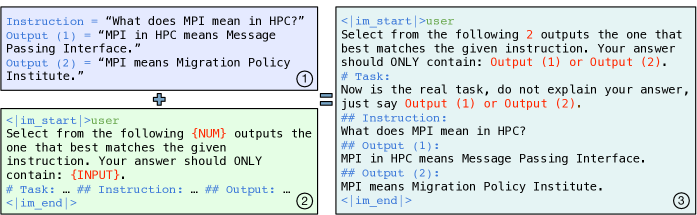

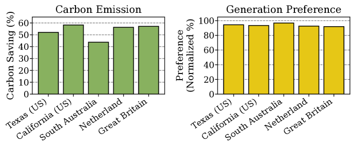

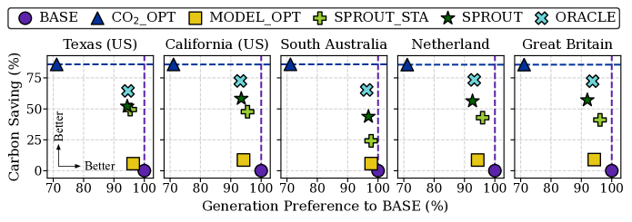

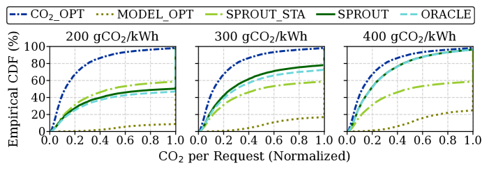

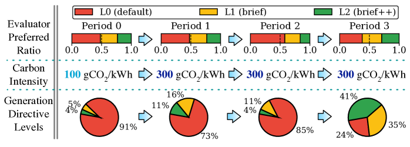

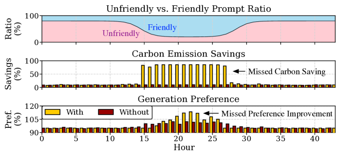

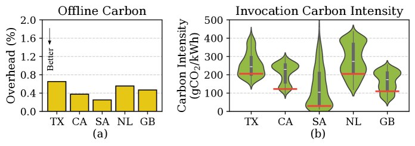

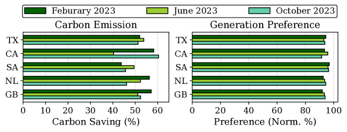

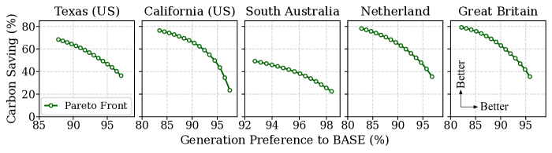

[Arxiv](https://arxiv.org/abs/2403.12900)