# UniBind 是一种创新的方法，它利用 LLM 增强技术构建了一个统一而均衡的表征空间，旨在“一统天下”，有效整合和绑定各种元素。

发布时间：2024年03月19日

`LLM应用` `多模态` `表示学习`

> UniBind: LLM-Augmented Unified and Balanced Representation Space to Bind Them All

# 摘要

> 我们推出的 UniBind 灵活高效，旨在为七种多样化的模态——包括图像、文本、音频、点云、热成像、视频和事件数据——创造一个统一的表现空间。以往的研究如 ImageBind 将图像置于核心地位，构建了以图像为核心的表示框架，但这样的做法可能导致各模态间表现失衡，无法达到最佳效果。而且，之前的做法直接使用类别名来提取下游任务的文本特征，这在处理多模态数据时很难准确表达其语义内涵。UniBind 创新性地提出了一种无视模态差异的对齐中心，并倚仗大型语言模型（LLMs）的力量构建了一个均衡且统一的表示空间，它能够广泛适用于各类 CLIP 风格模型，并带来显著性能跃升。具体实现步骤如下：首先，我们利用 LLM 和多模态 LLM 创建了一个文本嵌入的知识库；其次，根据该知识库以及编码后的视觉嵌入，动态构建基于 LLM 强化的类别级嵌入中心；最后，运用对比学习方法将所有嵌入调整至 LLM 强化的嵌入中心，从而形成一个既统一又平衡的表示空间。实验证明，UniBind 相较于传统方法在零样本识别任务上平均提升了 6.36% 的性能，并在多模态微调场景中取得突破，比如在 ImageNet 数据集上提高了 6.75% 的成绩，同时大幅削减了 90% 的可训练参数。

> We present UniBind, a flexible and efficient approach that learns a unified representation space for seven diverse modalities -- images, text, audio, point cloud, thermal, video, and event data. Existing works, eg., ImageBind, treat the image as the central modality and build an image-centered representation space; however, the space may be sub-optimal as it leads to an unbalanced representation space among all modalities. Moreover, the category names are directly used to extract text embeddings for the downstream tasks, making it hardly possible to represent the semantics of multi-modal data. The 'out-of-the-box' insight of our UniBind is to make the alignment center modality-agnostic and further learn a unified and balanced representation space, empowered by the large language models (LLMs). UniBind is superior in its flexible application to all CLIP-style models and delivers remarkable performance boosts. To make this possible, we 1) construct a knowledge base of text embeddings with the help of LLMs and multi-modal LLMs; 2) adaptively build LLM-augmented class-wise embedding center on top of the knowledge base and encoded visual embeddings; 3) align all the embeddings to the LLM-augmented embedding center via contrastive learning to achieve a unified and balanced representation space. UniBind shows strong zero-shot recognition performance gains over prior arts by an average of 6.36%. Finally, we achieve new state-of-the-art performance, eg., a 6.75% gain on ImageNet, on the multi-modal fine-tuning setting while reducing 90% of the learnable parameters.

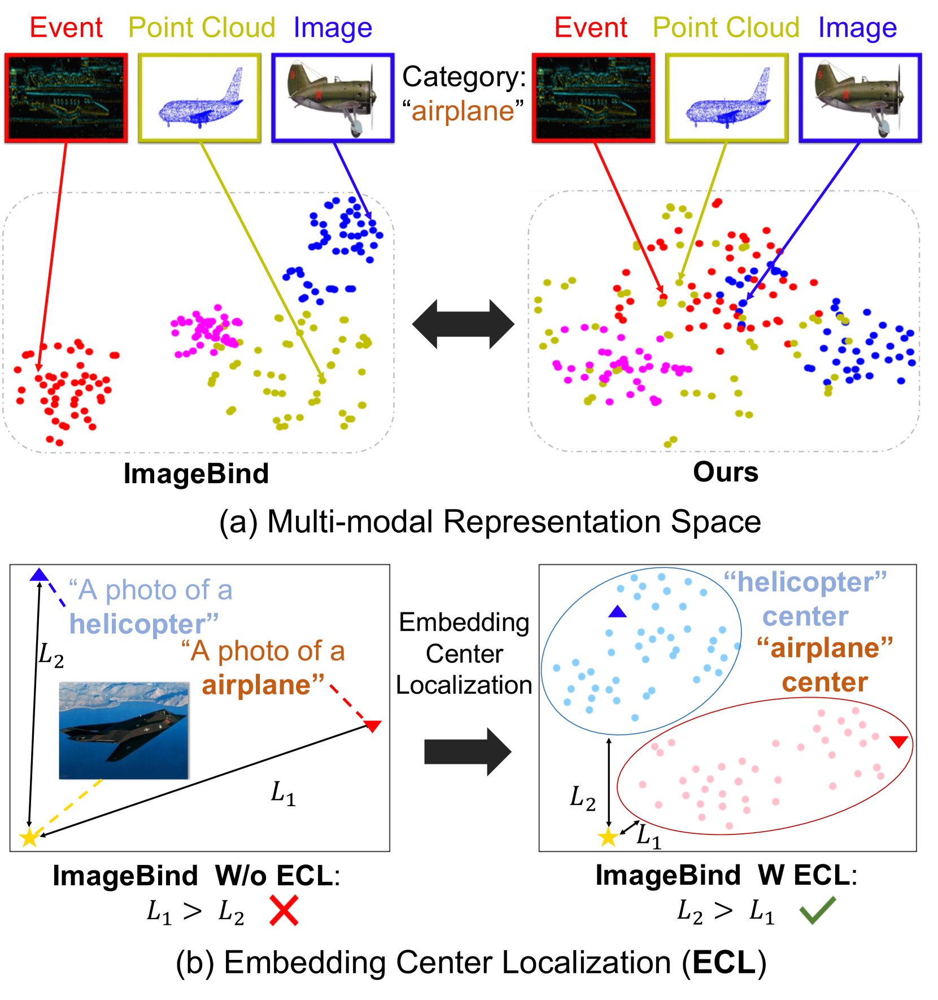

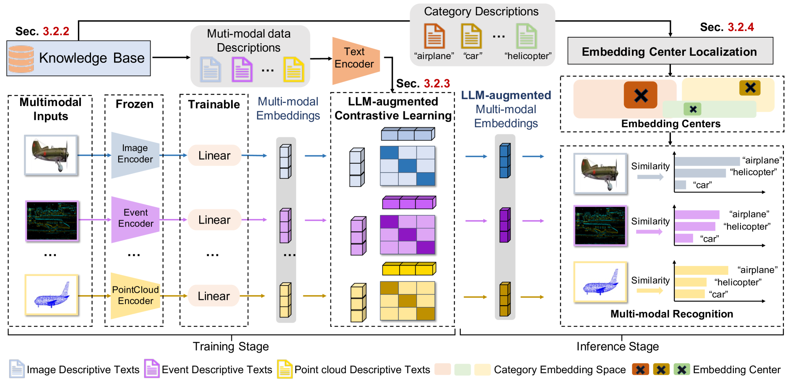

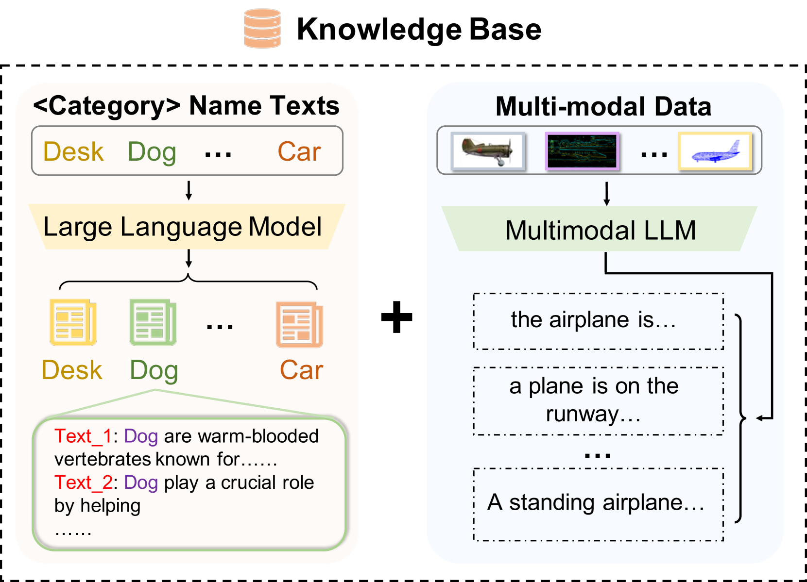

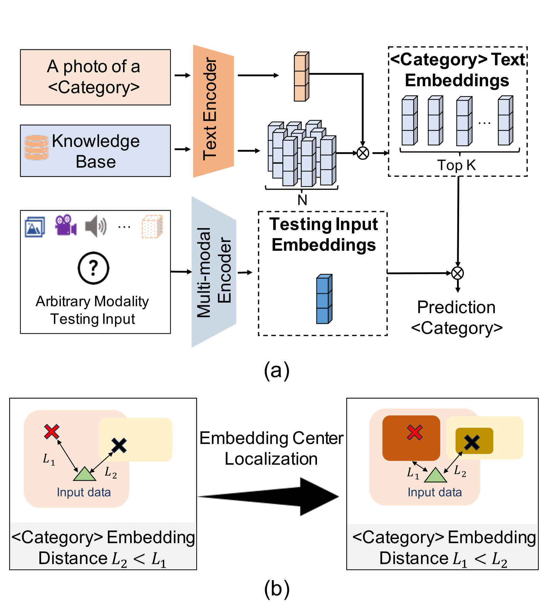

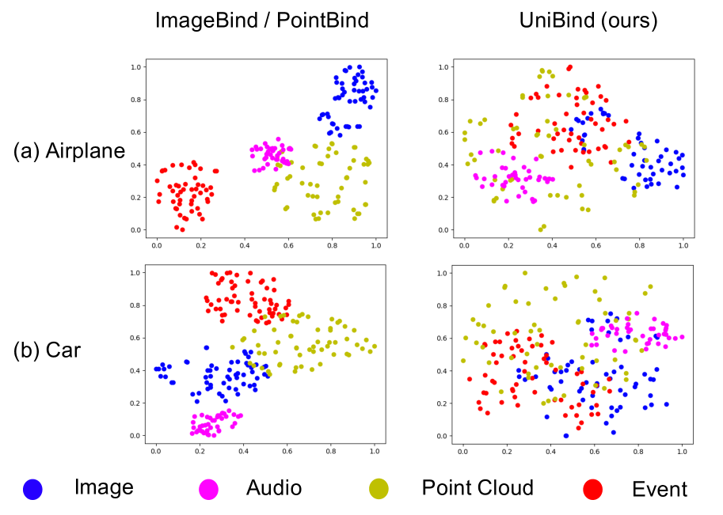

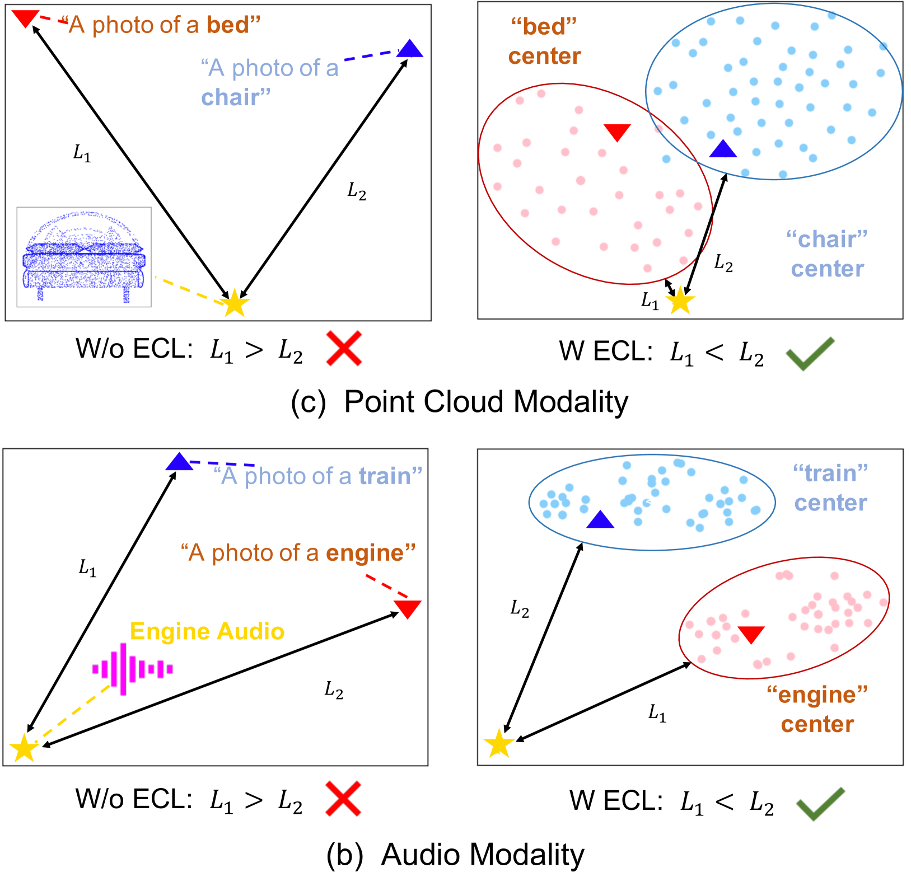

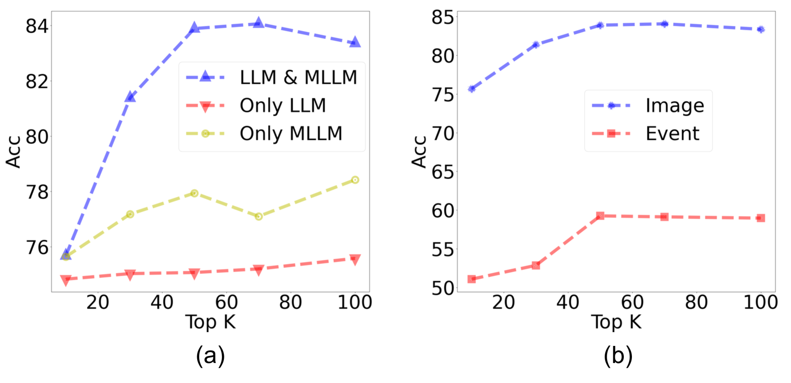

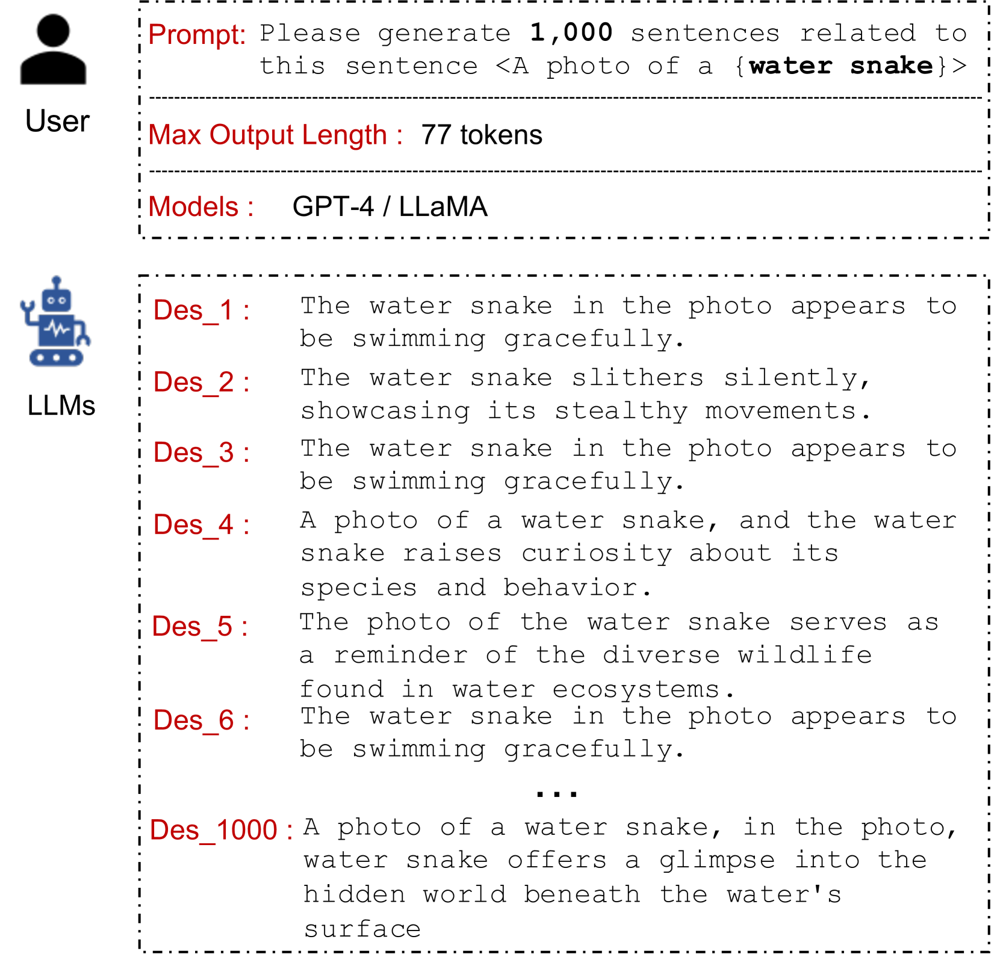

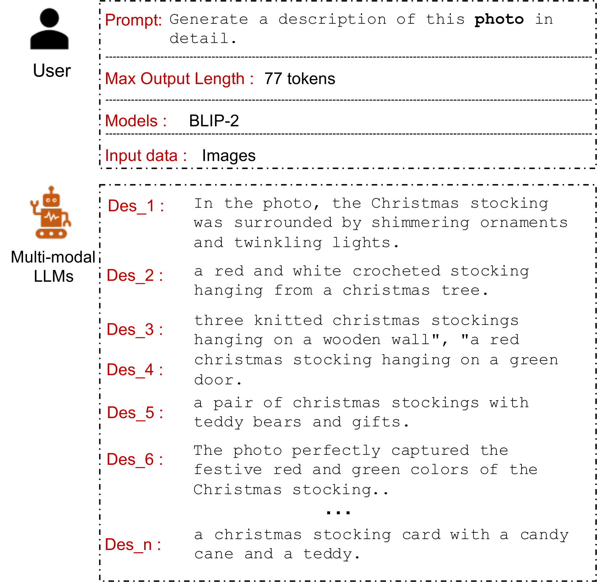

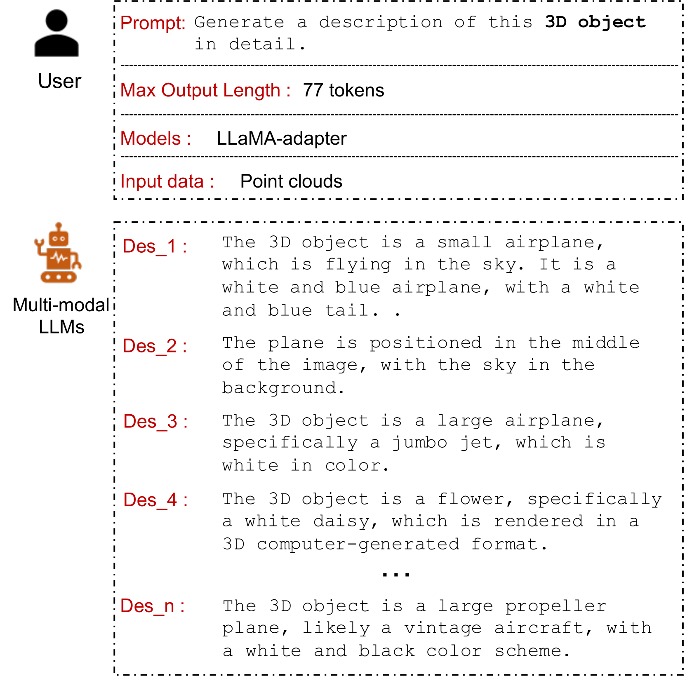

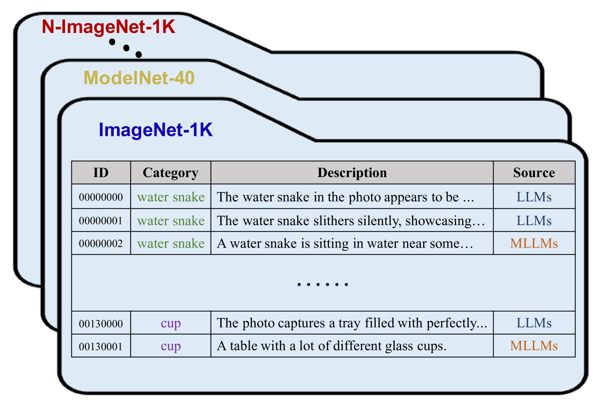

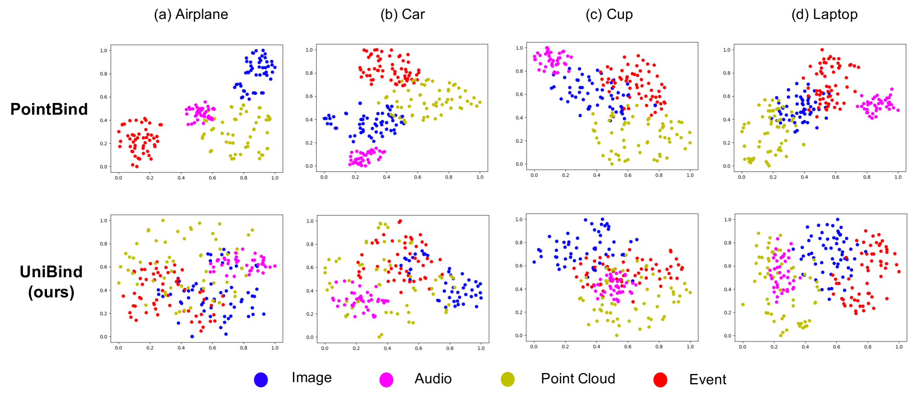

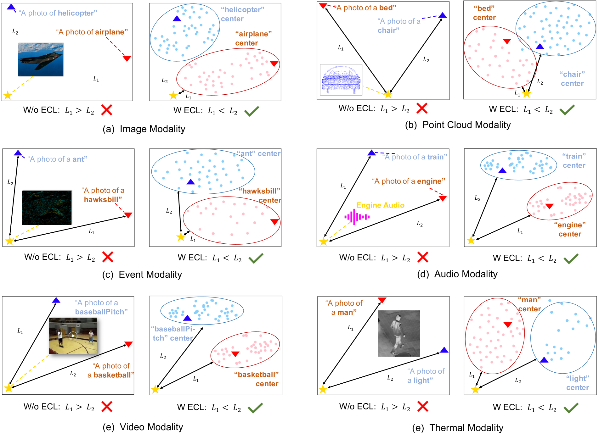

[Arxiv](https://arxiv.org/abs/2403.12532)