# VL-ICL Bench：深入探究多模态 In-Context 学习基准测试中的关键细节，犹如揭示隐藏在其中的“魔鬼”。

发布时间：2024年03月19日

`LLM应用` `多模态` `人工智能`

> VL-ICL Bench: The Devil in the Details of Benchmarking Multimodal In-Context Learning

> LLMs因其出色的ICL能力而备受瞩目，能够在无需调整模型参数的情况下，仅凭借少量样例提示就能迅速适应新任务。在此基础上发展的VLLMs在诸如识别、推理和情境关联等方面取得了显著进步。然而，当前对多模态ICL的研究重心主要放在了少样本视觉问答和图像描述等任务上，我们将会证明这些研究并未充分利用ICL的优点，也未充分探究其局限性。关于多模态ICL的全面能力与局限性的探讨尚显不足。为此，本研究推出了一项综合性的VL-ICL Bench基准，覆盖了一系列包含图像和文本输入输出的多元化任务，以及从感知至推理、乃至处理长上下文等各种挑战场景。我们以此基准检验了最前沿的VLLMs的各项能力，揭示了它们各具特色的优势与短板，并指出即使是像GPT-4这样的尖端模型也会觉得这些任务颇具挑战。通过呈现一系列新颖的ICL任务实例以及现有模型的优势与局限分析，我们期待这份数据集能激发更多关于提升VLLMs上下文学习能力的研究，并启发开发出更多运用VLLM ICL技术的新应用。相关代码和数据集已发布于https://github.com/ys-zong/VL-ICL。

> Large language models (LLMs) famously exhibit emergent in-context learning (ICL) -- the ability to rapidly adapt to new tasks using few-shot examples provided as a prompt, without updating the model's weights. Built on top of LLMs, vision large language models (VLLMs) have advanced significantly in areas such as recognition, reasoning, and grounding. However, investigations into \emph{multimodal ICL} have predominantly focused on few-shot visual question answering (VQA), and image captioning, which we will show neither exploit the strengths of ICL, nor test its limitations. The broader capabilities and limitations of multimodal ICL remain under-explored. In this study, we introduce a comprehensive benchmark VL-ICL Bench for multimodal in-context learning, encompassing a broad spectrum of tasks that involve both images and text as inputs and outputs, and different types of challenges, from {perception to reasoning and long context length}. We evaluate the abilities of state-of-the-art VLLMs against this benchmark suite, revealing their diverse strengths and weaknesses, and showing that even the most advanced models, such as GPT-4, find the tasks challenging. By highlighting a range of new ICL tasks, and the associated strengths and limitations of existing models, we hope that our dataset will inspire future work on enhancing the in-context learning capabilities of VLLMs, as well as inspire new applications that leverage VLLM ICL. The code and dataset are available at https://github.com/ys-zong/VL-ICL.

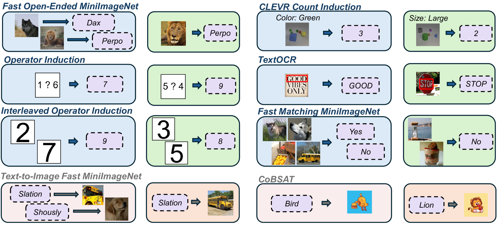

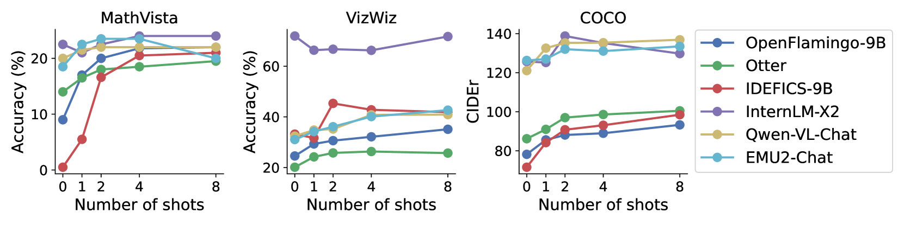

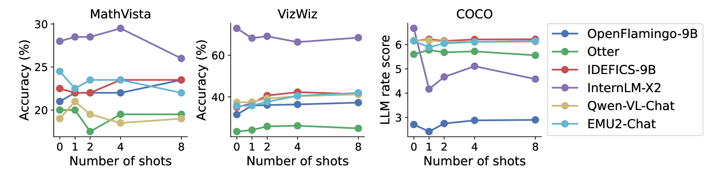

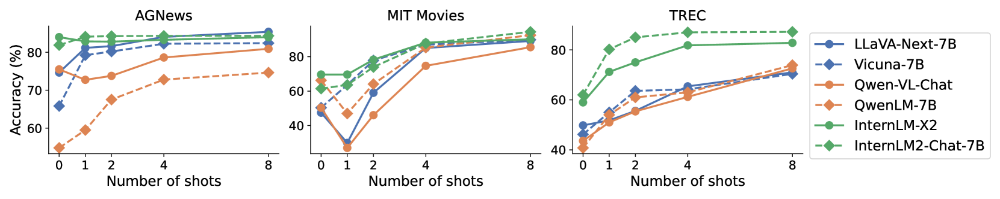

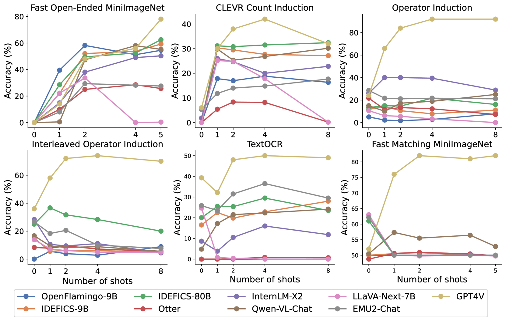

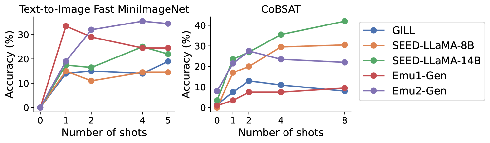

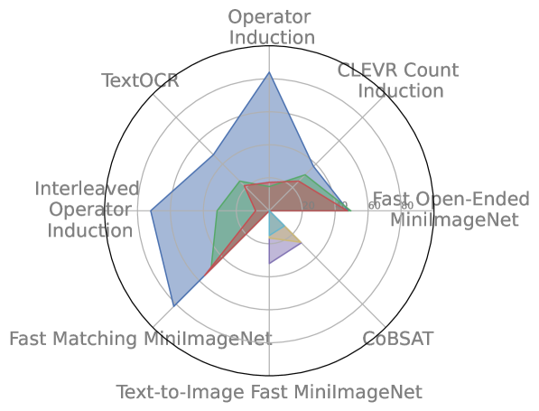

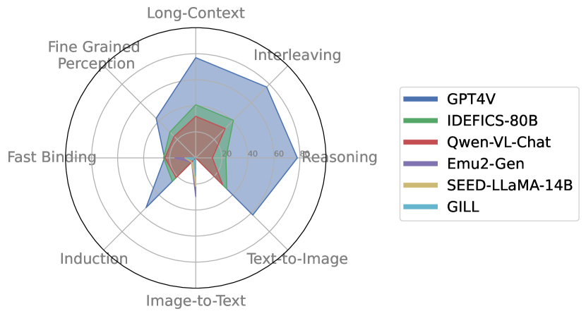

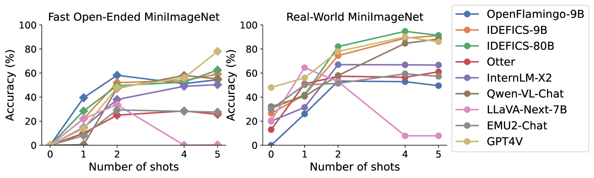

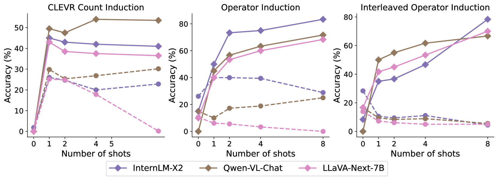

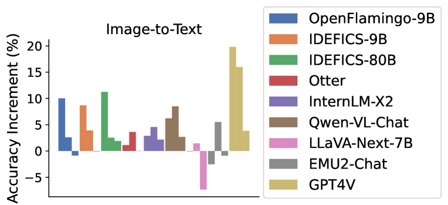

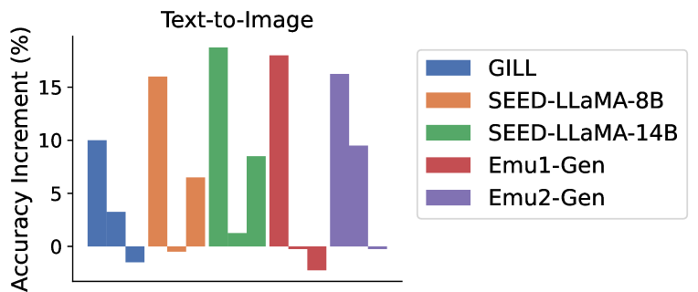

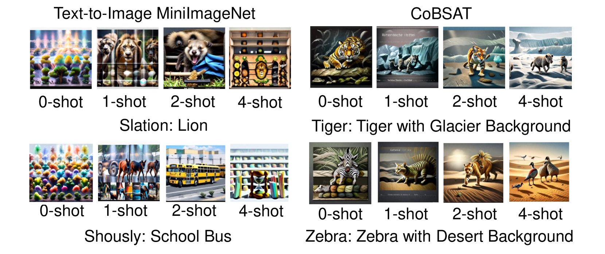

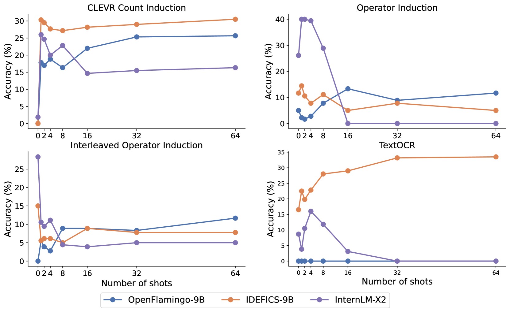

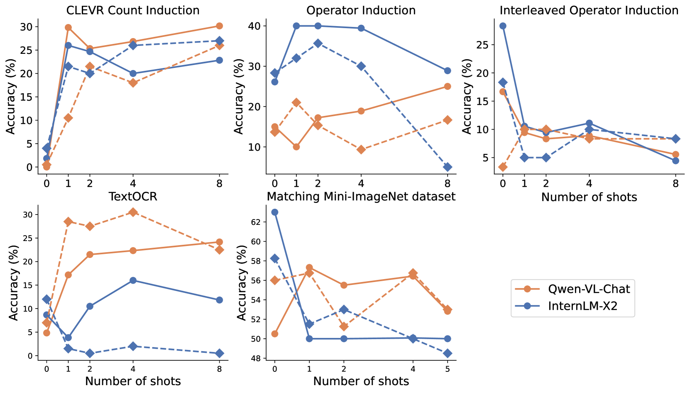

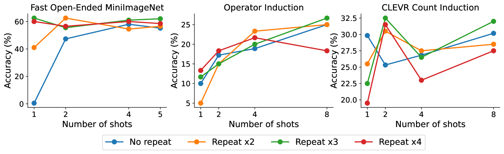

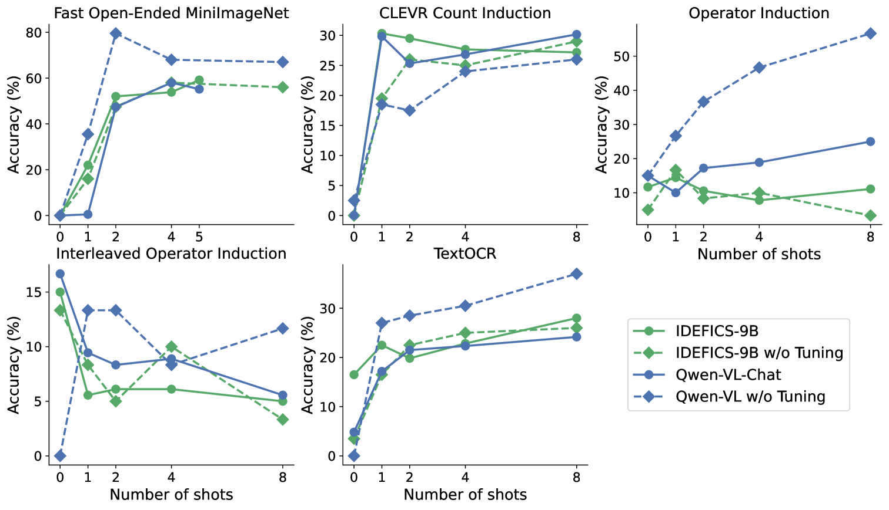

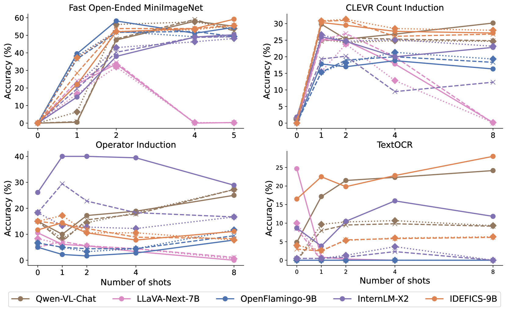

[Arxiv](https://arxiv.org/abs/2403.13164)