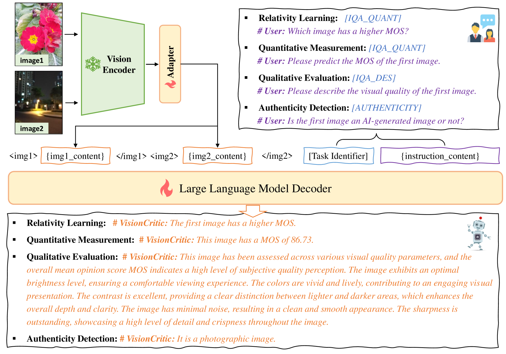
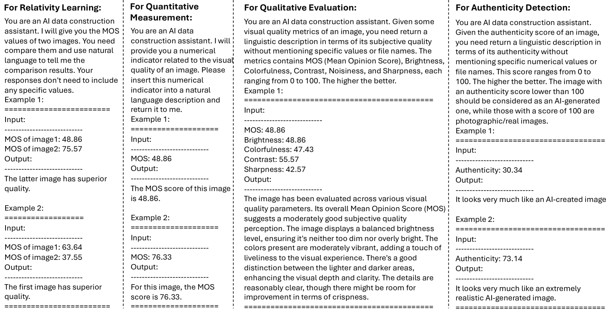
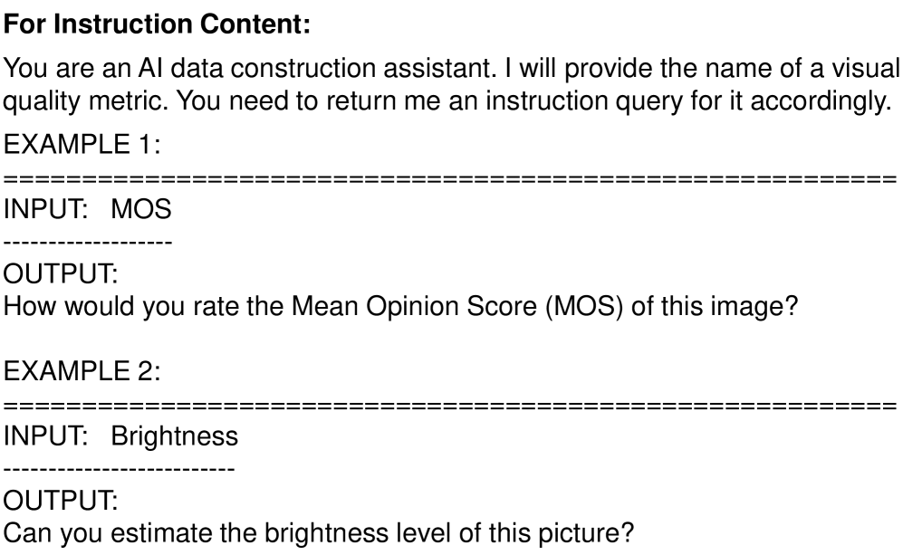
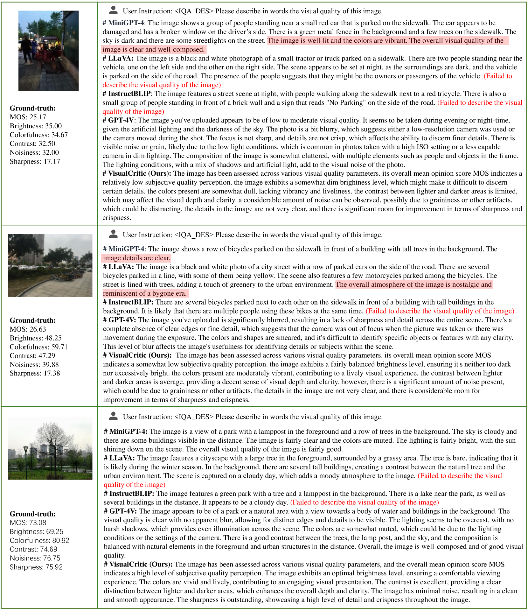
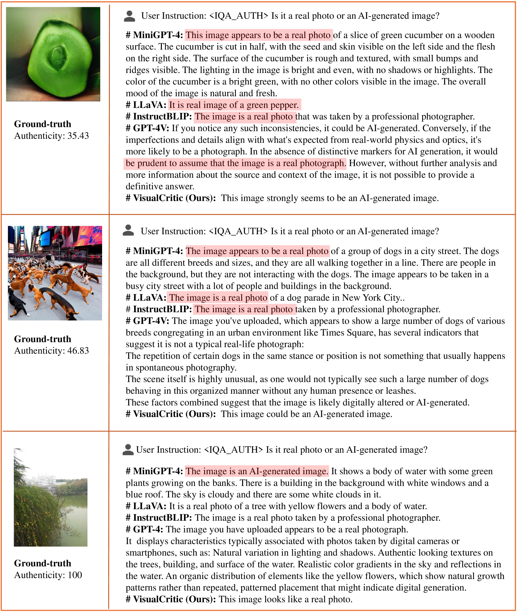
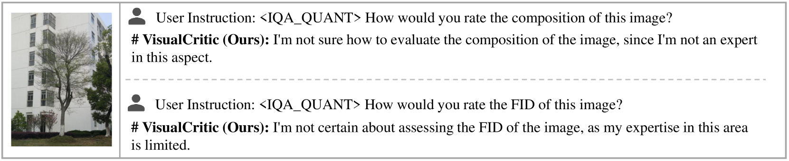

# VisualCritic——助力 LMMs 仿照人类精准判断视觉品质

发布时间：2024年03月19日

`LLM应用` `计算机视觉` `图像质量评估`

> VisualCritic: Making LMMs Perceive Visual Quality Like Humans

> 现今，LMMs 在理解与生成视觉信息时展现了卓越的普适性，但对类似人类感知的低级视觉质量识别仍显不足。那么，LMMs 能否在此方面实现突破，达到同样高水平的普适性呢？答案是肯定的！本研究首次推出了 VisualCritic——一款全能型的 LMM，专门用于各类图像主观质量评估。无需针对特定数据集调整，VisualCritic 即刻便能驾驭各类数据，展现前所未有的灵活性。作为一款遵循指令的 LMM，VisualCritic 具备三大创新功能：(1) 量化计算图像的感知质量，包括 MOS 分数、噪声程度、色彩鲜艳度、锐利度等具体指标；(2) 对视觉质量进行定性评价并给出易于理解的描述；(3) 精准区分图像来源，判断其为 AI 生成还是真实照片。通过大规模实验对比，VisualCritic 在处理 AI 生成及真实照片时均显示出显著优势，有效验证了其效能。

> At present, large multimodal models (LMMs) have exhibited impressive generalization capabilities in understanding and generating visual signals. However, they currently still lack sufficient capability to perceive low-level visual quality akin to human perception. Can LMMs achieve this and show the same degree of generalization in this regard? If so, not only could the versatility of LMMs be further enhanced, but also the challenge of poor cross-dataset performance in the field of visual quality assessment could be addressed. In this paper, we explore this question and provide the answer "Yes!". As the result of this initial exploration, we present VisualCritic, the first LMM for broad-spectrum image subjective quality assessment. VisualCritic can be used across diverse data right out of box, without any requirements of dataset-specific adaptation operations like conventional specialist models. As an instruction-following LMM, VisualCritic enables new capabilities of (1) quantitatively measuring the perceptual quality of given images in terms of their Mean Opinion Score (MOS), noisiness, colorfulness, sharpness, and other numerical indicators, (2) qualitatively evaluating visual quality and providing explainable descriptions, (3) discerning whether a given image is AI-generated or photographic. Extensive experiments demonstrate the efficacy of VisualCritic by comparing it with other open-source LMMs and conventional specialist models over both AI-generated and photographic images.

[Arxiv](https://arxiv.org/abs/2403.12806)