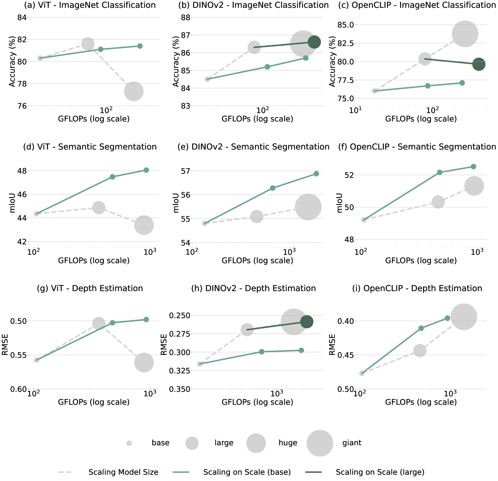
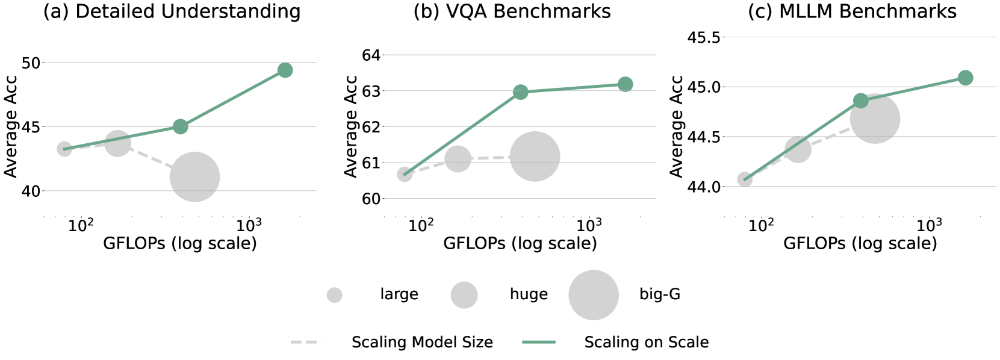
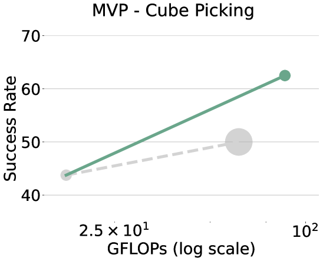
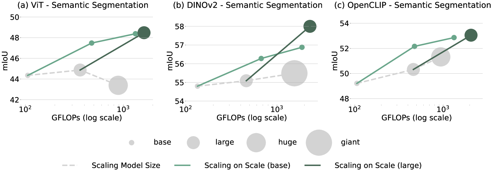
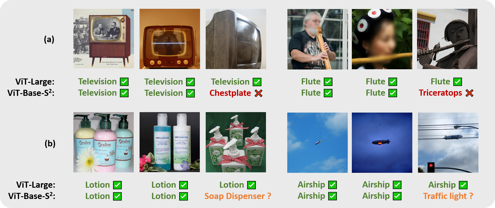
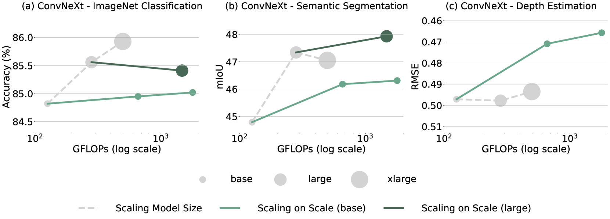
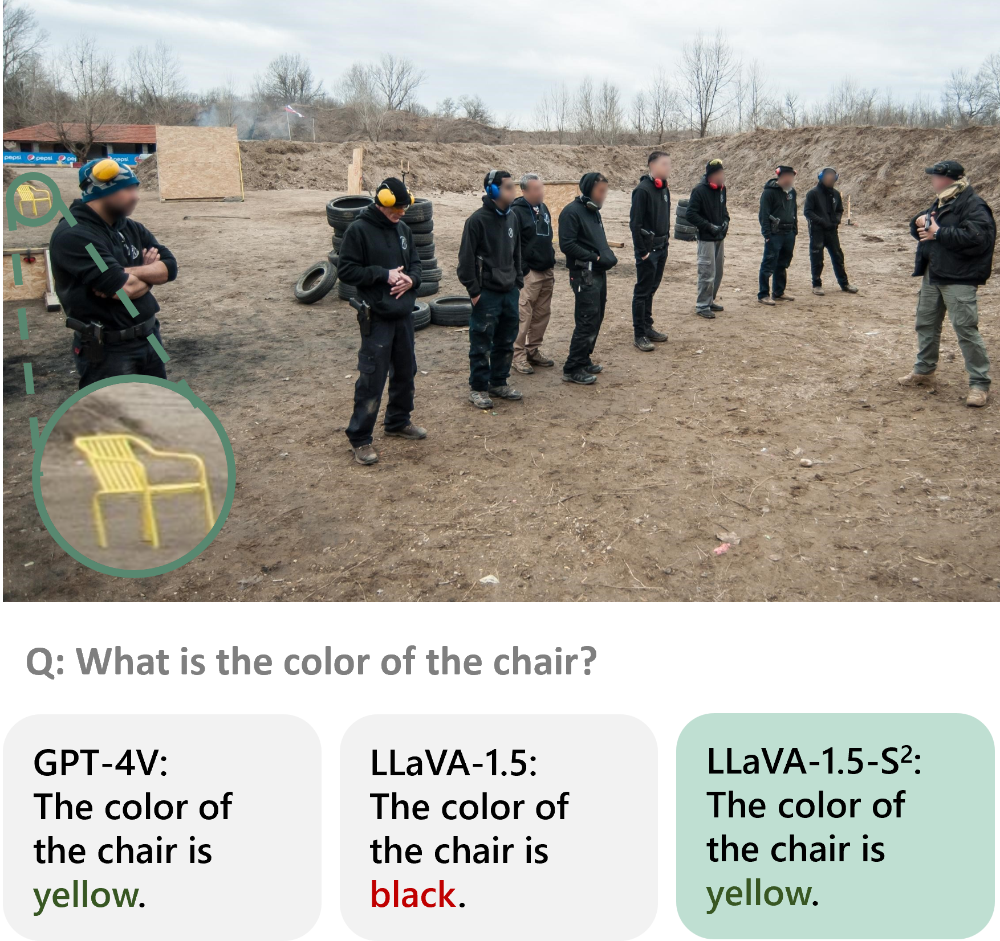
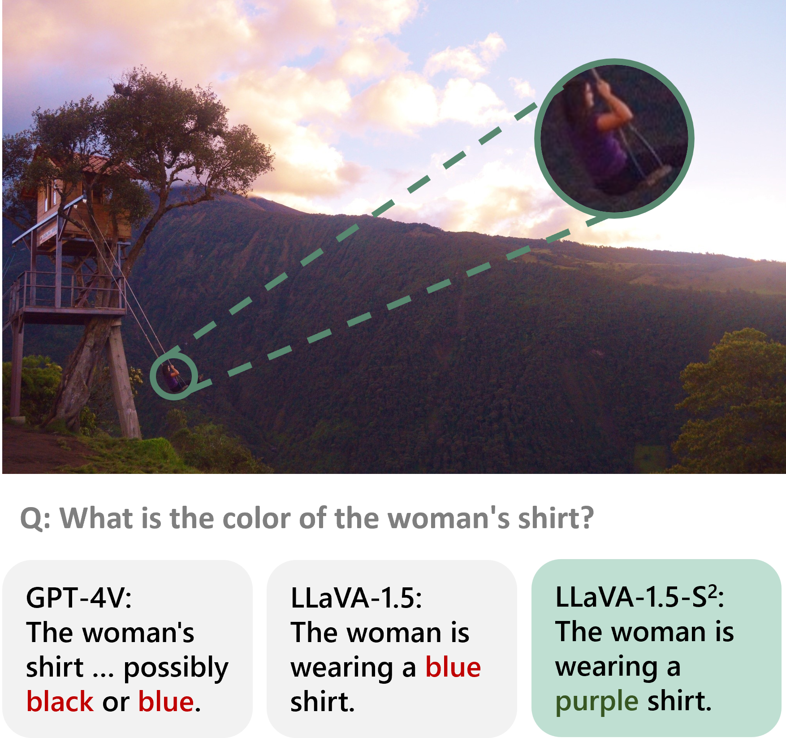

# 在哪些情况下，我们无需继续增大视觉模型呢？

发布时间：2024年03月19日

`Agent` `计算机视觉` `模型优化`

> When Do We Not Need Larger Vision Models?

# 摘要

> 在视觉模型领域，提升模型大小历来是增强视觉表征能力的主要途径。然而，本文聚焦于探究何时继续增大模型规模并非必要。实验中，我们提出了一种名为“尺度上的扩展”（S$^2$）的方法，通过预先训练并冻结的小型视觉模型（例如ViT-B或ViT-L），在不同图像尺度下运行，其性能竟能超越更大规模的模型（如ViT-H或ViT-G），在各类任务如分类、分割、深度预测、多模态大型语言模型基准测试，甚至是机器人操作上均表现出色。尤为突出的是，S$^2$在V*基准测试中对MLLM精细理解方面的表现达到了新的高度，超越了GPT-4V等同类模型。我们深入探究了在何种条件下，相比于单纯增加模型大小，选择S$^2$作为扩展策略更为优越。尽管大型模型在解决复杂问题时展现出更强的泛化能力，但研究发现，大型视觉模型的特征可以用多尺度小型模型有效模拟。这意味着当前大型预训练模型学到的大部分，乃至所有表示信息，其实也可从小型多尺度模型中得到。研究表明，一个经过精心设计的多尺度小型模型在学习能力上可媲美大型模型，而采用S$^2$预训练小型模型甚至有可能实现与大型模型相匹敌，甚至超越的效果。为此，我们提供了一个Python库，仅需一行代码就能将S$^2$应用于任意视觉模型：https://github.com/bfshi/scaling_on_scales。

> Scaling up the size of vision models has been the de facto standard to obtain more powerful visual representations. In this work, we discuss the point beyond which larger vision models are not necessary. First, we demonstrate the power of Scaling on Scales (S$^2$), whereby a pre-trained and frozen smaller vision model (e.g., ViT-B or ViT-L), run over multiple image scales, can outperform larger models (e.g., ViT-H or ViT-G) on classification, segmentation, depth estimation, Multimodal LLM (MLLM) benchmarks, and robotic manipulation. Notably, S$^2$ achieves state-of-the-art performance in detailed understanding of MLLM on the V* benchmark, surpassing models such as GPT-4V. We examine the conditions under which S$^2$ is a preferred scaling approach compared to scaling on model size. While larger models have the advantage of better generalization on hard examples, we show that features of larger vision models can be well approximated by those of multi-scale smaller models. This suggests most, if not all, of the representations learned by current large pre-trained models can also be obtained from multi-scale smaller models. Our results show that a multi-scale smaller model has comparable learning capacity to a larger model, and pre-training smaller models with S$^2$ can match or even exceed the advantage of larger models. We release a Python package that can apply S$^2$ on any vision model with one line of code: https://github.com/bfshi/scaling_on_scales.

[Arxiv](https://arxiv.org/abs/2403.13043)