# mPLUG-DocOwl 1.5 是一款集成了统一结构学习技术的工具，用于实现无需依赖光学字符识别（OCR）的高效文档理解。

发布时间：2024年03月19日

`Agent` `文档理解` `计算机视觉`

> mPLUG-DocOwl 1.5: Unified Structure Learning for OCR-free Document Understanding

> 结构信息是解读文本密集型图像（如文档、表格和图表）的关键。现有针对视觉文档理解的多模态大模型虽然能识文断字，却普遍缺乏对这类富文本文档图像整体结构的理解能力。为此，我们在本研究中提出“统一结构学习”这一概念，以强化MLLMs在此类任务上的表现。该方法包括跨五个领域（文档、网页、表格、图表及自然图像）的结构感知解析任务和多层次文本定位任务。为了更好地捕捉结构信息，我们创新设计了一款名为H-Reducer的简洁高效的视觉转文本模块，它既保留了布局信息，又能通过卷积将水平相邻图像块融合，有效缩短视觉特征长度，使得LLM能够更高效地处理高分辨率图像。同时，我们还构建了一个全面的训练集DocStruct4M，其中包含了具有结构感知文本序列和不同粒度文本与边框配对的公开文本丰富图像资源，用以支持结构学习。进一步地，我们精心编制了一个规模虽小但质量上乘的推理微调数据集DocReason25K，以激发文档领域的精细化解释能力。最终，我们的DocOwl 1.5模型在十个视觉文档理解基准测试中均取得了最新成果，相较于基于70亿参数LLM的MLLMs，在其中五个基准测试上提升了超过10个百分点的SOTA性能。所有代码、模型和数据集已开放至https://github.com/X-PLUG/mPLUG-DocOwl/tree/main/DocOwl1.5供公众获取。

> Structure information is critical for understanding the semantics of text-rich images, such as documents, tables, and charts. Existing Multimodal Large Language Models (MLLMs) for Visual Document Understanding are equipped with text recognition ability but lack general structure understanding abilities for text-rich document images. In this work, we emphasize the importance of structure information in Visual Document Understanding and propose the Unified Structure Learning to boost the performance of MLLMs. Our Unified Structure Learning comprises structure-aware parsing tasks and multi-grained text localization tasks across 5 domains: document, webpage, table, chart, and natural image. To better encode structure information, we design a simple and effective vision-to-text module H-Reducer, which can not only maintain the layout information but also reduce the length of visual features by merging horizontal adjacent patches through convolution, enabling the LLM to understand high-resolution images more efficiently. Furthermore, by constructing structure-aware text sequences and multi-grained pairs of texts and bounding boxes for publicly available text-rich images, we build a comprehensive training set DocStruct4M to support structure learning. Finally, we construct a small but high-quality reasoning tuning dataset DocReason25K to trigger the detailed explanation ability in the document domain. Our model DocOwl 1.5 achieves state-of-the-art performance on 10 visual document understanding benchmarks, improving the SOTA performance of MLLMs with a 7B LLM by more than 10 points in 5/10 benchmarks. Our codes, models, and datasets are publicly available at https://github.com/X-PLUG/mPLUG-DocOwl/tree/main/DocOwl1.5.

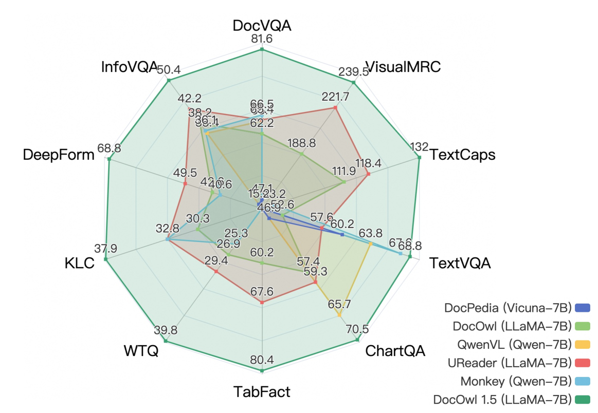

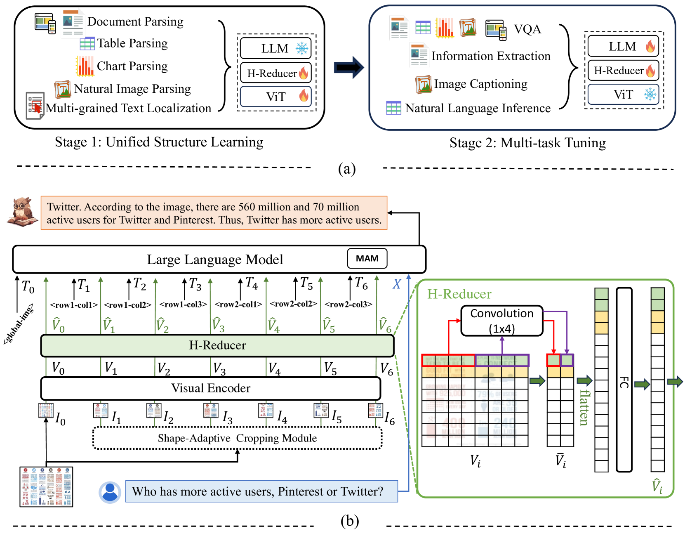

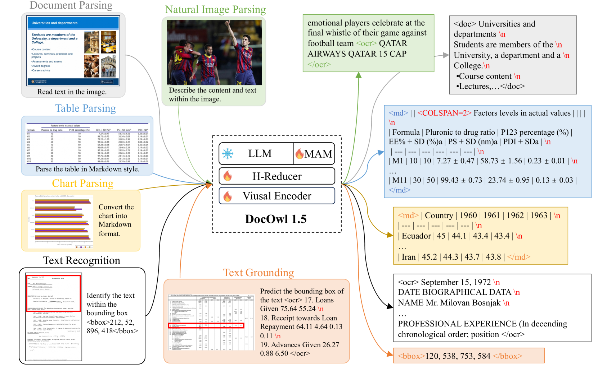

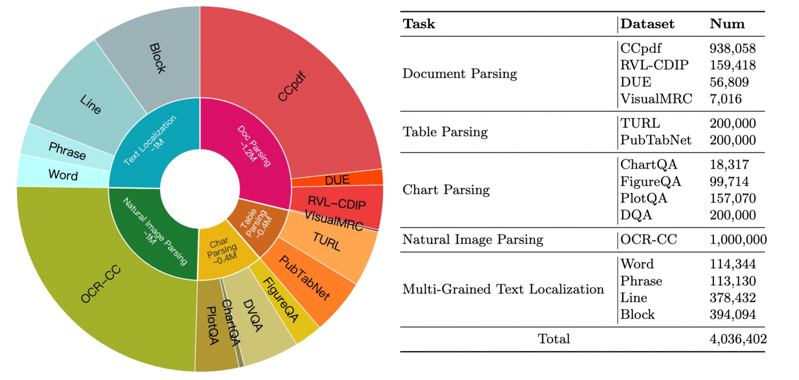

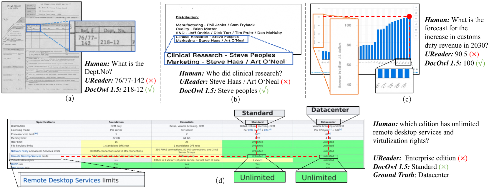

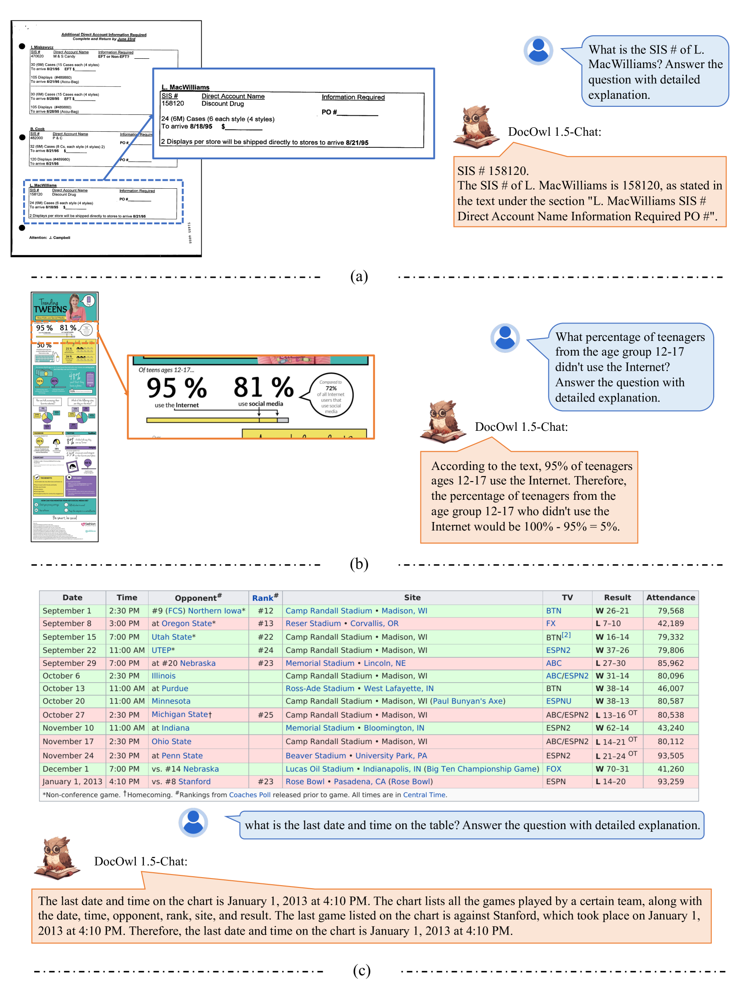

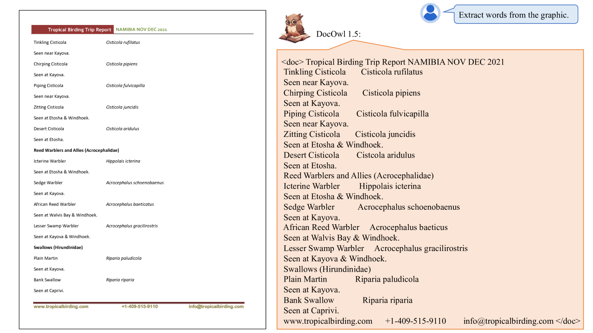

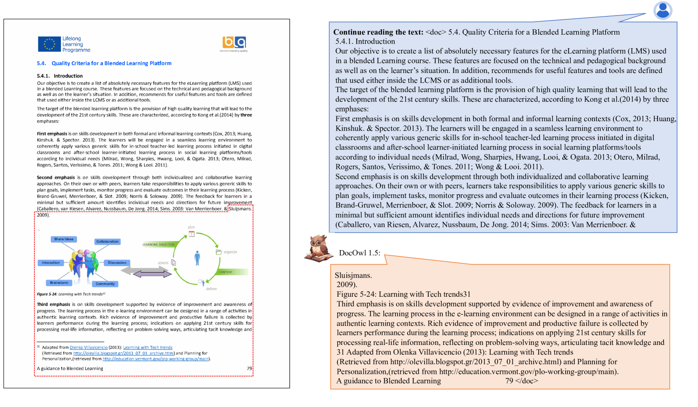

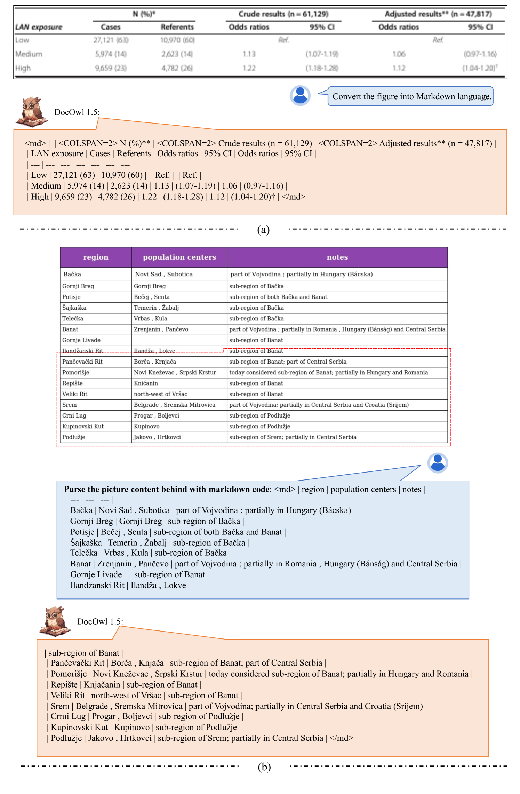

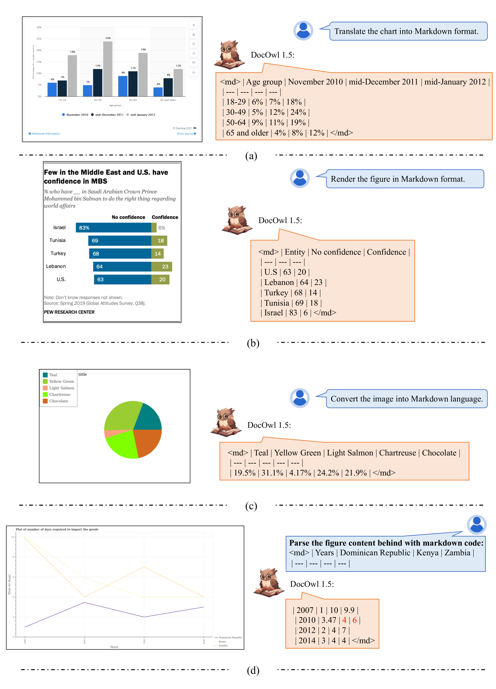

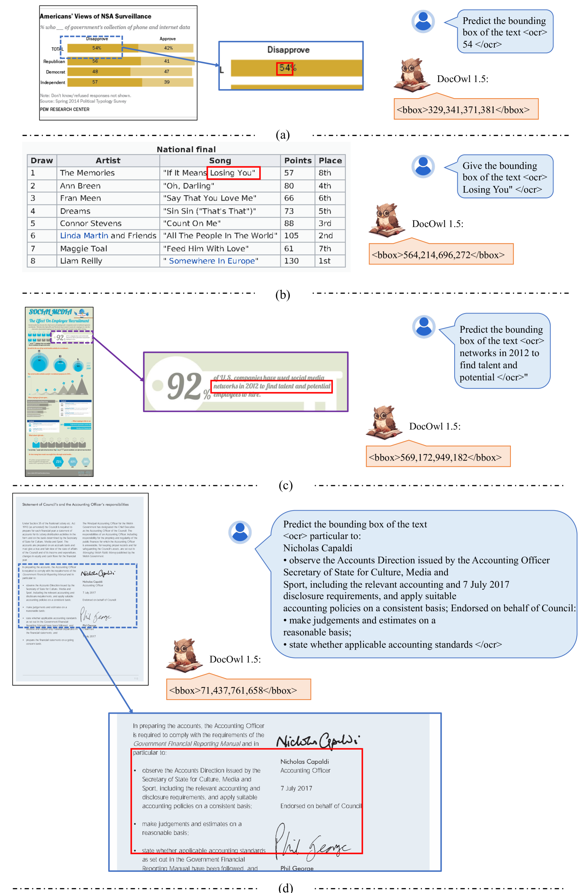

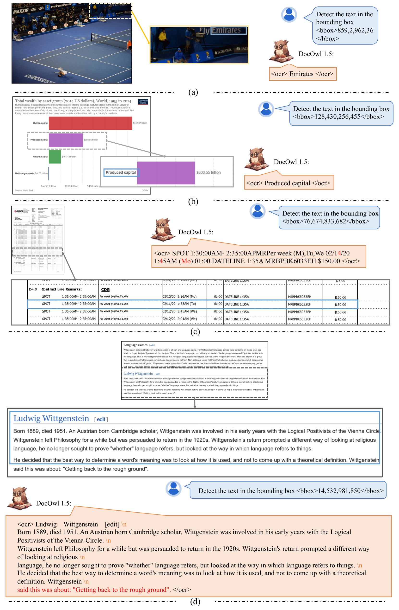

[Arxiv](https://arxiv.org/abs/2403.12895)