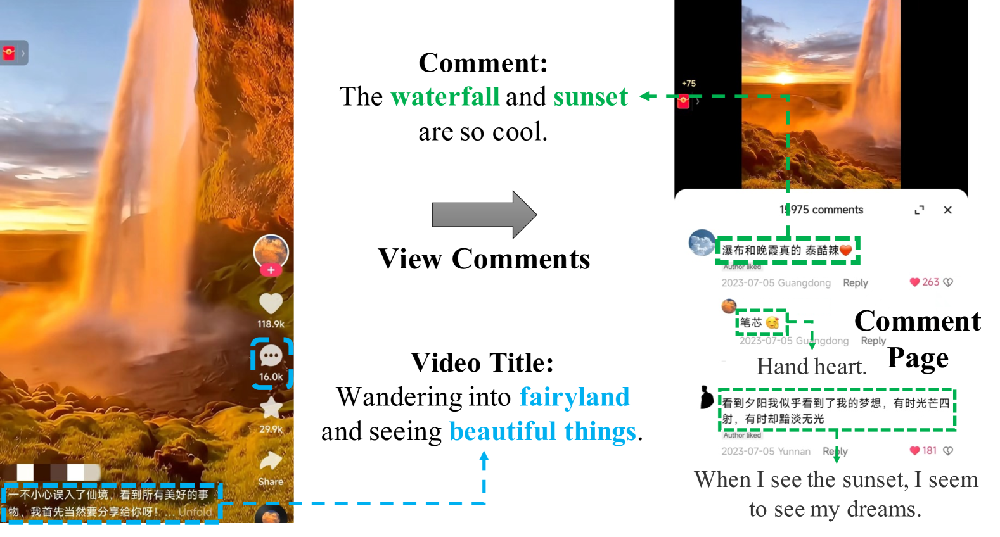
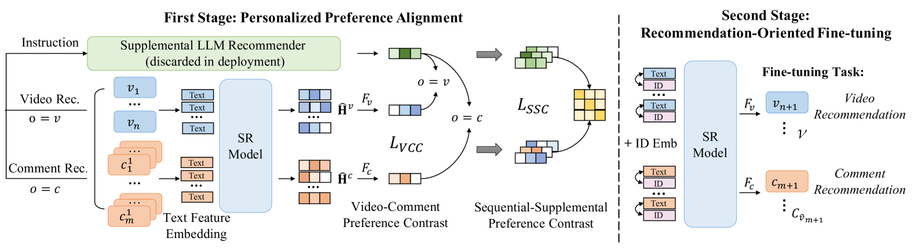
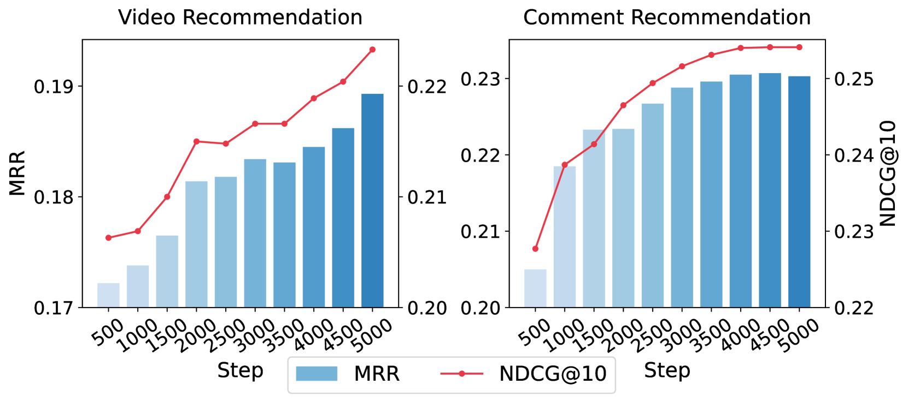
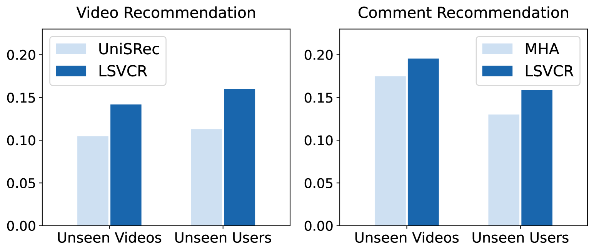

# 我们提出了一种利用大型语言模型强化的序列推荐系统，旨在实现视频与评论的同时精准推荐。

发布时间：2024年03月20日

`LLM应用` `在线视频` `推荐系统`

> A Large Language Model Enhanced Sequential Recommender for Joint Video and Comment Recommendation

# 摘要

> 如今，在线视频平台上，围绕热门视频的评论互动已成为观影体验的重要组成部分。然而，现行的视频推荐系统主要聚焦于用户与视频间的互动行为建模，却忽视了评论的影响。为此，本文创新性地提出了一种联合进行个性化视频及评论推荐的新方法——LSVCR，它充分利用用户与视频和评论的互动历史数据。该方法由两大核心组件构成：一是作为基础推荐骨架并保留在部署状态的序列推荐（SR）模型，它高效捕捉用户的个性化偏好；二是仅在训练阶段起辅助作用、能深入挖掘用户多样交互行为背后隐含偏好的大型语言模型（LLM）推荐器。为融合两者优势，我们设计了一套双阶段训练策略：首先是个性化偏好对齐阶段，目的是协调两种模型所生成的偏好表达，从而丰富SR模型的语义理解能力；其次是面向推荐优化的微调阶段，此时已得到增强的SR模型会根据特定目标进一步调整优化。大量实验证明了LSVCR在视频和评论推荐任务上的卓越效果，并且在快手平台的线上A/B测试中，我们成功实现了整体评论观看时间4.13%的显著增长。

> In online video platforms, reading or writing comments on interesting videos has become an essential part of the video watching experience. However, existing video recommender systems mainly model users' interaction behaviors with videos, lacking consideration of comments in user behavior modeling. In this paper, we propose a novel recommendation approach called LSVCR by leveraging user interaction histories with both videos and comments, so as to jointly conduct personalized video and comment recommendation. Specifically, our approach consists of two key components, namely sequential recommendation (SR) model and supplemental large language model (LLM) recommender. The SR model serves as the primary recommendation backbone (retained in deployment) of our approach, allowing for efficient user preference modeling. Meanwhile, we leverage the LLM recommender as a supplemental component (discarded in deployment) to better capture underlying user preferences from heterogeneous interaction behaviors. In order to integrate the merits of the SR model and the supplemental LLM recommender, we design a twostage training paradigm. The first stage is personalized preference alignment, which aims to align the preference representations from both components, thereby enhancing the semantics of the SR model. The second stage is recommendation-oriented fine-tuning, in which the alignment-enhanced SR model is fine-tuned according to specific objectives. Extensive experiments in both video and comment recommendation tasks demonstrate the effectiveness of LSVCR. Additionally, online A/B testing on the KuaiShou platform verifies the actual benefits brought by our approach. In particular, we achieve a significant overall gain of 4.13% in comment watch time.

[Arxiv](https://arxiv.org/abs/2403.13574)