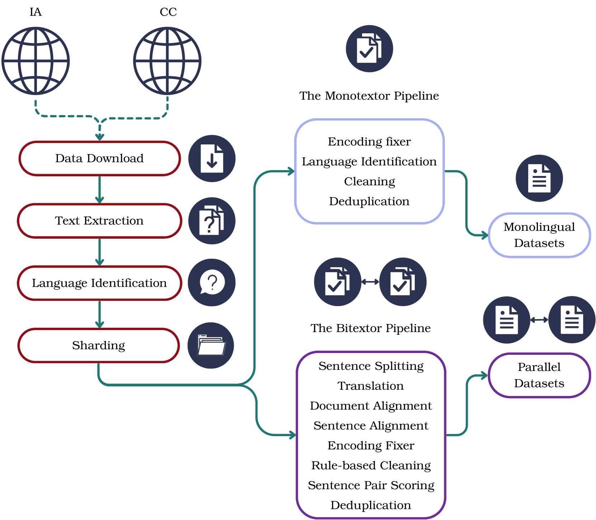
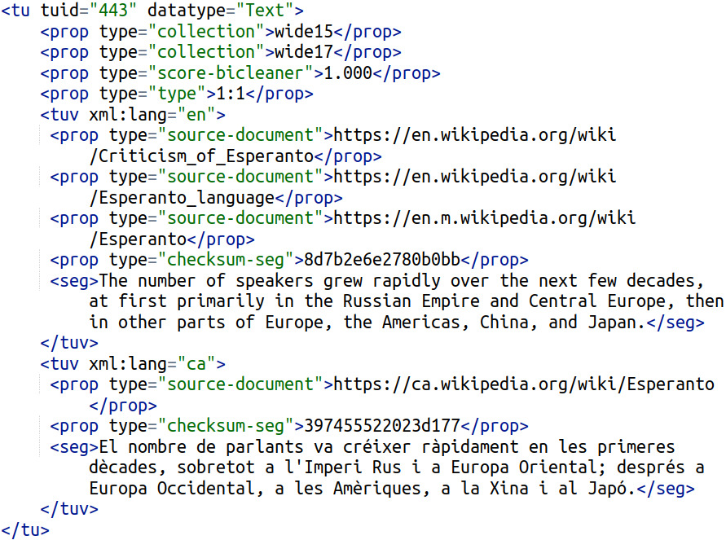
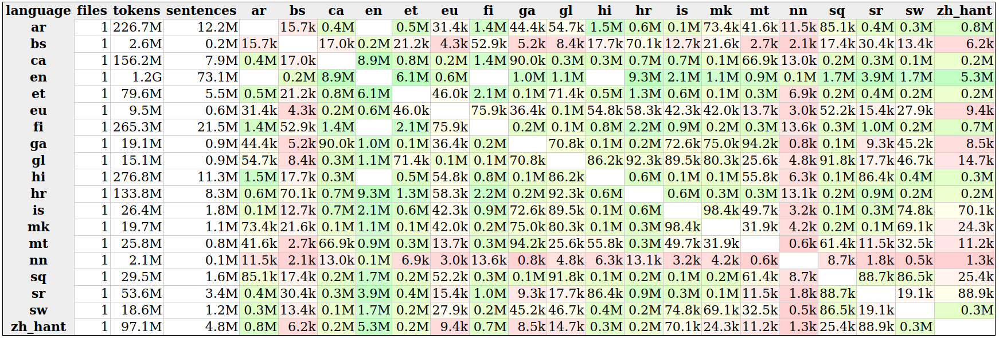
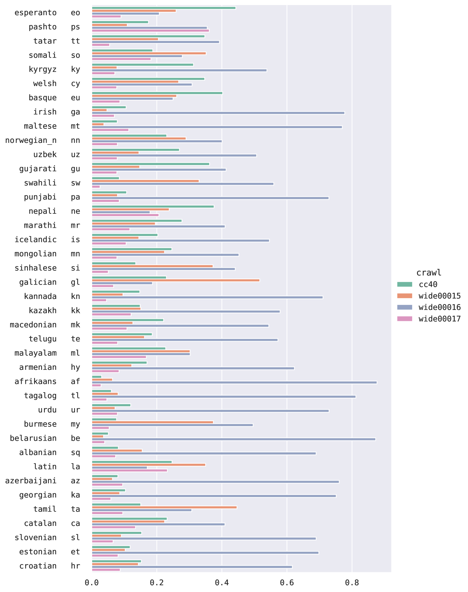
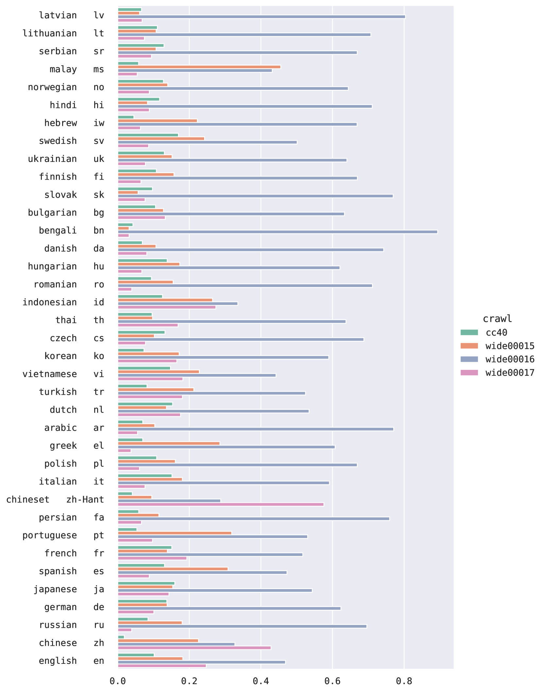

# 我们推出了一项新的大型多语种数据集，旨在赋能和提升高性能语言技术的表现。

发布时间：2024年03月20日

`LLM应用` `机器翻译`

> A New Massive Multilingual Dataset for High-Performance Language Technologies

> 我们推出了 HPLT 语言资源，这一创新的大规模多语种数据集囊括了源自 CommonCrawl 及互联网档案馆未曾利用过的网络爬取数据中的单语和双语文档。我们借助开源工具和高性能计算技术，详述了收集、管理和处理海量语料库的方法。该单语集合特别关注资源较少至中等的语言，涵盖75种语言，经文档级去重后拥有约5.6万亿个词元。而构建自单语集合的以英语为核心的平行语料库，则包含了18种语言对，以及超过9600万对精确对齐的句子对，其中大约含有14亿个英语词元。HPLT 语言资源是迄今为止公开发布的最大规模文本语料库之一，为语言模型训练和机器翻译研究提供了宝贵的资源。目前，我们已将相关的语料库、软件及工具全部公之于众。

> We present the HPLT (High Performance Language Technologies) language resources, a new massive multilingual dataset including both monolingual and bilingual corpora extracted from CommonCrawl and previously unused web crawls from the Internet Archive. We describe our methods for data acquisition, management and processing of large corpora, which rely on open-source software tools and high-performance computing. Our monolingual collection focuses on low- to medium-resourced languages and covers 75 languages and a total of ~5.6 trillion word tokens de-duplicated on the document level. Our English-centric parallel corpus is derived from its monolingual counterpart and covers 18 language pairs and more than 96 million aligned sentence pairs with roughly 1.4 billion English tokens. The HPLT language resources are one of the largest open text corpora ever released, providing a great resource for language modeling and machine translation training. We publicly release the corpora, the software, and the tools used in this work.

[Arxiv](https://arxiv.org/abs/2403.14009)