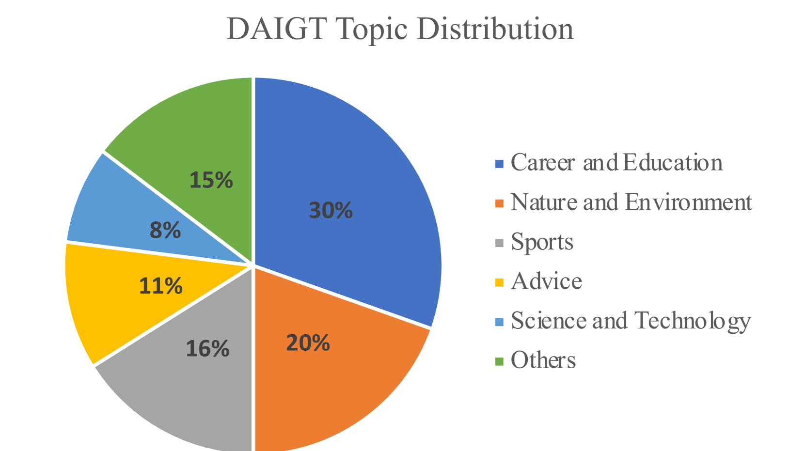
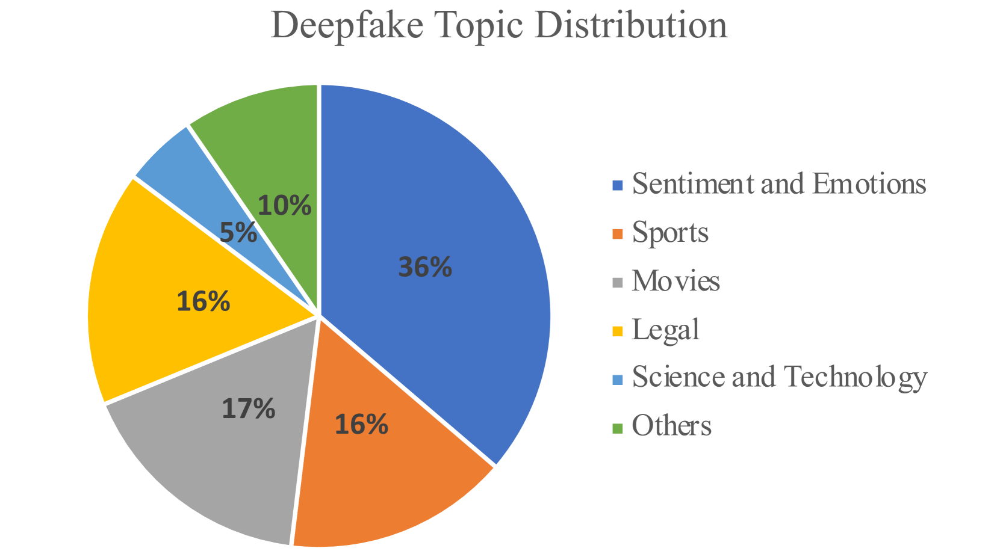
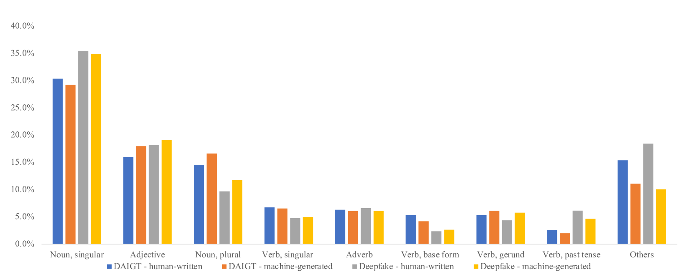
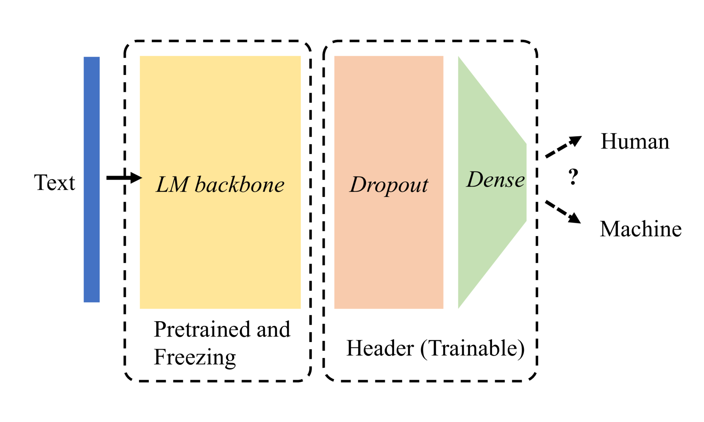
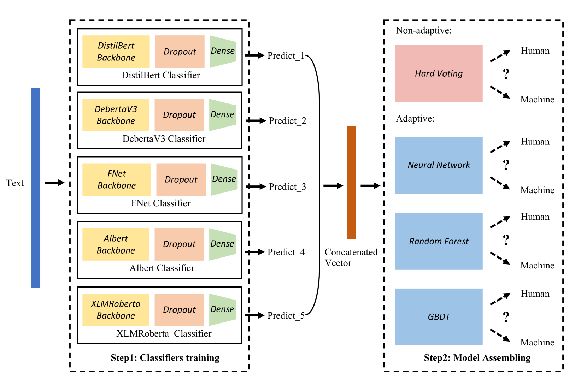
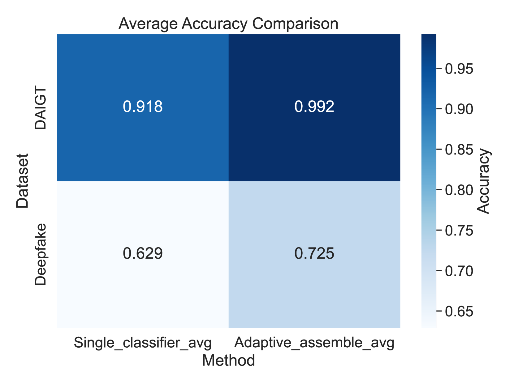

# 针对LLM生成文本检测任务，我们提出采用自适应微调的Transformer集合方法。该技术专为识别由大型语言模型（LLM）生成的文本而设计，通过动态整合多个微调后的Transformer模型，以提升检测准确性和鲁棒性。

发布时间：2024年03月20日

`LLM应用` `社交媒体` `文本生成检测`

> Adaptive Ensembles of Fine-Tuned Transformers for LLM-Generated Text Detection

> 随着LLMs在生成丰富多样的文本内容时展现出堪比人类的技能，有效鉴别虚假文本以规避社交媒体中假新闻等问题的需求日益凸显。以往研究主要针对单个模型在分布内数据集的测试，并未充分揭示模型在处理不同数据类型下的LLM生成文本检测任务时的表现差异。因此，我们在分布内和分布外数据集上运用五种专门的Transformer架构模型进行实验，以深入探究其性能和泛化能力。实验结果显示，尽管单个Transformer分类器在分布内数据集上表现出色，但在面对分布外数据集时却显得泛化能力不足。为此，我们借助自适应集成算法融合各独立分类器模型，取得了显著成效：分布内测试集的平均准确率从91.8%跃升至99.2%，分布外测试集的准确率也从62.9%提升至72.5%。这一研究成果有力地证明了自适应集成算法在LLM生成文本检测领域的高效性、出色的泛化性能及其广阔的应用前景。

> Large language models (LLMs) have reached human-like proficiency in generating diverse textual content, underscoring the necessity for effective fake text detection to avoid potential risks such as fake news in social media. Previous research has mostly tested single models on in-distribution datasets, limiting our understanding of how these models perform on different types of data for LLM-generated text detection task. We researched this by testing five specialized transformer-based models on both in-distribution and out-of-distribution datasets to better assess their performance and generalizability. Our results revealed that single transformer-based classifiers achieved decent performance on in-distribution dataset but limited generalization ability on out-of-distribution dataset. To improve it, we combined the individual classifiers models using adaptive ensemble algorithms, which improved the average accuracy significantly from 91.8% to 99.2% on an in-distribution test set and from 62.9% to 72.5% on an out-of-distribution test set. The results indicate the effectiveness, good generalization ability, and great potential of adaptive ensemble algorithms in LLM-generated text detection.

[Arxiv](https://arxiv.org/abs/2403.13335)