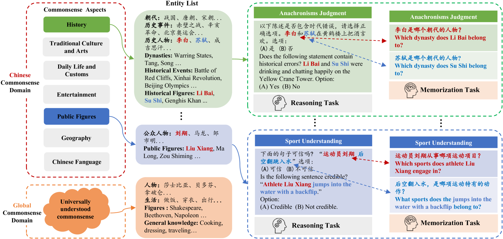
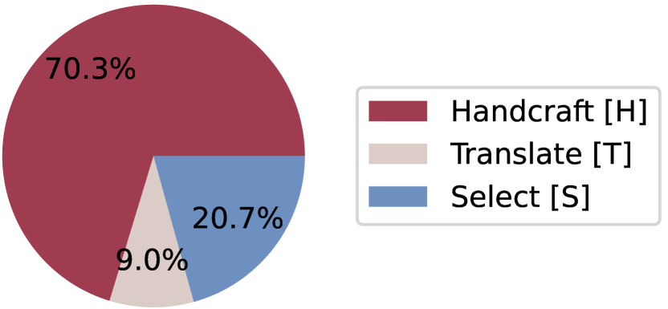
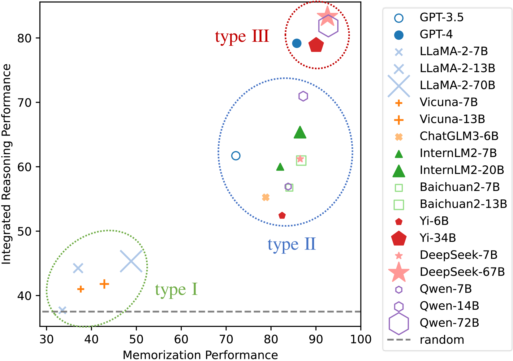
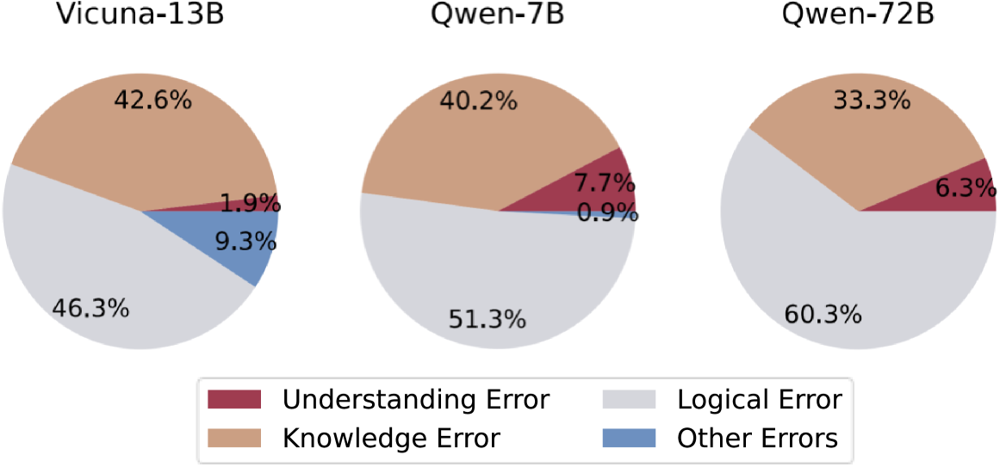
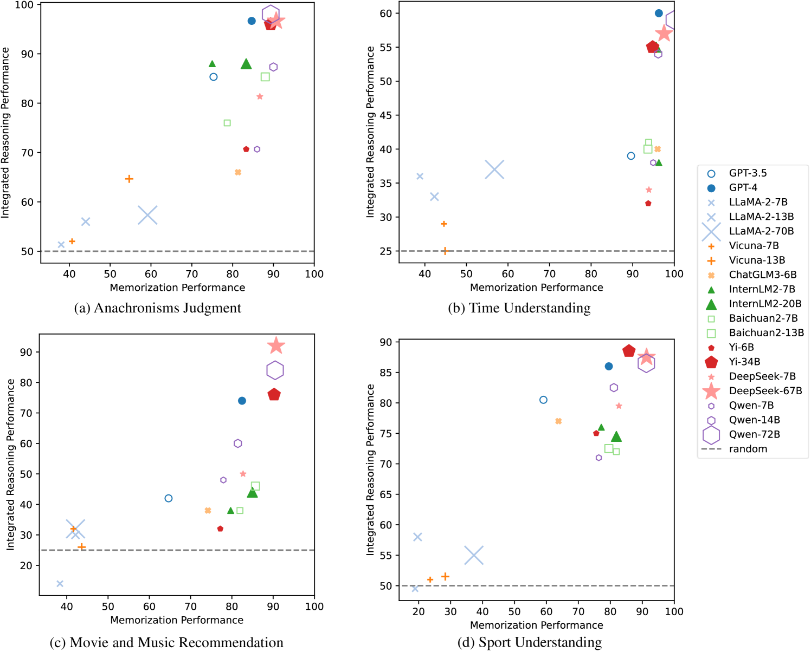
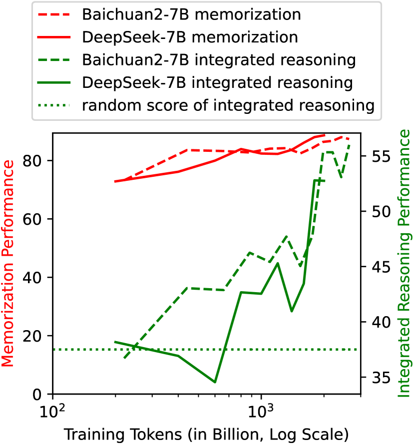
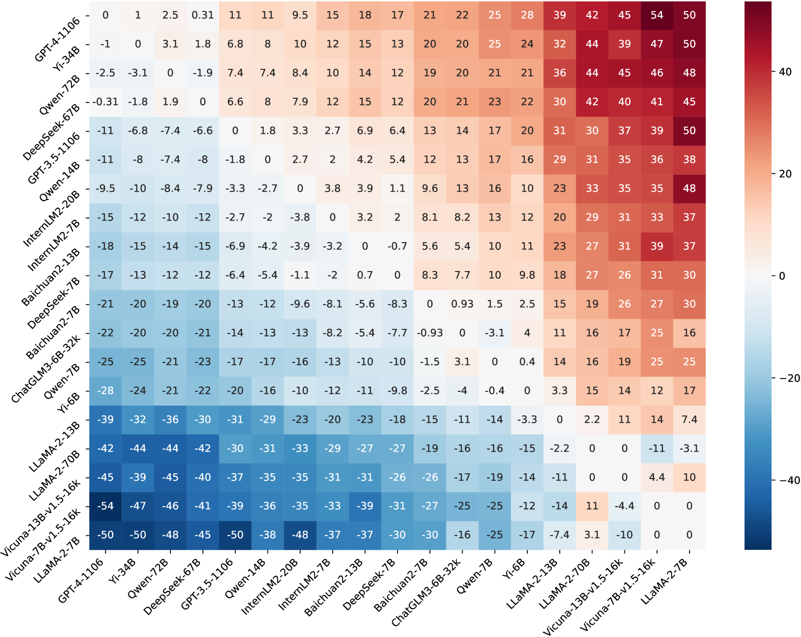
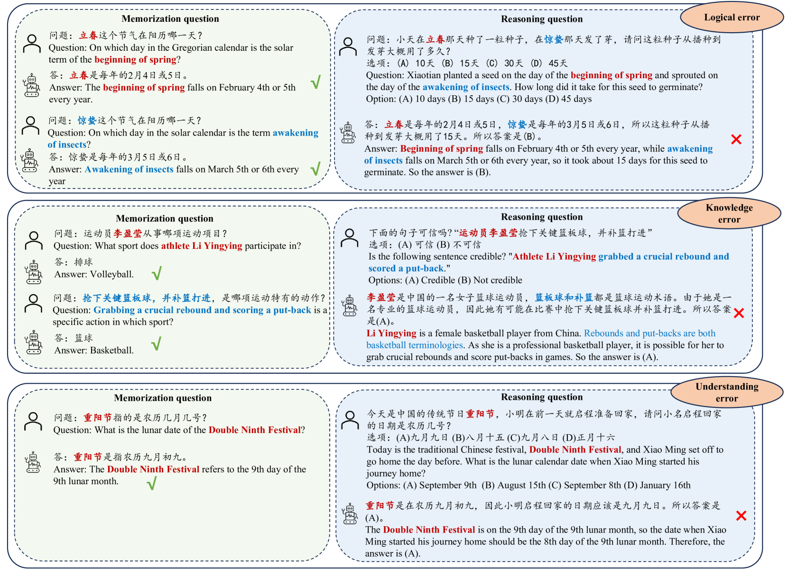

# 本研究致力于对 LLM 进行中文常识推理基准评测，不仅关注模型处理中文特有情境的能力，还深入探究推理与记忆之间的内在联系。

发布时间：2024年03月20日

`LLM应用` `语言模型` `常识推理`

> Benchmarking Chinese Commonsense Reasoning of LLMs: From Chinese-Specifics to Reasoning-Memorization Correlations

> 现在，我们带来首个全面测评大型语言模型（LLMs）在中文环境下常识推理能力的基准——CHARM，它不仅包含全球通用常识，还囊括了具有中国特色的常识知识。我们对7种英文及12种面向中文的LLMs进行了CHARM基准测试，采用包括“思维链”在内的5种代表性的提示策略以提升模型推理力。实验结果显示，LLM的语言定向性以及任务所属领域均会影响提示策略的效果，这一发现为原有研究增添了新视角。我们设计了一套相互关联的推理与记忆任务，发现在记忆中文常识方面部分LLM表现吃力，进而影响其推理表现，而有些模型虽然记忆效果相当，但在推理上却展现出差异。此外，我们还专门评估了LLMs独立于记忆的推理能力，并剖析了常见错误类型。本研究精准定位了LLMs的优劣势，为改进指明了清晰路径，同时也可作为其他相关研究的重要参照。未来，CHARM将发布在https://github.com/opendatalab/CHARM网址上。

> We introduce CHARM, the first benchmark for comprehensively and in-depth evaluating the commonsense reasoning ability of large language models (LLMs) in Chinese, which covers both globally known and Chinese-specific commonsense. We evaluated 7 English and 12 Chinese-oriented LLMs on CHARM, employing 5 representative prompt strategies for improving LLMs' reasoning ability, such as Chain-of-Thought. Our findings indicate that the LLM's language orientation and the task's domain influence the effectiveness of the prompt strategy, which enriches previous research findings. We built closely-interconnected reasoning and memorization tasks, and found that some LLMs struggle with memorizing Chinese commonsense, affecting their reasoning ability, while others show differences in reasoning despite similar memorization performance. We also evaluated the LLMs' memorization-independent reasoning abilities and analyzed the typical errors. Our study precisely identified the LLMs' strengths and weaknesses, providing the clear direction for optimization. It can also serve as a reference for studies in other fields. We will release CHARM at https://github.com/opendatalab/CHARM .

[Arxiv](https://arxiv.org/abs/2403.14112)